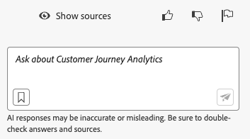

# Adobe Customer Journey Analytics용 AI Assistant

>[!NOTE]
>
>Customer Journey Analytics AI Assistant for Beta는 현재 제공되고 있습니다. 기능 및 해당 설명서는 변경될 수 있습니다.

AI Assistant는 Adobe Customer Journey Analytics 개념 및 용어를 탐색하고 이해하는 데 사용할 수 있는 UI 기능입니다. Customer Journey Analytics의 AI 도우미는 Adobe Experience League 설명서에 대해 교육되었습니다. 질문을 받으면 빠른 학습이 가능한 유익한 답변으로 AI 비서가 응답한다.

초보 사용자는 AI Assistant를 사용하여 Customer Journey Analytics 개념을 학습하고 익숙하지 않은 제품 및 기능을 온보딩할 수 있습니다. 숙련된 사용자는 AI Assistant를 사용하여 보다 고급 사용 사례나 팁 및 요령을 제시할 수 있습니다.

개념 질문의 몇 가지 예는 다음과 같습니다.

* 일괄 처리와 스트리밍 수집 간의 차이점은 무엇입니까?
* Customer Journey Analytics의 가장 좋은 용도는 무엇입니까?
* 데이터 보기를 설정하려면 어떻게 합니까?

제품 지식 검색 모델은 Customer Journey Analytics 교육을 받습니다. 데이터 분석과 같은 다른 기능은 나중에 롤아웃됩니다.

Adobe Target 및 Adobe Creative Cloud Suite와 같은 다른 Adobe 제품에 대한 질문과 같이 Customer Journey Analytics 범위를 벗어나는 질문은 대답할 수 없습니다.

Customer Journey Analytics을 위한 AI Assistant는 모든 제품 계층에서 사용할 수 있습니다.

## 기능 액세스

이 첫 번째 릴리스에서 AI Assistant 기능에 대한 액세스는 다음 매개 변수에 의해 제어됩니다.

* **솔루션 액세스**: AI Assistant는 Customer Journey Analytics에서 사용할 수 있지만 Adobe Analytics에서는 사용할 수 없습니다. Adobe Experience Platform, Adobe Journey Optimizer, Adobe Real-Time CDP 및 추가 Experience Platform 앱에서도 사용할 수 있습니다.

* **계약 액세스**: AI Assistant를 사용할 수 없는 경우 조직의 관리자 또는 Adobe 계정 담당자에게 문의하십시오. 조직에서 AI Assistant를 사용하려면 먼저 귀사가 특정 GenAI 관련 법률 조항에 동의해야 합니다.

* **권한**: [!UICONTROL Adobe Admin Console] [!UICONTROL 보고 도구] &quot;AI Assistant: 제품 기술 자료&quot; 권한은 이 도구에 대한 액세스를 결정합니다. 이 권한은 5월 중순에 보고 도구 섹션에 추가됩니다. 제품 프로필 관리자가 다음을 만들어야 합니다. [제품 프로필](https://helpx.adobe.com/enterprise/using/manage-product-profiles.html) 이 권한이 부여된 Admin Console에서 사용자를 수동으로 이 프로필에 추가합니다.

## Customer Journey Analytics UI에서 AI 지원에 액세스

1. AI Assistant를 실행하려면 Customer Journey Analytics UI에 있는 페이지의 상단 헤더에서 AI Assistant 아이콘을 선택합니다.

   

   AI Assistant를 처음 사용하는 경우 Assistant 사용에 대한 일부 약관과 함께 면책조항이 나타납니다.

1. 제공된 상자에서 AI Assistant의 특정 자연어 질문을 합니다.

   

1. (선택 사항) 소스를 표시하려면 **[!UICONTROL 소스 표시]**&#x200B;및 답변을 알려 준 설명서 소스가 표시됩니다.

1. (선택 사항) 주어진 답변의 유용성에 대해 엄지손가락을 치켜거나 아래로 향하게 하여 투표할 수도 있습니다.
