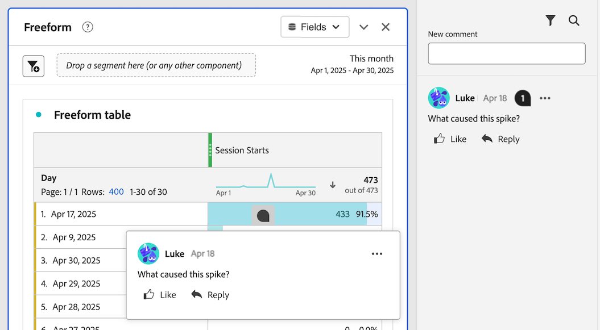

# 프로젝트의 주석 추가 및 관리 {#comment-on-projects}

{{release-limited-testing}}

Analysis Workspace의 주석을 사용하면 Analysis Workspace 프로젝트 컨텍스트 내에서 통찰력을 공유하고 질문을 할 수 있습니다. 이를 통해 데이터에 대한 토론을 간소화하여 논의되는 데이터의 컨텍스트 내에서 대화를 유지할 수 있습니다.

>[!NOTE]
>
>프로젝트에서 주석을 추가하고 관리하는 기능은 프로젝트 수준 또는 조직 수준에서 비활성화할 수 있습니다. 이 섹션에 설명된 대로 댓글을 추가하고 관리할 수 없는 경우 Customer Journey Analytics 관리자 또는 프로젝트 소유자가 이 기능을 비활성화했습니다.
>
>* **프로젝트:** 프로젝트 소유자는 [프로젝트 만들기](/help/analysis-workspace/build-workspace-project/create-projects.md)에 설명된 대로 프로젝트에 대해 이 기능을 사용하지 않도록 설정할 수 있습니다.
>* **조직:** Customer Journey Analytics 관리자는 [환경 설정](/help/analysis-workspace/user-preferences.md)에 설명된 대로 조직에 대해 이 기능을 비활성화할 수 있습니다.

## 댓글 보기

오른쪽 레일의 댓글 영역이나 댓글 배지가 있는 경우 댓글 배지에서 댓글을 볼 수 있습니다.

>[!NOTE]
>
>주석 영역이 오른쪽 레일에 표시되려면 먼저 프로젝트를 저장해야 합니다. 프로젝트를 이전에 저장하지 않은 경우 댓글을 추가하기 전에 [프로젝트를 저장](/help/analysis-workspace/build-workspace-project/save-projects.md)해야 합니다.

### 주석 영역에서 주석 보기

Analysis Workspace 프로젝트에서 작성한 모든 댓글은 오른쪽 레일의 댓글 영역에 표시됩니다.

1. Analysis Workspace에서 프로젝트를 연 채 Analysis Workspace의 오른쪽 레일에서 댓글 영역 아이콘을 선택합니다.

   

   각 댓글에는 댓글이 게시된 날의 타임스탬프가 표시됩니다. 현재 날짜에 댓글이 게시되면 시간이 표시됩니다. 댓글이 게시된 전체 날짜 및 시간을 표시하려면 마우스를 그날 또는 그날 위에 놓으십시오.

1. (선택 사항) 댓글 영역을 검색하려면 검색 아이콘 을 선택한 다음 단어나 구를 입력합니다. 설명 영역은 해당 단어나 구를 포함하는 설명만 포함하도록 필터링됩니다.

### 프로젝트에서 주석 배지 보기

프로젝트의 특정 영역에서 [만든 댓글](#comment-on-a-specific-area-of-the-project)에는 댓글과 관련된 프로젝트 영역에 표시되는 **댓글 배지** 가 있습니다. 댓글을 보려면 배지를 선택합니다. 배지를 선택한 후 주석 자체를 선택하여 오른쪽 레일의 주석 영역에서 주석을 강조 표시할 수 있습니다.

숫자는 프로젝트의 각 배지에 표시되며 생성된 순서대로 정렬됩니다. 프로젝트의 동일한 영역에 여러 개의 댓글이 있으면 배지에 세 개의 점 이 표시됩니다. 3점 배지를 선택하여 해당 영역의 모든 주석을 표시합니다.

<!-- Insert screeshot-->

프로젝트에서 모든 주석 배지를 숨기려면 다음을 수행합니다.

1. Analysis Workspace에서 프로젝트를 연 상태에서 Analysis Workspace의 오른쪽 레일에서 댓글 영역 아이콘 을 선택합니다.

1. 댓글 영역의 맨 아래에서 **[!UICONTROL 배치된 배지 숨기기]** 옵션을 활성화합니다.

## 댓글 추가

프로젝트의 특정 영역을 참조하는 주석을 추가하거나 일반 주석을 추가할 수 있습니다.

### 프로젝트의 특정 영역에 대한 댓글

프로젝트의 특정 영역(예: 자유 형식 테이블의 지표 값)에 대해 댓글을 달려면 다음을 수행합니다.

1. Analysis Workspace에서 프로젝트를 연 채 주석을 삽입할 프로젝트 영역을 마우스 오른쪽 버튼으로 클릭합니다.

   모든 시각화는 시각화 헤더에서 주석 배지를 지원하지만, 다음 시각화만 시각화 내의 특정 데이터 포인트에 주석 배지를 지원합니다.

   * 자유 형식 테이블
   * 코호트 테이블
   * 라인

   <!--add screenshot-->

1. **[!UICONTROL 댓글 추가]**&#x200B;를 선택합니다.

1. **[!UICONTROL 새 댓글]** 필드에 댓글을 지정합니다.

   주석은 최대 15,000자까지 사용할 수 있으며 기본 마크업, 하이퍼링크, 글머리 기호 및 번호 목록, 이모지를 포함할 수 있습니다.

1. (선택 사항) 다른 사람에게 @ 기호 뒤에 해당 이름을 입력하여 댓글에 대해 알립니다. @ 기호를 사용하여 다른 사용자에게 알리는 방법에 대한 자세한 내용은 [댓글에 다른 사용자 포함](#include-others-in-a-comment)을 참조하세요.

1. **[!UICONTROL 제출]**&#x200B;을 선택합니다.

   [프로젝트에서 주석 배지 보기](#view-comment-badges-in-a-project)에 설명된 대로 **주석 배지** 가 주석을 추가한 Workspace 프로젝트 영역에 배치됩니다. 주석은 오른쪽 레일의 주석 영역 맨 위에도 나타납니다.

### 프로젝트에 대한 일반 주석 추가

Analysis Workspace에서 프로젝트에 주석을 추가하려면 다음을 수행하십시오.

1. Analysis Workspace에서 프로젝트를 연 상태에서 Analysis Workspace의 오른쪽 레일에서 댓글 영역 아이콘 을 선택합니다. <!-- add screen shot -->

1. **[!UICONTROL 새 댓글]** 필드에 댓글을 지정합니다.

   주석은 최대 15,000자까지 사용할 수 있으며 기본 마크업, 하이퍼링크, 글머리 기호 및 번호 목록, 이모지를 포함할 수 있습니다.

1. (선택 사항) 다른 사람에게 @ 기호 뒤에 해당 이름을 입력하여 댓글에 대해 알립니다. @ 기호를 사용하여 다른 사용자에게 알리는 방법에 대한 자세한 내용은 [댓글에 다른 사용자 포함](#include-others-in-a-comment)을 참조하세요.

1. **[!UICONTROL 제출]**&#x200B;을 선택합니다.

   [댓글 영역에서 댓글 보기](#view-comments-in-the-comments-area)에 설명된 대로 댓글이 댓글 영역의 맨 위에 표시됩니다.

## 댓글에 다른 사용자 포함

Analysis Workspace의 주석 기능을 사용하면 다른 사용자와 보다 쉽게 공동 작업을 수행할 수 있습니다.

@ 기호를 사용하여 댓글에 사용자를 포함할 때는 다음 사항을 고려하십시오.

* 포함된 사람들은 Adobe Experience Cloud 알림 설정에 따라 알림을 받습니다. 기본적으로 인앱 알림을 받으며, Customer Journey Analytics의 [Experience Cloud 알림](https://experienceleague.adobe.com/ko/docs/core-services/interface/features/account-preferences#view-notifications) 아이콘 에서 볼 수 있습니다.

  또한 사용자는 [이메일 알림을 구독](https://experienceleague.adobe.com/ko/docs/core-services/interface/features/account-preferences#subscribe-to-in-app-and-email-notifications) 및 [Slack 알림을 구독](https://experienceleague.adobe.com/ko/docs/core-services/interface/features/account-preferences#slack)하여 이메일 알림 및 Slack 알림을 받도록 Experience Cloud 알림 설정을 구성할 수 있습니다.

* 조직의 모든 사용자를 댓글에 포함할 수 있지만, 이렇게 해도 프로젝트에 대한 액세스 권한이 자동으로 부여되지는 않습니다. 이미 프로젝트에 액세스할 수 있는 사람만 액세스할 수 있습니다.

댓글에 다른 사용자를 포함하려면 다음 작업을 수행하십시오.

1. @ 기호를 입력한 다음 포함할 사람의 이름, 성 또는 이메일 주소를 입력하세요.

   

1. 드롭다운 메뉴에 표시될 때 개인 이름을 선택합니다.

## 댓글에 회신

1. Analysis Workspace에서 프로젝트를 연 상태에서 Analysis Workspace의 오른쪽 레일에서 댓글 영역 아이콘 을 선택합니다.

1. 회신할 댓글 옆에 있는 **[!UICONTROL 회신]**&#x200B;을 선택합니다.

   또는

   답글을 달 댓글의 텍스트를 따옴표로 묶은 상태로 포함하려면 답글을 달 특정 댓글 또는 답글 옆에 있는 점 3개를 선택한 다음 **[!UICONTROL 답글 인용]**&#x200B;을 선택합니다. 견적 회신은 댓글이 가리키는 댓글 또는 답변을 표시하는 좋은 방법입니다.

1. **[!UICONTROL 새 댓글]** 필드에 댓글을 지정합니다.

   주석은 최대 15,000자까지 사용할 수 있으며 기본 마크업, 하이퍼링크, 글머리 기호 및 번호 목록, 이모지를 포함할 수 있습니다.

1. (선택 사항) 다른 사람에게 @ 기호 뒤에 해당 이름을 입력하여 댓글에 대해 알립니다. @ 기호를 사용하여 다른 사용자에게 알리는 방법에 대한 자세한 내용은 [댓글에 다른 사용자 포함](#include-others-in-a-comment)을 참조하세요.

1. **[!UICONTROL 제출]**&#x200B;을 선택합니다.

## 기존 댓글에 대한 배지 배치

오른쪽 레일의 댓글 영역에서 댓글을 사용할 수 있지만 프로젝트에 아직 배지가 없는 경우 배지를 추가할 수 있습니다.

1. Analysis Workspace에서 프로젝트를 연 상태에서 Analysis Workspace의 오른쪽 레일에서 댓글 영역 아이콘 을 선택합니다.

1. 배지를 넣을 댓글 옆에 있는 자세히 아이콘 을 선택한 다음 **[!UICONTROL 배지 배치]**&#x200B;를 선택합니다.

1. 기존 댓글에 대한 배지를 배치할 프로젝트 영역을 선택합니다.

   선택한 Workspace 프로젝트의 영역에 **댓글 배지** 가 있습니다. 주석은 오른쪽 레일의 주석 영역 맨 위에도 나타납니다.

   자세한 내용은 [프로젝트에서 주석 배지 보기](#view-comment-badges-in-a-project)를 참조하십시오.

배지를 제거하려면:

1. 제거할 배지를 선택한 다음 **[!UICONTROL 배지 제거]**&#x200B;를 선택합니다.

   배지는 제거되지만 댓글은 오른쪽 레일의 댓글 영역에서 계속 사용할 수 있습니다.

## 기존 댓글에 대한 배지 이동

기존 댓글에 이미 배치된 댓글 배지를 이동할 수 있습니다.

1. Analysis Workspace에서 프로젝트를 연 채 이동하려는 댓글에 대한 배지를 찾습니다.

1. 배지를 마우스 오른쪽 단추로 클릭한 다음 **[!UICONTROL 배치 이동]**&#x200B;을 선택합니다.

1. 배지를 배치할 프로젝트 영역을 선택합니다.

<!-- add section about adding images to comments. will be available at GA. Include that "you can have a maximum of 5 images per comment, and each image can be up to 2 MB." -->

## 댓글에 링크 복사

댓글에 링크를 복사하고 다른 사용자와 링크를 공유할 수 있습니다. 이미 프로젝트에 액세스할 수 있는 사람만 링크로 액세스할 수 있습니다.

링크를 댓글에 복사하려면 다음 작업을 수행하십시오.

1. Analysis Workspace에서 프로젝트를 연 상태에서 Analysis Workspace의 오른쪽 레일에서 댓글 영역 아이콘 을 선택합니다.

1. 링크를 복사할 댓글 옆에 있는 더 보기 아이콘 을 선택한 다음 **[!UICONTROL 링크 복사]**&#x200B;를 선택합니다.

   링크가 시스템 클립보드에 복사됩니다. 이메일 또는 다른 유형의 메시지에 링크를 붙여넣을 수 있습니다.

## 주석 텍스트 복사

댓글의 본문을 복사하여 다른 사람과 공유할 수 있다.

주석의 본문 텍스트를 복사하려면 다음을 수행합니다.

1. Analysis Workspace에서 프로젝트를 연 상태에서 Analysis Workspace의 오른쪽 레일에서 댓글 영역 아이콘 을 선택합니다.

1. 복사할 텍스트가 포함된 주석 옆에 있는 추가 아이콘 을 선택한 다음 **[!UICONTROL 본문 복사]**&#x200B;를 선택합니다.

   주석의 본문이 시스템 클립보드에 복사됩니다.

## 댓글처럼

1. Analysis Workspace에서 프로젝트를 연 상태에서 Analysis Workspace의 오른쪽 레일에서 댓글 영역 아이콘 을 선택합니다.

1. 보증할 댓글에서 **[!UICONTROL 좋아요]**&#x200B;를 선택합니다.

## 댓글 삭제

댓글을 삭제하면 원본 댓글과 모든 답글 또는 첨부 파일도 삭제됩니다.

삭제된 댓글은 복구할 수 없습니다.

댓글을 삭제하려면

1. Analysis Workspace에서 프로젝트를 연 상태에서 Analysis Workspace의 오른쪽 레일에서 댓글 영역 아이콘 을 선택합니다.

1. 삭제하려는 댓글 옆에 있는 더 보기 아이콘 을 선택한 다음 **[!UICONTROL 삭제]**&#x200B;을 선택합니다.

1. **[!UICONTROL 삭제]**&#x200B;를 다시 선택하여 삭제를 확인합니다.

## 댓글 확인

주석을 해결할 때 해당 주석이 해결됨으로 표시되고 주석 영역에서 숨겨집니다. 주석에 연결된 배지가 있으면 해당 배지가 프로젝트에서 제거됩니다.

댓글을 확인하려면:

1. Analysis Workspace에서 프로젝트를 연 상태에서 Analysis Workspace의 오른쪽 레일에서 댓글 영역 아이콘 을 선택합니다.

1. 해결할 댓글 옆에 있는 추가 아이콘 을 선택한 다음 **[!UICONTROL 해결]**&#x200B;을 선택합니다.

1. 확인하려면 **[!UICONTROL 해결]**&#x200B;을 다시 선택하십시오.

해결된 주석은 기본적으로 주석 영역에서 숨겨집니다. 해결된 주석을 표시하려면:

1. 설명 영역에서 필터 아이콘을 선택한 다음 **[!UICONTROL 해결된 설명 숨기기]** 옵션의 선택을 취소합니다.
