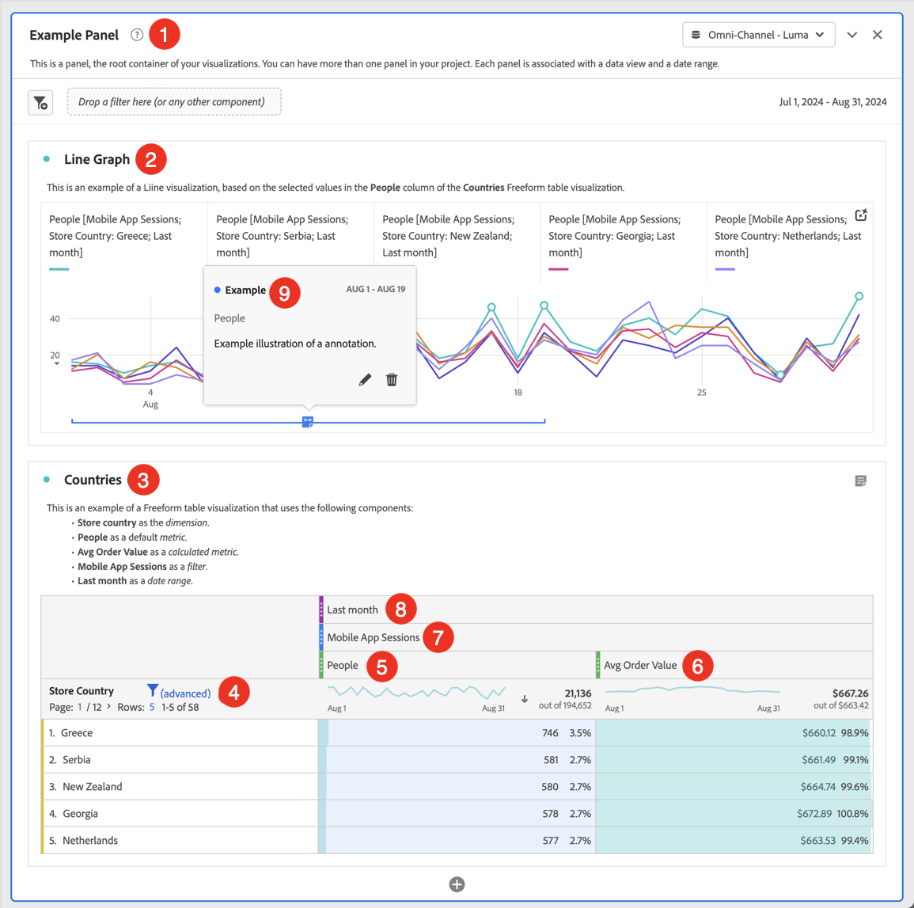

# 프로젝트 만들기 {#create-projects}

<!-- markdownlint-disable MD034 -->

>[!CONTEXTUALHELP]
>id="workspace_project_countrepeatinstances"
>title="반복 인스턴스 계산"
>abstract="보고서에서 반복 인스턴스가 계산되는지 여부를 지정합니다.  참고: 이 설정은 플로우 또는 폴아웃 시각화에 적용되지 않습니다."

<!-- markdownlint-enable MD034 -->

Analysis Workspace의 [프로젝트](/help/analysis-workspace/build-workspace-project/freeform-overview.md)를 사용하여 비즈니스에 중요한 분석을 만들고 볼 수 있습니다.  이러한 분석은 조직 내부 또는 외부의 관련자와 공유할 수 있습니다.

1. Customer Journey Analytics에서 **[!UICONTROL Workspace]**&#x200B;를 선택합니다.

1. 왼쪽 패널에서 **[!UICONTROL 프로젝트]**&#x200B;를 선택한 다음 **[!UICONTROL 프로젝트 만들기]**&#x200B;를 선택합니다.

1. **빈 Workspace 프로젝트**&#x200B;를 선택하여 브라우저를 통해 Workspace 프로젝트를 만듭니다.

   모바일 앱을 통해 다른 관련자와 공유할 수 있는 모바일 스코어카드 프로젝트를 만드는 방법에 대한 자세한 내용은 [빈 모바일 스코어카드](/help/mobile-app/curator.md)를 참조하십시오. 가이드 분석 프로젝트를 만들 수 있는 다양한 옵션에 대한 자세한 내용은 [가이드 분석](/help/guided-analysis/overview.md)을 참조하십시오.

1. [!UICONTROL **만들기**]&#x200B;를 선택합니다.

빈 Workspace 프로젝트를 만들고 나면 [Analysis Workspace](/help/analysis-workspace/home.md) 사용자 인터페이스를 잘 알고 있는지 확인합니다. 확인되면 프로젝트를 빌드할 수 있습니다. 이렇게 하려면 다음 작업을 수행하십시오.

* [패널](/help/analysis-workspace/c-panels/panels.md)를 프로젝트에 추가합니다. (예: **[!DNL Example Panel]**)

* [시각화](/help/analysis-workspace/visualizations/freeform-analysis-visualizations.md) 를 패널에 추가합니다. 예:
   * **[!DNL Line Graph]** [라인](/help/analysis-workspace/visualizations/line.md) 시각화
   * **[!DNL Countries]** [자유 형식 테이블](/help/analysis-workspace/visualizations/freeform-table/freeform-table.md) 시각화
* [구성 요소](/help/components/overview.md)를 시각화에 추가합니다. 예:
   * **[!DNL Store Country]** [차원](/help/components/dimensions/overview.md) ➍
   * **[!DNL People]** [지표](/help/components/apply-create-metrics.md) ➎
   * **[!DNL Avg Order Value]** [계산된 지표](/help/components/calc-metrics/calc-metr-overview.md) ➏
   * **[!DNL Mobile App Sessions]** [필터](/help/components/filters/filters-overview.md) ➐
   * **[!DNL Last Month]** [날짜 범위](/help/components/date-ranges/overview.md) ➑
   * **[!DNL Example]** [주석](/help/components/annotations/overview.md) ➒

## 프로젝트 정보 및 설정 {#project-info-settings}

<!-- markdownlint-disable MD034 -->

>[!CONTEXTUALHELP]
>id="workspace_project_repeatinstances"
>title="반복 인스턴스 계산"
>abstract="보고서에서 반복 인스턴스가 계산되는지 여부를 지정합니다. 참고: 이 설정은 플로우 또는 폴아웃 시각화에 적용되지 않습니다."

<!-- markdownlint-enable MD034 -->

프로젝트 설정에서는 현재 활성 상태인 프로젝트에 대한 프로젝트 수준의 정보를 제공합니다.

설정에는 다음이 포함됩니다.

| 설정 | 설명 |
|---|---|
| 프로젝트 이름 | 프로젝트에 지정된 이름. 이름을 더블 클릭하여 편집할 수 있습니다. |
| 소유자 | 프로젝트 소유자 이름 |
| 마지막 수정 | 프로젝트의 마지막 수정 날짜. |
| 태그 | 더 쉬운 분류를 위해 프로젝트에 적용된 모든 태그를 나열합니다. |
| 설명 | 설명은 프로젝트의 목적을 명확히 하는 데 유용합니다. 설명을 더블 클릭하여 편집할 수 있습니다. |
| 반복 인스턴스 계산 | 보고서에서 반복 인스턴스가 계산되는지 여부를 지정합니다. 참고: 이 설정은 흐름 또는 폴아웃 시각화에 적용되지 않습니다. |
| 주석 표시 | 이 프로젝트의 주석을 표시할지 여부를 지정합니다. |
| [프로젝트 색상 팔레트](/help/analysis-workspace/build-workspace-project/color-palettes.md) | 색맹 사용자에 최적화된 비맞춤형 팔레트에서 선택하거나 맞춤형 팔레트를 지정하여 Workspace에서 사용되는 범주별 색상 팔레트를 변경할 수 있습니다. 이 기능은 대부분의 시각화를 포함하여 작업 영역의 많은 사항에 영향을 줍니다. |
| [보기 밀도](/help/analysis-workspace/build-workspace-project/view-density.md) | 자유 형식 테이블 및 코호트 테이블에서 왼쪽 패널의 수직 안쪽 여백을 줄여 화면에서 더 많은 데이터를 볼 수 있습니다. |

