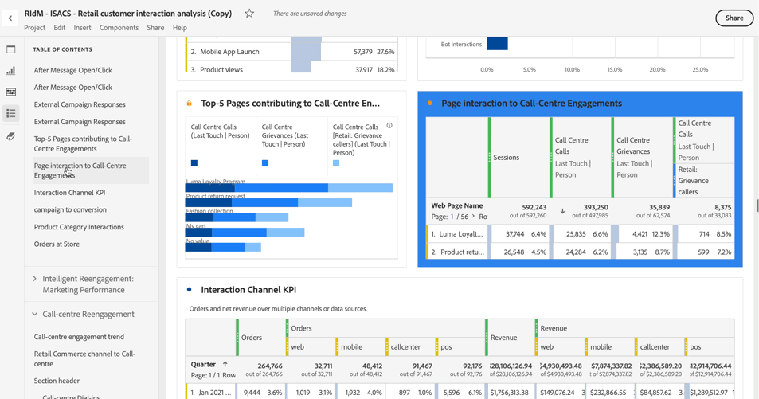

# 목차

Analysis Workspace에서 프로젝트에 대한 목차를 볼 수 있으므로 프로젝트에 있는 모든 패널과 시각화 간에 빠르게 이동할 수 있습니다. 목차는 많은 패널과 시각화가 포함된 큰 프로젝트를 볼 때 특히 유용합니다.

+++ 이 기능에 대한 비디오 데모를 봅니다.

>[!VIDEO](https://video.tv.adobe.com/v/26990/?learn=on)

+++

>[!TIP]
>
>섹션 헤더 시각화를 사용하여 많은 시각화가 포함된 패널 내의 섹션을 식별하고 아티큘레이션할 수 있습니다. 이러한 섹션 헤더도 목차에 항목으로 표시됩니다.
>

프로젝트에 대한 목차를 보려면 다음과 같이 하십시오.

1. Analysis Workspace에서 목차를 보려는 프로젝트로 이동합니다.

1. 단추 패널에서  **[!UICONTROL 목차]**&#x200B;를 선택합니다. 자세한 내용은 [Analysis Workspace 개요](/help/analysis-workspace/home.md)를 참조하십시오. 

   프로젝트에 대한 **[!UICONTROL 목차]**&#x200B;가 표시되고 기본적으로 각 패널이 확장되어 있습니다.

1. **[!UICONTROL 목차]**&#x200B;에서 시각화를 선택하십시오. 

   선택한 시각화는으로 자동 스크롤되어 간략하게 강조 표시됩니다.

   
