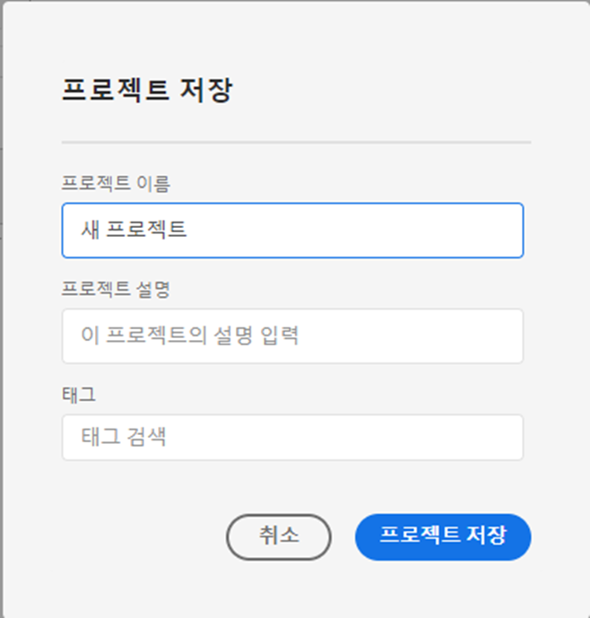
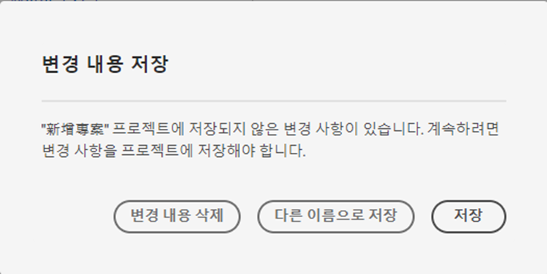
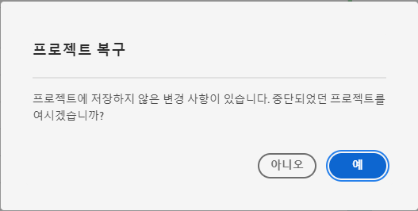

# 프로젝트 저장 {#save-projects}

<!-- markdownlint-disable MD034 -->

>[!CONTEXTUALHELP]
>id="workspace_project_addnotes"
>title="메모 추가"
>abstract="저장하는 프로젝트 버전에 대한 메모를 추가합니다. 이들 메모는 버전과 함께 저장되고 **[!UICONTROL 프로젝트]** > **[!UICONTROL 이전 버전 열기]** 메뉴에서 액세스할 수 있습니다."

<!-- markdownlint-enable MD034 -->

Analysis Workspace의 프로젝트는 2분마다 자동으로 저장됩니다. 프로젝트를 직접 저장하거나, 프로젝트를 복제본으로 저장하거나, 버전 메모와 함께 프로젝트를 저장할 수도 있습니다.

## 저장

프로젝트를 수동으로 저장하려면 Analysis Workspace에서 프로젝트를 연 상태에서 **[!UICONTROL 프로젝트]**&#x200B;를 선택하고 다음 옵션 중에서 선택합니다.

* **[!UICONTROL 저장]**

  프로젝트에 변경 사항을 저장합니다. 프로젝트가 공유되면 프로젝트의 수신자도 변경 내용을 보게 됩니다.

  프로젝트를 처음 저장하면 **[!UICONTROL 저장]** 대화 상자가 표시됩니다.

  

   1. 다음을 지정합니다.

      * **[!UICONTROL 이름]**(필수). 프로젝트의 이름.
      * **[!UICONTROL 설명]**. 프로젝트의 설명.
      * **[!UICONTROL 태그]**. [!UICONTROL *태그 검색*] 필드에서 태그를 검색하거나 **[!UICONTROL ENTER]**&#x200B;를 눌러 새로운 태그를 추가합니다.
      * **[!UICONTROL 폴더]**. [!UICONTROL *폴더 선택*] 드롭다운 메뉴에서 폴더를 선택합니다. 폴더를 지정하지 않으면 프로젝트는 새 프로젝트를 만든 현재 폴더에 저장됩니다.
      * **[!UICONTROL 버전 메모]**. *메모 추가* 텍스트 영역에 버전 메모를 추가합니다.

   1. 프로젝트를 저장하려면 **[!UICONTROL 저장]**&#x200B;을 클릭합니다.

  프로젝트를 저장하면 실제로 90일 동안 저장되는 프로젝트 버전이 저장됩니다.

  공유한 프로젝트를 저장하면 **[!UICONTROL 공유한 프로젝트의 변경 사항 저장]** 경고 대화 상자에 확인 메시지가 표시됩니다.

  

   * 프로젝트를 저장하려면 **[!UICONTROL 저장]**&#x200B;을 선택합니다.
   * 프로젝트를 새 이름의 복제 프로젝트로 저장하려면 **[!UICONTROL 다른 이름으로 저장]**&#x200B;을 선택합니다.

* **[!UICONTROL 메모와 함께 저장]**

  

  프로젝트를 저장할 때 프로젝트의 변경 내용에 대한 메모를 추가합니다. 버전 메모 저장 대화 상자에서:

   1. **[!UICONTROL 메모 추가]** 텍스트 영역에 **[!UICONTROL 버전 메모]**&#x200B;를 입력합니다.
   1. **[!UICONTROL 저장]**&#x200B;을 선택합니다.

  메모는 프로젝트 버전과 함께 저장되며, [이전 버전의 프로젝트를 열 때](open-projects.md#open-previous-version) 사용할 수 있습니다. 메모와 함께 저장된 버전은 1년간 자동으로 저장됩니다.

* **[!UICONTROL 다른 이름으로 저장]**

  

  새 이름으로 프로젝트 복제본을 만듭니다. 다른 이름으로 저장 대화 상자가 표시됩니다.

   1. 다음을 지정합니다.

      * **[!UICONTROL 이름]**(필수). 프로젝트의 이름.
      * **[!UICONTROL 설명]**. 프로젝트의 설명.
      * **[!UICONTROL 태그]**. [!UICONTROL *태그 검색*] 필드에서 태그를 검색하거나 **[!UICONTROL ENTER]**&#x200B;를 눌러 새로운 태그를 추가합니다.
      * **[!UICONTROL 폴더]**. [!UICONTROL *폴더 선택*] 드롭다운 메뉴에서 폴더를 선택합니다. 폴더를 지정하지 않으면 프로젝트는 새 프로젝트를 만든 현재 폴더에 저장됩니다.
      * **[!UICONTROL 버전 메모]**. *메모 추가* 텍스트 영역에 버전 메모를 추가합니다.

   1. 프로젝트를 저장하려면 **[!UICONTROL 저장]**&#x200B;을 클릭합니다.

  프로젝트를 다른 폴더에 저장할 수 있습니다. 원본 프로젝트는 영향을 받지 않습니다.

<!-- Cannot find this option in CJA 
| **[!UICONTROL Save as template]** | Save your project as a [custom template](https://experienceleague.adobe.com/docs/analytics/analyze/analysis-workspace/build-workspace-project/starter-projects.html) that becomes available to your organization under **[!UICONTROL Project > New]** | 
-->

## 자동 저장

>[!IMPORTANT]
>
>새 프로젝트가 자동으로 저장되더라도 **처음**&#x200B;에는 새 프로젝트를 각각 수동으로 저장해야 합니다.
>

Analysis Workspace의 모든 프로젝트는 2분마다 로컬 시스템에 자동으로 저장됩니다. 자동 저장에는 아직 수동으로 저장되지 않은 새로 만들어진 프로젝트가 포함됩니다.

### 새 프로젝트

다른 프로젝트로 전환하거나 브라우저 탭을 닫는 등의 경우 Analysis Workspace에 새 프로젝트를 수동으로 저장하라는 메시지가 표시됩니다.

어떤 이유로든 새로 만들어진 프로젝트를 수동으로 저장하기 전에 예기치 않게 액세스할 수 없을 경우 프로젝트의 복구 버전이 **[!UICONTROL 복구된 프로젝트(지난 7일)]** 폴더의 Analysis Workspace 랜딩 페이지에 저장됩니다. 복구된 프로젝트를 복원하고 원하는 위치에 수동으로 저장합니다.

복구된 프로젝트를 복원하는 경우:

1. Analysis Workspace 랜딩의 **[!UICONTROL 복구된 프로젝트(지난 7일)]** 폴더로 이동합니다.

<!-- 
     
  -->

1. 프로젝트를 열고 원하는 위치에 저장합니다.

### 기존 프로젝트

어떤 이유로든 아직 자동으로 저장되지 않은 변경 사항이 포함된 프로젝트를 종료할 경우 Analysis Workspace에 변경 사항을 저장하거나 경고 메시지를 입력하라는 메시지가 표시됩니다.

몇 가지 일반적인 시나리오:

#### 다른 Analysis 프로젝트 열기

아직 자동으로 저장되지 않은 변경 사항이 포함된 프로젝트에서 작업하는 동안 다른 프로젝트를 열 경우 Analysis Workspace에 현재 프로젝트를 저장하라는 메시지가 표시됩니다.

다음 옵션을 사용할 수 있습니다.

* **[!UICONTROL 저장]**: 가장 최근 자동으로 저장된 프로젝트의 로컬 복사본을 최신 변경 사항으로 바꿉니다.
* **[!UICONTROL 변경 사항 삭제]**: 최신 변경 사항을 삭제합니다. 프로젝트는 가장 최근 자동으로 저장된 로컬 사본을 유지합니다.
* **[!UICONTROL 취소]**: 다른 프로젝트를 여는 작업을 취소하고 기존 프로젝트를 열어 둡니다.

<!--  -->

#### 탭 이동 또는 닫기

아직 자동으로 저장되지 않은 변경 사항이 포함된 프로젝트를 확인하는 도중 페이지에서 빠져나오거나 브라우저 탭을 닫을 경우 저장하지 않은 변경 사항이 유실된다는 경고가 브라우저에 표시됩니다. 종료하거나 취소할 수 있습니다. 브라우저에서 경고하는 방식은 사용하는 브라우저에 따라 다릅니다.

### 브라우저 충돌 또는 세션 시간 초과

브라우저가 충돌하거나 세션 시간이 초과될 경우 다음에 Analysis Workspace에 액세스할 때 아직 자동으로 저장되지 않은 프로젝트 변경 사항을 복구하라는 메시지가 표시됩니다.

* **[!UICONTROL 예]**&#x200B;를 선택하면 가장 최근 자동으로 저장된 로컬 복사본으로 프로젝트가 복원됩니다.

* **[!UICONTROL 아니요]**&#x200B;를 선택하면 자동으로 저장된 로컬 복사본이 삭제되고 사용자가 저장한 프로젝트의 마지막 버전이 열립니다.

<!---->

저장되지 않은 **새** 프로젝트의 경우 저장하지 않은 변경 사항은 복구할 수 없습니다.

<!-- Shouldn't this belong to another page?  Moved it to a new open projects page

## Open previously saved version

To open a previously saved version of a project:

1. Select **[!UICONTROL Open previous version]** from the **[!UICONTROL Project]** menu.

   

1. Review the list of previous versions available. You can switch between **[!UICONTROL All versions]** and **[!UICONTROL Only versions with notes]**.

   For each version, the list shows a timestamp
   [!UICONTROL Timestamp] and [!UICONTROL Editor] are shown, in addition to [!UICONTROL Notes] if they were added when the [!UICONTROL Editor] saved. Versions without notes are stored for 90 days; versions with notes are stored for 1 year.
1. Select a previous version and click **[!UICONTROL Load]**.
   The previous version then loads with a notification. The previous version does not become the current saved version of your project until you click **[!UICONTROL Save]**. If you navigate away from the loaded version, when you return, you will see the last saved version of the project.

-->
