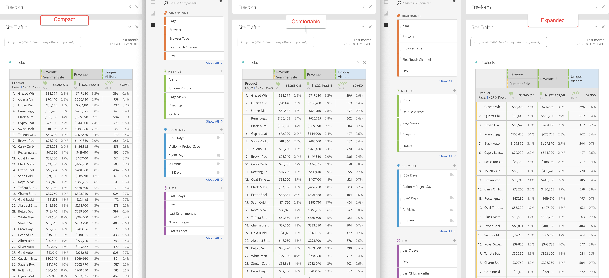

# 보기 밀도

보기 밀도를 조정하면 자유 형식 테이블 및 집단 테이블에서 왼쪽 레일의 수직 안쪽 여백을 줄여 화면에서 더 많은 데이터를 볼 수 있습니다.
라디오 버튼을 통해 보기 밀도를 토글할 때 다음과 같은 3개의 선택 사항이 표시됩니다.

- **[!UICONTROL 작게]**: 가장 압축된 보기 버전.
- **[!UICONTROL 무난]**: 작은 버전보다 좀 더 큰 버전.
- **[!UICONTROL 크게]** (기본값): 작업 영역에서 사용하는 보기.

보기 밀도를 설정하려면 다음을 수행하십시오.

1. 작업 영역에서 **[!UICONTROL 프로젝트]** > **[!UICONTROL 프로젝트 정보 및 설정]**&#x200B;으로 이동합니다.

1. 위에 설명된 3개 선택 사항 중에서 선택하고 **[!UICONTROL 저장을 클릭하십시오]**.
