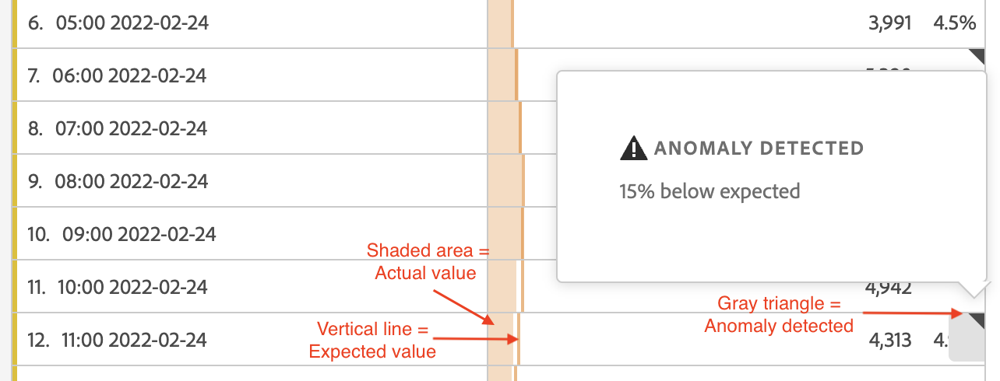

# 예외 항목 보기

Analysis Workspace의 예외 항목을 표 또는 선 차트로 볼 수 있습니다.

## 테이블에서 예외 항목 보기 {#section_869A87B92B574A38B017A980ED8A29C5}

시계열 자유 형식 테이블에서 예외 항목을 볼 수 있습니다.

1. 열 헤더에서 을 선택한 다음 옵션 목록에서 **[!UICONTROL 예외 항목 표시]** 옵션이 선택되어 있는지 확인하십시오. 자세한 내용은 [열 설정](/help/analysis-workspace/visualizations/freeform-table/column-row-settings/column-settings.md)을 참조하십시오.

1. 예외 항목은 다음과 같이 테이블에 표시됩니다.

   

   데이터 예외 항목이 감지된 각 행의 오른쪽 위 모서리에 ◥이(가) 나타납니다.

   각 행 **의**&#x200B;색 세로 선➋은(는) 예상 값을 나타냅니다. 각 행 **의**&#x200B;색 음영 영역➊은(는) 실제 값을 나타냅니다. 라인(예상 값)과 음영 처리 영역(실제 값)을 비교하여 예외 항목이 있는지 여부를 결정합니다. (관찰은 [예외 항목 탐지에 사용된 통계 기법](/help/analysis-workspace/c-anomaly-detection/statistics-anomaly-detection.md)에 설명된 고급 통계 기법을 기반으로 예외적인 것으로 간주됩니다.)

1. 예외 항목에 대한 세부 정보를 보려면 행의 오른쪽 상단 모서리에서 ◥을(를) 선택하십시오. 실제 값이 예상 값보다 위 또는 아래로 벗어나는 정도(백분율로)가 표시됩니다.

## 선 차트에서 예외 항목 보기

라인 차트는 예외 항목을 볼 수 있는 유일한 시각화입니다.

라인 차트에서 예외 항목을 보려는 경우:

1. 시각화 헤더에서 을 선택한 다음 옵션 목록에서 [!UICONTROL **예외 항목 표시**] 옵션이 선택되어 있는지 확인하십시오. 자세한 내용은 [라인](/help/analysis-workspace/visualizations/line.md)을 참조하십시오.

1. (선택 사항) 신뢰 구간에서 차트의 크기를 조절하려면 시각화 헤더에서 을 선택한 다음 **[!UICONTROL 예외 항목이 Y축의 크기 조절을 허용하도록]** 옵션을 선택합니다.

   때때로 차트를 읽기 어렵게 만들 수 있으므로 이 옵션은 기본적으로 선택하지 않습니다.

   예외 항목은 다음과 같이 라인 차트에 표시됩니다.

   

   데이터 예외 항목이 탐지될 때마다 **흰색 점**&#x200B;이 라인에 나타납니다. (관찰은 [예외 항목 탐지에 사용된 통계 기법](/help/analysis-workspace/c-anomaly-detection/statistics-anomaly-detection.md)에 설명된 고급 통계 기법을 기반으로 예외적인 것으로 간주됩니다.)

   **밝은 음영 처리 영역**&#x200B;은 값이 발생해야 하는 신뢰 대역 또는 예상 범위입니다. 이 예상 범위를 벗어나는 모든 값은 예외 항목입니다.

   라인 차트에 여러 개의 지표가 있을 경우에는 예외 항목만 표시되고, 사용자는 마우스를 각 예외 항목의 위에 놓아 해당 지표에 대한 신뢰 대역을 확인해야 합니다.

   **점선**&#x200B;은 정확한 예상 값입니다.

1. 예외 항목(흰색 점)을 선택하여 다음 정보를 확인합니다.

   * 예외 항목이 발생한 날짜입니다.

   * 예외 항목의 원시 값.

   * 녹색 실선으로 표시되는 예상 값 초과 또는 미만의 백분율 값입니다.

<!--
# View anomalies in Analysis Workspace

You can view anomalies in a table or in a line chart.

## View anomalies in a table {#table}

You can view anomalies in a time-series Freeform Table.

1. Select the column settings icon in the column header, then ensure that the [!UICONTROL **Anomalies**] option is selected in the list of options. For more information, see [Column settings](/help/analysis-workspace/visualizations/freeform-table/column-row-settings/column-settings.md).

1. Click away from the settings menu to view the updated table.

   

1. Anomalies are shown in the table as follows:

   A **dark gray triangle** appears in the upper-right corner of each row where a data anomaly is detected.

   The colored **vertical line** in each row indicates the expected value. The colored **shaded area** in each row indicates the actual value. How the line (expected value) compares with the shaded area (actual value) determines whether there is an anomaly. (An observation is considered anomolous based on the advanced statistical techniques described in [Statistical techniques used in anomaly detection](/help/analysis-workspace/c-anomaly-detection/statistics-anomaly-detection.md).)

1. Select the gray triangle in the upper-right corner of a row to view details about the anomaly. This shows the extent (as a percentage) to which the actual value diverges either above or below the expected value.

## View anomalies in a line chart {#line-chart}

A Line chart is the only visualization that allows you to view anomalies.

To view anomalies in a line chart:

1. Select the settings icon in the visualization header, then ensure that the [!UICONTROL **Show anomalies**] option is selected in the list of options. For more information, see [Line](/help/analysis-workspace/visualizations/line.md).

1. (Optional) To allow the confidence interval to scale the chart, select the settings icon in the visualization header, then select the option, **[!UICONTROL Allow anomalies to Scale Y-axis]**. 

   This option is not selected by default because it can sometimes make the chart less legible.
   
1. Click away from the settings menu to view the updated line chart.

      

   Anomalies are shown in the line chart as follows:
   
   A **white dot** appears on the line wherever a data anomaly is detected. (An observation is considered anomolous based on the advanced statistical techniques described in [Statistical techniques used in anomaly detection](/help/analysis-workspace/c-anomaly-detection/statistics-anomaly-detection.md).)

   The **light shaded area** is the confidence band, or expected range, where values should occur. Any value that falls outside of this expected range is an anomaly. 

   If you have multiple metrics in the line chart, only the anomalies are shown and you have to hover over each anomaly to see the confidence band for that metric. 

   The **dotted line** is the exact expected value.

1. Click an anomaly (white dot) to view the following information:

   * The date the anomaly occurred 
   
   * The raw value of the anomaly 
   
   * The percentage value above or below the expected value, which is represented by the solid green line.
   
-->
