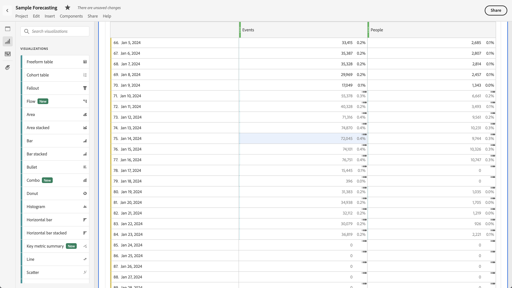

# Analysis Workspace에서 예측 조회

자유 형식 테이블 또는 라인 차트에서 예측을 볼 수 있습니다.

## 테이블에서 예측 보기

시계열 자유 형식 테이블에서 예측을 볼 수 있습니다. [사용자 환경 설정](../user-preferences.md)에서 자유 형식 테이블에 대해 [!UICONTROL 예측 표시]를 사용하면 테이블에 추가된 첫 번째 지표 열에 대한 예측이 자동으로 표시됩니다. 추가 열의 경우:

1. 열 헤더에서 열 설정 아이콘 을 선택한 다음 옵션 목록에서 **[!UICONTROL 예측 표시]**&#x200B;를 선택했는지 확인하십시오. 자세한 내용은 [열 설정](../visualizations/freeform-table/column-row-settings/column-settings.md)을 참조하십시오.

1. 설정을 저장하고 업데이트된 테이블을 보려면 **[!UICONTROL 열 설정]** 메뉴 바깥쪽을 클릭하십시오.

예측은 다음과 같이 테이블에 표시됩니다.

* 각 셀의 예측 값과 백분율이 **진한 회색**&#x200B;에 표시됩니다.
* 예측 값을 나타내려면 예측 기호 이(가) 셀의 오른쪽 위 모서리에 표시됩니다.

## 라인 차트에서 예측 보기

라인 차트는 예측을 볼 수 있는 유일한 시각화입니다.

1. 시각화 헤더에서 설정 아이콘 을 선택한 다음 옵션 목록에서 **[!UICONTROL 예측 표시]**&#x200B;가 선택되어 있는지 확인하십시오.

1. (선택 사항) 예측이 차트의 크기를 적절히 조절하도록 하려면 **[!UICONTROL Y축 크기 조절 허용]**&#x200B;을 선택하십시오. 이 옵션은 간혹 읽기 쉬운 차트를 렌더링할 수 있으므로 기본적으로 선택되지 않습니다.

1. 업데이트된 꺾은선형 차트를 보려면 **[!UICONTROL 설정]** 메뉴 바깥쪽을 클릭하십시오.

예측은 다음과 같이 라인 차트에 표시됩니다.

* 라인 차트의 현재 지표 값은 세로 막대로 표시됩니다. 해당 세로 라인 위로 마우스를 가져가면 마지막 현재 날짜가 포함된 팝업이 표시됩니다.
* 하나 이상의 지표에 대한 예측 값이 점선을 사용하여 세로 막대에서 바로 표시됩니다. 지표에 대한 데이터 포인트 위로 마우스를 가져갈 수 있습니다. 팝업에 다음이 표시됩니다.
   * 예측 일자
   * 지표에 대한 예측 값
   * 지표에 대한 예측 값의 상한
   * 지표에 대한 예측 값의 하한
* 음영처리된 영역은 예측의 신뢰 대역을 보여 줍니다.
