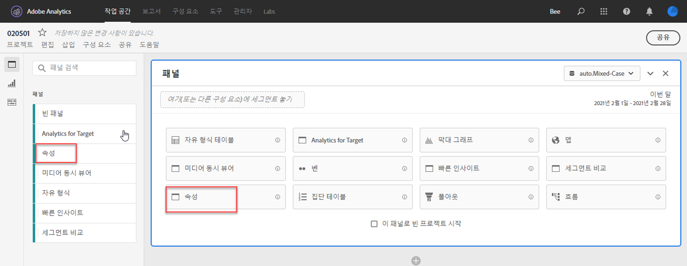
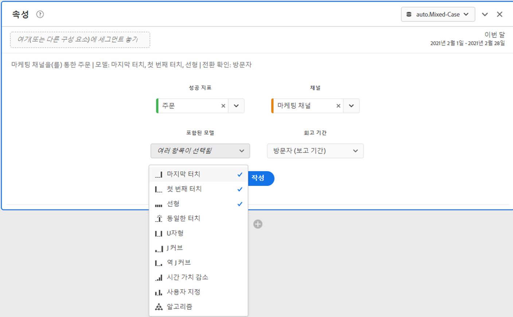
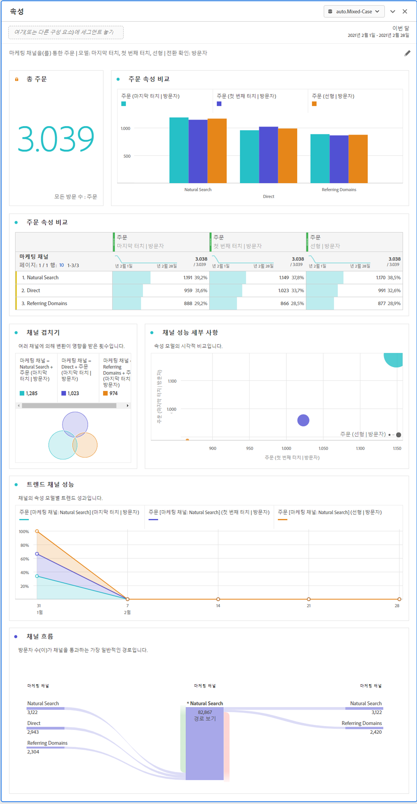

# 속성 패널

[!UICONTROL 속성] 패널은 다양한 속성 모델을 비교하는 분석을 쉽게 구축할 수 있는 방법입니다. 속성 모델을 사용하고 비교할 수 있는 전용 작업 영역을 제공하는 기능입니다.

Customer Journey Analytics는 다음을 통해 속성을 강화합니다.

* 유료 미디어 이외의 속성 정의: 차원, 지표, 채널 또는 이벤트는 마케팅 캠페인뿐 아니라 모델 (예: 내부 검색)에 적용할 수 있습니다.
* 무제한 속성 모델 비교를 사용: 원하는 수만큼 모델을 동적으로 비교합니다.
* 구현 변경 방지: 보고서 시간 처리 및 컨텍스트 인식 세션을 통해 고객 여정 컨텍스트를 내장하고 런타임에 적용할 수 있습니다.
* 사용자의 속성 시나리오와 일치하는 세션을 생성합니다.
* 필터별 속성 분류: 중요한 모든 필터(예: 신규 및 반복 고객, 제품 X와 제품 Y, 로열티 수준 또는 CLV)에서 마케팅 채널의 실적을 쉽게 비교할 수 있습니다.
* 채널 교차 및 다중 터치 분석: 벤 다이어그램, 히스토그램 및 트렌드 속성 결과를 사용합니다.
* 주요 마케팅 시퀀스를 시각적으로 분석: 다중 노드 플로우 및 폴아웃 시각화를 통해 시각적으로 전환된 경로를 탐색합니다.
* 계산된 지표 작성: 여러 속성 할당 방법을 사용합니다.

## 속성 패널 만들기

1. 왼쪽의 패널 아이콘을 클릭합니다.
1. [!UICONTROL 속성] 패널을 Analysis Workspace 프로젝트로 드래그합니다.

   

1. 속성을 지정할 지표를 추가하고 속성에 대한 차원을 추가합니다. 마케팅 채널 또는 내부 판촉 행사 등의 사용자 정의 차원을 예로 들 수 있습니다.

   

1. 비교할 속성 모델 및 전환 확인 기간을 선택합니다.

1. 속성 패널은 선택한 차원 및 지표에 대한 속성을 비교하는 풍부한 데이터 및 시각화를 반환합니다.

   

## 속성 시각화

* **총 지표**: 보고 기간 내에 발생한 총 전환 수입니다. 선택한 차원에 할당된 전환입니다.
* **속성 비교 막대**: 선택한 차원의 각 차원 항목에서 속성 전환을 시각적으로 비교합니다. 각 막대의 색상은 개별 속성 모델을 나타냅니다.
* **속성 비교 테이블**: 막대 차트와 동일한 데이터를 테이블로 표시합니다. 이 표에서 다른 열 또는 행을 선택하면 막대 차트와 패널의 다른 여러 가지 시각화가 필터링됩니다. 이 테이블은 작업 영역의 기타 자유 형식 테이블과 유사하게 작동하므로 지표, 필터 또는 분류와 같은 구성 요소를 추가할 수 있습니다.
* **Overlap Diagram**: 상위 3개 차원 항목과 이들이 전환에 공동으로 참여하는 빈도를 보여 주는 벤 다이어그램입니다. 예를 들어 버블의 크기는 사용자가 차원 항목 모두에 노출될 때 전환이 발생한 빈도를 나타냅니다. 인접 자유 형식 테이블에서 다른 행을 선택하면 선택 사항을 반영하도록 시각화가 업데이트됩니다.
* **성과 세부 정보**: 산포도를 사용하여 시각적으로 최대 3개의 속성 모델을 비교할 수 있습니다.
* **추세적 성과**: 최상위 차원 항목에 대한 속성 전환 추세를 표시합니다. 인접 자유 형식 테이블에서 다른 행을 선택하면 선택 사항을 반영하도록 시각화가 업데이트됩니다.
* **플로우**: 어떤 채널과 가장 일반적으로 상호 작용하는지 그리고 사용자 여정에서 어떤 순서로 상호 작용하는지 확인할 수 있습니다.
