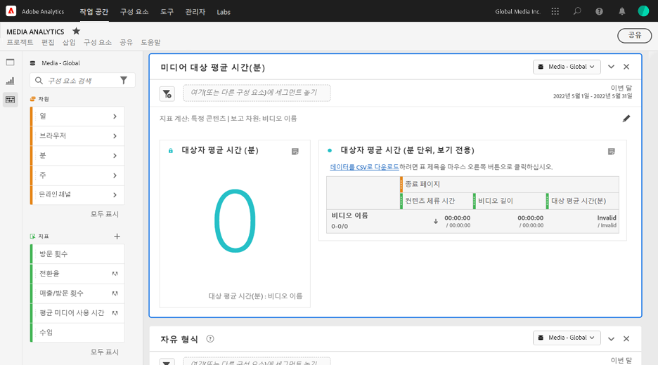

# 미디어 평균 분당 시청자 패널 {#media-average-minute-audience-panel}

<!-- markdownlint-disable MD034 -->

>[!CONTEXTUALHELP]
>id="cja_workspace_mediaminuteaverageaudience_button"
>title="미디어 평균 분당 시청자"
>abstract="패널을 만들어 특정 콘텐츠 또는 특정 기간 동안의 분당 평균 시청 시간을 분석합니다."

<!-- markdownlint-enable MD034 -->

<!-- markdownlint-disable MD034 -->

>[!CONTEXTUALHELP]
>id="cja_workspace_mediaaverageminuteaudience_panel"
>title="미디어 평균 분당 시청자"
>abstract="특정 미디어 콘텐츠나 사용자 정의 기간 동안의 성과를 보여줍니다.  **일반 매개변수&#x200B;** **다음에 대한 지표 계산**: 지표 계산: 패널에 사용할 지표를 선택합니다. **특정 콘텐츠**&#x200B;를 선택하여 콘텐츠 길이를 기준으로 특정 콘텐츠나 이벤트에 대한 평균 분당 시청자를 분석합니다. **사용자 정의 기간을 선택하여** 선택한 사용자 정의 기간 동안 평균 분당 시청자가 어떻게 변하는지 분석합니다. **보고 차원**: **콘텐츠 ID** 차원의 **비디오 이름**&#x200B;별로 보고할지 선택합니다. 특정 콘텐츠를 지표로 선택한 경우에만 사용할 수 있습니다. **세부 기간**: 보고할 세부 기간을 선택합니다. 사용자 정의 기간을 지표로 선택한 경우에만 사용할 수 있습니다. **콘텐츠 필터링 기준(선택 사항)**: 특정 프로그램, 시즌, 에피소드를 선택하거나 사용자 정의 차원을 선택하여 콘텐츠를 필터링합니다.  **고급 설정&#x200B;** **표 설정**: 표에 계산 값을 표시할 수 있는지 여부를 선택합니다. **체류 시간 지표**: 특정 콘텐츠 계산에 사용할 체류 시간 지표를 선택합니다. 특정 콘텐츠를 지표로 선택한 경우에만 사용할 수 있습니다."
>additional-url="https://experienceleague.adobe.com/ko/docs/analytics/analyze/analysis-workspace/panels/average-minute-audience-panel#specific-content" text="특정 콘텐츠"
>additional-url="https://experienceleague.adobe.com/ko/docs/analytics/analyze/analysis-workspace/panels/average-minute-audience-panel#custom-time-period" text="사용자 정의 기간"

<!-- markdownlint-enable MD034 -->

>[!NOTE]
>
>**[!UICONTROL 미디어 분당 평균 시청 시간]** 패널은 Customer Journey Analytics을 위해 스트리밍 미디어 컬렉션 추가 기능을 구입한 고객에게만 제공됩니다.
>
>자세한 내용은 Adobe 영업 담당자 또는 Adobe 계정 팀에 문의하십시오.
>

Analysis Workspace에서 분당 평균 시청 시간은 다음에 대한 정보를 제공할 수 있습니다.

* 특정 미디어 스트림을 보는 데 소요된 시간을 콘텐츠 기간으로 나눈 값입니다. 또는
* 선택한 세부 기간을 사용하는 사용자 지정 기간 동안의 체류 시간입니다.

미디어 분당 평균 시청 시간 패널을 통해 다양한 길이 또는 장르의 프로그램을 비교하여 콘텐츠의 평균 소비량을 파악할 수 있습니다. 예를 들어 30분 시트콤과 3시간 동안의 스포츠 이벤트를 비교할 때 평균 소비량을 이해할 수 있습니다.

또한 미디어 분당 평균 시청 시간 패널을 사용하여 이 디지털 분당 평균 시청 시간을 유선 TV 평균 시청 시간 지표와 비교하거나 추가할 수 있습니다.

미디어 분당 평균 시청 시간 패널은 분당 평균 시청 시간 지표에 대해 다음과 같은 이점을 제공합니다.

* 사용자 정의 기간 지원

* 보기를 처리한 후 기간 분류를 업데이트할 수 있습니다(기간 분류가 없거나 수정해야 하는 경우).

  지표를 사용할 때 이 업데이트를 수행하는 경우 기간 분류가 존재하지 않습니다(분류가 없는 경우). 또는 기간 분류가 만료되었습니다(분류가 있지만 잘못된 경우).

## Use

**[!UICONTROL 미디어 분당 평균 시청 시간]** 패널을 사용하려면:

1. **[!UICONTROL 미디어 분당 평균 시청 시간]** 패널을 만듭니다. 패널을 만드는 방법에 대한 자세한 내용은 [패널 만들기](panels.md#create-a-panel)를 참조하십시오.

1. 스트리밍 미디어 컬렉션 추가 기능에서 구성 요소가 구성된 패널에 대해 데이터 보기를 선택해야 합니다.

1. 패널에 대한 [입력](#panel-input)을(를) 지정하십시오.

1. 패널의 [output](#panel-output)을(를) 확인합니다.

### 패널 입력

이 섹션에 설명된 입력 설정을 사용하여 미디어 분당 평균 시청 시간 패널을 구성합니다.

1. 다음 입력 설정을 구성합니다.

   | 설정 | 설명 |
   |---------|------------|
   | **패널 날짜 범위** | 패널 날짜 범위 기본값은 [!UICONTROL **이번 달**]&#x200B;입니다. 단 하루 또는 여러 달이 보이도록 편집할 수 있습니다.    이 시각화는 1440개의 데이터 행으로 제한됩니다(예: 분 단위 세부 기간에서 24시간). 날짜 범위와 세부 기간 조합의 결과 행이 1440개를 초과하는 경우 전체 날짜 범위를 수용하도록 세부 기간이 자동으로 업데이트됩니다. |
   | [!UICONTROL **여기에 세그먼트(또는 다른 구성 요소) 끌어 놓기**] | 다른 패널과 마찬가지로 이 설정은 사용자가 만든 세그먼트를 기준으로 선택 항목을 필터링합니다. 이 설정은 특정 플랫폼, 라이브 스트림 또는 기타 일반적인 미디어 세그먼트를 볼 수 있는 좋은 방법입니다. |
   | [!UICONTROL **지표 계산 대상**] | [**[!UICONTROL 특정 콘텐츠]**](#specific-content)에 대한 분당 평균 시청 시간을 볼지 여부를 선택합니다. 또는 [**[!UICONTROL 사용자 지정 기간]**](#custom-time-period)에 대한 분당 평균 시청 시간을 보려는 경우.  사용자 지정 기간&#x200B;**]을 선택합니다.[!UICONTROL ** <ul><li>기간을 사용할 수 없는 경우 또는 </li><li>여러 콘텐츠가 포함된 시계열에 대한 분당 평균 시청 시간을 보려는 경우 또는</li><li>지정된 기간이 없는 콘텐츠(예: 라이브 스트림 또는 이벤트 중)</li></ul></li></li></ul> 
이 설정은 워크플로 및 보고서 출력을 변경합니다.
 |

1. [!UICONTROL **다음 기간 계산**] 드롭다운 목록에서 선택한 옵션에 따라 [특정 콘텐츠](#specific-content) 또는 [사용자 지정 기간](#custom-time-period)을(를) 계속합니다.

#### 특정 콘텐츠

1. [패널 입력을 구성](#panel-inputs)할 때 [!UICONTROL **지표 계산**] 드롭다운 메뉴에서 [!UICONTROL **특정 콘텐츠**]&#x200B;를 선택한 경우 다음 구성 옵션을 지정하십시오.

   | 설정 | 설명 |
   |---------|------------|
   | [!UICONTROL **보고 차원**] | 특정 콘텐츠를 선택하는 경우, 보고서 출력을 선택하여 비디오 이름 또는 콘텐츠 ID 필드를 사용하여 콘텐츠 및 관련 분당 평균 시청 시간을 표시할 수 있습니다. |
   | [!UICONTROL **콘텐츠 필터링 기준(선택 사항)**] | 원하는 보기 또는 데이터 구조 방식에 따라 특정 콘텐츠를 필터링하는 방법을 선택합니다. <ul>[!UICONTROL **쇼, 시즌, 에피소드**]: 검색을 사용하여(또는 왼쪽 열에서 쇼 이름을 끌어다 놓아) 필터링할 수 있는 사용 가능한 프로그램을 드롭다운에 표시합니다. 여기에서 선택을 끝내면 쇼의 모든 시즌을 볼 수 있습니다. 또는 개별 시즌별로 필터링한 다음 개별 에피소드별로 필터링할 수 있습니다. 이 설정은 선택한 기간의 해당 쇼, 시즌 또는 에피소드에 대한 데이터를 표시합니다.</li><li>[!UICONTROL **사용자 지정 차원**]: 표시 이름이 사용자 지정 차원에 있는 경우 차원(선택 사항) 드롭다운에서 검색하거나 왼쪽 열 검색을 사용하여 찾을 수 있습니다. 차원 항목은 해당 선택에 따라 자동으로 채워지고 에피소드로 처리됩니다.</li><li>[!UICONTROL **없음**]: 선택한 항목에 대한 분당 평균 시청 시간 데이터가 있는 모든 비디오 이름을 표시합니다. 이 옵션은 기본적으로 선택되어 있습니다.</li></ul> |

1. 고급 설정을 구성하려면 [특정 콘텐츠 고급 설정](#specific-content-advanced-settings)을 계속하십시오.

#### 특정 콘텐츠 고급 설정

1. [!UICONTROL **지표 계산**] 드롭다운 메뉴에서 [!UICONTROL **특정 콘텐츠**]&#x200B;을(를) 선택한 상태에서 [!UICONTROL **고급 설정 표시**]&#x200B;를 선택한 후 다음 구성 옵션을 지정하십시오.

   | 옵션 | 설명 |
   |---------|------------|
   | **[!UICONTROL 테이블 설정]** | 기본 옵션 **[!UICONTROL 표에 계산 값 표시]**&#x200B;는 분당 평균 시청 시간의 분자와 분모를 표의 이전 열로 표시합니다. 이 옵션을 선택 해제하면 해당 두 열이 제거됩니다. 분당 평균 시청 시간 열은 비디오 이름 또는 콘텐츠 ID 옆의 표에 남아 있습니다. |
   | **[!UICONTROL 체류 시간 지표]** | 콘텐츠 시간만 포함하는 기본 **[!UICONTROL 콘텐츠 체류 시간]** 옵션을 선택할 수 있습니다. 또는 분당 평균 시청 시간에 대한 분자 계산으로 콘텐츠와 광고 시간을 함께 포함하는 **[!UICONTROL 미디어 체류 시간]**&#x200B;을 사용하도록 선택할 수 있습니다. |

1. [!UICONTROL **빌드**]&#x200B;를 선택하여 미디어 분당 평균 시청 시간 패널 만들기를 완료합니다.

1. 미디어 분당 평균 시청 시간 패널을 사용하는 방법에 대한 자세한 내용은 [패널 출력](#panel-output)을 계속 사용하십시오.

#### 사용자 정의 기간

1. [패널 입력을 구성](#panel-inputs)할 때 [!UICONTROL **지표 계산**] 드롭다운 메뉴에서 [!UICONTROL **사용자 지정 기간**]&#x200B;을 선택한 경우 다음 구성 옵션을 지정하십시오.

   | 옵션 | 설명 |
   |---------|------------|
   | **[!UICONTROL 세부 기간]** | 기본 세부 기간은 [!UICONTROL **5분**]&#x200B;이지만 선택한 기간 내에 시계열의 분모로 사용되는 세부 기간을 선택할 수 있습니다. 예를 들어 5분 세부 기간을 사용하여 오후 12시에서 12시 30분을 선택하면 전체 30분 동안의 분당 평균 시청 시간과 각 5분 기간에 대한 분당 평균 시청 시간이 있는 6개의 행이 반환됩니다. 이 행은 시계열 차트에 대한 데이터 포인트로 사용됩니다. |
   | [!UICONTROL **콘텐츠 필터링 기준(선택 사항)**] | 원하는 보기 또는 데이터 구조 방식에 따라 특정 콘텐츠를 필터링하는 방법을 선택합니다. <ul>[!UICONTROL **쇼, 시즌, 에피소드**]: 검색을 사용하여(또는 왼쪽 열에서 쇼 이름을 끌어다 놓아) 필터링할 수 있는 사용 가능한 프로그램을 드롭다운에 표시합니다. 여기에서 선택을 끝내면 쇼의 모든 시즌을 볼 수 있습니다. 또는 개별 시즌별로 필터링한 다음 개별 에피소드별로 필터링할 수 있습니다. 이 설정은 선택한 기간의 해당 쇼, 시즌 또는 에피소드에 대한 데이터를 표시합니다.</li><li>[!UICONTROL **사용자 지정 차원**]: 표시 이름이 사용자 지정 차원에 있는 경우 차원(선택 사항) 드롭다운에서 검색하거나 왼쪽 열 검색을 사용하여 찾을 수 있습니다. 차원 항목은 해당 선택에 따라 자동으로 채워지고 에피소드로 처리됩니다.</li><li>[!UICONTROL **없음**]: 선택한 항목에 대한 분당 평균 시청 시간 데이터가 있는 모든 비디오 이름을 표시합니다. 이 옵션은 기본적으로 선택되어 있습니다.</li></ul> |

1. [사용자 지정 기간 고급 설정을 계속](#custom-time-period-advanced-settings)하여 고급 설정을 구성합니다.

#### 사용자 정의 기간 고급 설정

1. [!UICONTROL **사용자 지정 기간**]&#x200B;을(를) [!UICONTROL **다음에 대한 지표 계산**] 드롭다운 메뉴에서 선택한 상태에서 [!UICONTROL **고급 설정 표시**]&#x200B;를 선택한 후 다음 구성 옵션을 지정하십시오.

   | 옵션 | 설명 |
   |---------|------------|
   | **[!UICONTROL 테이블 설정]** | 기본 설정은 평균 분당 시청자의 분자와 분모를 테이블의 선행 열로 표시하는 테이블에 계산 값을 표시합니다. 이 옵션을 선택 해제하면 기간 옆에 평균 분당 시청자만 남겨두고 해당 두 열이 제거됩니다. |

1. [!UICONTROL **빌드**]&#x200B;를 선택하여 미디어 분당 평균 시청 시간 패널 만들기를 완료합니다.

1. 미디어 분당 평균 시청 시간 패널을 사용하는 방법에 대한 자세한 내용은 [패널 출력](#panel-output)을 계속 사용하십시오.

### 패널 출력

패널 출력은 [패널 입력을 구성](#panel-inputs)할 때 [!UICONTROL **지표 계산**] 드롭다운 메뉴에서 [!UICONTROL **특정 콘텐츠**] 또는 [!UICONTROL **사용자 지정 기간**]&#x200B;을 선택했는지 여부에 따라 달라집니다.

#### 특정 콘텐츠

미디어 분당 평균 시청 시간 패널은 다음을 반환합니다.

* 전체 선택 항목에 대한 총 평균 분당 시청자
* 테이블에 표시되는 개별 비디오에 대한 필터 및 분당 평균 시청 시간
* 고급 설정을 선택한 경우 콘텐츠 체류 시간 및 비디오 길이(지속 시간)

언제든지 오른쪽 상단의 을(를) 선택하여 패널을 편집하고 다시 빌드합니다.

#### 특정 콘텐츠 데이터 소스

미디어 분당 평균 시청 시간 패널은 분당 평균 시청 시간 지표만 사용하여 데이터를 수집합니다. 분류나 다른 지표는 패널에서 사용할 수 없습니다.

| 지표 | 설명 |
|--------|-------------|
| **[!UICONTROL 분당 평균 시청 시간]** | 미디어 스트림을 보는 데 소요된 시간을 분류를 통해 제공된 비디오 길이(지속 시간)로 나눈 값입니다. |

#### 사용자 정의 기간 {#custom-time-period-output}

미디어 분당 평균 시청 시간 패널은 다음을 반환합니다.

* 전체 선택 항목에 대한 총 분당 평균 시청 시간

* 최대 및 최소 분당 평균 시청 시간

* 전체 선택 항목에 대한 분당 평균 시청 시간을 보여 주는 선 시리즈 그래프입니다.

* 세부 기간에 대한 필터 및 분당 평균 시청 시간과 각 기간에 대한 콘텐츠 체류 시간 및 세부 기간을 보여 주는 표입니다

  이 테이블은 [!UICONTROL **테이블에 계산 값 표시**]&#x200B;라는 고급 설정 아래의 옵션을 선택한 경우에만 표시됩니다.

언제든지 패널을 편집하고 다시 작성하려면 오른쪽 상단에서 을 선택하십시오.

#### 사용자 정의 기간 데이터 소스

미디어 분당 평균 시청 시간 패널은 분당 평균 시청 시간 지표만 사용하여 데이터를 수집합니다. 분류나 다른 지표는 패널에서 사용할 수 없습니다.

| 지표 | 설명 |
|---|---|
| **[!UICONTROL 평균 분당 시청자]** | 미디어 스트림을 보는 데 소요된 시간을 전체 선택 기간 또는 선택한 세부 기간(분)으로 나눈 값입니다. |

>[!MORELIKETHIS]
>
> [패널 만들기](/help/analysis-workspace/c-panels/panels.md#create-a-panel)
> [미디어 동시 뷰어 패널](media-concurrent-viewers.md)
> [미디어 재생 소요 시간 패널](media-playback-time-spent.md)
>