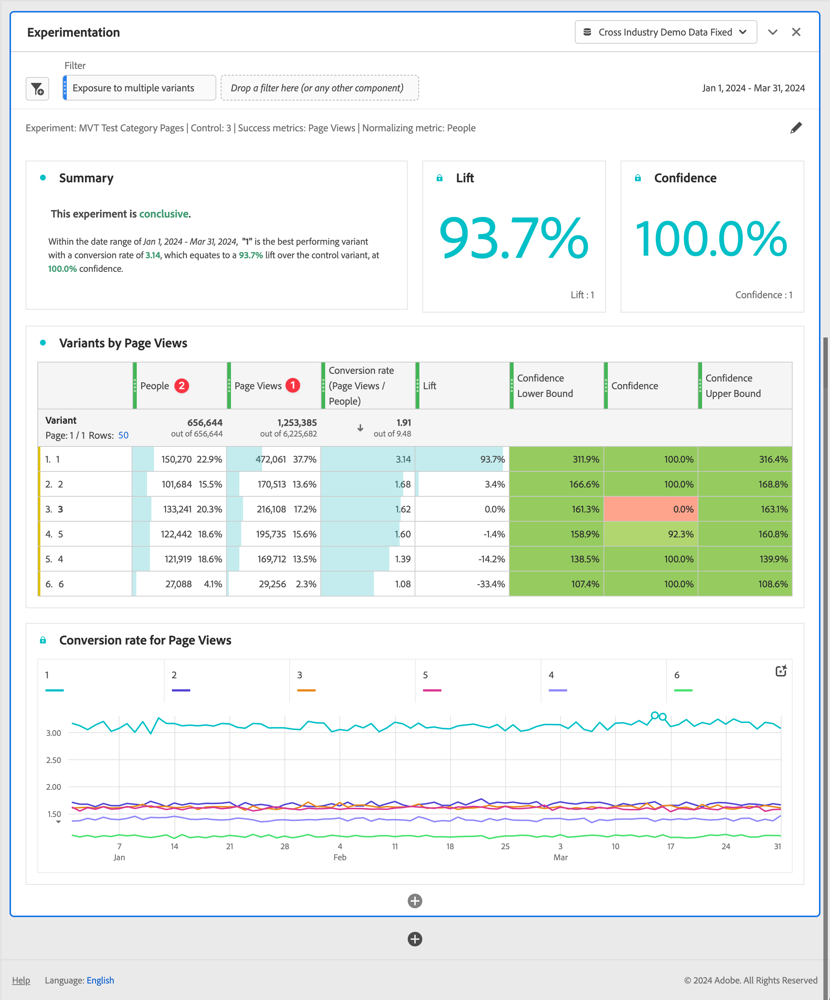

# 실험 패널 {#experimentation-panel}

>[!CONTEXTUALHELP]
>id="workspace_experimentation_button"
>title="실험"
>abstract="다양한 사용자 경험, 마케팅 또는 메시징의 변화를 비교하는 패널을 만듭니다. 그리고 어떤 변화가 특정 결과를 도출하는 데 가장 적합한지 판단합니다."

>[!CONTEXTUALHELP]
>id="workspace_experimentation_panel"
>title="실험"
>abstract="다양한 사용자 경험, 마케팅 또는 메시징의 변화를 비교하여 어떤 것이 특정 결과를 도출하는 데 가장 적합한지 판단합니다. 실험, 비교할 제어 변형, 성공 지표 및 표준화 지표를 지정합니다. 필요한 경우 신뢰성을 위해 상한과 하한을 설정합니다."

>[!BEGINSHADEBOX]

_이 문서에서는_  _**Customer Journey Analytics**&#x200B;의 실험 패널에 대해 설명합니다._ __ _**Adobe Analytics**&#x200B;에서 Adobe Target 활동 및 경험을 분석하는 방법에 대한 자세한 내용은 [Target용 Analytics 패널](https://experienceleague.adobe.com/ko/docs/analytics/analyze/analysis-workspace/panels/a4t-panel)을 참조하십시오._

>[!ENDSHADEBOX]

**[!UICONTROL 실험]** 패널을 통해 다양한 사용자 경험, 마케팅 또는 메시징의 변화를 비교하여 어떤 것이 특정 결과를 도출하는 데 가장 적합한지 판단할 수 있습니다. 온라인, 오프라인, Target 또는 Journey Optimizer와 같은 Adobe 솔루션 및 BYO(Bring Your Own) 데이터 등 모든 실험 플랫폼에서 A/B 실험의 상승도와 신뢰도를 평가할 수 있습니다.

[Adobe Customer Journey Analytics와 Adobe Target의 통합](https://experienceleague.adobe.com/ko/docs/target/using/integrate/cja/target-reporting-in-cja)에 대해 자세히 알아보십시오.

## 액세스 제어 {#access}

실험 패널은 모든 Customer Journey Analytics 사용자가 사용할 수 있습니다. 다른 관리자 권한이나 사용 권한이 필요하지 않습니다. 그러나 사전 요구 사항에는 관리자만 수행할 수 있는 액션이 필요합니다.

## 계산된 지표의 함수

상승도와 신뢰도라는 두 가지 고급 함수를 사용할 수 있습니다. 자세한 내용은 [참조 - 고급 함수](/help/components/calc-metrics/cm-adv-functions.md)를 참조하십시오.

## 사전 요구 사항

실험 패널을 사용하려면 다음 사전 요구 사항을 따라야 합니다.

### 실험 데이터 세트로의 연결 만들기

권장되는 데이터 스키마는 실험 데이터가 두 개의 개별 차원에서 실험 및 변형 데이터를 포함하는 [오브젝트 배열](https://experienceleague.adobe.com/ko/docs/experience-platform/xdm/ui/fields/array)에 있는 것입니다. 두 차원 모두 **단일** 오브젝트 배열에 있어야 합니다. 실험 데이터와 변형 데이터가 구분된 문자열에 있는 단일 차원의 실험 데이터가 있는 경우 데이터 보기의 [하위 문자열](/help/data-views/component-settings/substring.md) 설정을 사용하여 패널에서 사용할 수 있도록 두 개로 차원을 분할할 수 있습니다.

실험 데이터가 Adobe Experience Platform으로 [수집](https://experienceleague.adobe.com/ko/docs/experience-platform/ingestion/home)되면 하나 이상의 실험 데이터 세트로 [Customer Journey Analytics에서 연결을 생성](/help/connections/create-connection.md)합니다.

### 데이터 보기에 컨텍스트 레이블 추가

Customer Journey Analytics 데이터 보기 설정에서 관리자는 차원 또는 지표에 [컨텍스트 레이블](/help/data-views/component-settings/overview.md)을 추가할 수 있으며 이를 위해 [!UICONTROL 실험] 패널 같은 Customer Journey Analytics 서비스로 이 레이블을 사용할 수 있습니다. 실험 패널에는 두 가지의 미리 정의된 레이블이 사용됩니다.

* [!UICONTROL 실험]
* [!UICONTROL 실험 변형]

실험 데이터가 포함된 데이터 보기에서 실험 데이터가 있는 차원 하나와 변형 데이터가 있는 차원 하나를 선택합니다. 그 다음 **[!UICONTROL 실험]** 및 **[!UICONTROL 실험 변형]** 레이블이 있는 차원에 레이블을 지정합니다.

이 레이블이 없으면 함께 작동할 실험이 없어 실험 패널이 작동하지 않습니다.

## 사용

**[!UICONTROL 실험]** 패널을 사용하는 방법:

1. **[!UICONTROL 실험]** 패널을 만듭니다. 패널을 만드는 방법에 대한 자세한 내용은 [패널 만들기](panels.md#create-a-panel)를 참조하십시오.

1. 패널의 [입력](#panel-input)을 지정합니다.

1. 패널의 [출력](#panel-output)을 확인합니다.

   >[!IMPORTANT]
   >
   >Customer Journey Analytics데이터 보기에서 필요한 설정이 완료되지 않은 경우 진행하기 전에 [!UICONTROL 데이터 보기에서 실험 및 변형 차원을 구성하십시오]라는 메시지를 받게 됩니다.
   >

### 패널 입력

실험 패널을 사용하는 방법:

1. 패널 입력 설정을 구성합니다.

   

   | 설정 | 정의 |
   | --- | --- |
   | **[!UICONTROL 날짜 범위]** | \실험 패널의 날짜 범위는 선택한 실험의 Customer Journey Analytics에서 받은 첫 번째 이벤트를 기준으로 자동으로 설정됩니다. 필요한 경우 더 구체적인 시간대로 날짜 범위를 제한하거나 확장할 수 있습니다. |
   | **[!UICONTROL 실험]** | 어떤 것을 영구적으로 유지하는 것이 최선인지 판단하기 위해 최종 사용자에게 공개된 경험의 변형 세트. 실험은 두 개 이상의 변형으로 구성되며, 그 중 하나는 제어 변형으로 간주됩니다. 이 설정은 데이터 보기에서 **[!UICONTROL 실험]** 레이블로 레이블 지정된 차원과 최근 6개월 동안의 실험 데이터로 미리 채워집니다. |
   | **[!UICONTROL 제어 변형]** | 최종 사용자 경험에서 두 가지 이상의 변경 중 하나로, 최선의 대안을 식별하기 위해 비교됩니다. 하나의 변형을 제어로 선택해야 하며, 하나의 변형만 제어 변형으로 간주될 수 있습니다. 이 설정은 데이터 보기에서 **[!UICONTROL 변형]** 레이블로 레이블 지정된 차원으로 미리 채워집니다. 이 설정은 이 실험과 관련된 변형 데이터를 가져옵니다. |
   | **[!UICONTROL 성공 지표]** ➊ | 사용자가 변형을 비교하는 지표입니다. 전환 지표에 대해 가장 바람직한 결과를 나타내는 변형(최고 또는 최저)이 실험의 *최고 성과의 변형*&#x200B;으로 사용됩니다. 최대 5개의 지표를 추가할 수 있습니다. |
   | **[!UICONTROL 지표 정규화]** ➋ | 테스트가 실행될 기본(**[!UICONTROL 글로벌 계정]**[!BADGE B2B 에디션]{type=Informative url="https://experienceleague.adobe.com/ko/docs/analytics-platform/using/cja-overview/cja-b2b/cja-b2b-edition" newtab=true tooltip="Customer Journey Analytics B2B Edition"}, **[!UICONTROL 계정]**[!BADGE B2B 에디션]{type=Informative url="https://experienceleague.adobe.com/ko/docs/analytics-platform/using/cja-overview/cja-b2b/cja-b2b-edition" newtab=true tooltip="Customer Journey Analytics B2B Edition"}, **[!UICONTROL 기회]**[!BADGE B2B 에디션]{type=Informative url="https://experienceleague.adobe.com/ko/docs/analytics-platform/using/cja-overview/cja-b2b/cja-b2b-edition" newtab=true tooltip="Customer Journey Analytics B2B Edition"}, **[!UICONTROL 구매 그룹]**[!BADGE B2B 에디션]{type=Informative url="https://experienceleague.adobe.com/ko/docs/analytics-platform/using/cja-overview/cja-b2b/cja-b2b-edition" newtab=true tooltip="Customer Journey Analytics B2B 에디션"}, **[!UICONTROL 사용자]**, **[!UICONTROL 세션]** 또는 **[!UICONTROL 이벤트]**)입니다. 예를 들어 테스트는 **[!UICONTROL 전환율]**&#x200B;이 페이지 보기로 계산되는 여러 변형의 전환율을 비교할 수 있습니다. |
   | **[!UICONTROL 신뢰도 상한/하한 포함]** | 이 옵션을 활성화하면 신뢰 수준에 대한 상한과 하한이 표시됩니다. |

1. **[!UICONTROL 빌드]**&#x200B;를 선택합니다.

### 패널 출력

실험 패널은 실험의 성과를 더 잘 이해할 수 있도록 풍부한 데이터 및 시각화를 반환합니다. 패널 맨 위에는 선택한 패널 설정을 알려 주는 [요약 변경](../visualizations/summary-number-change.md) 시각화가 제공됩니다. 언제든지 오른쪽 상단의 연필 편집을 선택하여 패널을 편집할 수 있습니다.

또한 실험이 결정적인지 여부와 결과를 정리한 텍스트 요약을 얻을 수 있습니다. 결론은 통계적 유의성에 근거합니다([통계적 방법론](#adobes-statistical-methodology) 참조). 가장 높은 상승도와 신뢰도를 가진 최고 성능의 변형에 대한 요약 숫자를 확인할 수 있습니다.

선택한 각 성공 지표에 대해 [자유 형식 테이블](../visualizations/freeform-table/freeform-table.md) 시각화와 전환율 [라인](../visualizations/line.md) 시각화가 표시됩니다.

>[!NOTE]
>
>이 패널은 현재 A/A 테스트 분석을 지원하지 않습니다.

#### 결과 해석

1. **실험은 결론적**: 실험 보고서를 볼 때마다 이 지점까지 실험에서 축적된 데이터를 분석합니다. 분석은 *항시* 유효 신뢰도가 *적어도 하나*&#x200B;의 변형에 대해 95%의 임계값을 넘을 때 실험이 결정적이라고 선언합니다. 두 개 이상의 암이 있는 경우, 여러 가설 검정을 수정하기 위해 Benjamini-Hochberg 보정이 적용됩니다.

2. **최고 성과의 변형**: 실험이 결정적이라고 선언되면 전환율이 가장 높은 변형을 최고 성과의 변형으로 레이블 지정합니다. 이 변형은 제어 또는 기준선 변형이거나, *항시* 유효한 신뢰 임계값(Benjamini-Hochberg 보정 적용 상태) 95%를 초과하는 변형 중 하나여야 합니다.

3. **전환율**: 표시되는 전환율은 표준화 지표 값 ➊에 대한 성공 지표 값 ➋의 비율입니다. 이 값은 이진수(실험의 각 단위당 1 또는 0)가 아닌 경우 이 값이 1보다 클 수 있습니다.

4. **상승도**: 실험 보고서 요약에는 기준선 상승도가 표시되며, 이는 기준선에 대한 해당 변형의 전환율 개선 비율을 측정한 것입니다. 정확하게 정의하면 해당 변형과 기준선 간의 성과 차이를 기준선의 성과로 나눈 값이 백분율로 표시됩니다.

5. **신뢰도**: 표시된 항시 유효한 신뢰도는 해당 변형이 제어 변형과 동일하다는 증거가 얼마나 있는지에 대한 확률론적 척도입니다. 신뢰도가 높을수록 제어 변형과 비제어 변형의 성과가 동일하다는 가정의 증거가 적다는 것을 나타냅니다. 신뢰도는 주어진 변형과 대조군 간의 전환율 차이가 더 작았을 확률(백분율로 표현)입니다. 실제로 기본 전환율에는 차이가 없습니다. *p*-값의 경우 표시되는 신뢰도는 1-*p*-값입니다.

>[!NOTE]
>
>결과에 대한 전체 설명은 결정적 여부에 대한 선언뿐만 아니라 사용 가능한 모든 증거(예: 실험 설계, 표본 크기, 전환율, 신뢰도 등)를 고려해야 합니다. 결과가 아직 결정적이 아니지만 한 변형이 다른 변형과 다르다는 강력한 증거가 있을 수 있습니다(예: 신뢰 구간이 거의 겹치지 않음). 이상적으로, 연속 스펙트럼으로 해석되는 모든 통계적 증거를 통해 의사 결정 정보를 얻어야 합니다.

## Adobe의 통계 방법 {#statistics}

쉽게 해석이 가능하고 안전한 통계 추측을 제공하기 위해 Adobe는 [항시 유효한 신뢰 시퀀스](https://arxiv.org/abs/2103.06476) 기반의 통계 방법을 채택합니다.

신뢰 시퀀스는 신뢰 구간의 *순차적* 아날로그입니다. 신뢰 시퀀스가 무엇인지 이해하기 위해 실험을 100번 반복한다고 가정해 보겠습니다. 그리고 실험에 참여하는 *모든 신규 사용자*&#x200B;에 대한 평균 비즈니스 지표(예: 이메일 열람율)와 관련된 95% 신뢰도 시퀀스의 추정치를 계산합니다.

95% 신뢰 시퀀스에는 100개의 실험 중 95개의 비즈니스 지표의 “참” 값이 포함됩니다. (95% 신뢰 구간은 모든 신규 사용자가 아닌 동일한 95% 적용 범위를 보장하기 위해 실험당 한 번만 계산할 수 있습니다.) 따라서 신뢰 시퀀스를 사용하면 긍정 오류율을 증가시키지 않고 실험을 지속적으로 모니터링할 수 있습니다. 즉, 결과를 “엿볼” 수 있습니다.

## 비무작위로 지정되는 차원 해석 {#non-randomized}

Customer Journey Analytics를 통해 분석가는 모든 차원을 실험으로 선택할 수 있습니다. 그러나 실험으로 선택된 차원이 무작위로 추출된 사람들을 위한 차원이 아닌 분석을 어떻게 해석할 수 있습니까?

예를 들어 사람이 보는 광고를 생각해 보겠습니다. *광고 A* 대신 *광고 B*&#x200B;를 표시하기로 결정한 경우 일부 지표(예: 평균 수익)의 변화를 측정하는 데 관심이 있을 수 있습니다. 광고 A 대신 광고 B를 보여 주는 인과 효과는 마케팅 결정에 도달하는 데 매우 중요합니다. 이 인과 효과는 광고 A를 표시하는 현상 유지를 광고 B를 표시하는 다른 전략으로 대체하면 전체 집단의 평균 수익으로 측정될 수 있습니다.

A/B 테스트는 이러한 개입의 효과를 객관적으로 측정하기 위한 업계의 표준입니다. A/B 테스트가 인과관계 추정치를 도출하는 중요한 이유는 가능한 변형 중 하나를 받을 수 있는 사람들의 무작위 배정 때문입니다.

이제 무작위화로 달성할 수 없는 차원, 예를 들어 미국의 주에 대해 생각해 보겠습니다. 사람들은 주로 뉴욕과 캘리포니아 두 주에서 옵니다. 겨울 의류 브랜드의 평균 판매 수익은 지역 날씨의 차이로 인해 두 주에서 다를 수 있습니다. 이러한 상황에서는 사람들의 지리적 상태가 다르다는 사실이 아니라 날씨가 겨울 의류 판매의 진정한 원인일 수 있습니다.

Customer Journey Analytics의 실험 패널을 통해 데이터를 사람들의 주별 평균 매출 차이로 분석할 수 있습니다. 이런 상황에서는 출력 결과에 인과 관계가 없습니다. 하지만 이런 분석은 여전히 흥미로울 수 있습니다. 이는 사람들의 주별 평균 수입 차이에 대한 추정치(불확실성 측정치와 함께)를 제공합니다. 이 값은 *통계적 가설 검정*&#x200B;으로도 지칭됩니다. 이 분석의 결과는 흥미로울 수 있지만 반드시 실행 가능한 것은 아닙니다. 단순히 무작위로 지정하지 않았기 때문에, 때로는 차원의 가능한 값 중 하나에 사람을 무작위로 지정할 수 없습니다.

다음 일러스트레이션은 이러한 상황을 대조합니다.

개입 X가 결과 Y에 미치는 영향을 측정하고자 할 때 두 가지의 실제 원인은 혼동 요인 C일 가능성이 있습니다. 데이터가 X에 대한 사람들을 무작위로 추출하여 얻지 못하면 그 영향을 측정하기가 더 어려워지며, 분석은 C를 명시적으로 설명합니다. 무작위 추출은 X의 C에 대한 종속성을 끊고 다른 변수에 대해 걱정할 필요 없이 X가 Y에 미치는 영향을 측정할 수 있도록 해 줍니다.

## 실험에서 계산된 지표 사용 {#use-in-experimentation}

>[!NOTE]
>
>Customer Journey Analytics와 Adobe Journey Optimizer를 모두 사용하는 조직의 경우 이 섹션의 정보는 Journey Optimizer 내의 실험 기능에도 적용됩니다.

모든 계산된 지표가 실험 패널과 호환되는 것은 아닙니다.

다음 지표나 상수 중 하나라도 포함된 계산된 지표는 실험 패널과 호환되지 않습니다.

* [요약 데이터 세트](https://experienceleague.adobe.com/ko/docs/analytics-platform/using/cja-dataviews/summary-data)의 기본 지표
* 서로 나누거나 곱한 기본 지표(예: `Revenue` /`Orders`)
* 기본 지표에 추가되거나 차감되는 상수(예: `Revenue+50`)
* 다음 기본 지표 중 하나:
   * 사용자

실험 패널과 호환되지 않는 계산된 지표는 계산된 지표를 생성할 때 [!UICONTROL **제품 호환성**] 필드에서 [!UICONTROL **Customer Journey Analytics(실험 제외)의 모든 곳**] 값을 갖습니다. 계산된 지표를 만드는 방법에 대한 자세한 내용은 [지표 작성](/help/components/calc-metrics/cm-workflow/cm-build-metrics.md)을 참고하십시오.

## 실험 패널에서 계산된 지표 사용

[실험 패널에서 계산된 지표 사용](https://experienceleaguecommunities.adobe.com/t5/adobe-analytics-blogs/using-derived-metrics-in-cja-s-experimentation-panel/ba-p/593119)에 대한 자세한 내용은 이 블로그 게시물을 참조하십시오.

>[!MORELIKETHIS]
>[Adobe Customer Journey Analytics 실험 마스터하기](https://experienceleaguecommunities.adobe.com/t5/adobe-analytics-blogs/mastering-adobe-customer-journey-analytics-experimentation-your/ba-p/732338)
>
