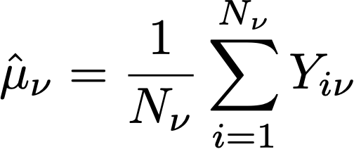

# CJA의 실험 패널의 통계 계산: 세부 사항

이 페이지에서는 CJA의 실험 패널에 사용되는 세부 통계 계산을 설명합니다. 기술 사용자를 위한 것입니다.

## 전환율

전환율 또는 **평균**, *umν* 각 변형의 *ν* 실험에서는 해당 지표에 지정된 단위 수에 대한 지표 합계의 비율로 정의됩니다. *Nν*:

여기에서,

- *Yiν* 은 각 단위에 대한 지표 값입니다 *i*&#x200B;지정된 변형에 지정된 *ν*.
- 단위 합계 *i* 표준화 지표 선택에 따라 다릅니다.
   - If *사람* 는 정규화 지표이며 각 단위는 고유한 개인/프로필입니다.
   - If *세션* 는 정규화 지표이며 각 단위는 고유한 세션입니다.
   - If *이벤트* 정규화 지표이며 각 단위는 고유한 이벤트입니다.

일반적으로 이러한 정규화 지표는 사용자의 독립성 단위와 같게 선택해야 합니다. 즉, 한 세션에서 사용자의 동작이 다른 세션의 해당 사용자의 동작과 독립적이 되는 경우 세션은 적절한 정규화 지표입니다.

필요한 경우 표현식과 함께 샘플 표준 편차가 사용됩니다

## 상승도

변형 간의 상승도  *ν*&#x200B;및 컨트롤 변형  *ν0* 는 로 정의된 전환율의 상대 &quot;델타&quot;입니다

여기서 개별 전환율은 위에서 정의한 것과 같습니다.

## 신뢰도 시퀀스

CJA 실험 패널에는 표시되지 않지만 개별 변형에 대한 신뢰 시퀀스입니다 *ν* 는 Adobe에서 사용하는 통계적 방법론의 중심이며 여기에서 정의됩니다( [Waudby-Smith가 Al.](https://doi.org/10.48550/arXiv.2103.06476)).

> 특정 매개 변수가 타겟 매개 변수를 추정하는 데 관심이 있다고 가정해 보십시오 *내* (실험에서의 변형의 전환율과 같음). 그런 다음 &#39;고정 시간&#39; 신뢰 구간(CI) 순서와 시간 균일한 신뢰 시퀀스(CS) 간의 이분법을 다음과 같이 요약할 수 있습니다.

즉, 정규 신뢰 구간 의 경우 타겟 매개 변수가 값 범위 내에 있다는 확률적 보증입니다 *ċt* 는 단일 고정 값에서만 유효합니다. *n* (다음과 같은 경우) *n* 는 샘플 수입니다.) 반대로 신뢰 시퀀스의 경우 항상 샘플 크기의 모든 값이 보장됩니다 *t*&#x200B;로 지정하는 경우 관심 매개 변수의 &quot;true&quot; 값은 경계 내에 있습니다 *Ct*.

이렇게 하면 온라인 테스트에 매우 중요한 몇 가지 심층적인 의미가 있습니다.
- CS는 새로운 데이터를 사용할 수 있게 될 때마다 선택적으로 업데이트됩니다.
- 실험은 지속적으로 모니터링, 적응적으로 정지 또는 계속될 수 있다.
- 유형-I 오류는 데이터 종속적 시간을 포함하여 모든 중지 시간에 제어됩니다.

Adobe은 평균 예상 개별 변형에 대해 체감형 신뢰도 시퀀스를 사용합니다 *um* 에는 양식이 있습니다

수행:
- *N* 는 해당 변형의 단위 수입니다
- *시그마* 는 표준 편차의 샘플 예상(이전에 정의됨)입니다
- *알파* 원하는 유형-I 오류 수준(또는 잘못된 범위 가능성)입니다.
- *ρ* 2개 는 CS가 가장 가까운 샘플 크기를 조정하는 상수입니다. Adobe이 *ρ* 2개 = 10-2.8: 온라인 실험에서 표시되는 전환율 유형에 적합합니다.

## 신뢰도

Adobe에서 사용하는 신뢰도는 평균 처리 효과에 대한 신뢰 시퀀스를 반전하여 얻은 &quot;언제든지 유효한&quot; 신뢰도입니다.

정확하게 말하자면, 우리는 2개의 견본에서 *t* 두 변형 간의 수단의 차이점을 테스트합니다. 에는 1:1 매핑이 있습니다 *p*-이 테스트에 대한 값 및 의미에서의 차이에 대한 신뢰 구간. 유추로, 언제나 유효함 *p*-value는 평균 처리 효과 추정기의 (언제든 유효한) 신뢰 시퀀스를 반전하여 얻을 수 있습니다.

사용하는 견적 도구는 IPW(역 성향 가중치) 견적 도구입니다. 고려 사항 *N = N0* + *N1* 단위, 각 단위에 대한 변형 할당 $i$ 레이블 지정 *Ai= 0,1* 단위가 variant ν=0,1에 할당되는 경우 사용자에게 고정 가능성(성향)이 있는 경우 *바늘0, (1-파이)0)*, 및 그 결과 지표 *Yi*&#x200B;를 입력하면 IPW 견적 도구가

그 점에 주목해 *f* 는 영향 기능인 Audby-Smith et al입니다. 은 이 견적 도구 의 신뢰 시퀀스를 보여 주었습니다.

경험적 추정치로 할당 확률 대체: *바늘0 = N0/N*&#x200B;를 지정하면, 개별 샘플 평균 견적에서 분산 용어를 표시할 수 있습니다  *um{0,1}* 표준 편차 예상  *시그마{0,1}* 로서의:

테스트 통계로 일반 가설 테스트를 위해 이를 상기하십시오 *z = (마이크로초1 - um0)/p*, $p$ 값과 신뢰 구간 간에 통신합니다.

여기서 *만능* 표준 정규의 누적 분포입니다. 언제든 유효한 경우 *p*-values, 위에 정의된 평균 처리 효과에 대한 신뢰 시퀀스가 있는 경우 이 관계를 변환할 수 있습니다.

마지막으로, **언제든 유효한 *신뢰*** is

## 실험 확정 선언

두 개의 암을 사용한 실험의 경우 CJA 실험 패널에는 실험은 **확정** 언제든지 유효한 신뢰도가 95%를 초과하는 경우(즉, 언제든 유효한 신뢰) *p*-value가 5% 미만).

두 개 이상의 변형이 있으면 Bonferonni 보정이 적용됩니다. 실험 대상 *K* 치료 및 단일 기준선(제어) 치료에는 *K-1* 독립적인 가설 테스트. Bonferonni 보정은 제어와 주어진 변형이 항상 유효한 경우 동일한 수단이 있다는 null 가설을 거부한다는 것을 의미합니다 *p*-value가 0.05/(K-1)의 임계값 미만입니다.

## 성과가 가장 좋은 암

실험이 확정되면 최고의 성과가 나타나는 암이 표시됩니다. 이 팔은 컨트롤이 포함된 Set 및 모든 Arm 중에서 가장 뛰어난 성능(가장 높은 평균 또는 전환율)을 가진 팔입니다 *p*-Bonferonni 임계값 미만입니다.