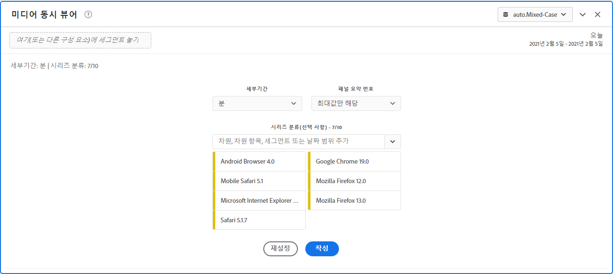
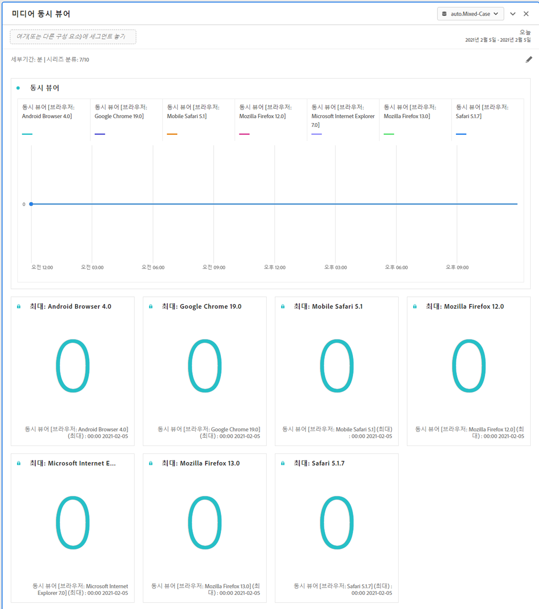
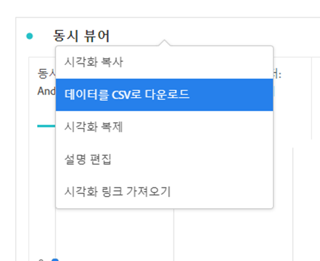

# 미디어 동시 뷰어 패널 {#media-concurrent-viewers-panel}

<!-- markdownlint-disable MD034 -->

>[!CONTEXTUALHELP]
>id="cja_workspace_mediaconcurrentviewers_button"
>title="미디어 동시 뷰어"
>abstract="패널을 만들어 특정 콘텐츠 또는 특정 기간 동안의 분당 평균 시청 시간을 분석합니다."

<!-- markdownlint-enable MD034 -->

<!-- markdownlint-disable MD034 -->

>[!CONTEXTUALHELP]
>id="cja_workspace_mediaconcurrentviewers_panel"
>title="미디어 동시 뷰어"
>abstract="시간 경과에 따른 동시 뷰어를 분석하거나, 최대 동시성을 보거나, 분류하고 비교할 수 있습니다.  **세부 기간**: 동시 뷰어를 볼 기간을 선택하십시오. **패널 요약 번호**: 각 줄의 날짜 또는 시간 세부 정보와 함께 요약 번호를 표시하는 옵션입니다. 최대값은 최대 동시 시청에 대한 세부 정보를 표시합니다. 최소값은 저점에 대한 세부 정보를 표시합니다. **시리즈 분류(선택 사항)**: 세그먼트, 차원, 차원 항목 또는 날짜 범위별로 시각화를 분류합니다. 한 번에 최대 10개의 줄을 봅니다. 분류는 단일 수준으로 제한됩니다."

<!-- markdownlint-enable MD034 -->

>[!NOTE]
>
>Customer Journey Analytics 미디어 분당 평균 시청 시간 패널은 스트리밍 미디어용 스트리밍 미디어 컬렉션 추가 기능을 구입한 고객만 사용할 수 있습니다.
>
>자세한 내용은 Adobe 영업 담당자 또는 Adobe 계정 팀에 문의하십시오.
>

**[!UICONTROL 미디어 동시 뷰어]** 패널을 사용하면 최대 동시 시청에 대한 세부 정보와 분류 및 비교 기능을 통해 시간 경과에 따른 동시 시청자를 분석할 수 있습니다.

동시 뷰어를 분석하여 최대 동시 시청 시간 발생 위치 또는 드롭오프가 발생한 위치를 파악하여 콘텐츠 및 뷰어 참여의 품질에 대한 중요한 통찰력을 제공할 수 있습니다. 볼륨 또는 규모에 대한 문제 해결 또는 계획에 도움이 됩니다.

Analysis Workspace에서 동시 뷰어 지표는 세션 수에 관계없이 특정 시점에 미디어 스트림을 보는 고유한 사용자의 수입니다.

+++ 이 기능에 대한 비디오 데모를 봅니다.

>[!VIDEO](https://video.tv.adobe.com/v/330177/?quality=12)

{{videoaa}}

+++

## Use

**[!UICONTROL 미디어 동시 뷰어]** 패널을 사용하려면:

1. **[!UICONTROL 미디어 동시 뷰어]** 패널을 만듭니다. 패널을 만드는 방법에 대한 자세한 내용은 [패널 만들기](panels.md#create-a-panel)를 참조하십시오.

1. 스트리밍 미디어 컬렉션 추가 기능에서 구성 요소가 구성된 패널에 대해 데이터 보기를 선택해야 합니다.

1. 패널에 대한 [입력](#panel-input)을(를) 지정하십시오.

1. 패널의 [output](#panel-output)을(를) 확인합니다.

### 패널 입력

다음 입력 설정을 사용하여 미디어 동시 뷰어 패널을 구성할 수 있습니다.

| 설정 | 설명 |
|---|---|
| **[!UICONTROL 패널 날짜 범위]** | 패널 날짜 범위 기본값은 오늘입니다.  단 하루 또는 여러 달이 보이도록 편집할 수 있습니다.    이 시각화는 1440개의 데이터 행으로 제한됩니다(예: 분 단위 세부 기간에서 24시간).  날짜 범위와 세부 기간 조합의 결과 행이 1440개를 초과하는 경우 전체 날짜 범위를 수용하도록 세부 기간이 자동으로 업데이트됩니다. |
| **[!UICONTROL 세부 기간]** | 세부 기간 기본값은 분입니다. 이 시각화는 1440개의 데이터 행으로 제한됩니다(예: 분 단위 세부 기간에서 24시간).  날짜 범위와 세부 기간 조합의 결과 행이 1440개를 초과하는 경우 전체 날짜 범위를 수용하도록 세부 기간이 자동으로 업데이트됩니다. |
| **[!UICONTROL 패널 요약 번호]** | 동시 시청자의 날짜 또는 시간 세부 정보를 보려면 요약 번호를 사용할 수 있습니다. 최대값은 최대 동시 시청에 대한 세부 정보를 표시합니다. **[!UICONTROL 최소]**&#x200B;은(는) 저점에 대한 세부 정보를 표시합니다.  패널 기본값은 최대값만 표시하지만 최소값 또는 최대값과 최소값을 모두 표시하도록 변경할 수 있습니다.  분류를 사용하는 경우 각각에 대한 요약 번호가 표시됩니다. |
| **[!UICONTROL 시리즈 분류]** | 선택적으로, 필터, 차원, 차원 항목 또는 날짜 범위별로 시각화를 분류할 수 있습니다. 한 번에 최대 10개의 줄을 볼 수 있습니다. 분류는 단일 수준으로 제한됩니다. 차원을 끌어오면 선택한 패널 날짜 범위에 따라 최상위 차원 항목이 자동으로 선택됩니다. 날짜 범위를 비교하려면 2개 이상의 날짜 범위를 시리즈 분류 필터로 끌어옵니다. |

다음은 **[!UICONTROL 분]** 세부 기간으로 구성된 패널의 예입니다. 요약 번호는 **[!UICONTROL 최대값만]**&#x200B;입니다. **[!UICONTROL 기타]**, **[!UICONTROL 테이블]**, **[!UICONTROL 휴대폰]**, **[!UICONTROL 게임 콘솔]**, **[!UICONTROL 미디어 플레이어]**, **[!UICONTROL 셋톱 박스]**, **[!UICONTROL 텔레비전]**&#x200B;별로 분류되어 있습니다.

### 패널 출력

미디어 동시 뷰어 패널은 최대 및/또는 최소 동시 시청자에 대한 세부 정보를 포함하는 꺾은선형 차트 및 요약 번호를 반환합니다.  패널 맨 위에는 선택한 패널 설정을 알려 주는 요약 줄이 제공됩니다.

언제든지 을 선택하여 패널을 편집하고 다시 빌드합니다.

시리즈 분류를 선택하면 꺾은선형 차트에 선과 요약 번호가 각각 표시됩니다.

### 데이터 소스

이 패널에서 사용할 수 있는 유일한 지표는 **[!UICONTROL 동시 뷰어]**&#x200B;입니다.

| 지표 | 설명 |
|---|---|
| **[!UICONTROL 동시 뷰어]** | 세션 수에 관계없이 특정 시점에 미디어 스트림을 보는 고유한 사용자의 수입니다. |

이 보기에서는 자유 형식 테이블을 사용할 수 없습니다.  데이터 원본을 보려면 꺾은선형 차트 시각화 상황에 맞는 메뉴에서 데이터 원본을 다운로드하고 **[!UICONTROL CSV로 데이터 다운로드]**&#x200B;를 선택하십시오.  시리즈 분류가 포함됩니다.

## FAQ

| 질문 | 답변 |
|---|---|
| 자유 형식 테이블은 어디에 있습니까? 데이터 소스는 어떻게 볼 수 있습니까? | 이 보기에서는 자유 형식 테이블을 사용할 수 없습니다.  꺾은선형 차트 상황에 맞는 메뉴에서 데이터 원본을 다운로드하고 **[!UICONTROL CSV로 데이터 다운로드]**&#x200B;를 선택할 수 있습니다. |
| 세부 기간이 변경된 이유는 무엇입니까? | 이 시각화는 1440개의 데이터 행으로 제한됩니다(예: 분 단위 세부 기간에서 24시간).  날짜 범위와 세부 기간 조합의 결과 행이 1440개를 초과하는 경우 전체 날짜 범위를 수용하도록 세부 기간이 자동으로 업데이트됩니다.  큰 날짜 범위에서 작은 날짜 범위로 변경하는 경우 날짜 범위가 변경되면 세부 기간이 허용되는 가장 낮은 세부 항목으로 업데이트됩니다. 더 높은 수준의 세부 기간으로 보려면 패널을 편집하고 다시 빌드하십시오. |
| 비디오 이름, 필터, 콘텐츠 유형 등을 비교하려면 어떻게 해야 합니까? | 단일 시각화에서 이러한 항목을 비교하려면 시리즈 분류 필터에서 필터, 차원 또는 특정 차원 항목을 드래그합니다.  보기는 10개의 분류로 제한됩니다.  10개 이상을 보려면 여러 패널을 사용해야 합니다. |
| 날짜 범위는 어떻게 비교합니까? | 단일 시각화에서 날짜 범위를 비교하려면 2개 이상의 날짜 범위를 끌어서 시리즈 분류를 사용합니다.  날짜 범위는 패널 날짜 범위를 덮어씁니다. |
| 시각화 유형은 어떻게 변경합니까? | 이 패널은 시계열에 대한 선 시각화만 허용합니다. |
| 예외 항목 탐지를 실행할 수 있습니까? | 아니요.  이 패널에서는 예외 항목 탐지를 사용할 수 없습니다. |
| 활성 세션 대신 고유한 사람을 사용하는 이유는 무엇입니까? | 고유 사용자를 사용하면 표시 경계(세션이 종료되고 동시에 시작되는 위치)에서 원하지 않는 급등을 제거할 수 있습니다. |
| 분 단위보다 세부 기간 수준이 높은 동시 시청자가 있다는 것은 무엇을 의미합니까? | 세부 기간이 1분보다 큰 경우, 동시 시청자는 해당 시간 범위 내의 모든 분에 대한 고유 동시 시청자의 합계입니다.  예를 들어 시간 수준 세부 기간에서 동시 시청자 수는 시간 내의 모든 분에 대한 고유 동시 시청자의 합계입니다. |
| Workspace 패널에 동시 뷰어 보고서와 동일한 정보가 표시됩니까? | 아니요.  Analysis Workspace에서 동시 뷰어 지표는 특정 시점에 미디어 스트림을 보는 고유한 사람의 수로 정의됩니다. 세션 수에 관계없이 표시됩니다.  이 지표는 동시 활성 세션을 사용하는 보고서 섹션의 동시 뷰어 보고와 다릅니다. 고유 사용자 계정을 사용하면 표시 경계 (세션이 종료되고 동시에 시작되는 위치)에서 원하지 않는 피크를 제거할 수 있습니다. |

<!-- For more information about Media Concurrent Viewers, visit [MA doc page]( https://url). -->

>[!MORELIKETHIS]
>
>[패널 만들기](/help/analysis-workspace/c-panels/panels.md#create-a-panel)
>[미디어 재생 소요 시간 패널](media-playback-time-spent.md)
>[미디어 분당 평균 시청 시간 패널](average-minute-audience-panel.md)
>