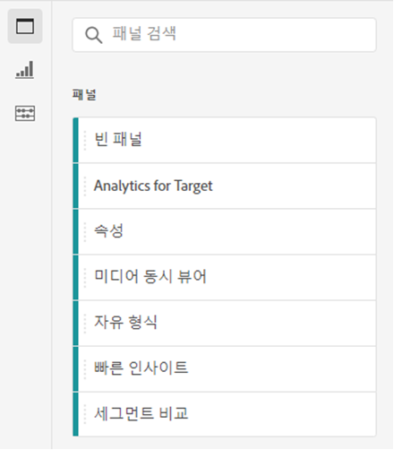
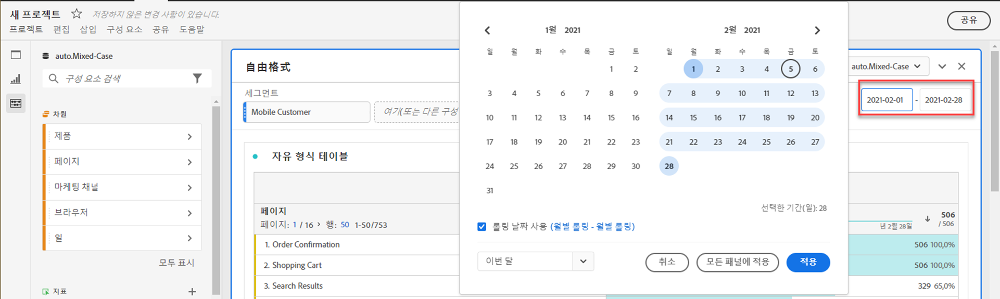
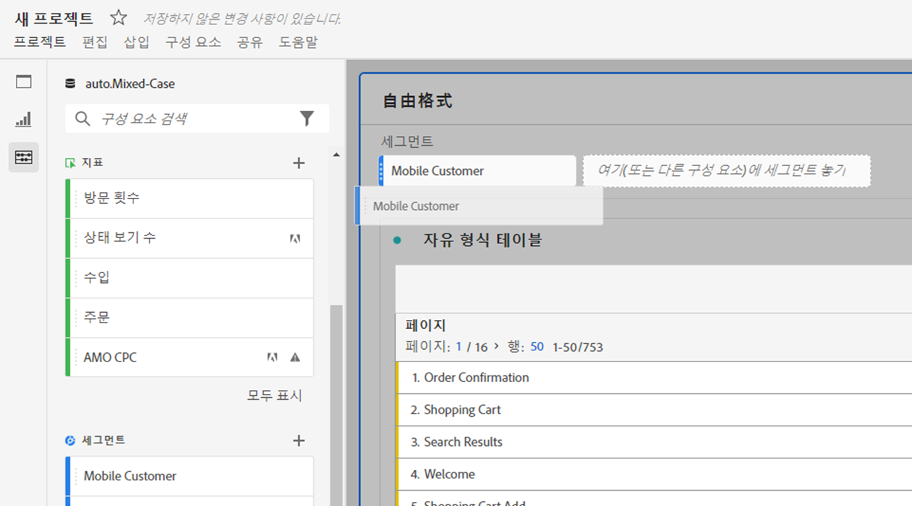
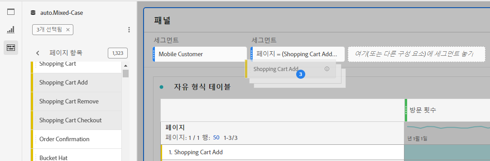
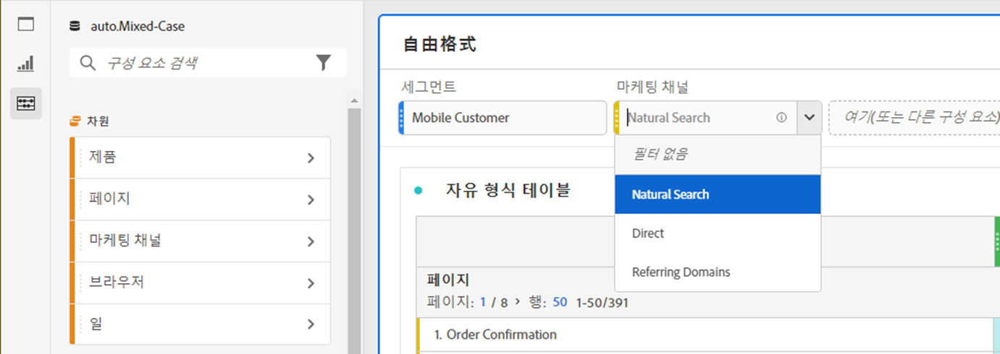
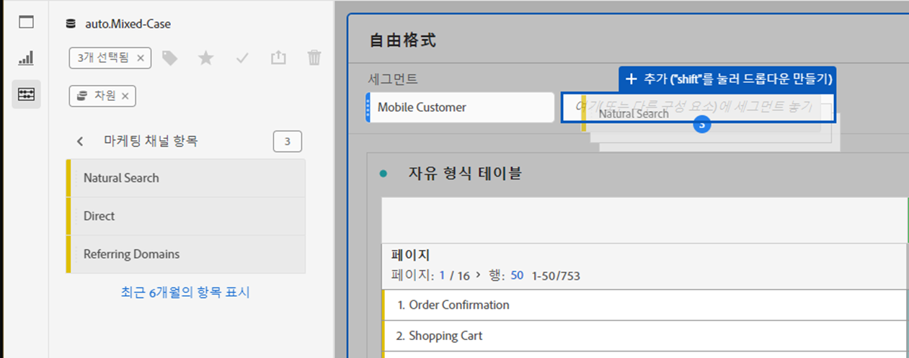
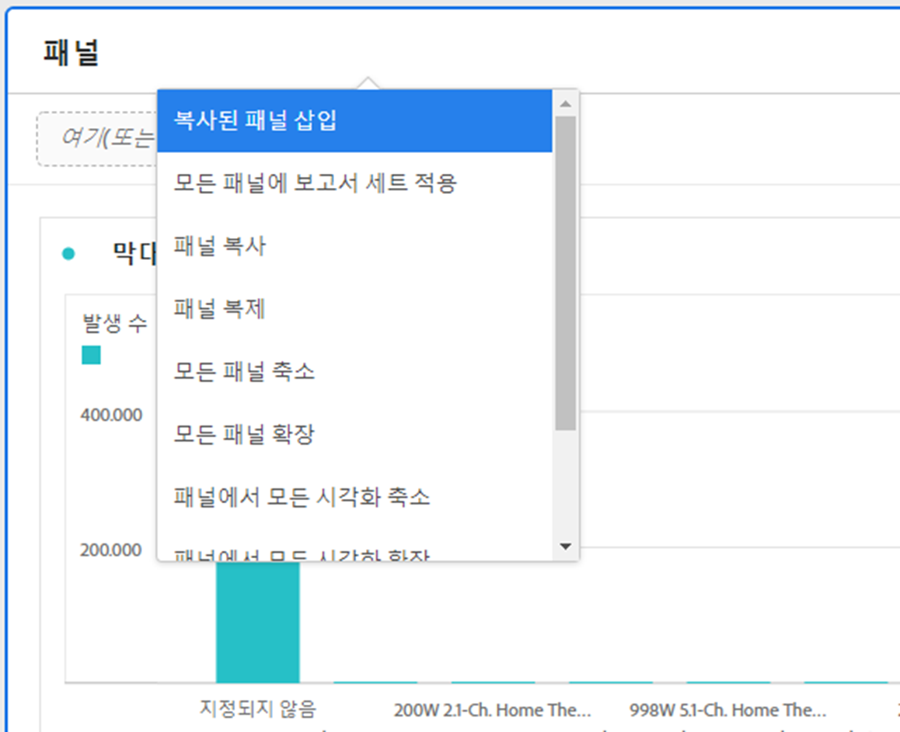

# 패널 개요

[!UICONTROL 패널]은 테이블 및 시각화 컬렉션입니다. Workspace의 왼쪽 상단 아이콘 또는 [빈 패널](/help/analysis-workspace/c-panels/blank-panel.md)에서 패널에 액세스할 수 있습니다. 패널은 기간, 데이터 보기 또는 분석 사용 사례에 따라 프로젝트를 구성하려는 경우에 유용합니다.

## 패널 유형

[!UICONTROL Customer Journey Analytics]을 위한 Analysis Workspace에서 다음 패널 유형을 사용할 수 있습니다.

| 패널 이름 | 설명 |
| --- | --- |
| [빈 패널](/help/analysis-workspace/c-panels/blank-panel.md) | 사용 가능한 패널 및 시각화 중에서 선택하여 분석을 시작합니다. |
| [빠른 인사이트 패널](quickinsight.md) | 인사이트를 더 빨리 분석하고 발견할 수 있도록 자유 형식 테이블과 함께 제공되는 시각화를 신속하게 구축하십시오. |
| [속성 패널](attribution.md) | 파원 및 전환 지표를 사용하여 여러 기여도 모델을 빠르게 비교하고 시각화합니다. |
| [자유 형식 패널](freeform-panel.md) | 무제한 비교 및 분석을 수행한 다음 시각화를 추가하여 풍부한 데이터 스토리를 전달합니다. |
| [미디어 동시 뷰어 패널](media-concurrent-viewers.md) | 최대 동시성 및 분류 및 비교 기능에 대한 세부 정보로 시간 경과에 따른 동시 뷰어를 분석합니다. |
| [미디어 재생 소요 시간 패널](/help/analysis-workspace/c-panels/media-playback-time-spent.md) | 재생 소요 시간 분석을 통해 최대 동시 시청이 발생한 위치 또는 시청 감소가 발생한 위치를 파악할 수 있습니다. |

[!UICONTROL 빠른 인사이트], [!UICONTROL 빈] 패널 및 [!UICONTROL 자유 형식] 패널은 분석을 시작하기에 좋은 위치이며 [!UICONTROL Attribution IQ]는 보다 고급 분석에 적합합니다. 프로젝트에서 `"+"` 버튼을 사용할 수 있으므로 언제든지 빈 패널을 추가할 수 있습니다.

기본 시작 패널은 [!UICONTROL 자유 형식] 패널이지만 [빈 패널](/help/analysis-workspace/c-panels/blank-panel.md)도 기본값으로 설정할 수 있습니다.

## 달력 {#calendar}

패널 달력은 패널 내의 테이블 및 시각화에 대한 보고 범위를 제어합니다.

참고:(보라색) 날짜 범위 구성 요소가 테이블, 시각화 또는 패널 드롭 영역 내에서 사용되는 경우 패널 달력을 재정의합니다.

패널 캘린더의 고급 설정에서 분 단위 날짜 범위를 적용할 수 있습니다. 여러 날에 걸친 날짜 범위에 대해 보고하는 경우 시작 시간은 범위의 첫 번째 날에 적용되고 종료 시간은 범위의 마지막 날에 적용됩니다.

## 드롭 영역 {#dropzone}

패널 드롭 영역을 사용하면 패널 내의 모든 테이블 및 시각화에 필터 및 드롭다운 필터를 적용할 수 있습니다. 패널에 하나 이상의 필터를 적용할 수 있습니다.

### 필터

패널 필터링을 시작하려면 왼쪽 레일에서 패널 드롭 영역으로 필터를 드래그 앤 드롭합니다. 패널에 필터를 추가하려면 이 과정을 반복하십시오. 필터는 패널 상단에 나란히 표시됩니다.

### 임시 필터

필터가 아닌 구성 요소를 드롭 영역으로 직접 드래그하여 임시 필터를 만들 수도 있으므로 필터 빌더로 이동하는 데 드는 시간과 노력을 절약할 수 있습니다. 이러한 방식으로 만든 필터는 자동으로 이벤트 수준 필터로 정의됩니다. 이 정의는 필터 옆에 있는 정보 아이콘(i)을 클릭한 다음 연필 모양의 편집 아이콘을 클릭하고 필터 빌더에서 편집하여 수정할 수 있습니다.

애드혹 필터는 빠른 필터의 한 유형이며, 프로젝트에 대해 로컬입니다. 공개로 설정하지 않으면 왼쪽 레일에 표시되지 않습니다.

자세한 내용은 [빠른 필터](/help/components/filters/quick-filters.md)를 참조하십시오.

### 정적 드롭다운 필터

정적 드롭다운 필터를 통해 제어된 방식으로 데이터와 상호 작용할 수 있습니다. 예를 들어 모바일 디바이스 유형에 대한 드롭다운 필터를 추가하여 태블릿, 휴대폰 또는 데스크탑별로 패널을 필터링할 수 있습니다.

정적 드롭다운 필터를 사용하여 여러 프로젝트를 하나로 통합할 수도 있습니다. 예를 들어 다른 국가 필터가 적용된 동일한 프로젝트의 여러 버전이 있는 경우 모든 버전을 단일 프로젝트로 통합하고 국가 드롭다운 필터를 추가할 수 있습니다.

#### 정적 드롭다운 필터 만들기

* 차원 항목을 사용하는 드롭다운 필터의 경우 왼쪽 레일에서 단일 차원을 선택하여 **`[Shift]`** 키를 누른 상태에서 패널 드롭 영역에 놓습니다. 이렇게 하면 해당 차원과 연결된 모든 차원 항목이 포함된 드롭다운 필터가 생성됩니다.

  또는 차원과 연결된 특정 차원 항목만 드롭다운 필터에 포함하려면 왼쪽 레일에서 원하는 차원 옆에 있는 오른쪽 화살표 아이콘을 클릭합니다. 이 작업을 수행하면 사용 가능한 모든 차원 항목이 표시됩니다. `[Shift + Click]` 또는 `[Ctrl + Click]`을 사용하여 이 목록에서 여러 차원 항목을 선택한 다음 **`[Shift]`** 키를 누른 상태에서 패널 드롭 영역에 놓습니다.

* 단일 구성 요소 유형을 사용하는 드롭다운 필터(예: 차원, 필터 또는 지표만 사용)의 경우 왼쪽 레일에서 `[Shift + Click]` 또는 `[Ctrl + Click]`을 사용하여 동일한 유형의 여러 항목을 선택한 다음 **`[Shift]`** 키를 누른 상태에서 패널 드롭 영역에 놓습니다.

  선택한 구성 요소로 단일 드롭다운 필터가 생성됩니다.

* 구성 요소 유형을 혼합하여 사용하는 드롭다운 필터(예: 지표 2개와 필터 3개)의 경우 `[Shift + Click]` 또는 `[Ctrl + Click]`을 사용하여 여러 구성 요소를 선택합니다. **`[Shift]`** 키를 누른 상태에서 선택 항목을 패널 드롭 영역에 놓습니다. 이 컨텍스트에서는 모든 구성 요소 유형이 별도의 드롭다운 필터로 처리됩니다. 예를 들어 선택 항목에 지표와 차원 항목을 모두 포함하면 두 개의 별도 드롭다운 필터가 생성됩니다. 드롭다운 필터 하나에는 차원 항목이 포함되고 다른 드롭다운 필터에는 지표가 포함됩니다.

  

드롭다운 필터를 마우스 오른쪽 버튼으로 클릭하면 다음 옵션이 제공됩니다.

* **[!UICONTROL 드롭다운 삭제]**: 패널에서 드롭다운 필터를 제거합니다.
* **[!UICONTROL 레이블 삭제]**: 드롭다운 필터 위의 텍스트를 제거합니다. 레이블을 수정하려면 연필 아이콘을 선택합니다.
* **[!UICONTROL 레이블 추가]**: 프로젝트에 드롭다운 필터를 추가하면 구성 요소 이름에 레이블이 자동으로 설정됩니다. 레이블을 삭제한 경우 이 옵션을 사용하여 다시 추가할 수 있습니다.
* **[!UICONTROL 선택 필수]**: 패널에 필터가 설정되어 있어야 합니다.

프로젝트에 드롭다운 필터를 추가하는 방법에 대해 자세히 알아보려면 [비디오를 시청하십시오](https://experienceleague.adobe.com/docs/analytics-learn/tutorials/analysis-workspace/using-panels/using-panels-to-organize-your-analysis-workspace-projects.html?lang=ko).

#### 정적 드롭다운 필터 사용

다음 방법 중 하나로 드롭다운 필터 메뉴를 사용하여 패널을 필터링할 수 있습니다.

* 드롭다운 필터에서 필터를 선택하여 패널에 단일 필터를 적용합니다.

* 드롭다운 필터에서 두 개 이상의 필터를 선택하여 패널에 여러 필터를 적용합니다. 선택된 필터를 포함하도록 패널이 필터링됩니다.

  

### 동적 드롭다운 필터

동적 드롭다운 필터를 사용하면 패널의 보고 범위 내의 데이터 및 기타 드롭다운 필터의 값을 기반으로 사용 가능한 값을 결정할 수 있습니다. 예를 들어 국가 차원과 도시 차원을 사용하여 두 개의 동적 드롭다운을 만들 수 있습니다. UICONTROL 국가 드롭다운 목록에서 국가를 선택하면 도시 드롭다운 목록이 해당 국가 내의 도시만 표시하도록 동적으로 조정됩니다.

이와 동일한 개념이 모든 차원에 적용됩니다. 즉, 패널의 날짜 범위 및 선택한 필터 내에 나타나는 차원 항목만 표시됩니다. 정적 드롭다운 필터에서 선택한 차원 항목은 동적 드롭다운 필터에서 사용 가능한 값에 영향을 줍니다. 그러나 그 반대로는 그렇지 않습니다. 즉, 동적 드롭다운 필터에서 선택한 차원 항목은 정적 드롭다운 필터에서 사용 가능한 값에 영향을 주지 않습니다.

나중에 특정 차원 항목을 수집할 것으로 예상되는 경우 차원 항목을 수동으로 선택할 수 있습니다. 값이 포함되지 않도록 동적 드롭다운 필터를 지워서 다른 동적 드롭다운 필터에 더 많은 값이 포함되도록 할 수도 있습니다. 해당 패널의 모든 드롭다운 필터에서 선택 항목을 지우려면 **[!UICONTROL 모두 재설정]**&#x200B;을 선택합니다.

동적 드롭다운 필터를 만들려면 다음 작업을 수행하십시오.

* **`[Shift]`**&#x200B;를 누른 상태에서 단일 차원을 패널 드롭 영역으로 드래그 앤 드롭합니다.
* 지표, 필터 또는 날짜 범위에는 동적 드롭다운 필터를 사용할 수 없습니다.
* 드롭다운 필터를 삭제하려면 필터를 마우스 오른쪽 버튼으로 클릭하고 **[!UICONTROL 필터 삭제]**&#x200B;를 선택합니다.

동적 드롭다운 필터를 마우스 오른쪽 버튼으로 클릭하면 정적 드롭다운 필터와 동일한 옵션이 제공됩니다.

## 마우스 오른쪽 버튼 클릭 메뉴 {#right-click}

패널 헤더를 마우스 오른쪽 버튼으로 클릭하면 패널을 위한 추가 기능을 사용할 수 있습니다.

다음 설정을 사용할 수 있습니다.

| 설정 | 설명 |
| --- | --- |
| [!UICONTROL 복사한 패널/시각화 삽입] | 복사한 패널 또는 시각화를 프로젝트 내의 다른 위치 또는 다른 프로젝트에 붙여넣기(“삽입”)할 수 있습니다. |
| [!UICONTROL 패널 복사] | 패널을 마우스 오른쪽 버튼으로 클릭하고 복사하여 프로젝트 내의 다른 위치 또는 다른 프로젝트에 삽입할 수 있습니다. |
| [!UICONTROL 패널 복제] | 현재 패널의 정확한 복제본을 만들어서 수정할 수 있습니다. |
| [!UICONTROL 모든 패널 축소/확장] | 모든 프로젝트 패널을 축소 및 확장합니다. |
| [!UICONTROL 패널의 모든 시각화 축소 및 확장] | 현재 패널의 모든 시각화를 축소 및 확장합니다. |
| [!UICONTROL 설명 편집] | 패널에 대한 텍스트 설명을 추가(또는 편집)합니다. |
| [!UICONTROL 패널 링크 가져오기] | 프로젝트 내의 특정 패널로 사용자를 안내할 수 있습니다. 링크를 클릭하면 연결된 정확한 패널로 이동하기 전에 먼저 수신자가 로그인해야 합니다. |
