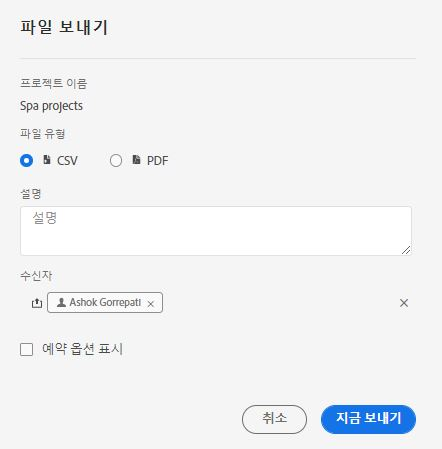
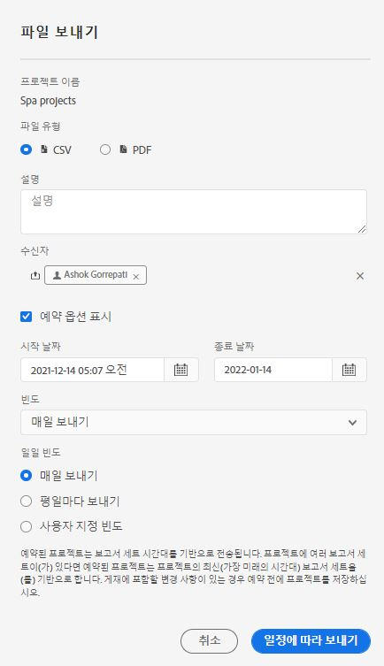

# 프로젝트 예약

작업 영역 **[!UICONTROL 공유]** 메뉴에서 이메일을 통해 선택한 수신자에게 Analysis Workspace 프로젝트를 보낼 수 있습니다. 파일은 CSV 또는 PDF 형식으로 보낼 수 있습니다.

## 지금 파일 보내기 {#now}

이메일을 통해 파일을 수신자에게 즉시 보내려면

1. 클릭 **[!UICONTROL 공유] > [!UICONTROL 파일 내보내기]**.
1. 파일 형식 지정:
   * [!UICONTROL **CSV**]: 일반 텍스트 데이터를 원하는 경우 이 옵션을 선택합니다.
   * [!UICONTROL **PDF**]: 다운로드한 파일에 프로젝트에 표시된 (볼 수 있는) 모든 테이블 및 시각화를 포함하려면 이 옵션을 선택합니다.
1. (선택 사항) 수신되는 파일을 설명하기 위해 이메일에 포함할 설명을 추가합니다.
1. 수신자 또는 그룹을 추가합니다. 이메일 주소를 입력할 수도 있습니다.
1. (Healthcare Shield 고객만 해당) 암호를 입력합니다. 암호로 예약된 보고서 보호 섹션을 참조하십시오.
1. **[!UICONTROL 지금 보내기]**&#x200B;를 클릭합니다.
1. (선택 사항) 게재 일정을 지정하려면 **[!UICONTROL 예약 옵션 표시]**&#x200B;를 클릭합니다.

## 일정에 따라 파일 보내기 {#schedule}

이메일을 통해 되풀이되는 일정으로 수신자에게 파일을 보내려면

1. 클릭 **[!UICONTROL 공유] > [!UICONTROL 파일 내보내기 예약]**.
1. 파일 유형(CSV 또는 PDF)을 지정합니다.
1. (선택 사항) 수신되는 파일을 설명하기 위해 이메일에 포함할 설명을 추가합니다.
1. 수신자 또는 그룹을 추가합니다. 이메일 주소를 입력할 수도 있습니다.
1. (Healthcare Shield 고객만 해당) 암호를 입력합니다. 암호로 예약된 보고서 보호 섹션을 참조하십시오.
1. 입력 시 시작 및 종료를 수정하여 일정이 전달될 범위를 지정합니다. 종료 날짜는 일정을 만들거나 수정한 날로부터 1년 이내여야 합니다.
1. 게재 빈도를 지정합니다. 각 빈도에서는 다양한 맞춤화를 사용할 수 있습니다.
1. **[!UICONTROL 일정에 따라 보내기]**&#x200B;를 클릭합니다.

## 예약된 프로젝트 관리자 {#manager}

예약된 Analysis Workspace 프로젝트는 **[!UICONTROL Analytics] > [!UICONTROL 구성 요소] > [!UICONTROL 예약된 프로젝트]**&#x200B;에서 관리할 수 있습니다.

자세한 내용은 [예약된 프로젝트](/help/components/scheduled-projects-manager.md)

## 암호로 예약된 프로젝트 보호 {#password}

>[!NOTE]
>
>예약된 프로젝트를 암호로 보호하는 옵션은 프로젝트를 구입한 Customer Journey Analytics 고객에게만 표시됩니다. [헬스케어 실드](https://business.adobe.com/solutions/experience-cloud-for-healthcare.html) 추가 기능 제품.

Adobe는 .pdf 또는 .csv 포맷으로 전송되는지 여부에 관계없이 암호를 사용하여 예약된 프로젝트를 암호화합니다.

귀사에서 Healthcare Shield SKU를 구매하고 활성화한 후 다음 두 가지 상황에서 예약된 프로젝트에 대한 암호를 생성하라는 메시지가 표시됩니다.

* 누군가 예약된 프로젝트를 새로 만드는 경우

* 기존의 예약된 프로젝트를 전송하려고 하는 경우 현재의 예약된 프로젝트는 암호 보호가 적용될 때까지 비활성화됩니다. 예약된 프로젝트의 소유자는 이에 대한 이메일 알림을 수신하게 됩니다.

### 암호 요구 사항

암호 요구 사항은 Adobe 표준을 따르며 최소 하나의 숫자와 하나의 특수 문자를 포함하여 8자 이상이어야 합니다.

### 암호로 예약된 새 프로젝트 보호

1. 프로젝트를 저장하고 나면 **[!UICONTROL 공유]** > **[!UICONTROL 지금 파일 보내기]** 또는 [!UICONTROL 공유] > **[!UICONTROL 일정에 따라 파일 보내기]**&#x200B;로 이동합니다.
1. [지금 파일 보내기](https://experienceleague.adobe.com/docs/analytics-platform/using/cja-workspace/curate-share/t-schedule-report.html?lang=ko-KR#now) 또는 [일정에 따라 파일 보내기](https://experienceleague.adobe.com/docs/analytics-platform/using/cja-workspace/curate-share/t-schedule-report.html?lang=ko-KR#schedule)에 대해 위 지침을 따르십시오.

### 암호로 예약된 기존 프로젝트 보호

프로젝트가 예약되기 전에 해당 프로젝트의 소유자는 다음과 유사한 내용의 이메일을 수신하게 됩니다.

1. Customer Journey Analytics에 다시 로그인합니다.
1. **[!UICONTROL 예약된 프로젝트 보기]**&#x200B;를 클릭합니다.
1. **[!UICONTROL 예약된 프로젝트 편집]** 대화 상자에서 암호를 입력한 후 다시 입력합니다.
1. 예약된 프로젝트의 수신자에게만 이 암호를 알려 주십시오.

