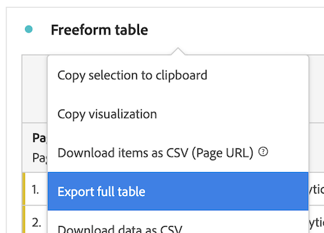

# Customer Journey Analytics 보고서를 클라우드로 내보내기 {#full-table-export}

<!-- markdownlint-disable MD034 -->

>[!CONTEXTUALHELP]
>id="cja-upgrade-full-table-export"
>title="Data Warehouse와 유사한 전체 테이블 내보내기 만들기"
>abstract="Analysis Workspace에서 데이터를 확인하는 즉시 전체 테이블 내보내기가 가능합니다. 필요에 따라 전체 테이블 내보내기를 만들거나 예약할 수 있습니다.  내보내기에 포함할 데이터를 이미 알고 있는 경우 전체 테이블 내보내기를 완료하는 데 몇 분밖에 걸리지 않습니다."

<!-- markdownlint-enable MD034 -->

Customer Journey Analytics에서 Workspace 전체 테이블을 내보내고 내보내기를 지정된 클라우드 대상으로 전송할 수 있습니다.

[내보내기 개요](/help/analysis-workspace/export/export-project-overview.md)에 설명된 대로 Customer Journey Analytics 보고서를 내보내는 다른 방법도 사용할 수 있습니다.

## 전체 테이블 내보내기 이해

Analysis Workspace에서 Google, Azure, Amazon 및 Adobe과 같은 클라우드 공급자로 전체 테이블을 내보낼 수 있습니다.

[전체 테이블을 클라우드로 내보낼 수 있는 이점](#advantages-of-exporting-to-the-cloud)에는 수백만 개의 행을 내보내고, 계산된 지표를 포함하고, 연결된 값으로 데이터 출력을 구조화하는 기능 등이 있습니다.

전체 테이블을 내보낼 때 다음 사항을 고려하십시오.

* 클라우드로 내보내기 전에 테이블, 환경 및 권한이 [내보내기 요구 사항](#export-requirements)을 충족하는지 확인하십시오.

* 전체 테이블을 클라우드로 내보낼 때 일부 [기능](#unsupported-features) 및 [구성 요소](#unsupported-components)가 지원되지 않습니다.

전체 테이블을 클라우드로 내보낼 때 다음 프로세스를 사용하십시오.

1. [클라우드 계정 구성](/help/components/exports/cloud-export-accounts.md)

1. [계정에서 위치 구성](/help/components/exports/cloud-export-locations.md)

1. [Workspace에서 전체 테이블 내보내기](#export-full-tables-from-analysis-workspace)

1. [클라우드에서 데이터 액세스](#view-exported-data-and-manifest-file) 및 [Adobe에서 내보내기 관리](/help/components/exports/manage-exports.md)

## Analysis Workspace에서 전체 테이블 내보내기

>[!NOTE]
>
>이 섹션에 설명된 대로 데이터를 내보내기 전에 위의 [전체 테이블 내보내기 이해](#understand-full-table-export) 섹션에서 전체 테이블 내보내기에 대해 자세히 알아보세요.

Analysis Workspace에서 전체 테이블을 내보내려면 다음을 수행합니다.

1. [클라우드 내보내기 계정 구성](/help/components/exports/cloud-export-accounts.md)에 설명된 대로 내보내기 계정 및 위치를 구성합니다.

1. Analysis Workspace에서 내보낼 데이터가 포함된 자유 형식 테이블을 마우스 오른쪽 단추로 클릭합니다.

1. [!UICONTROL **전체 테이블 내보내기**]&#x200B;를 선택합니다.

   

1. [!UICONTROL **새 전체 테이블 내보내기**] 대화 상자에서 다음 정보를 지정합니다.

   | 필드 이름 | 함수 |
   |---------|----------|
   | 이름 | 내보낼 이름을 지정합니다. 이 이름은 내보내기 목록에 표시됩니다. |
   | 태그 | 내보내기에 기존 태그를 적용하거나 새 태그를 만들어 적용할 수 있습니다. 
내보내기에 기존 태그를 적용하려면 드롭다운 메뉴에서 태그를 선택합니다. 회사의 모든 태그를 적용<!-- double-check this -->할 수 있습니다.
 
새 태그를 만들려면 새 태그의 이름을 입력한 다음 Enter 키를 누릅니다.

내보내기에 태그를 적용할 때는 다음 사항을 고려하십시오. <ul><li>적용하는 태그는 내보내기 테이블에서 필터링하거나 검색할 수 있습니다.</li> <li>[내보내기 관리](/help/components/exports/manage-exports.md)의 &quot;내보내기 페이지의 열 구성&quot;에 설명된 대로 전체 테이블을 내보낼 때 프로젝트에 적용된 태그는 자동으로 적용되지 않습니다. (또는 [내보내기를 위해 전체 프로젝트를 예약](/help/analysis-workspace/export/t-schedule-report.md)할 때 프로젝트에 적용된 모든 태그가 내보내기에 자동으로 적용됩니다.) <!-- Right now we don't have a column for them on the exports table, so this isn't true. Jaden is adding the column. --></li></ul> |
   | 설명 | 내보내기에 설명을 추가합니다. 내보내기를 볼 때 [내보내기 페이지](/help/components/exports/manage-exports.md)에서 설명을 열로 보도록 선택할 수 있습니다. |
   | 데이터 보기 | 내보내기에 포함할 구성 요소가 포함된 데이터 보기를 선택합니다. 데이터 보기 드롭다운 메뉴는 대화 상자의 왼쪽 상단 모서리에 있으며 데이터 보기 아이콘으로 식별할 수 있습니다.  
**참고:** 데이터 테이블에 이미 포함된 구성 요소가 누락된 데이터 보기를 선택하면 데이터 테이블을 지우고 선택한 데이터 보기에 포함된 구성 요소를 사용하여 데이터 테이블을 다시 만들라는 메시지가 표시됩니다. 
 |
   | 전환 확인 기간 | 각 내보내기 파일에 포함할 보고 기간을 선택합니다. 옵션에는 [!UICONTROL **오늘**], [!UICONTROL **어제**], [!UICONTROL **최근 7일**], [!UICONTROL **최근 30일**], [!UICONTROL **이번 주**], [!UICONTROL **이번 달**]&#x200B;이 있습니다. 
[!UICONTROL **내보내기 빈도**]&#x200B;가 [!UICONTROL **지금 보내기(1회)**](으)로 설정된 경우에는 이 옵션이 표시되지 않습니다. |
   | 데이터 테이블 | 내보내는 자유 형식 테이블을 표시합니다. 왼쪽 패널의 구성 요소를 테이블로 드래그하여 데이터 테이블을 수정할 수 있습니다. 캔버스에 구성 요소를 추가하면 테이블이 동적으로 업데이트됩니다.  
프로젝트의 전체 테이블에 적용된 모든 세그먼트는 테이블의 각 개별 열 맨 위에 나타납니다.
 |
   | 지우기 | 데이터 테이블의 내용을 지웁니다. 이렇게 하면 새 전체 테이블 내보내기 대화 상자 내에서 직접 새 테이블 빌드를 시작할 수 있습니다. |
   | 내보내기 빈도 | 내보내기가 발생하는 빈도에 대한 일정을 설정합니다. 
내보내기를 한 번만 보내려면 [!UICONTROL **지금 보내기(1회)**]&#x200B;를 선택할 수 있습니다. 이 옵션을 선택하면 내보내기가 즉시 시작됩니다.
또는 정의된 일정에 따라 내보내기를 전송하도록 선택할 수 있습니다. 일정에 따라 보낼 때 옵션은 [!UICONTROL **일별**], [!UICONTROL **주별**], [!UICONTROL **주별**], [!UICONTROL **월별**], [!UICONTROL **월별**] 및 [!UICONTROL **특정 날짜별**]&#x200B;입니다. 

내보내기 빈도를 선택할 때는 다음 사항을 고려하십시오.
<ul><li>[!UICONTROL **전환 확인 기간**] 필드의 옵션은 여기에서 선택한 항목에 따라 달라집니다.<!-- if they're doing Daily, then we might not let them look back to the last year... --></li><li>선택한 옵션에 따라 추가 구성 필드가 표시됩니다.</li></ul> |
   | 시작 날짜 | 예약된 내보내기가 시작되는 날짜 및 시간입니다. 
이 옵션은 예약된 내보내기 빈도를 선택하는 경우에만 사용할 수 있습니다.
 |
   | 종료 일자 | 예약된 내보내기가 만료되는 날짜 및 시간입니다. 예약된 내보내기는 설정한 날짜 및 시간 이후에 더 이상 실행되지 않습니다. 
이 옵션은 예약된 내보내기 빈도를 선택하는 경우에만 사용할 수 있습니다.
 |
   | 파일 포맷 | 내보낸 데이터가 .csv 형식이어야 하는지 .json 형식이어야 하는지 선택합니다. |
   | 계정 | 데이터를 전송할 클라우드 내보내기 계정을 선택합니다. 
또는 사용할 클라우드 계정을 아직 구성하지 않은 경우 새 계정을 구성할 수 있습니다.<ol><li>[!UICONTROL **계정 추가**]&#x200B;를 선택하고 다음 정보를 지정합니다.<ul><li>[!UICONTROL **위치 계정 이름**]: 위치 계정의 이름을 지정하십시오. 이 이름은 위치를 만들 때 나타납니다 </li><li>[!UICONTROL **위치 계정 설명**]: 같은 계정 유형의 다른 계정과 구분할 수 있도록 계정에 대한 간단한 설명을 제공합니다.</li><li>[!UICONTROL **계정 유형**]: 내보내는 클라우드 계정 유형을 선택하십시오. 사용 가능한 계정 유형은 Amazon S3 역할 ARN, Google Cloud Platform, Azure SAS, Azure RBAC, Snowflake 및 AEP 데이터 랜딩 영역입니다.</li></ul><li>계정 구성을 완료하려면 선택한 [!UICONTROL **계정 유형**]&#x200B;에 해당하는 아래 링크를 사용하여 계속하십시오.<ul><li>[AEP 데이터 랜딩 영역](/help/components/exports/cloud-export-accounts.md#aep-data-landing-zone)</li><li>[Amazon S3 역할 ARN](/help/components/exports/cloud-export-accounts.md#amazon-s3-role-arn)</li><li>[Google 클라우드 플랫폼](/help/components/exports/cloud-export-accounts.md#google-cloud-platform)</li><li>[Azure SAS](/help/components/exports/cloud-export-accounts.md#azure-sas)</li><li>[Azure RBAC](/help/components/exports/cloud-export-accounts.md#azure-rbac)</li><li>[Snowflake](/help/components/exports/cloud-export-accounts.md#snowflake)</li></ul></ol> |
   | 위치 이름 | 계정에서 내보내기 데이터를 보낼 위치를 선택합니다.
또는 선택한 계정에서 사용할 위치를 아직 구성하지 않은 경우 새 위치를 구성할 수 있습니다.<ol><li>[!UICONTROL **위치 추가**]&#x200B;를 선택한 후 다음 정보를 지정하십시오. <ul><li>[!UICONTROL **이름**]: 위치의 이름입니다.</li><li>[!UICONTROL **설명**]: 계정의 다른 위치와 구분할 수 있도록 위치에 대한 간단한 설명을 입력하십시오.</li><li>[!UICONTROL **위치 계정**]: 위치를 만들 계정을 선택하십시오.</li></ul><li>위치 구성을 완료하려면 [!UICONTROL **위치 계정**] 필드에서 선택한 계정 유형에 해당하는 아래 링크를 사용하여 계속하십시오.<ul><li>[AEP 데이터 랜딩 영역](/help/components/exports/cloud-export-locations.md#aep-data-landing-zone).</li><li>[Amazon S3 역할 ARN](/help/components/exports/cloud-export-locations.md#amazon-s3-role-arn)</li><li>[Google 클라우드 플랫폼](/help/components/exports/cloud-export-locations.md#google-cloud-platform)</li><li>[Azure SAS](/help/components/exports/cloud-export-locations.md#azure-sas)</li><li>[Azure RBAC](/help/components/exports/cloud-export-locations.md#azure-rbac)</li><li>[Snowflake](/help/components/exports/cloud-export-locations.md#snowflake)</li></ul> |

   {style="table-layout:auto"}

1. 내보내기를 저장하려면 [!UICONTROL **저장**]&#x200B;을 선택합니다.

   데이터는 지정한 빈도로 지정한 클라우드 계정으로 전송됩니다.

1. (선택 사항) 내보내기를 만든 후에 지금 보내도록 선택했는지 정의된 일정에 따라 보내도록 선택했는지에 관계없이 [내보내기 페이지](/help/components/exports/manage-exports.md)에서 보고 관리할 수 있으며 [내보내기 로그](/help/components/exports/manage-export-logs.md)에서 볼 수 있습니다.

## 내보내기 관리

Analysis Workspace에서 데이터를 내보낸 후에는 [내보내기 관리](/help/components/exports/manage-exports.md)에 설명된 대로 기존 내보내기를 편집, 다시 내보내기, 복제, 태그 지정 또는 삭제할 수 있습니다.

## 내보낸 데이터 및 매니페스트 파일 보기

### 내보낸 데이터

[클라우드 내보내기 계정 구성](/help/components/exports/cloud-export-accounts.md) 및 [클라우드 내보내기 위치 구성](/help/components/exports/cloud-export-locations.md)에 설명된 대로 내보낸 데이터를 사용자가 구성한 클라우드 대상에서 압축 파일로 사용할 수 있습니다.

압축 파일의 파일 이름은 파일 형식으로 CSV 또는 JSON을 선택했는지 여부에 따라 다음과 같습니다.

* `cja-export-{reportInstanceId}-{idx}.csv.gz`

* `cja-export-{reportInstanceId}-{idx}.json.gz`

>[!NOTE]
>
>[Analysis Workspace에서 전체 테이블 내보내기](#export-full-tables-from-analysis-workspace)에 설명된 대로 테이블을 내보낼 때 [!UICONTROL **파일 형식**] 필드에서 파일 형식을 선택합니다.

### 매니페스트 파일

파일 이름이 `cja-export-{reportInstanceId}-{idx}.json.gz`인 매니페스트 파일이 하나 이상의 파일이 포함된 성공적인 내보내기 배달에 포함되어 있습니다. 매니페스트 파일을 사용하면 모든 파일이 성공적으로 배달되었는지 확인할 수 있습니다. 여기에는 다음 정보가 포함됩니다.

* 게재된 모든 파일 목록

* 각 파일의 MD5 체크섬

<!-- add in  what the file name, structure, and file format will be -->

## 클라우드로 내보내기의 장점

Customer Journey Analytics 데이터를 클라우드로 내보내면 다음 작업을 수행할 수 있습니다.

* Adobe Experience Platform 데이터 랜딩 영역, Google Cloud Platform, Microsoft Azure, Amazon S3 또는 Snowflake과 같은 공유 위치로 내보냅니다.

* 대량의 내역 데이터를 저장합니다.

  이러한 유형의 데이터는 비즈니스 인텔리전스를 얻고 궁극적으로 더 나은 비즈니스 의사 결정을 이끌어내기 위해 장기적인 추세를 감지하는 데 사용할 수 있습니다.

* 수천 또는 수백만 개의 행(라이선스 유형에 따라 300만, 3000만, 1억 5000만 또는 3억 개의 행)이 포함된 전체 테이블을 내보냅니다. 다른 내보내기 방법을 사용하면 최대 50,000개의 행을 사용할 수 있습니다.

* 내보낸 Customer Journey Analytics 데이터에 계산된 지표를 포함합니다.

* 연결된 값으로 데이터 출력을 구조화합니다.

* 한 번 또는 일정에 따라 내보냅니다. [다른 내보내기 옵션](/help/analysis-workspace/export/export-project-overview.md)에서도 사용할 수 있습니다.

* CSV 또는 JSON 형식으로 파일을 내보냅니다. [다른 내보내기 옵션](/help/analysis-workspace/export/export-project-overview.md)에서도 사용할 수 있습니다.

* 여러 차원이 포함된 표를 내보냅니다.

## 내보내기 요구 사항 {#export-requirements}

### 최소 요구 사항

테이블, 환경 및 권한이 다음 요구 사항을 충족하는지 확인하십시오.

* **테이블:** 전체 테이블 내보내기를 지원하려면 모든 테이블에 행에 하나 이상의 차원과 각 열에 하나의 지표가 포함되어야 합니다.

* **환경:** Customer Journey Analytics에서 사용하는 [IP 주소](/help/technotes/ip-addresses.md) 및 [도메인](/help/technotes/domains.md)이 해당 조직의 방화벽을 통해 허용되는지 확인하십시오.

* **권한:** Adobe Admin Console에서 전체 테이블을 내보내려면 사용자에게 [!UICONTROL **전체 테이블 내보내기**] 권한이 할당된 제품 프로필이 할당되어야 합니다. Admin Console의 제품 프로필에 권한을 할당하는 방법에 대한 자세한 내용은 Admin Console의 [Customer Journey Analytics 권한](/help/technotes/access-control.md)을 참조하십시오.

  >[!NOTE]
  >
  >  [제품 관리자 역할](/help/technotes/access-control.md#product-admin-role)이(가) 할당된 사용자는 항상 전체 테이블을 내보낼 수 있습니다. 이러한 사용자에게는 [!UICONTROL **전체 테이블 내보내기**] 권한을 할당할 필요가 없습니다.

### 지원되지 않는 기능

다음 기능은 지원되지 않으며 전체 테이블 내보내기에서 자동으로 제거됩니다.

* 백분율
* 총계
* 검색 필터링
* 정적 행
* 날짜 정렬
* 요약 데이터 세트의 지표
* 동적 차원

  자세한 내용은 [자유 형식 테이블의 동적 차원 항목과 정적 차원 항목](/help/analysis-workspace/visualizations/freeform-table/column-row-settings/manual-vs-dynamic-rows.md)을 참조하십시오.
* 첫 번째 분류의 차원은 변환된 후 내보낸 테이블의 행에 보조 차원으로 추가됩니다. 다른 모든 분류는 테이블에 포함되지 않습니다
* 대부분의 데이터 세트에서는 정렬이 지원되지 않습니다. 작은 데이터 세트에서는 데이터를 정렬할 수 있습니다

### 지원되지 않는 구성 요소

다음 구성 요소는 지원되지 않으며, Analysis Workspace은 전체 테이블 내보내기를 수행할 때 테이블에서 해당 구성 요소를 제거하라는 메시지를 표시합니다.

* 지표 정의에서 기본 또는 고급 함수를 사용하는 계산된 지표(자세한 내용은 [기본 함수](/help/components/calc-metrics/cm-functions.md) 및 [고급 함수](/help/components/calc-metrics/cm-adv-functions.md) 참조)
* 관리자가 제한한 구성 요소의 내보내기 제한(자세한 내용은 [레이블 및 정책](/help/data-views/data-governance.md)의 *데이터 보기에서 데이터 거버넌스 정책 필터링* 섹션 참조)
* 다음 기준을 모두 충족하는 차원입니다.
   * [개체 배열](/help/use-cases/object-arrays.md)의 일부인 필드에서 만들어졌습니다(Adobe Analytics의 다중 값 변수와 유사).
   * [지속성이 활성화됨](/help/data-views/component-settings/persistence.md)
   * [바인딩 차원](/help/use-cases/data-views/binding-dimensions-metrics.md)을 사용하고 있지 않습니다.
* 다른 [개체 배열](/help/use-cases/object-arrays.md)을 참조하는 필드에서 가져온 차원이 여러 개 있습니다. (동일한 오브젝트 배열을 참조하는 여러 차원이 허용됩니다.)
* 보고서당 5개 이상의 차원과 5개의 지표(최대 5개의 차원과 5개의 지표가 지원됨)
* 테이블 열:
   * 날짜 범위
   * 차원
* 테이블 행에서:
   * 계산된 지표
   * 지표
   * 날짜 범위
   * 필터

### 속성 동작

전체 테이블 내보내기는 기본값이 아닌 속성 모델을 사용하는 계산된 지표를 지원합니다([열 설정](/help/analysis-workspace/visualizations/freeform-table/column-row-settings/column-settings.md)의 *기본값이 아닌 속성 모델 사용* 섹션에 설명된 대로).

보고서에서 기본값이 아닌 속성 모델을 사용하는 경우 보고서에 단일 차원이 있는지 아니면 여러 차원이 있는지에 따라 보고서에서 사용 중인 할당 모델이 무시되거나 유지됩니다.

* **단일 차원에 지표 속성이 포함된 보고서의 경우:** [지표 속성](/help/data-views/component-settings/attribution.md)은(는) 지표 속성을 사용할 때 일반적으로 수행되는 [할당 모델](/help/data-views/component-settings/persistence.md)을 재정의합니다.

  예를 들어 &quot;첫 번째 터치&quot; 지표 속성은 &quot;가장 최근&quot; 차원 할당을 무시합니다.

* **동시에 여러 차원에 대한 지표 속성을 포함하는 보고서의 경우:** [지표 속성](/help/data-views/component-settings/attribution.md)이 차원 [할당 모델](/help/data-views/component-settings/persistence.md) 외에 적용됩니다.

  예를 들어 &quot;가장 최근&quot; 차원 할당 외에 &quot;첫 번째 터치&quot; 지표 속성이 적용됩니다. 또한 지표 속성은 일반적으로 자유 형식 테이블에서 수행되는 것처럼 각 차원 항목에 독립적으로 적용되는 것이 아니라, 단일 차원 항목인 것처럼 사후 할당된 차원 항목 쌍에 적용됩니다.

  >[!NOTE]
  >
  >다차원 보고서는 이 문서에 설명된 대로 데이터를 클라우드로 내보낼 때만 지원됩니다.

## Customer Journey Analytics의 전체 테이블 내보내기와 Adobe Analytics의 Data Warehouse 비교

이전에 Data Warehouse을 사용하여 Adobe Analytics 데이터를 내보낸 경우 다음 표를 통해 Customer Journey Analytics에서 전체 표를 내보내는 것과 Adobe Analytics에서 Data Warehouse으로 데이터를 내보내는 것의 차이점을 파악할 수 있습니다.

| 기능 | Customer Journey Analytics에서 전체 테이블 내보내기 | Adobe Analytics의 Data Warehouse |
|---------|----------|---------|
| 사용자 지정 보고서 작성 | 예 | 예 |
| 계산된 지표 | 예 | 아니요 |
| 세그먼트 | 예 | 제한적 |
| 차원 | 5 제한 | 제한 없음 |
| 지표 | 5 제한 | 제한 없음 |
| 행 보고 | 계층에 따라 300만, 3000만, 1억 5000만 또는 3억 제한 | 제한 없음 |
| 보고서 수 | 제한 없음 | 제한 없음 |
| 애드혹(일회성) 게재 | 예 | 예 |
| 반복 게재 예약 | 예 | 예 |
| 이메일 게재 | 아니요 | 예 |
| FTP / SFTP | 아니요 | 레거시 지원 |
| Azure | 예 | 예 |
| Amazon S3 | 예 | 예 |
| Google Cloud Platform | 예 | 예 |
| Snowflake | 예 | 아니요 |
| 게재 빈도 | 일별 | 시간별 |
