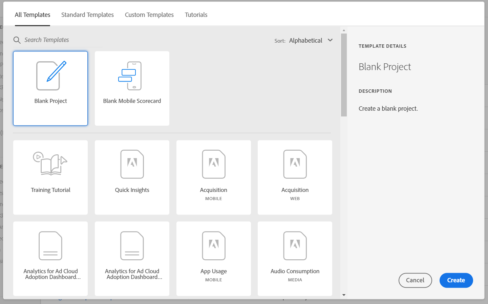

# Analysis Workspace 개요

Analysis Workspace는 신속하게 분석을 빌드하고 인사이트를 공유할 수 있는 유연한 브라우저 도구입니다. 드래그하여 놓기 인터페이스를 사용하여 분석을 만들고 시각화를 추가하여 데이터를 생동감 있게 표현하고 데이터 세트를 조정하며 조직 내 누구와도 프로젝트를 공유 및 예약할 수 있습니다.

시간이 몇 분 밖에 없다면 이 간단한 개요를 통해 무엇이 가능한지 확인하십시오.

>[!VIDEO](https://video.tv.adobe.com/v/26266/?quality=12)

## Customer Journey Analytics 로그인 {#login}

Analysis Workspace를 사용하려면 [experience.adobe.com/analytics](https://experience.adobe.com/analytics)로 이동하여 Customer Journey Analytics에 로그인합니다. 이전에 특정 프로젝트를 선택하지 않은 경우 Analysis Workspace 프로젝트 목록 홈 페이지가 표시됩니다.

## 교육 튜토리얼 사용 {#training-tutorial}

로그인하고 나면 먼저 Workspace에서 첫 번째 분석을 빌드하는 일반적인 용어 및 단계를 안내하는 Analysis Workspace 교육 튜토리얼을 방문해야 합니다. 튜토리얼을 시작하려면 **[!UICONTROL 새 프로젝트 만들기]**&#x200B;를 클릭한 다음 새 프로젝트 모달 내에서 **교육 튜토리얼**&#x200B;을 선택합니다.

## 새 프로젝트 만들기 {#new-project}

튜토리얼이 완료되면 첫 번째 프로젝트 빌드를 시작할 수 있습니다. **새로운 프로젝트 모달**&#x200B;은 분석을 시작하기 위한 다양한 옵션을 제공합니다. 분석을 브라우저에서 공유할 계획인지 Customer Journey Analytics 대시보드 모바일 앱에서 공유할 계획인지에 따라 빈 프로젝트에서 시작하거나 [빈 모바일 스코어카드](/help/mobile-app/curator.md)에서 시작하도록 선택할 수 있습니다.

## 분석 빌드 {#analysis}

Analysis Workspace 프로젝트에서 **패널, 표, 시각화 및 구성 요소**&#x200B;는 왼쪽 레일에서 액세스됩니다. 이는 프로젝트 구성 요소입니다.

### 구성 요소

**구성 요소**&#x200B;는 차원, 지표, 필터 또는 날짜 범위입니다. 모두 비즈니스 질문에 답변하기 위해 **[!UICONTROL 자유 형식 테이블]**&#x200B;에서 결합할 수 있습니다. 분석하기 전에 각 [구성 요소 유형](/help/components/overview.md)을 숙지하십시오. 구성 요소 용어를 숙지하면 드래그 앤 드롭을 시작하여 **[!UICONTROL 자유 형식 테이블]**&#x200B;에서 [분석을 빌드](/help/analysis-workspace/build-workspace-project/freeform-overview.md)할 수 있습니다.

### 시각화

그러면 막대형 차트 또는 선형 차트와 같은 **시각화**&#x200B;가 데이터 위에 추가되어 시각적으로 생동감 있게 표현됩니다. 맨 왼쪽 레일에서 가운데 **[!UICONTROL 시각화]** 아이콘을 선택하여 [시각화](/help/analysis-workspace/visualizations/freeform-analysis-visualizations.md)의 전체 목록을 확인합니다.

### 패널

**패널**&#x200B;은 프로젝트 내에서 분석을 구성하는 데 사용되며 많은 표와 시각화를 포함할 수 있습니다. Analysis Workspace에서 제공되는 많은 패널은 몇 개의 사용자 입력을 기반으로 전체 분석 집합을 생성합니다. 맨 왼쪽 레일에서 맨 위의 **[!UICONTROL 패널]** 아이콘을 선택하여 사용 가능한 [패널](/help/analysis-workspace/c-panels/panels.md)의 전체 목록을 확인합니다.

## 추가 리소스 {#resources}

* Adobe는 수백 개의 [Analytics 비디오 교육 튜토리얼](https://experienceleague.adobe.com/docs/analytics-learn/tutorials/overview.html?lang=ko-KR)을 제공합니다.
