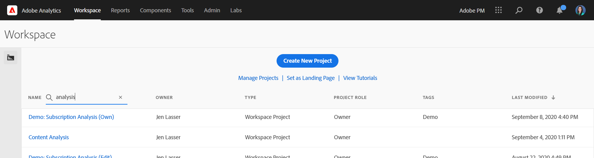

# Analysis Workspace 개요

Analysis Workspace은 분석 및 인사이트 공유를 신속하게 수행할 수 있는 유연한 브라우저 툴입니다. 드래그 앤 드롭 인터페이스를 사용하여 분석을 만들고 시각화를 추가하여 데이터를 생동감 있게 표현하고 데이터 세트를 조정하며 조직 내 누구와도 프로젝트를 공유 및 예약할 수 있습니다.

몇 분 밖에 시간이 없다면 이 간단한 개요를 통해 가능한 작업을 확인하십시오.

>[!VIDEO](https://video.tv.adobe.com/v/26266/?quality=12)

## Adobe Analytics{#login}에 로그인합니다 

Analysis Workspace을 사용하려면 [experience.adobe.com/analytics](https://experience.adobe.com/analytics). 이전에 특정 프로젝트를 선택하지 않은 경우 작업 공간 프로젝트 목록 홈 페이지에 표시됩니다.

## 교육 자습서 사용 {#training-tutorial}

로그인하고 나면 첫 번째 중지는 Analysis Workspace 교육 자습서여야 합니다. 이 자습서에서는 작업 공간에서 첫 번째 분석을 작성하는 일반적인 용어 및 단계를 안내합니다. 튜토리얼을 시작하려면 **[!UICONTROL 새 프로젝트 만들기]** 그런 다음 **교육 자습서** 새로운 프로젝트 모달

## 새 프로젝트 만들기 {#new-project}

튜토리얼이 완성되면 첫 번째 프로젝트 작성을 시작할 수 있습니다. The **새로운 프로젝트 모달** 는 분석을 시작할 수 있는 다양한 옵션을 제공합니다. 빈 프로젝트에서 시작하거나 [빈 모바일 스코어카드](https://docs.adobe.com/content/help/ko-KR/analytics/analyze/mobapp/curator.html), 브라우저나 Adobe Analytics 대시보드 모바일 앱에서 분석을 공유할지 여부에 따라 다릅니다.

또한 미리 만들어진 **템플릿**, Adobe 제공 표준 템플릿 또는 조직에서 만든 사용자 정의 템플릿. 사용 가능한 템플릿은 분석 또는 사용 사례에 따라 몇 가지 다릅니다. [자세한 내용](/help/analysis-workspace/build-workspace-project/starter-projects.md) 사용 가능한 다양한 템플릿 옵션에 대해 설명합니다.

## 분석 구축 {#analysis}

작업 공간 프로젝트에서 **패널, 표, 시각화 및 구성 요소** 왼쪽 레일에서 액세스합니다. 이것이 프로젝트 구성 요소입니다.

### 구성 요소

**구성 요소** 차원, 지표, 세그먼트 또는 날짜 범위입니다. 모두 **[!UICONTROL 자유 형식 테이블]** 비즈니스 질문에 답하기 시작합니다. 각 제품에 대해 숙지하십시오 [구성 요소 유형](/help/components/overview.md) 분석 전에 구성 요소 용어를 마스터하면 드래그 앤 드롭을 [분석 구축](/help/analysis-workspace/build-workspace-project/freeform-overview.md) in **[!UICONTROL 자유 형식 테이블]**.

### 시각화

**시각화**&#x200B;데이터 위에 막대형 또는 라인 차트와 같은 항목이 추가되어 시각적으로 생동감 있게 표현됩니다. 맨 왼쪽 레일에서 가운데 선택 **[!UICONTROL 시각화]** 아이콘 - [시각화](/help/analysis-workspace/visualizations/freeform-analysis-visualizations.md) 사용할 수 있습니다.

### 패널

**패널** 는 프로젝트 내에서 분석을 구성하는 데 사용되며 많은 표와 시각화를 포함할 수 있습니다. Analysis Workspace에서 제공되는 많은 패널들은 몇 개의 사용자 입력을 기반으로 전체 분석 세트를 생성합니다. 맨 왼쪽 레일에서 맨 위를 선택합니다 **[!UICONTROL 패널]** 아이콘 - [패널](/help/analysis-workspace/c-panels/panels.md) 사용할 수 있습니다.

## 추가 리소스 {#resources}

* 수백 개의 Adobe 제공 [분석 비디오 트레이닝 자습서](https://docs.adobe.com/content/help/ko-KR/analytics-learn/tutorials/overview.html).
