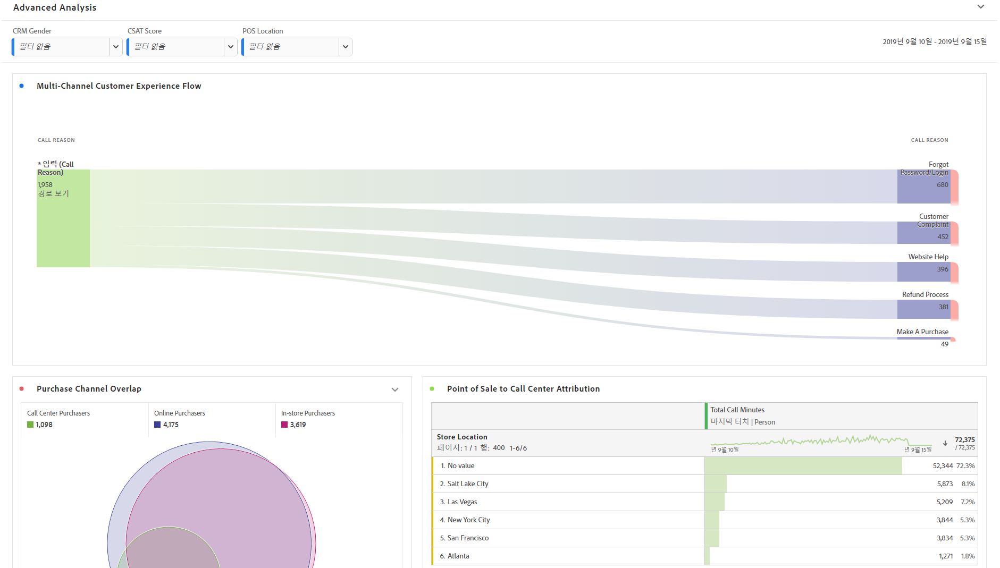
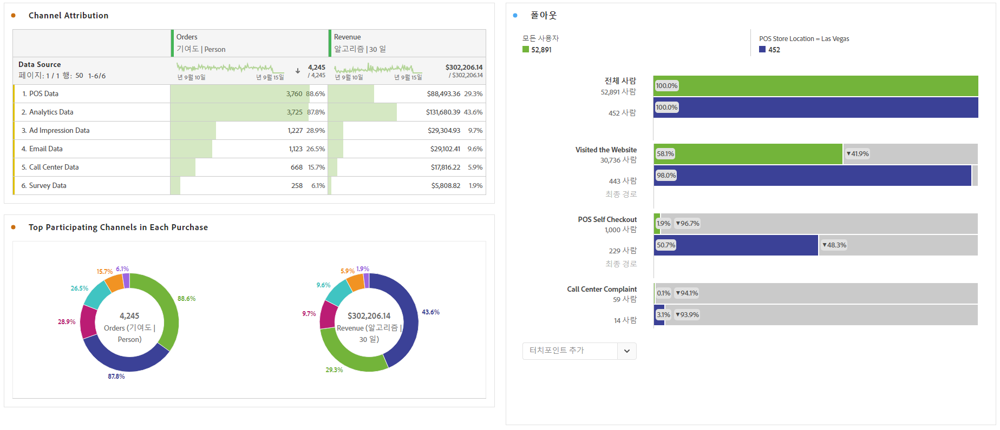

# 고급 분석 수행

고급 분석은 다음과 같은 기능을 활용합니다. [플로우](/help/analysis-workspace/visualizations/c-flow/flow.md) 다이어그램, [속성](/help/analysis-workspace/c-panels/attribution.md), [폴아웃](/help/analysis-workspace/visualizations/fallout/fallout-flow.md) 다이어그램 및 [차원 분류](/help/components/dimensions/t-breakdown-fa.md).

