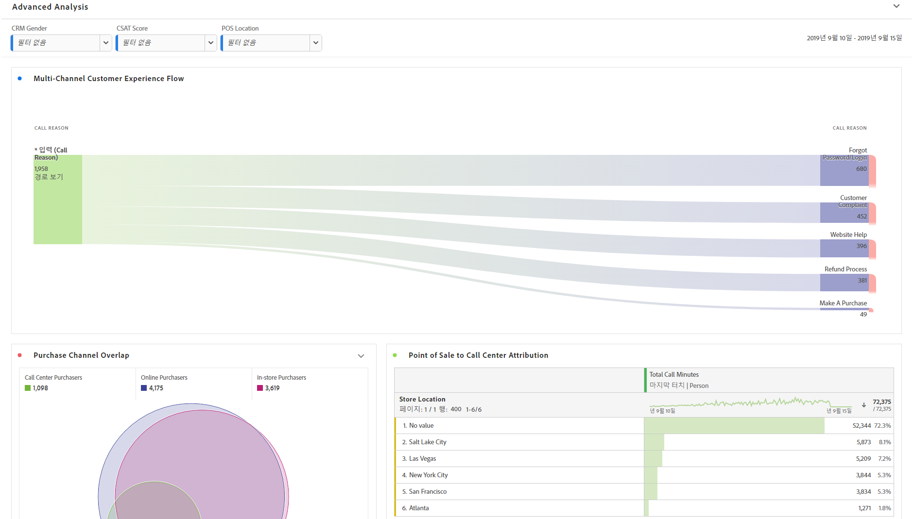
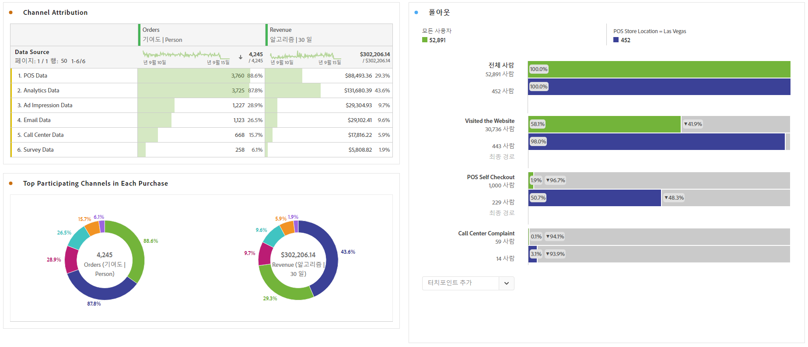

# 고급 분석 수행

아래 설명된 대로, 고급 분석 보고서 및 시각화를 빌드하기 전에 [기본 분석](/help/analysis-workspace/perform-basic-analysis.md)을 이해해야 합니다.

고급 분석은 [흐름](/help/analysis-workspace/visualizations/c-flow/flow.md) 다이어그램, [속성](/help/analysis-workspace/c-panels/attribution.md), [폴아웃](/help/analysis-workspace/visualizations/fallout/fallout-flow.md) 다이어그램, 그리고 [차원 분류](/help/components/dimensions/t-breakdown-fa.md) 같은 기능을 활용합니다.

