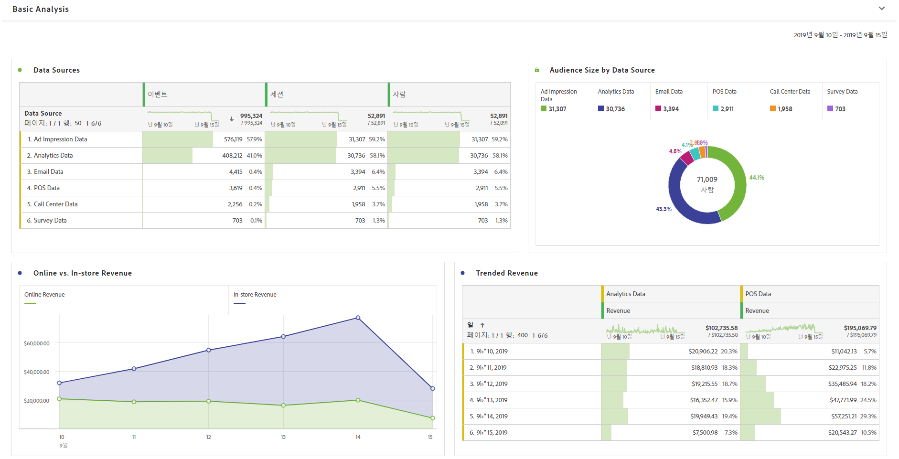
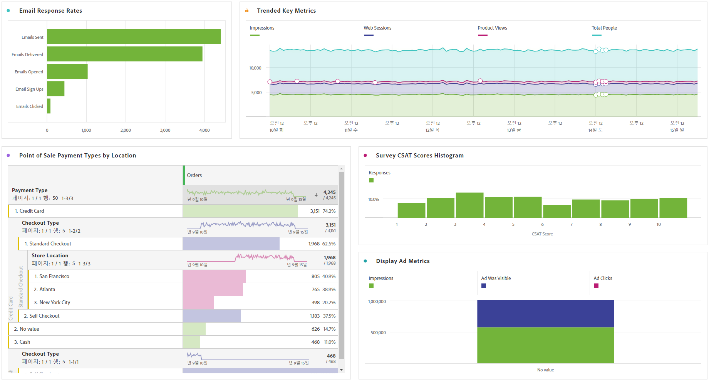

# 기본 분석 수행

연결 및 데이터 보기를 만든 후 Analysis Workspace의 강력한 기능과 유연성을 사용하여 가져온 데이터를 분석합니다. 차원과 지표를 자유롭게 테스트하고 끌어오고, 차원과 지표 속성 설정, 친숙한 이름, 시간대, 세션 설정 등을 변경할 수 있습니다.

다음은 Workspace의 기본 시각화 샘플입니다. 예를 들어 다음 작업을 수행할 수 있습니다.

* 가장 많은 이벤트, 세션 및 사람을 표시하는 데이터 소스의 등급 보고서를 만듭니다.

* 시간에 따라 두 데이터 소스를 비교하는 온라인 매출과 매장 내 매출에 대한 트렌드 보고서를 만듭니다.

* 광고 노출 횟수 데이터, Customer Journey Analytics 데이터, 이메일 데이터, POS 데이터, 콜센터 데이터 그리고 설문 조사 데이터와 같은 데이터 소스로 고객의 규모를 나타냅니다.

