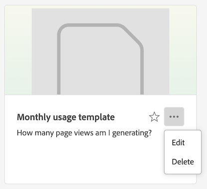
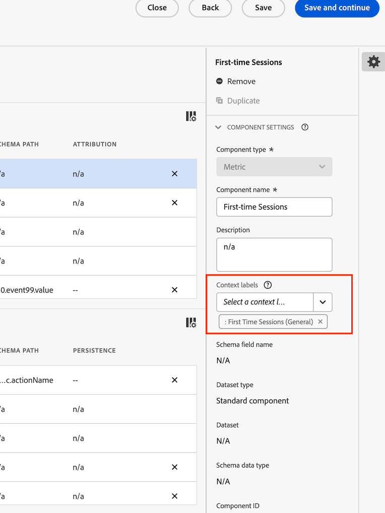

# 템플릿 만들기 및 관리

관리자는 템플릿을 만들고 이를 저장하여 로그인 회사의 다른 사용자들이 이용하도록 할 수 있습니다.

로그인 회사의 사람들은 [템플릿 사용](/help/analysis-workspace/templates/use-templates.md)에 설명된 대로 이러한 회사 템플릿을 사용할 수 있습니다.

## 템플릿 만들기 {#create-templates}

<!-- markdownlint-disable MD034 -->

>[!CONTEXTUALHELP]
>id="use-case-ajo-template"
>title="Journey Optimizer에서 템플릿 사용"
>abstract="Journey Optimizer에서 이 템플릿을 사용하면 Customer Journey Analytics에서 이 템플릿으로 선택한 데이터 보기와 관계없이 Adobe Journey Optimizer에서 기본 데이터 보기로 설정된 데이터 보기가 사용됩니다."

<!-- markdownlint-enable MD034 -->

로그인 회사의 사람들이 사용할 수 있는 새 템플릿을 만드는 방법:

1. Analysis Workspace에서 원하는 상태로 프로젝트를 빌드합니다.

1. [!UICONTROL **프로젝트**] > **[!UICONTROL 템플릿으로 저장…]**&#x200B;을 선택합니다.

   

1. [!UICONTROL 템플릿으로 저장] 대화 상자에서 다음 정보를 지정합니다.

   | 필드 | 설명 |
   |---------|----------|
   | **[!UICONTROL 이름]** | 템플릿에 대해 설명적인 이름을 지정합니다. |
   | **[!UICONTROL 설명]** | 템플릿의 용도를 설명하는 간단한 설명을 입력합니다. |
   | **[!UICONTROL 이 템플릿을 사용하는 이유]** | 이 템플릿을 어떻게 사용할 수 있는지 조직 내의 사람들에게 알리기 위해 간단한 설명을 입력합니다. 이 설명은 템플릿의 미리보기 페이지에 표시됩니다. |
   | **[!UICONTROL 채널]** | 이 템플릿에 적용되는 채널을 모두 선택합니다. 다음의 여러 채널을 선택할 수 있습니다. **[!UICONTROL 웹]**, **[!UICONTROL 모바일]**, **[!UICONTROL 크로스 채널]**, **[!UICONTROL 콜센터]** 및 **[!UICONTROL 스토어에서]**.
선택한 항목에 따라 템플릿이 표시되는 위치와 조직 템플릿 페이지에서 템플릿에 액세스하는 사용자에게 적용되는 세그먼트가 결정됩니다.
 |
   | **[!UICONTROL 사용 사례]** | 이 템플릿에 적용되는 사용 사례를 선택합니다. 다음의 여러 가지 사용 사례를 선택할 수 있습니다. **[!UICONTROL 참여]**, **[!UICONTROL 전환]**, **[!UICONTROL 대상자]**, **[!UICONTROL 확보]** 및 **[!UICONTROL Journey Optimizer]**. 
선택한 항목에 따라 조직 템플릿 페이지에서 템플릿의 위치가 결정됩니다. 사용자는 템플릿으로 이동하거나 사용 사례별로 목록을 필터링할 수 있습니다. 

**참고:** **[!UICONTROL Journey Optimizer]** 옵션을 선택하면 해당 템플릿을 Adobe Journey Optimizer에서 사용할 수 있습니다. Journey Optimizer에서는 **[!UICONTROL 보고서]** 페이지에서 드롭다운 메뉴를 사용하여 사용자가 이 템플릿이나 기본 템플릿을 선택할 수 있습니다. 자세한 내용은 Journey Optimizer 설명서의 [업데이트된 보고 환경 시작하기](https://experienceleague.adobe.com/ko/docs/journey-optimizer/using/reporting/channel-report/report-gs-cja)를 참조하십시오.

Journey Optimizer 옵션을 선택할 때 다음 사항을 고려하십시오.
<ul><li>이 옵션은 Customer Journey Analytics에서 사용하는 데이터 보기에 Journey Optimizer 데이터가 있는 경우에만 사용할 수 있습니다.</li><li>Journey Optimizer에서 이 템플릿을 사용하면 Customer Journey Analytics에서 이 템플릿으로 선택한 데이터 보기와 관계없이 Adobe Journey Optimizer에서 기본 데이터 보기로 설정된 데이터 보기가 사용됩니다.  Journey Optimizer에서 특정 데이터 보기를 기본 데이터 보기로 설정하는 방법에 대한 자세한 내용은 [데이터 보기 만들기 또는 편집](/help/data-views/create-dataview.md)의 [호환성](/help/data-views/create-dataview.md#compatibility)을 참조하십시오.</li></ul> |
   | **[!UICONTROL Journey Optimizer 활동 유형]** | 이 템플릿과 연결할 Journey Optimizer 활동 유형을 선택합니다. **[!UICONTROL 캠페인]**, **[!UICONTROL 여정]**, **[!UICONTROL 랜딩 페이지]**, **[!UICONTROL 보고서]** 또는 **[!UICONTROL 구독]**. 
이 템플릿을 모든 활동 유형과 연결하려면 이 필드를 비워 둡니다.

이 필드는 **[!UICONTROL Journey Optimizer]**&#x200B;가 **[!UICONTROL 사용 사례]** 필드에서 선택된 경우에만 표시됩니다.
 |
   | **[!UICONTROL Journey Optimizer 활동]** | 이 템플릿과 연결할 Journey Optimizer 활동을 선택합니다. 
선택한 활동 유형의 모든 활동과 이 템플릿을 연관시키려면 이 필드를 비워 둡니다.

이 필드는 **[!UICONTROL Journey Optimizer]**&#x200B;가 **[!UICONTROL 사용 사례]** 필드에서 선택된 경우에만 표시됩니다.
 |
   | **[!UICONTROL 태그]** | 템플릿에 적용할 태그를 지정합니다. 추가한 태그를 통해 사용자가 템플릿 목록을 필터링할 수 있습니다. |

1. [!UICONTROL **템플릿으로 저장**]&#x200B;을 선택합니다.

템플릿을 기반으로 프로젝트를 만드는 방법에 대한 자세한 내용은 [템플릿 사용](/help/analysis-workspace/templates/use-templates.md)에서 [템플릿을 기반으로 프로젝트 만들기](/help/analysis-workspace/templates/use-templates.md#create-a-project-based-on-a-template)를 참조하십시오.

## 템플릿 편집 또는 삭제

관리자는 회사 템플릿을 편집하거나 삭제할 수 있습니다.

1. Analysis Workspace에서 [!UICONTROL **Workspace**] 탭을 선택한 다음 왼쪽 레일의 **[!UICONTROL 템플릿]** 아래에서 **[!UICONTROL _login_company_name _템플릿을 선택합니다]**.

1. 열 보기 에서 템플릿을 보는 방법:

   1. 편집하거나 삭제하려는 템플릿으로 이동하여 템플릿 이름 옆에 있는 정보 아이콘을 선택합니다.

      

   1. **[!UICONTROL 미리보기]**&#x200B;를 선택합니다.

   1. 더 보기 아이콘을 선택한 다음 **[!UICONTROL 편집]** 또는 **[!UICONTROL 삭제]**&#x200B;를 선택합니다.

      

1. 카드 보기 에서 템플릿을 보는 방법:

   1. 편집하거나 삭제하려는 템플릿을 찾습니다.

      

   1. 템플릿에 마우스를 가져다 대고 **[!UICONTROL 미리보기]**&#x200B;를 선택합니다.

   1. 자세히 아이콘을 선택한 다음 **[!UICONTROL 편집]** 또는 **[!UICONTROL 삭제]**&#x200B;를 선택합니다.

      

1. 템플릿을 편집하는 경우 원하는 대로 편집한 다음 [!UICONTROL **프로젝트**] > **[!UICONTROL 템플릿으로 저장…]**&#x200B;을 선택합니다.

   

1. [!UICONTROL 템플릿으로 저장] 대화 상자에서 다음 정보를 지정합니다.

   | 필드 | 설명 |
   |---------|----------|
   | **[!UICONTROL 이름]** | 템플릿에 대해 설명적인 이름을 지정합니다. |
   | **[!UICONTROL 설명]** | 템플릿의 용도를 설명하는 간단한 설명을 입력합니다. |
   | **[!UICONTROL 이 템플릿을 사용하는 이유]** | 이 템플릿을 어떻게 사용할 수 있는지 조직 내의 사람들에게 알리기 위해 간단한 설명을 입력합니다. 이 설명은 템플릿의 미리보기 페이지에 표시됩니다. |
   | **[!UICONTROL 채널]** | 이 템플릿에 적용되는 채널을 모두 선택합니다. 다음의 여러 채널을 선택할 수 있습니다. **[!UICONTROL 웹]**, **[!UICONTROL 모바일]**, **[!UICONTROL 크로스 채널]**, **[!UICONTROL 콜센터]** 및 **[!UICONTROL 스토어에서]**. 채널을 선택하지 않으면 템플릿이 모든 채널에 포함됩니다.
선택한 항목에 따라 템플릿이 표시되는 위치와 조직 템플릿 페이지에서 템플릿에 액세스하는 사용자에게 적용되는 필터가 결정됩니다.
 |
   | **[!UICONTROL 사용 사례]** | 이 템플릿에 적용되는 사용 사례를 선택합니다. 다음의 여러 가지 사용 사례를 선택할 수 있습니다. **[!UICONTROL 참여]**, **[!UICONTROL 전환]**, **[!UICONTROL 대상자]**, **[!UICONTROL 확보]** 및 **[!UICONTROL Journey Optimizer]**. 
선택한 항목에 따라 조직 템플릿 페이지에서 템플릿의 위치가 결정됩니다. 사용자는 템플릿으로 이동하거나 사용 사례별로 목록을 필터링할 수 있습니다. 

**참고:** **[!UICONTROL Journey Optimizer]** 옵션을 선택하면 해당 템플릿을 Adobe Journey Optimizer에서 사용할 수 있습니다. Journey Optimizer에서는 **[!UICONTROL 보고서]** 페이지에서 드롭다운 메뉴를 사용하여 사용자가 이 템플릿이나 기본 템플릿을 선택할 수 있습니다. 자세한 내용은 Journey Optimizer 설명서의 [업데이트된 보고 환경 시작하기](https://experienceleague.adobe.com/ko/docs/journey-optimizer/using/reporting/channel-report/report-gs-cja)를 참조하십시오.

Journey Optimizer 옵션을 선택할 때 다음 사항을 고려하십시오.
<ul><li>이 옵션은 Customer Journey Analytics에서 사용하는 데이터 보기에 Journey Optimizer 데이터가 있는 경우에만 사용할 수 있습니다.</li><li>Journey Optimizer에서 이 템플릿을 사용하면 Customer Journey Analytics에서 이 템플릿으로 선택한 데이터 보기와 관계없이 Adobe Journey Optimizer에서 기본 데이터 보기로 설정된 데이터 보기가 사용됩니다.  Journey Optimizer에서 특정 데이터 보기를 기본 데이터 보기로 설정하는 방법에 대한 자세한 내용은 [데이터 보기 만들기 또는 편집](/help/data-views/create-dataview.md)의 [호환성](/help/data-views/create-dataview.md#compatibility)을 참조하십시오.</li></ul> |
   | **[!UICONTROL Journey Optimizer 활동 유형]** | 이 템플릿과 연결할 Journey Optimizer 활동 유형을 선택합니다. **[!UICONTROL 캠페인]**, **[!UICONTROL 여정]**, **[!UICONTROL 랜딩 페이지]**, **[!UICONTROL 보고서]** 또는 **[!UICONTROL 구독]**. 
이 템플릿을 모든 활동 유형과 연결하려면 이 필드를 비워 둡니다.

이 필드는 **[!UICONTROL Journey Optimizer]**&#x200B;가 **[!UICONTROL 사용 사례]** 필드에서 선택된 경우에만 표시됩니다.
 |
   | **[!UICONTROL Journey Optimizer 활동]** | 이 템플릿과 연결할 Journey Optimizer 활동을 선택합니다. 
선택한 활동 유형의 모든 활동과 이 템플릿을 연관시키려면 이 필드를 비워 둡니다.

이 필드는 **[!UICONTROL Journey Optimizer]**&#x200B;가 **[!UICONTROL 사용 사례]** 필드에서 선택된 경우에만 표시됩니다.
 |
   | **[!UICONTROL 태그]** | 템플릿에 적용할 태그를 지정합니다. 추가한 태그를 통해 사용자가 템플릿 목록을 필터링할 수 있습니다. |

1. [!UICONTROL **템플릿으로 저장**]&#x200B;을 선택합니다.

## 템플릿 이름 바꾸기, 태그 지정 또는 승인

관리자는 회사 템플릿의 이름을 바꾸고, 태그를 지정하고, 승인할 수 있습니다.

1. Analysis Workspace에서 [!UICONTROL **Workspace**] 탭을 누른 다음 왼쪽 레일에서 **[!UICONTROL 프로젝트 탭]**&#x200B;을 선택합니다.

1. 프로젝트 목록을 필터링하려면 필터 아이콘을 선택합니다.

1. 필터 레일에서 **[!UICONTROL 다른 필터]**&#x200B;를 선택한 다음 **[!UICONTROL 회사 템플릿]**&#x200B;을 선택합니다.

   회사 템플릿 목록이 표시됩니다. 고정되지 않은 모든 일반 프로젝트는 표시되지 않습니다.

   회사 템플릿은 템플릿 이름 앞에 있는 으로 식별할 수 있습니다.

   

1. 사용 가능한 옵션을 보려면 템플릿 옆에 있는 **...** 줄임표 아이콘을 클릭합니다.

   

1. **[!UICONTROL 이름 바꾸기]**, **[!UICONTROL 태그]** 또는 **[!UICONTROL 승인]**&#x200B;을 선택합니다.

   또한 템플릿을 삭제할 수도 있고, [템플릿 편집 또는 삭제](#edit-or-delete-templates)에 설명된 대로 템플릿을 삭제할 수도 있습니다.

1. (선택 사항) 일반 보기로 돌아가려면 필터 레일에서 **[!UICONTROL 회사 템플릿]**&#x200B;을 선택 취소합니다.

## 해당 템플릿의 데이터 보기에 누락된 구성 요소 추가

기본적으로 Adobe에서 제공하는 일부 템플릿은 데이터 보기에 없는 구성 요소를 포함하고 있으므로 사용할 수 없습니다.

누락된 각 구성 요소에 대해 일치하는 컨텍스트 레이블을 데이터 보기에서 사용할 수 있습니다. 이미 데이터 보기에 있는 구성 요소에 일치하는 컨텍스트 레이블을 추가하거나, 데이터 보기에 새 구성 요소를 추가하고 여기에 컨텍스트 레이블을 추가해야 합니다.

템플릿에 누락된 구성 요소를 추가하는 방법:

1. Analysis Workspace에서 [!UICONTROL **Workspace**] 탭을 선택한 다음 왼쪽 레일의 **[!UICONTROL 템플릿]** 아래에서 **[!UICONTROL Adobe 템플릿]**&#x200B;을 선택합니다.

1. 템플릿 목록을 필터링하려면 필터 아이콘을 선택합니다.

1. 데이터 보기에 없는 구성 요소가 필요한 템플릿을 표시하려면 **[!UICONTROL 사용 준비 안됨]**&#x200B;을 선택합니다.

   

1. 아직 데이터 보기에 사용할 준비가 되지 않은 템플릿을 찾습니다.

1. 다음 중 하나를 수행합니다.

   * **열 보기** 에서 템플릿을 보는 방법:

      1. 아직 데이터 보기에 사용할 준비가 되지 않은 템플릿으로 이동한 다음 템플릿 이름 옆에 있는 정보 아이콘을 선택합니다.

         

      1. **[!UICONTROL 미리보기]**&#x200B;를 선택합니다.

         

   * **카드 보기** 에서 템플릿을 보는 방법:

      1. 아직 데이터 보기에 사용할 준비가 되지 않은 템플릿을 찾습니다.

         

      1. 템플릿에 마우스를 가져다 대고 **[!UICONTROL 미리보기]**&#x200B;를 선택합니다.

         

1. **[!UICONTROL 누락된 구성 요소]** 섹션의 데이터 보기에서 누락된 구성 요소 목록이 표시됩니다. **[!UICONTROL 데이터 보기에 이들 구성 요소를 추가하십시오]**&#x200B;를 선택합니다.

   데이터 보기의 구성 페이지가 새 탭에 표시됩니다.

1. 데이터 보기의 **[!UICONTROL 구성 요소]** 탭을 선택합니다.

   

1. 템플릿에서 누락된 것으로 나열된 각 구성 요소에 대해 **[!UICONTROL 구성 요소]** 탭에서 다음 중 하나를 수행합니다.

   * **[!UICONTROL 포함된 구성 요소]** 섹션에서 누락된 구성 요소에 사용하려는 데이터 보기에 이미 포함된 구성 요소를 선택합니다.

   * 누락된 구성 요소에 사용할 새 구성 요소를 데이터 보기에 추가한 다음 구성 요소를 선택합니다.

     데이터 보기에 새 구성 요소를 추가하려면 스키마 필드 목록을 검색한 다음 **[!UICONTROL 포함된 구성 요소]** 섹션으로 끌어다 놓습니다.

1. 구성 요소를 선택한 후 오른쪽 열에서 **[!UICONTROL 컨텍스트 레이블]** 드롭다운 메뉴를 찾습니다.

   

1. **[!UICONTROL 컨텍스트 레이블]** 드롭다운 메뉴에서 누락된 구성 요소와 동일한 이름을 가진 컨텍스트 레이블을 선택합니다.

1. **[!UICONTROL 저장 후 계속]**&#x200B;을 선택합니다.

1. 누락된 각 구성 요소에 대해 데이터 보기의 구성 요소에 일치하는 컨텍스트 레이블을 추가하는 과정을 반복합니다.

## 회사 템플릿 액세스

Adobe에서 제공하는 템플릿과 마찬가지로 조직 내 사용자는 관리자가 만든 템플릿에 액세스할 수 있습니다.

회사 템플릿에 액세스하는 방법에 대한 자세한 내용은 [템플릿 사용](/help/analysis-workspace/templates/use-templates.md)에서 [템플릿 액세스 및 실행](/help/analysis-workspace/templates/use-templates.md#access-and-run-a-template)을 참조하십시오.

## 템플릿 탭 숨기기

관리자는 자신의 조직 내에서 모든 사용자에 대해 템플릿 탭을 숨길 수 있습니다.

1. **[!UICONTROL Customer Journey Analytics]** > **[!UICONTROL 구성 요소]** > **[!UICONTROL 환경 설정]** > **[!UICONTROL 회사]**&#x200B;로 이동합니다.
1. **[!UICONTROL 템플릿 탭 숨기기]** 옵션을 선택합니다.
