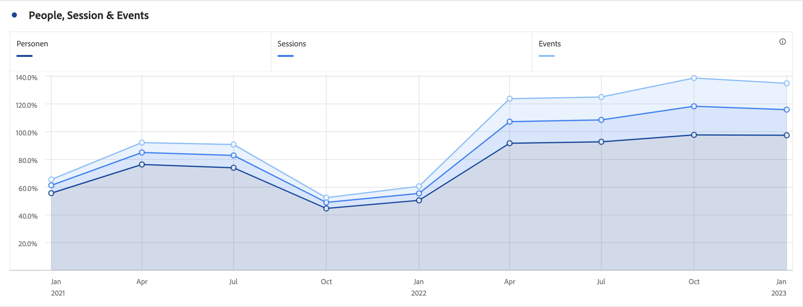

# 영역 및 스택 영역

## 영역 {#area}

<!-- markdownlint-disable MD034 -->

>[!CONTEXTUALHELP]
>id="cja_workspace_area_button"
>title="영역 그래프"
>abstract="여러 지표의 교차를 나타내는 영역 그래프 시각화를 만듭니다."

<!-- markdownlint-enable MD034 -->

 **[!UICONTROL Area]** 시각화는 선 그래프와 비슷하지만 선 아래에 색칠된 영역이 있습니다. 여러 지표가 있고 두 개 이상의 지표의 교차 지점으로 표시되는 영역을 시각화하려는 경우 영역 그래프를 추가합니다.

## 스택 영역 {#area-stacked}

<!-- markdownlint-disable MD034 -->

>[!CONTEXTUALHELP]
>id="cja_workspace_areastacked_button"
>title="스택 영역"
>abstract="여러 지표의 스택을 나타내는 영역 그래프 시각화를 만듭니다."

<!-- markdownlint-enable MD034 -->

 **[!UICONTROL Area stacked]** 시각화는 영역과 유사하지만 각 시리즈가 이전 시리즈의 맨 위에서 시작됩니다.

 **[!UICONTROL 설정]**&#x200B;에서 **[!UICONTROL 100% 누적]** 옵션을 사용하여 차트를 100% 누적 시각화로 만듭니다.

>[!MORELIKETHIS]
>
>[패널에 시각화 추가](/help/analysis-workspace/visualizations/freeform-analysis-visualizations.md#add-visualizations-to-a-panel)
>[시각화 설정](/help/analysis-workspace/visualizations/freeform-analysis-visualizations.md#settings)
>[시각화 컨텍스트 메뉴](/help/analysis-workspace/visualizations/freeform-analysis-visualizations.md#context-menu)
>
