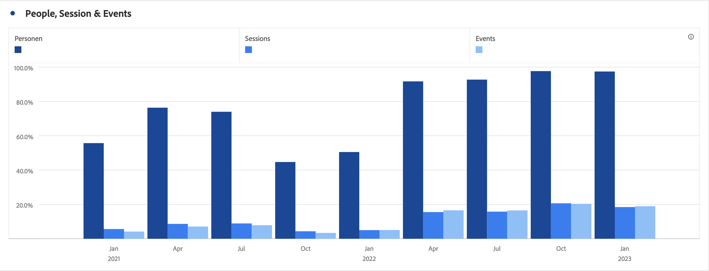
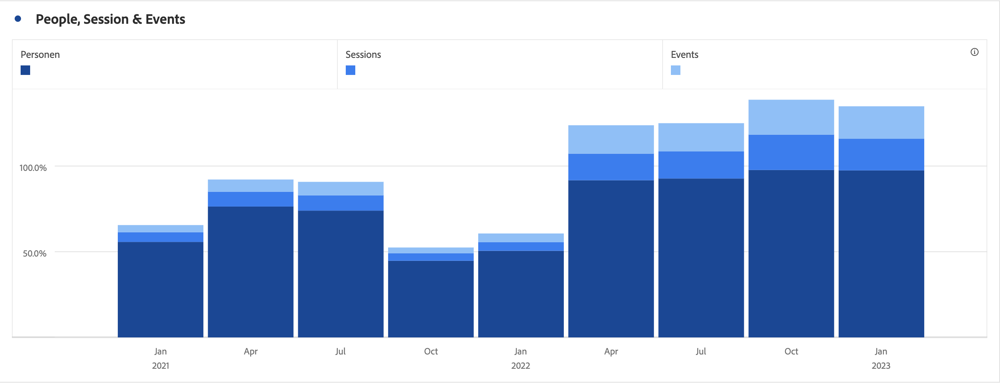
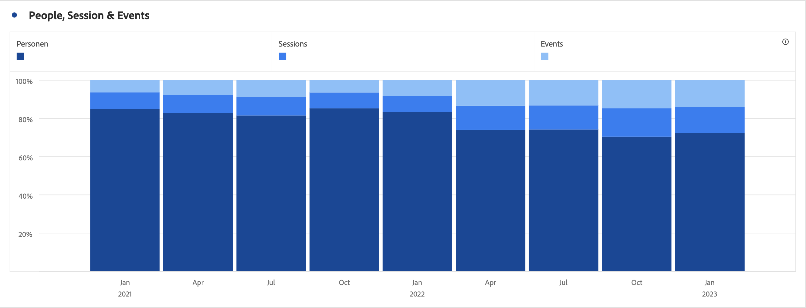

# 막대(스택)

>[!BEGINSHADEBOX]

_이 문서는 이 문서의_  _&#x200B;**Customer Journey Analytics**&#x200B;에 막대 및 막대 누적 시각화를 문서화합니다._ __&#x200B;에 대한 [막대 및 막대 누적](https://experienceleague.adobe.com/ko/docs/analytics/analyze/analysis-workspace/visualizations/bar)을 참조하십시오 _&#x200B;**Adobe Analytics** 버전._

>[!ENDSHADEBOX]

막대 시각화에는 표준 옵션과 스택 옵션이 있습니다.

## 막대 {#bar}

<!-- markdownlint-disable MD034 -->

>[!CONTEXTUALHELP]
>id="workspace_bar_button"
>title="막대"
>abstract="하나 이상의 지표에서 다양한 값을 나타내는 막대 시각화를 만듭니다."

<!-- markdownlint-enable MD034 -->

 **[!UICONTROL 막대]** 시각화는 하나 이상 지표에서 다양한 값을 나타내는 세로 막대를 표시합니다.

시각화 설정의 세부 기간 드롭다운을 사용하면 트렌드 시각화 (예: 선, 막대)를 일별에서 주별, 월별 등으로 변경할 수 있습니다.

## 스택 막대 {#bar-stacked}

<!-- markdownlint-disable MD034 -->

>[!CONTEXTUALHELP]
>id="workspace_barstacked_button"
>title="스택 막대"
>abstract="하나 이상의 스택 지표에서 다양한 값을 나타내는 막대 시각화를 만듭니다."

<!-- markdownlint-enable MD034 -->

 **[!UICONTROL 스택 막대]** 시각화는 막대 차트와 유사하지만 시리즈 막대가 서로의 위에 스택되어 있습니다.

 **[!UICONTROL 설정]**&#x200B;에서 **[!UICONTROL 100% 스택]** 옵션을 사용하여 차트를 100% 스택 시각화로 변환합니다.

>[!BEGINSHADEBOX]

데모 비디오는  [영역 시각화](https://experienceleague.adobe.com/en/docs/customer-journey-analytics-learn/tutorials/analysis-workspace/visualizations/add-bar-visualizations){target="_blank"}를 참조하십시오.

>[!ENDSHADEBOX]

>[!MORELIKETHIS]
>
>[패널에 시각화 추가](/help/analysis-workspace/visualizations/freeform-analysis-visualizations.md#add-visualizations-to-a-panel)
>[시각화 설정](/help/analysis-workspace/visualizations/freeform-analysis-visualizations.md#settings)
>[시각화 컨텍스트 메뉴](/help/analysis-workspace/visualizations/freeform-analysis-visualizations.md#context-menu)
>

