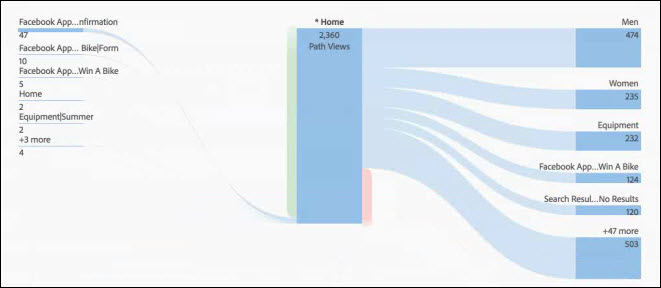

# 플로우 시각화 구성

>[!NOTE] Customer Journey Analytics의 Analysis Workspace 설명서를 보고 있습니다. 이 기능은 기존 Adobe Analytics의 [Analysis Workspace과 약간 다릅니다](https://docs.adobe.com/content/help/ko-KR/analytics/analyze/analysis-workspace/home.html). [추가 정보...](/help/getting-started/cja-aa.md)

흐름을 사용하면 eVar와 같이, 페이지나 차원을 통해 경로를 추적할 수 있습니다. 

* 시작(차원만)
* 차원 또는 항목
* 종료(차원만)

이러한 각각의 카테고리는 화면에 &quot;놓기 영역&quot;으로 표시됩니다. 목록의 항목을 원하는 놓기 영역으로 드래그하여 놓으십시오. 차원이 아닌 페이지 및 다른 항목은 가운데 놓기 영역에만 배치할 수 있습니다. 차원을 가운데 영역에 놓으면, 해당 차원에 대한 상위 항목을 삽입하는 보고서가 자동으로 실행됩니다. 

항목을 놓기 영역에 놓으면 흐름 다이어그램이 열립니다. 흐름 다이어그램의 컨텐츠는 차원이나 항목을 놓는 놓기 영역에 따라 달라집니다. 종료 및 시작은 시작 또는 종료 놓기 영역에 놓는 차원(예: 페이지 수)에 대한 모든 항목을 보여 줍니다. 예를 들어, 차원을 중앙의 놓기 영역에 놓으면, 해당 차원에 대한 흐름 다이어그램이 열립니다. 

마우스를 다이어그램의 중앙에 있는 포커스 노드 위에 놓아 해당 노드에 대한 정보를 보십시오. 

흐름 다이어그램은 대화형입니다. 표시되는 세부 사항을 변경하려면 마우스를 다이어그램 위에 놓습니다. 

다이어그램의 경로들은 비례합니다. 활동이 많은 경로일수록 더 두껍게 표시됩니다. 

다이어그램에 있는 노드를 클릭하면 해당 노드에 대한 세부 사항이 표시됩니다. 예를 들어, 위의 맨 위 다이어그램에서 오른쪽에 있는 **[!UICONTROL 검색 결과]**&#x200B;를 클릭하면 다이어그램이 확장되어 검색 결과 노드에 대한 세부 사항이 더 많이 표시됩니다. 축소하려면 노드를 다시 클릭하십시오. 

기본적으로 다이어그램에는 상위 5개의 흐름이 표시됩니다. 다이어그램의 맨 아래에 있는 **[!UICONTROL 자세히]** 노드를 클릭하면 아래쪽으로 다이어그램이 확장되어 5개의 흐름이 더 표시됩니다. 계속하여 **[!UICONTROL 자세히]**&#x200B;를 클릭하여 표시되는 추가 흐름이 없을 때까지 확장하십시오. 

흐름 다이어그램 내에서 탐색할 수 있는 양에는 제한이 없습니다.

**[!UICONTROL 프로젝트]** > **[!UICONTROL CSV 다운로드]**&#x200B;로 이동하여 프로젝트의 .CSV 파일의 일부로서 플로우 다이어그램을 내보내고 추가로 분석할 수도 있습니다.
