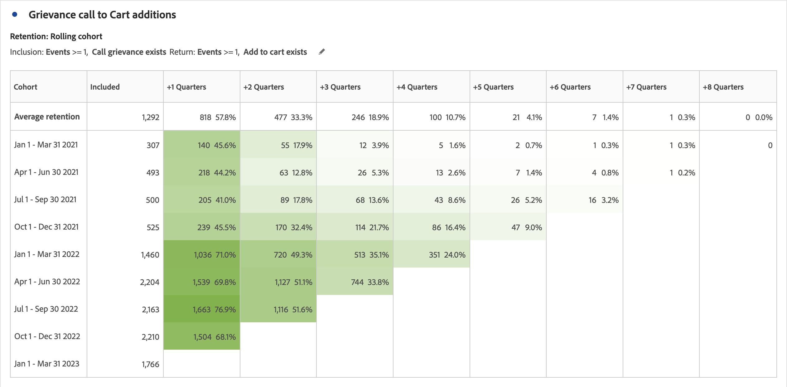

# 코호트 테이블 개요 {#cohort-table-overview}

<!-- markdownlint-disable MD034 -->

>[!CONTEXTUALHELP]
>id="workspace_cohorttable_button"
>title="코호트 테이블"
>abstract="이벤트 완료를 기반으로 사용자를 그룹화하고 진행 중인 참여와 시간에 따른 이탈을 분석하는 코호트 시각화를 만듭니다."

<!-- markdownlint-enable MD034 -->

<!-- markdownlint-disable MD034 -->

>[!CONTEXTUALHELP]
>id="workspace_cohorttable_panel"
>title="코호트 테이블"
>abstract="이벤트 완료를 기반으로 사용자를 그룹화한 다음 진행 중인 참여와 시간에 따른 이탈을 분석합니다. 세부 기간, 코호트 분석 유형, 순환 계산 사용 여부와 같은 추가 설정을 지정합니다. 선택한 차원을 기반으로 지연 테이블이나 사용자 정의 차원 코호트를 작성하기 위한 고급 옵션을 설정할 수 있습니다."

<!-- markdownlint-enable MD034 -->

>[!BEGINSHADEBOX]

_이 문서에서는_  _&#x200B;**Customer Journey Analytics**&#x200B;의 코호트 테이블에 대해 설명합니다._ _이 문서의_  _&#x200B;**Adobe Analytics** 버전은 [코호트 테이블](https://experienceleague.adobe.com/ko/docs/analytics/analyze/analysis-workspace/visualizations/cohort-table/cohort-analysis)을 참조하십시오._

>[!ENDSHADEBOX]

*코호트*&#x200B;는 지정된 기간 동안 공통적인 특성을 공유하는 사람들의 그룹입니다.  **[!UICONTROL 코호트 테이블]** 시각화는 코호트가 브랜드와 어떻게 상호 작용하는지 알아보고 싶을 때 유용합니다. 트렌드 변경 사항을 쉽게 찾아 응답할 수 있습니다. ([!UICONTROL 집단 분석]에 대한 설명은 [집단 분석 101](https://ko.wikipedia.org/wiki/Cohort_analysis)에서와 같이 웹에서 사용할 수 있습니다.)

집단 보고서를 만들면 그 구성 요소(특정 차원, 지표 및 세그먼트)를 조정한 다음, 모든 사람과 집단 보고서를 공유할 수 있습니다. [조정 및 공유](/help/analysis-workspace/curate-share/curate.md)를 참조하십시오.

[!UICONTROL 코호트 테이블]로 수행할 수 있는 작업의 예:

* 원하는 액션에 박차를 가할 수 있도록 설계된 캠페인 시작.
* 고객 라이프사이클에서 적시에 마케팅 예산 전환.
* 체험판이나 오퍼를 종료하여 가치를 극대화할 시점 인식.
* 가격 책정, 업그레이드 경로 등과 같은 분야에서 A/B 테스트를 하기 위한 아이디어 얻기.

[!UICONTROL 코호트 테이블]은 [!UICONTROL Analysis Workspace]에 대한 액세스 권한이 있는 모든 Customer Journey Analytics 고객이 사용할 수 있습니다.

>[!BEGINSHADEBOX]

데모 비디오를 보려면  [Analysis Workspace의 코호트 테이블](https://video.tv.adobe.com/v/23990/?quality=12&learn=on){target="_blank"}을 확인하십시오.

{{videoaa}}

>[!ENDSHADEBOX]

>[!IMPORTANT]
>
>[!UICONTROL 집단 분석]에서는 세그먼트화할 수 없는 지표(계산된 지표 포함), 정수가 아닌 지표(매출액 등) 또는 발생을 지원하지 않습니다. 세그먼트에 사용할 수 있는 지표만 [!UICONTROL 집단 분석]에서 사용할 수 있으며 한 번에 1씩만 증분할 수 있습니다.

Customer Journey Analytics의 코호트 테이블은 이중 기반(또는 숫자 기반) 지표를 지원합니다. 예를 들어 Purchase.Value(double)는 포함/반환 지표로 사용될 수 있습니다. 또한 Analytics Source Connector를 통해 Adobe Experience Platform에 전달되는 모든 지표도 두 배가 됩니다.

## 코호트 테이블 기능

다음 섹션에서는 작성 중인 코호트를 세밀하게 제어할 수 있는 코호트 분석 기능에 대해 설명합니다.

코호트를 만들고 [!UICONTROL 코호트 분석] 보고서를 실행하는 방법에 대한 자세한 내용은 [코호트 테이블 구성](/help/analysis-workspace/visualizations/cohort-table/t-cohort.md)을 참조하십시오.

### [!UICONTROL 유지] 테이블

[!UICONTROL 유지] 코호트 테이블은 사람 수를 반환합니다. 각 데이터 셀에는 해당 기간 동안 액션을 수행한 코호트에 있는 사람들의 원시 수와 백분율 보여 줍니다. 최대 3개의 지표와 10개의 세그먼트를 포함할 수 있습니다.

### [!UICONTROL 이탈] 테이블

[!UICONTROL 이탈] 코호트 테이블은 유지 테이블의 역버전이며 시간 경과에 따라 코호트에 대한 반환 기준을 충족하지 않은 사람을 표시합니다. 최대 3개의 지표와 10개의 세그먼트를 포함할 수 있습니다.

### [!UICONTROL 순환 계산]

포함된 열이 아닌 이전 열을 기준으로 유지 또는 이탈을 계산할 수 있으며, 이를 순환 계산이라고 합니다.

### [!UICONTROL 지연] 테이블

지연 테이블은 포함 이벤트가 발생하기 전후에 경과된 시간을 측정합니다. 지연 시간 측정은 사전 및 사후 분석을 위한 훌륭한 도구입니다. **[!UICONTROL 포함]** 열은 테이블의 중앙에 있으며 포함 이벤트 전후의 기간이 양쪽에 표시됩니다.

### [!UICONTROL 사용자 정의 차원] 코호트

기본값인 시간 기반 코호트가 아닌 선택된 차원에 따라 코호트를 만들 수 있습니다. [!UICONTROL 도시 지역], [!UICONTROL 마케팅 채널], [!UICONTROL 캠페인], [!UICONTROL 제품], [!UICONTROL 페이지], [!UICONTROL 지역] 또는 기타 차원을 사용하여 유지율이 어떻게 변화하는지 보여 줍니다. 이러한 차원의 다양한 값을 기준으로 합니다.

>[!MORELIKETHIS]
>
>[코호트 테이블 구성](/help/analysis-workspace/visualizations/cohort-table/t-cohort.md).
>

