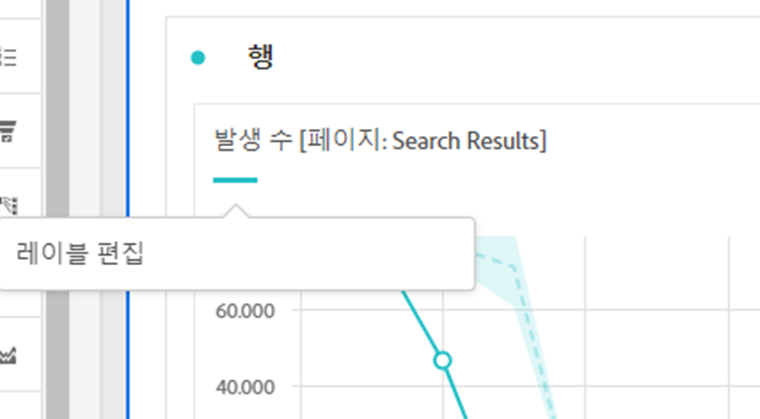
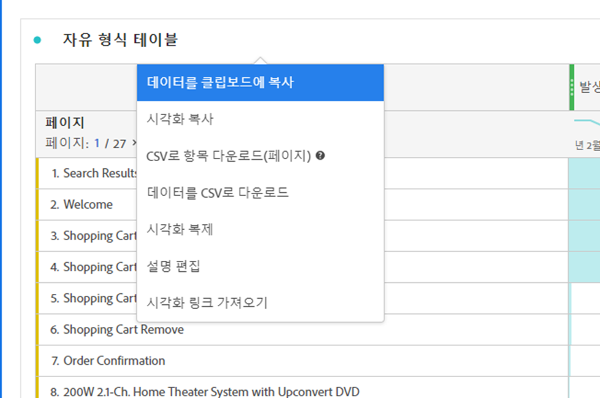
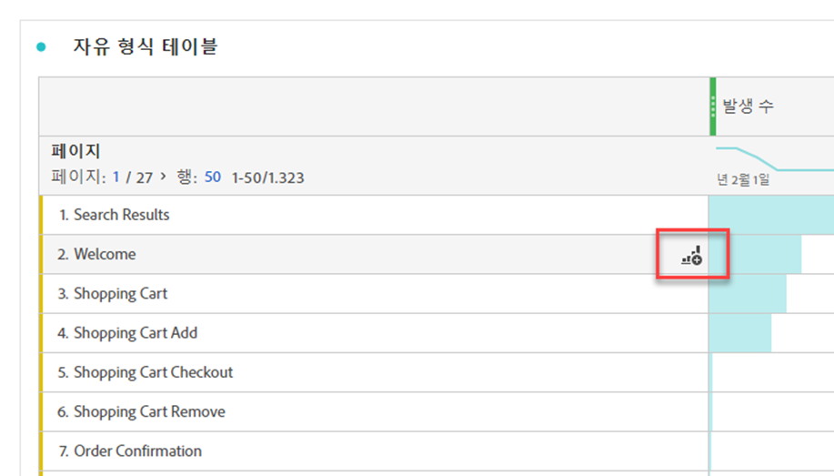

# 시각화 개요

Workspace에서는 데이터를 시각적으로 나타낼 수 있도록 해주는 다양한 시각화를 제공합니다. 막대 차트, 도넛 차트, 히스토그램, 선 차트, 맵, 산점도 등이 있습니다.

## 유형

Analysis Workspace에서 다음 시각화 유형을 사용할 수 있습니다.

| 아이콘 |  이름  | 설명 |
| :---: | --- | ---| 
|  | [영역](/help/analysis-workspace/visualizations/area.md) | 영역 그래프 시각화. 선 그래프와 비슷하지만 선 아래에 색칠된 영역이 있습니다. 여러 개의 지표가 있고 두 개 이상 지표의 교차 지점으로 표시되는 영역을 시각화하려는 경우 영역 그래프를 사용하십시오. |
|  | [막대](/help/analysis-workspace/visualizations/bar.md) | 하나 이상의 지표에서 다양한 값을 나타내는 세로 막대가 있는 막대 그래프 시각화입니다. |
|  | [스택 막대](/help/analysis-workspace/visualizations/bar.md) | 하나 이상의 지표에서 다양한 값을 나타내는 세로 막대가 있는 스택 막대 그래프 시각화입니다. |
| 
 | [글머리 기호](/help/analysis-workspace/visualizations/bullet-graph.md) | 중요한 값이 다른 성능 범위(목표)에 대해 비교되거나 측정되는 방식을 보여 주는 글머리 기호 그래프 시각화입니다. |
|  | [집단 테이블](/help/analysis-workspace/visualizations/cohort-table/cohort-analysis.md) | 집단 시각화는 지정된 기간 동안 공통적인 특성을 공유하는 사람들의 그룹입니다. 집단 테이블은 유지, 이탈 또는 지연 시간 분석에 유용합니다. |
|  | [콤보](combo-charts.md) | 콤보 차트를 사용하면 표를 먼저 빌드하지 않고도 비교 시각화를 빠르게 빌드할 수 있습니다. |
|  | [도넛](/help/analysis-workspace/visualizations/donut.md) | 파이 차트와 유사하게 도넛 시각화는 데이터를 전체의 일부 또는 필터로 표시합니다. |
|  | [폴아웃](/help/analysis-workspace/visualizations/fallout/fallout-flow.md) | 폴아웃 시각화는 사용자가 페이지의 사전 정의된 순서를 떠나고 (폴아웃) 계속 따라가는 (폴스루) 위치를 보여 줍니다. |
|  | [플로우](/help/analysis-workspace/visualizations/c-flow/flow.md) | 플로우 시각화는 웹 사이트 및 앱을 통과하는 정확한 고객 경로를 보여 줍니다. |
| 
 | [자유 형식 테이블](/help/analysis-workspace/visualizations/freeform-table/freeform-table.md) | 자유 형식 테이블 시각화는 대화형 시각화입니다. 자유 형식 테이블 시각화는 Workspace에서 데이터 분석을 위한 기반입니다. |
|  | [히스토그램](/help/analysis-workspace/visualizations/histogram.md) | 히스토그램 시각화는 지표 볼륨을 기반으로 개인, 방문 또는 이벤트를 버킷으로 버킷팅합니다. |
|  | [가로 막대형](/help/analysis-workspace/visualizations/horizontal-bar.md) | 가로 막대 시각화는 하나 이상의 지표에서 다양한 값을 나타내는 가로 막대를 표시합니다. |
|  | [스택 가로 막대](/help/analysis-workspace/visualizations/horizontal-bar.md) | 스택 가로 막대 시각화는 하나 이상의 지표에서 다양한 값을 나타내는 가로 막대를 표시합니다. |
|  | [주요 지표 요약](/help/analysis-workspace/visualizations/key-metric.md) | 주요 지표 요약 시각화는 선, 요약 변경 및 요약 번호 시각화를 결합합니다. |
|  | [라인](/help/analysis-workspace/visualizations/line.md) | 라인 시각화는 일정 기간 동안 값이 어떻게 변하는지를 보여 주기 위해 라인을 사용하여 지표를 나타냅니다. 꺾은선형 차트는 x축을 따라 시간을 사용합니다. |
|  | [분산](/help/analysis-workspace/visualizations/scatterplot.md) | 산포도 시각화는 차원 항목과 최대 3개의 지표 간의 관계를 보여 줍니다. |
|  | [섹션 머리글](section-header.md) | 패널 내의 섹션을 식별하고 아티큘레이션합니다. |
|  | [요약 변경](/help/analysis-workspace/visualizations/summary-number-change.md) | 요약 변경 시각화는 선택한 셀 간의 변화를 하나의 큰 숫자 또는 백분율로 표시합니다. |
| 
 | [요약 번호](/help/analysis-workspace/visualizations/summary-number-change.md) | 요약 번호 시각화는 선택한 셀을 하나의 큰 숫자로 표시합니다. |
|  | [텍스트](/help/analysis-workspace/visualizations/text.md) | 텍스트 시각화를 사용하면 Workspace에 사용자 정의 텍스트를 추가할 수 있습니다. 패널/시각화 설명을 활용하는 것 외에도 여러분의 분석 및 통찰력에 추가 컨텍스트를 추가하는 데 유용합니다. |
|  | [트리맵](/help/analysis-workspace/visualizations/treemap.md)
 | 트리맵 시각화는 계층형(트리 구조) 데이터를 중첩된 직사각형 세트로 표시합니다. |
|  | [벤](/help/analysis-workspace/visualizations/venn.md) | 벤 시각화는 원을 사용하여 최대 3개 필터의 지표 겹침을 나타냅니다. |

<!-- Add beneath Horizontal bar in the table above: | [Journey canvas](/help/analysis-workspace/visualizations/journey-canvas/journey-canvas.md) | Similar to Fallout, Journey canvas shows where persons left (fell out) and continued through (fell through) a predefined sequence of pages. 
Unlike Fallout, Journey canvas supports not only linear journeys, but any number of entry points and paths. Furthermore, journeys can be created in Adobe Journey Optimizer and then analyzed in Journey canvas.
 | -->

## 패널에 시각화 추가

1. 시각화를 추가할 Workspace 프로젝트를 엽니다.

1. 시각화를 추가하려면 다음 방법 중 하나를 사용하십시오.

   

   * 왼쪽 패널에서  **시각화**&#x200B;를 선택한 다음 시각화를 추가할 패널로 시각화를 드래그합니다.

   * 시각화를 추가할 패널에서 을 선택한 다음 추가할 시각화를 나타내는 아이콘을 선택합니다. 각 시각화의 아이콘 위로 마우스를 가져가 이름을 확인합니다.

   * [빈 패널](https://experienceleague.adobe.com/en/docs/analytics/analyze/analysis-workspace/panels/blank-panel)을 추가한 다음 추가할 시각화를 선택합니다.

   * Analysis Workspace 프로젝트에 있는 기존 시각화의 컨텍스트 메뉴에서 **[!UICONTROL 시각화 복제]** 또는 **[!UICONTROL 시각화 복사]**&#x200B;를 선택합니다.

   * Workspace **[!UICONTROL 삽입]** 메뉴를 사용하여 시각화를 삽입합니다.

   * 자유 형식 테이블의 컨텍스트 메뉴에서 **[!UICONTROL 시각화]**&#x200B;를 선택합니다. 그런 다음 하위 메뉴에서 시각화를 선택합니다. Workspace은 테이블에서 현재 선택한 항목에 따라 제공할 시각화를 결정하고 데이터를 해석하여 요청된 시각화를 구축합니다.

## 범례

시각화 범례를 사용하면 소스 테이블의 날짜를 시각화에 그려진 시리즈와 연결할 수 있습니다. 범례는 대화형입니다. 시각화에서 시리즈를 표시하거나 숨길 범례 항목을 선택할 수 있습니다. 이는 시각화되는 데이터를 단순화하려는 경우 유용합니다.

또한 시각적 오브젝트를 보다 쉽게 사용할 수 있도록 범례 레이블의 이름을 바꿀 수 있습니다. 참고: 트리맵, 글머리 기호, 요약 변경 사항 또는 숫자, 텍스트, 자유 형식, 히스토그램, 집단 또는 플로우 시각화에는 범례 편집이 적용되지 **않습니다**.

범례 레이블을 편집하려면 다음 작업을 수행하십시오.

1. 범례 레이블 중 하나를 마우스 오른쪽 버튼으로 클릭합니다.
1. **[!UICONTROL 레이블 편집을 클릭합니다]**.

   

1. 새 레이블 텍스트를 입력합니다.
1. **[!UICONTROL Enter]**&#x200B;를 눌러 저장합니다.

## 설정

각 시각화에는 자체 설정이 있습니다. 시각화 설정에 액세스하려면 팝업을 표시하려면 시각화 헤더에서  **[!UICONTROL 설정]**&#x200B;을(를) 선택하십시오.

시각화에 따라 다음을 구성할 수 있습니다.

* [**[!UICONTROL 데이터 원본]**](#data-source) 탭을 통해 시각화의 데이터 원본에 대한 세부 정보 및
* [**[!UICONTROL 설정]**](#settings-1) 탭을 통해 시각화에 대한 설정을 지정합니다.

### 데이터 소스

시각화에 해당하는 데이터 소스 및 해당 데이터 소스 내의 항목 또는 위치를 제어할 수 있습니다. 자세한 내용은 [데이터 원본 관리](t-sync-visualization.md)를 참조하세요.

### 설정

사용할 수 있는 시각화 설정은 시각화에 따라 다릅니다. 아래 표는 가장 일반적인 설정을 요약합니다. 일부 시각화에는 특정 설정이 있습니다. 자세한 내용은 개별 시각화 설명서 를 참조하십시오.

| 옵션 | 설명 |
| --- | --- |
| **[!UICONTROL 시각화 유형]** | 데이터를 시각화하는 데 사용되는 시각화 유형을 변경합니다. |
| **[!UICONTROL 세부 기간]** | 트렌드 시각화의 시간 세부기간을 변경합니다. 이 변경 사항은 데이터 소스 테이블에도 적용됩니다. |
| **[!UICONTROL 백분율]** | 값을 백분율로 표시합니다. |
| **[!UICONTROL 100% 스택]** | 차트를 100% 누적 시각화로 전환합니다.  영역, 막대 및 가로 막대형 스택 시각화에만 적용할 수 있습니다. |
| **[!UICONTROL 범례 표시]** | 범례 텍스트를 표시합니다. |
| **[!UICONTROL 최대 항목 수 제한]** | 시각화에 표시되는 항목 수를 제한합니다. 선택한 경우 최대 항목 수를 정의합니다. |
| **[!UICONTROL 주석 표시]** | 이 시각화에 대해 만들어진 주석을 표시합니다. |
| **[!UICONTROL 제목 숨기기]** | 시각화의 제목을 숨깁니다. |
| **[!UICONTROL Y축을 0에 고정]** | y축의 아래쪽을 0으로 강제 적용합니다. 차트에 그려진 모든 값이 0보다 상당히 높은 경우 차트 기본값은 y축의 하단을 0이 아닌 값으로 만듭니다. 이 옵션을 활성화하면 y축이 0이 되고 차트가 다시 그려집니다. |
| **[!UICONTROL 이중 축 표시]** | 서로 다른 두 지표에 대해 왼쪽 및 오른쪽 y축을 표시합니다. 이 옵션은 지표가 두 개인 경우에만 적용됩니다. 이중 축은 그려진 지표의 크기가 다른 경우에 유용합니다. |
| **[!UICONTROL X축 표시]** | 시각화에 x축을 표시합니다. |
| **[!UICONTROL Y축 표시]** | 시각화에 y축을 표시합니다. |
| **[!UICONTROL 선에 바벨 표시]** | 콤보 차트 시각화에 선 시각화에 바벨을 표시합니다. |
| **[!UICONTROL 표준화]** | 지표를 등분 비례에 강제 적용합니다. 그려진 지표의 크기가 서로 다른 경우 동일한 비율이 유용합니다. |
| **[!UICONTROL 예외 항목 표시]** | 예외 항목 탐지를 표시하여 선 그래프 및 자유 형식 테이블을 향상시킵니다. 선 시각화의 예외 항목 탐지에는 예상 값(파선)과 예상 범위(음영 처리된 띠)가 포함됩니다. |
| **[!UICONTROL 예측 표시]** | 예측 값을 표시하여 선 그래프 및 자유 형식 테이블을 향상시킵니다. |
| **[!UICONTROL 최소값 표시]** | 시각화에 최소값을 표시합니다. |
| **[!UICONTROL 최대 표시]** | 시각화에 최대 값을 표시합니다. |
| **[!UICONTROL 추세선 표시]** | 시각화에 추세선을 표시합니다. 선택하면 드롭다운 메뉴에서 추세선 유형을 선택할 수 있습니다. |

사용자가 만드는 모든 시각화에 대한 설정을 사용자 지정할 수 있습니다. 자세한 내용은 [사용자 환경 설정](/help/analysis-workspace/user-preferences.md)을 참조하십시오.

## 상황에 맞는 메뉴 {#right-click}

시각화 헤더의 컨텍스트 메뉴(마우스 사용 시 마우스 오른쪽 버튼 클릭)를 사용하여 시각화에 대한 추가 기능에 액세스합니다. 일부 옵션은 모든 시각화에 사용할 수 없습니다.

| 옵션 | 설명 |
| --- | --- |
| **[!UICONTROL 복사된 시각화 삽입]** | 복사한 시각화를 프로젝트 내의 다른 위치 또는 완전히 다른 프로젝트에 붙여넣기(삽입)합니다. |
| **[!UICONTROL 클립보드에 데이터 복사]** | 시각화에서 클립보드로 데이터를 복사합니다. |
| **[!UICONTROL 선택 항목을 클립보드에 복사]** | 시각화에서 클립보드로 선택 항목을 복사합니다. |
| **[!UICONTROL CSV로 항목 다운로드(*차원 이름*)]** | 시각화의 차원 항목(최대 50,000개)을 로컬 장치에 다운로드합니다. 선택한 차원에 대한 최대 50,000개의 차원 항목. |
| **[!UICONTROL 시각화 복사]** | 시각화를 복사하여 프로젝트 내의 다른 위치 또는 완전히 다른 프로젝트에 시각화를 삽입할 수 있습니다. |
| **[!UICONTROL 데이터 CSV 다운로드]** | 로컬 장치에 표시된 시각화 데이터를 다운로드합니다. |
| **[!UICONTROL 전체 테이블 내보내기]** | 전체 테이블을 지정된 클라우드 위치로 내보냅니다. [클라우드로 Customer Journey Analytics 보고서 내보내기](../export/export-cloud.md)를 참조하세요. |
| **[!UICONTROL 시각화 복제]** | 시각화의 정확한 복제본을 만듭니다. |
| **[!UICONTROL 설명 편집]** | 시각화에 대한 텍스트 설명을 추가(또는 편집)합니다. [텍스트](text.md)를 참조하세요. |
| **[!UICONTROL 시각화 링크 가져오기]** | 시각화에 직접 링크를 복사하여 공유합니다. 링크 공유 대화 상자에 링크가 표시됩니다. 복사 를 선택하여 클립보드에 링크를 복사합니다. |
| **[!UICONTROL 시작]** | 현재 시각화에 대한 구성을 삭제하여 처음부터 다시 구성할 수 있습니다. |

## 구성

일부 시각화(예: 집단 테이블, 폴아웃, 플로우 등)에는 시각화 작성을 지원하는 구성 대화 상자가 있습니다. 시각화 상단의 을 사용하여 구성에 액세스하고 구성을 변경합니다.

## 시각화

어떤 시각화를 선택할지 확실하지 않은 경우 자유 형식 테이블 행에서  **[!UICONTROL 시각화]**&#x200B;를 선택합니다(마우스 오버 시 사용 가능). 이 선택 사항은 시각화를 추가하는 가장 빠른 방법입니다. Analysis Workspace은 어떤 시각화가 데이터에 가장 적합한지 교육된 추측을 합니다. 예를 들어 행을 하나 선택한 경우 트렌드 [선 그래프](line.md)가 만들어집니다. 세 개의 필터 행을 선택한 경우 [벤](venn.md) 다이어그램이 만들어집니다.

