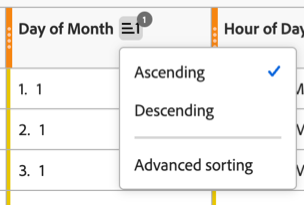

# 자유 형식 테이블에 여러 차원 열 포함

{{release-limited-testing}}

자유 형식 테이블에 최대 5개의 차원 열을 포함할 수 있으므로 여러 차원 항목을 나란히 볼 수 있습니다. 차원 항목의 각 행은 하나의 연결된 항목 역할을 합니다.

여러 차원 열이 있는 자유 형식 테이블에 필터, 정렬, 분류 등을 적용하여 보다 완벽하고 사용자 정의 분석을 만들 수 있습니다.

## 여러 차원 열 추가

여러 차원 열을 한 번에 하나씩 또는 일괄적으로 추가할 수 있습니다.

1. Analysis Workspace에서 자유 형식 테이블을 만듭니다.

   자세한 내용은 [시각화 개요](/help/analysis-workspace/visualizations/freeform-analysis-visualizations.md#add-visualizations-to-a-panel)에서 [패널에 시각화 추가](/help/analysis-workspace/visualizations/freeform-analysis-visualizations.md)를 참조하십시오.

1. 자유 형식 테이블에 차원을 추가합니다. 한 번에 하나씩 차원을 추가하거나 여러 차원을 한 번에 추가할 수 있습니다.

   * 차원을 한 번에 하나씩 자유 형식 테이블로 드래그합니다. 테이블에서 기존 차원 열의 왼쪽 또는 오른쪽에 추가 차원 열을 배치합니다. 새 열이 만들어질 파란색 세로 **[!UICONTROL 추가]** 줄이 표시됩니다.

     

   * 구성 요소 메뉴에서 최대 5개의 차원을 선택하여 자유 형식 테이블로 드래그합니다. 차원은 사용자가 선택한 순서대로 왼쪽에서 오른쪽으로 표에 추가됩니다.

     여러 차원을 선택하려면 ***Command*** 키(Mac의 경우) 또는 ***Ctrl*** 키(Windows의 경우)를 길게 누릅니다.

     

## 테이블 필터링

자유 형식 테이블에서 하나 이상의 차원 열에 필터를 적용할 수 있습니다.

테이블 필터링에 대한 자세한 내용은 [테이블 필터링 및 정렬](/help/analysis-workspace/visualizations/freeform-table/filter-and-sort.md#filter-tables)의 [테이블 필터링](/help/analysis-workspace/visualizations/freeform-table/filter-and-sort.md)을 참조하십시오.

## 테이블 정렬 {#sort-tables}

<!--At GA, move this section into the "Filter and sort tables" article and replace the current "Sort tables" section. Change the "Filter tables" section above to "Filter and sort tables" and link to the other article. Also add row to Guardrails -->

Analysis Workspace의 열별로, 차원이든 지표든 자유 형식 테이블의 데이터를 정렬할 수 있습니다.

기본적으로 차원은 오름차순으로 정렬되고 지표는 내림차순으로 정렬됩니다.

### 단일 열을 기준으로 표 정렬

이 섹션에 설명된 대로 단일 열의 데이터를 정렬할 때 테이블에 적용된 [고급 정렬](#sort-tables-by-multiple-columns-advanced-sorting)이 제거됩니다.

단일 열을 기준으로 테이블의 데이터를 정렬하려면 다음을 수행합니다.

1. 정렬할 열의 머리글 위로 마우스를 가져간 다음 **정렬** 아이콘 이 나타나면 선택합니다.

   

1. **[!UICONTROL 오름차순]** 또는 **[!UICONTROL 내림차순]**&#x200B;을 선택하십시오.

   정렬이 열에 적용되면 정렬 아이콘이 계속 표시됩니다. 화살표는 데이터 정렬 방식을 나타냅니다(, 내림차순의 경우 ).

### 여러 열을 기준으로 표 정렬(고급 정렬)

{{release-limited-testing-section}}

#### 여러 열에 정렬 적용

테이블의 데이터를 여러 열로 정렬하려면 다음을 수행합니다.

1. 정렬할 열의 머리글 위로 마우스를 가져간 다음 표시될 때 **정렬** 아이콘 을 선택합니다.

   

1. **[!UICONTROL 고급 정렬]**&#x200B;을 선택합니다.

   

1. 고급 정렬 대화 상자에서 다음 중 하나를 수행합니다.

   * **[!UICONTROL 정렬 열 추가]** 단추를 선택하여 아직 정렬되지 않은 열을 추가하십시오.

   * **제거** 아이콘 을(를) 선택하여 더 이상 정렬하지 않을 열을 제거합니다.

   * 목록에서 열을 더 높거나 낮게 드래그하여 정렬 우선 순위를 조정합니다.

     자세한 내용은 [정렬 우선 순위](#sort-priority)를 참조하십시오.

   * 드롭다운 메뉴에서 **[!UICONTROL 오름차순]** 또는 **[!UICONTROL 내림차순]**&#x200B;을 선택하여 정렬 값을 변경합니다.

   * 열 이름 드롭다운 메뉴를 선택하여 다른 열을 선택합니다.

1. **[!UICONTROL 적용]**&#x200B;을 선택합니다.

정렬이 열에 적용될 때 정렬 아이콘이 계속 표시됩니다. 화살표는 데이터 정렬 방식을 나타냅니다(, 내림차순의 경우 ).

#### 정렬 우선 순위

여러 열에 대한 데이터를 정렬할 때 데이터는 각 열에 할당하는 우선 순위에 따라 정렬됩니다. 정렬 아이콘  옆에 우선 순위 번호가 표시됩니다.

1차 우선 순위가 있는 열은 기본 순서를 결정하고, 2차 우선 순위가 있는 열은 1차 열에서 행이 동일한 값을 가질 때 순서를 결정하고, 3차 우선 순위가 있는 열은 1차 열과 2차 열에서 행이 동일한 값을 가질 때 순서를 결정합니다.

예를 들어 다음 열이 있는 표를 생각해 보십시오.

* 날짜(차원)

* 시간(차원)

* 이벤트(지표)

다음과 같이 각 열에 정렬 우선순위를 지정할 수 있습니다.

| 열(구성 요소) 이름 | 구성 요소 유형 | 정렬 우선 순위 |
|---------|----------|---------|
| 날짜 (월 기준) | 차원 | 1 |
| 시간 (일 기준) | 차원 | 2 |
| 이벤트 | 지표 | 3 |

각 열에 정렬 우선 순위를 할당하면 데이터가 테이블에 표시되는 방식을 정확하게 제어할 수 있습니다. 이 예에서 정보는 먼저 날짜별로, 그 다음 시간별로, 그리고 마지막으로 이벤트별로 정렬됩니다.

## 여러 차원 열 및 분류

Analysis Workspace에서는 자유 형식 테이블 내에 여러 차원을 추가하는 다음과 같은 방법을 제공합니다.

* 여러 차원 열 포함(이 문서에 설명된 대로)

* [분류 추가](/help/components/dimensions/t-breakdown-fa.md)

이 두 가지 방법 모두 다른 차원에 대해 차원을 분석할 수 있도록 해줍니다. 그러나 중요한 차이점이 있으며, 두 방법 모두 한 표에서 사용하면 더욱 심층적인 분석이 가능합니다.

### 차원 열과 분류 간의 차이점

여러 차원 열을 사용하면 다음 작업을 수행할 수 있습니다.

* 차원 항목을 여러 차원의 고유한 데이터 행에 연결합니다.

* 차원 항목이 테이블의 각 차원 열에 적용되는 경우에만 연결된 행에 차원 항목을 포함합니다. 이렇게 하려면 열 필터를 사용하여 각 차원 열에서 **[!UICONTROL 값 없음 포함]** 설정을 선택 취소합니다.

  자세한 내용은 [여러 열을 기준으로 표 정렬(고급 정렬)](#sort-tables-by-multiple-columns-advanced-sorting)을 참조하십시오.

* 사용자 지정된 데이터를 더 많이 보려면 여러 차원 및 지표 열을 기준으로 데이터를 정렬하십시오.

  자세한 내용은 [여러 열을 기준으로 표 정렬(고급 정렬)](#sort-tables-by-multiple-columns-advanced-sorting)을 참조하세요.

분류를 사용하면 다음 작업을 수행할 수 있습니다.

* 자유 형식 테이블의 차원 항목을 보조 차원으로 분류합니다. 보조 차원에 대해 최대 200개의 차원 항목을 표시할 수 있습니다.

### 여러 차원 열이 있는 테이블에 분류를 추가합니다

여러 차원 열이 있는 테이블에 분류를 추가하면 분류는 분류를 추가한 행의 모든 차원 항목에 적용됩니다.

[차원 분류](/help/components/dimensions/t-breakdown-fa.md)에 설명된 대로 분류를 추가할 수 있습니다.

## 지원되지 않는 차원 {#unsupported}

다음 차원 조합은 지원되지 않으며, Analysis Workspace에서는 조합을 추가하지 않거나 추가된 후 오류 메시지를 표시합니다.

* 동일한 자유 형식 테이블에서 함께 사용되는 다른 [개체 배열](/help/use-cases/object-arrays.md)을 참조하는 필드의 여러 차원입니다.

  여러 차원이 동일한 개체 배열을 참조하는 경우 동일한 자유 형식 테이블에서 여러 차원을 함께 사용할 수 있습니다.