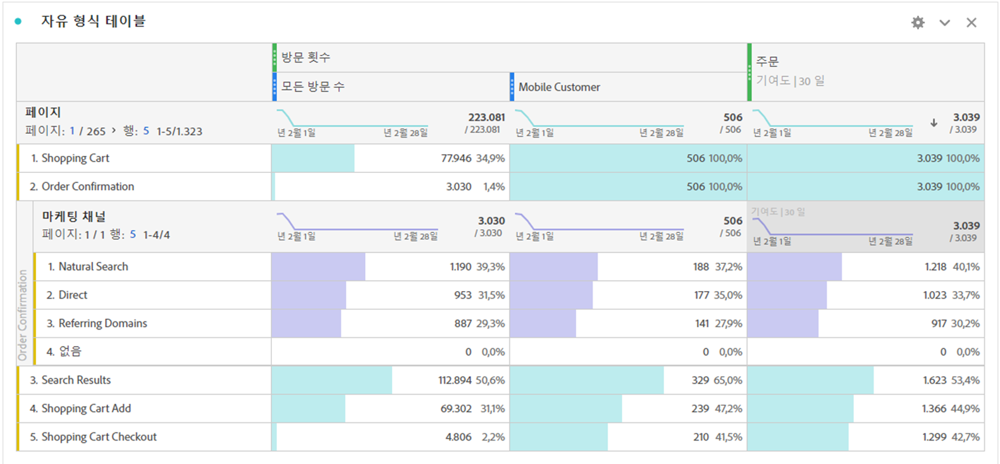

# 자유 형식 테이블 개요 {#freeform-table-overview}

<!-- markdownlint-disable MD034 -->

>[!CONTEXTUALHELP]
>id="workspace_freeformtable_button"
>title="자유 형식 테이블"
>abstract="차원, 세그먼트, 지표 및 날짜 범위를 사용하여 작성할 수 있는 빈 자유 형식 테이블 시각화를 만듭니다. 자유 형식 테이블을 다른 시각화의 기반으로 사용할 수 있습니다."

<!-- markdownlint-enable MD034 -->

>[!BEGINSHADEBOX]

_이 문서에서는_  _**Customer Journey Analytics**&#x200B;의 자유 형식 테이블 시각화에 대해 설명합니다._ _이 문서의_  _**Adobe Analytics** 버전은 [자유 형식 테이블](https://experienceleague.adobe.com/ko/docs/analytics/analyze/analysis-workspace/visualizations/freeform-table/freeform-table)을 참조하십시오._

>[!ENDSHADEBOX]

Analysis Workspace에서  **[!UICONTROL 자유 형식 테이블]** 시각화는 대화형 데이터 분석을 위한 기반입니다. [구성 요소](/help/components/overview.md) 조합을 행과 열로 끌어다 놓아 분석에 사용할 사용자 정의 테이블을 만들 수 있습니다. 각 구성 요소가 삭제되면 테이블이 즉시 업데이트되므로 빠르고 더 깊이 분석할 수 있습니다.

[!UICONTROL 자유 형식 테이블]을 만들고 구성하는 방법:

*  **[!UICONTROL 자유 형식 테이블]** 시각화를 추가합니다. [패널 내에 시각화 추가](../freeform-analysis-visualizations.md#add-visualizations-to-a-panel)를 참조하십시오.

## 자동화된 테이블

테이블을 만드는 가장 빠른 방법은 구성 요소를 빈 프로젝트, 패널 또는 자유 형식 테이블에 직접 놓는 것입니다. 자유 형식 테이블은 권장 형식으로 만들어집니다. [튜토리얼을 확인하십시오](https://experienceleague.adobe.com/ko/docs/analytics-learn/tutorials/analysis-workspace/building-freeform-tables/auto-build-freeform-tables-in-analysis-workspace).

## 자유 형식 테이블 빌더

먼저 테이블에 여러 구성 요소를 추가한 다음 데이터를 렌더링하려는 경우 **[!UICONTROL 테이블 빌더 활성화]**&#x200B;를 선택할 수 있습니다. 빌더를 활성화한 상태에서 차원, 분류, 지표 및 세그먼트를 끌어다 놓아 보다 복잡한 질문에 대한 답변을 제공하는 표를 작성할 수 있습니다. **[!UICONTROL 빌드]**&#x200B;를 선택하면 데이터가 업데이트됩니다.

## 상호 작용

다음과 같은 다양한 방법으로 자유 형식 테이블과 상호 작용하고 사용자 정의할 수 있습니다.

### 필터링 및 정렬

* 테이블의 데이터를 [세그먼트화하고 정렬](filter-and-sort.md)할 수 있습니다.

### 다른 결과를 표시했던

* [GraphBarVerticalAdd](../freeform-analysis-visualizations.md#visualize)를 사용하면 하나 이상의 행에서 빠르게 를 할 수 있습니다.
* 프로젝트의 [보기 밀도](/help/analysis-workspace/build-workspace-project/view-density.md)를 조정하여 더 많은 행을 단일 화면에 맞출 수 있습니다.
* 페이지 매김이 발생하기 전에 각 차원 행에 최대 400개의 행을 표시할 수 있습니다. 첫 번째 열 머리글의 **[!UICONTROL 행]** 옆에 있는 숫자를 선택하면 페이지에 행이 더 많이 표시됩니다. 첫 번째 열 머리글에서 를 사용하여 다른 페이지로 이동합니다.
* 행을 추가 구성 요소별로 분류할 수 있습니다. 한 번에 여러 행을 분류하려면 여러 행을 선택한 다음 선택한 행 위로 다음 구성 요소를 끌어다 놓습니다. [분류](/help/components/dimensions/t-breakdown-fa.md)에 대해 자세히 알아보십시오.
* 행을 [세그먼트화](/help/components/filters/filters-overview.md)하여 축소된 항목 집합을 표시할 수 있습니다. 추가 설정은 [행 설정](/help/analysis-workspace/visualizations/freeform-table/column-row-settings/table-settings.md)에서 사용할 수 있습니다.

### 열

* 구성 요소를 열 내에 스택하여 세그먼트화된 지표, 탭 간 분석 등을 만들 수 있습니다.
* 각 열의 보기는 [열 설정](/help/analysis-workspace/visualizations/freeform-table/column-row-settings/column-settings.md)에서 조정할 수 있습니다.
* [컨텍스트 메뉴](/help/analysis-workspace/visualizations/freeform-analysis-visualizations.md#context-menu)를 통해 몇 가지 액션을 사용할 수 있습니다. 이 메뉴는 테이블 머리글, 행 또는 열을 선택하는지 여부에 따라 다른 액션을 제공합니다.

## 설정

을 선택하여 **[!UICONTROL 테이블 설정]**&#x200B;을 표시합니다. 다음과 같은 특정 시각화 [설정](../freeform-analysis-visualizations.md#settings)을 사용할 수 있습니다.

### 데이터 소스

| 옵션 | 설명 |
|---|---|
| **[!UICONTROL 연결된 시각화]**. | 연결된 모든 시각화를 나열합니다. |
| **[!UICONTROL 데이터 소스 표시]** | 이 옵션을 선택하지 않으면 시각화의 데이터 소스로 사용되는 자유 형식 테이블이 Workspace에 숨겨집니다. |

### 설정

| 옵션 | 설명 |
|---|---|
| **[!UICONTROL 각 열의 날짜가 같은 행에서 모두 시작하도록 맞춥니다.]** | 또한 각 열의 날짜가 같은 행에서 시작하도록 맞추거나 맞추지 않을 수 있습니다. |

## 컨텍스트 메뉴

시각화 머리말에서 다음 [컨텍스트 메뉴](../freeform-analysis-visualizations.md#context-menu) 옵션을 사용할 수 있습니다.

| 옵션 | 설명 |
| --- | --- |
| **[!UICONTROL 복사된 시각화 삽입]**n | 복사한 시각화를 프로젝트 내의 다른 위치 또는 완전히 다른 프로젝트에 붙여넣기(삽입)할 수 있습니다. |
| **[!UICONTROL 클립보드에 데이터 복사]** | 시각화에서 클립보드로 데이터를 복사합니다. |
| **[!UICONTROL 클립보드에 선택 항목 복사]** | 시각화에서 클립보드로 선택 항목을 복사합니다. |
| **[!UICONTROL CSV로 항목 다운로드(*차원 이름*)]** | 시각화의 차원 항목(최대 50,000개)을 로컬 디바이스에 즉시 다운로드합니다. 선택한 차원에 최대 50,000개의 차원 항목. |
| **[!UICONTROL 시각화 복사]** | 시각화를 복사하여 프로젝트 내의 다른 위치 또는 완전히 다른 프로젝트에 삽입할 수 있습니다. |
| **[!UICONTROL 데이터 CSV 다운로드]** | 시각화에 표시된 데이터를 로컬 디바이스에 즉시 다운로드합니다. |
| **[!UICONTROL 전체 테이블 내보내기...]** | 전체 테이블을 지정된 클라우드 위치로 내보냅니다. [Customer Journey Analytics 보고서를 클라우드로 내보내기](../../export/export-cloud.md) 참조 |
| **[!UICONTROL 시각화 복제]** | 시각화를 정확하게 복제합니다. |
| **[!UICONTROL 설명 편집]** | 시각화에 대한 텍스트 설명을 추가 (또는 편집)합니다. [텍스트](../text.md)를 확인합니다. |
| **[!UICONTROL 시각화 링크 가져오기]** | 시각화에 대한 링크를 직접 복사하여 공유합니다. 링크 공유 대화 상자에 링크가 표시됩니다. 복사를 선택하면 링크를 클립보드에 복사할 수 있습니다. |
| **[!UICONTROL 시작]** | 현재 시각화에 대한 구성을 삭제하여 처음부터 다시 구성할 수 있습니다. |

>[!MORELIKETHIS]
>
>[패널 내에 시각화 추가](/help/analysis-workspace/visualizations/freeform-analysis-visualizations.md#add-visualizations-to-a-panel)
>[시각화 설정](/help/analysis-workspace/visualizations/freeform-analysis-visualizations.md#settings)
>[시각화 컨텍스트 메뉴](/help/analysis-workspace/visualizations/freeform-analysis-visualizations.md#context-menu)
>
