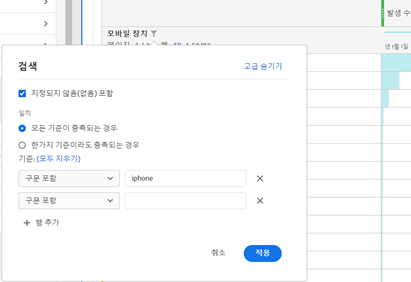
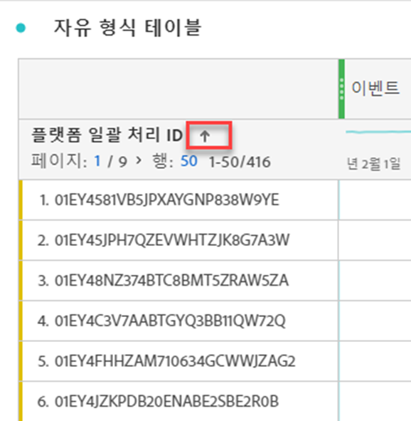

# 테이블 페이지 매김, 필터링 및 정렬

>[!NOTE]
>
>Customer Journey Analytics의 Analysis Workspace 설명서를 보고 계십니다. 이 기능은 [기존 Adobe Analytics의 Analysis Workspace](https://experienceleague.adobe.com/docs/analytics/analyze/analysis-workspace/home.html?lang=ko-KR)와 약간 다릅니다. [추가 정보...](/help/getting-started/cja-aa.md)

Analysis Workspace의 테이블 페이지 매김, 필터링 및 정렬에 대한 개요는 이 비디오 튜토리얼을 참조하십시오.

>[!VIDEO](https://video.tv.adobe.com/v/23968)

## 고급 필터링 옵션 {#section_36E92E31442B4EBCB052073590C1F025}

필터 아이콘을 클릭한 다음, 자유 형식 테이블의 차원 옆에 있는 **[!UICONTROL 고급 표시]**&#x200B;를 클릭하면 다음 기준을 사용하여 필터링할 수 있습니다. 여러 필터링 규칙을 적용할 수 있습니다.

* 다음 포함
* 다음을 포함하지 않음
* 다음 검색어 포함
* 검색어를 하나라도 포함
* 구문 포함
* 검색어 포함 안 함
* 다음 구문 포함 안 함
* 같음
* 같지 않음
* 다음으로 시작
* 다음으로 끝남

## 자유 형식 테이블에서 차원 정렬

>[!NOTE]
>
>차원 정렬은 Customer Journey Analytics의 자유 형식 테이블에만 적용되며 기존의 Adobe Analytics에는 적용되지 않습니다. 지표 정렬은 두 버전의 Analytics에서 모두 수행할 수 있습니다.

1. 프로젝트의 자유 형식 테이블에서, 차원 이름 옆에 있는 화살표를 클릭합니다.

* 아래쪽 화살표는 내림차순으로 정렬하고 위쪽 화살표(기본값)는 오름차순으로 정렬합니다.
* 차원을 알파벳이나 숫자순으로 정렬할 수 있습니다. 예를 들어 워크플로에서 단계 번호가 매겨져 있으며, 단계 번호순으로 정렬할 수 있습니다. 날짜 관련 차원을 날짜순으로 정렬할 수 있습니다. 또는 위의 스크린샷에서처럼 알파벳순으로 데이터 소스를 정렬할 수 있습니다.
