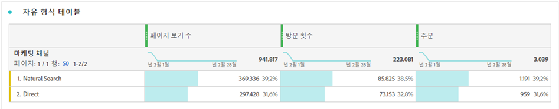

# 작업 영역 합계 {#workspace-totals}

<!-- markdownlint-disable MD034 -->

>[!CONTEXTUALHELP]
>id="cja_workspace_freeformtable_grandtotal"
>title="총계"
>abstract="정적 행이 있는 테이블 또는 분류에서는 총 합계가 지원되지 않습니다."

<!-- markdownlint-enable MD034 -->

자유 형식 테이블에서, 합계 행은 각 분류 수준에 나타나고 두 개의 합계를 표시할 수 있습니다.

* **[!UICONTROL 테이블 합계{1➊} - 이 합계는 일반적으로 [!UICONTROL 총계]와 같거나 그 하위 집합입니다.]** 합계는 [!UICONTROL 없음 포함] 옵션을 포함하여 자유 형식 테이블 내에 적용된 테이블 필터를 반영합니다.
* **[!UICONTROL 총계]**(]**개 중**[!UICONTROL &#x200B;개 *개*&#x200B;개) ➋ - 이 합계는 수집된 모든 이벤트를 나타냅니다. 필터가 패널 수준에서 또는 자유 형식 테이블 내에서 적용되면 이 합계는 필터 기준과 일치하는 모든 이벤트를 반영하도록 조정됩니다.

## 합계 표시

 **[!UICONTROL 열 설정]**&#x200B;에 **[!UICONTROL 합계 표시]** 및 **[!UICONTROL 총합계 표시]** 옵션이 있습니다. 이러한 설정을 선택 취소하면 표에서 합계가 제거되며, 이는 합계가 적절하지 않은 경우에 필요할 수 있습니다. 예를 들어 특정 [계산된 지표 시나리오](https://experienceleague.adobe.com/en/docs/analytics/components/calculated-metrics/calcmetrics-reference/cm-totals)에서.

[정적 행](/help/analysis-workspace/visualizations/freeform-table/column-row-settings/manual-vs-dynamic-rows.md) 합계는 다르게 동작하며  **[!UICONTROL 행 설정]**&#x200B;을 사용하여 제어합니다.

| 옵션 | 설명 |
|---|---|
| **[!UICONTROL 현재 행의 합계를 합계로 표시]** | 표에 행의 클라이언트측 합계를 표시합니다. 이 합계는 세션 또는 개인과 같은 지표에 대한 중복 제거를 **하지 않습니다**. |
| **[!UICONTROL 총계 표시]** | 서버측 합계를 표시합니다. 이 총 중복 제거 지표는 세션 또는 개인과 같습니다. |

자유 형식 테이블의 [동적 및 정적 차원 항목](column-row-settings/manual-vs-dynamic-rows.md)을(를) 참조하십시오.

## FAQ

| 질문 | 답변 |
|---|---|
| 회색 열 비율은 어느 *합계*&#x200B;를 기반으로 합니까? | 이 *합계*&#x200B;는 **[!UICONTROL 행 설정]**&#x200B;의 **[!UICONTROL 백분율]** 설정 선택 사항에 따라 달라집니다.<ul><li>열별 백분율 계산 - 이 설정이 기본값입니다. 백분율은 테이블 합계를 기반으로 합니다.</li><li>행별 백분율 계산 - 백분율은 총계를 기반으로 합니다.</li></ul> |
| **[!UICONTROL 값 없음 포함]** 설정은 합계에 어떤 영향을 줍니까? | **[!UICONTROL 값 없음 포함&quot;]** 설정이 선택 취소되면 **[!UICONTROL 값 없음]** 행이 테이블, 테이블 합계에서 제거되고 [*합계* 지표 유형](https://experienceleague.adobe.com/en/docs/analytics/components/calculated-metrics/calcmetric-workflow/m-metric-type-alloc)을 사용하는 모든 계산된 지표로 전달됩니다. |
| 사용자 지정 테이블 필터가 자유 형식 테이블에 적용되는 경우 모든 계산된 지표 및 조건부 서식이 필터를 처리합니까? | 현재 처리하지 않습니다. **[!UICONTROL Include &quot;값 없음&quot;]**&#x200B;이(가) 해당되지만 사용자 지정 테이블 필터는 다음 항목에 영향을 주지 않습니다.<ul><li>조건부 서식에서 사용하는 열 최대/최소 범위는 모든 데이터를 표시합니다.</li><li>**[!UICONTROL 총계]** 지표 유형을 활용하는 계산된 지표입니다.</li><li>자유 형식 테이블의 행들 간에 계산되는 열 합계, 열 최대값, 열 최소값, 카운트, 평균, 중간값, 백분위수, 사분위수, 행 수, 표준 편차, 분산, 누적, 누적 평균, 회귀 변형, T 스코어, T 테스트, Z 스코어 및 Z 테스트와 같은 함수를 사용하는 계산된 지표.</li></ul> |
| 계산된 지표에서 **[!UICONTROL 총계]** 지표 유형은 무엇을 반영합니까? | **[!UICONTROL 총계]**&#x200B;는 **[!UICONTROL 총계]**&#x200B;을(를) 계속 참조하며 테이블이나 **[!UICONTROL 테이블 총계]**&#x200B;에 적용된 필터를 반영하지 않습니다. |
| 데이터를 자유 형식 테이블에서 복사하여 붙여넣거나 CSV를 통해 다운로드할 때에는 어떤 합계가 표시됩니까? | 합계 행은 **[!UICONTROL 테이블 합계]**&#x200B;만 반영하며 열 **[!UICONTROL 합계 표시]** 설정을 준수합니다. |
