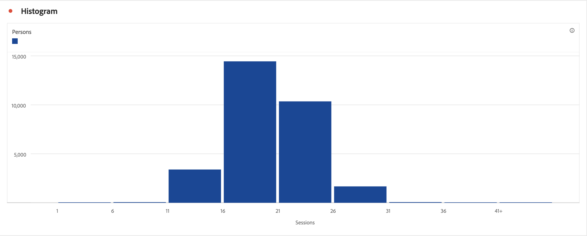

# 히스토그램 {#histogram}

<!-- markdownlint-disable MD034 -->

>[!CONTEXTUALHELP]
>id="workspace_histogram_button"
>title="히스토그램"
>abstract="범위 그룹의 숫자 데이터 분포를 나타내는 히스토그램 시각화를 만듭니다."

<!-- markdownlint-enable MD034 -->

>[!BEGINSHADEBOX]

*이 문서는&#x200B;**Customer Journey Analytics**의 히스토그램 시각화를 설명합니다. 이 문서의&#x200B;**Adobe Analytics**버전에 대한 [히스토그램](https://experienceleague.adobe.com/en/docs/analytics/analyze/analysis-workspace/visualizations/histogram)을 참조하세요.*

>[!ENDSHADEBOX]

 **[!UICONTROL 히스토그램]** 시각화는 [!UICONTROL 막대] 시각화와 유사하지만 숫자를 범위(버킷)로 그룹화합니다. Analytics는 숫자를 범위로 &quot;버킷하는 것&quot;을 자동화하지만, [고급 설정](#advanced-settings)에서 설정을 변경할 수 있습니다.

## 사용

히스토그램을 만드는 방법:

1.  **[!UICONTROL 히스토그램]** 시각화를 추가합니다. [패널에 시각화 추가](freeform-analysis-visualizations.md#add-visualizations-to-a-panel)를 참조하십시오.
1. **[!UICONTROL 지표]** 구성 요소 목록에서 지표를 드래그하거나 [!UICONTROL *지표 추가*] 드롭다운 메뉴에서 지표를 선택합니다.
1. (선택 사항) **[!UICONTROL 고급 설정 표시]**&#x200B;를 선택합니다. [고급 설정](#advanced-settings)을 참조하세요.
1. **[!UICONTROL 빌드]**&#x200B;를 선택합니다.

>[!NOTE]
>
>히스토그램은 계산된 지표는 지원하지 않고 표준 지표만 지원합니다.

아래 예에서는 히스토그램을 사용하여 사람 수에 대한 세션을 버킷 지정합니다. 히스토그램에 따르면 대부분의 사용자는 선택한 날짜 범위에 대해 16~21개의 세션을 가지고 있습니다.

## 고급 설정

시각화의 일부로 특정 히스토그램 설정을 사용할 수 있습니다.

| 히스토그램 설정 | 설명 |
|---|---|
| **[!UICONTROL 버킷 시작]** | 히스토그램이 시작되는 버킷을 결정합니다. 1이 기본값입니다. 시작 숫자를 0부터 무한대까지 설정할 수 있습니다(음수는 안 됨). |
| **[!UICONTROL 지표 버킷]** | 데이터 범위(버킷)의 수를 늘이거나 줄일 수 있습니다. 최대 버킷 수는 50입니다. |
| **[!UICONTROL 지표 버킷 크기]** | 각 버킷의 크기를 설정할 수 있습니다. 예를 들어 버킷 크기를 페이지 보기 1개에서 페이지 보기 2개로 변경할 수 있습니다. |
| **[!UICONTROL 계산 메서드]** | **[!UICONTROL 개인]**, **[!UICONTROL 세션]** 또는 **[!UICONTROL 이벤트]**&#x200B;에서 선택하십시오. 예를 들어 세션당 페이지 보기 수, 사용자당 페이지 보기 수 또는 이벤트당 페이지 보기 수 중에서 선택할 수 있습니다. |

<!--Russ or Meike - Check Hit Type link above. -->

**예**:

| 시작 버킷 | 지표 버킷 | 지표 버킷 크기 | 결과 |
|:----:|:--:|:--:|:--|
| 1 | 5 | 2 |  |
| 0 | 3 | 5 |  |

>[!MORELIKETHIS]
>
>[패널에 시각화 추가](/help/analysis-workspace/visualizations/freeform-analysis-visualizations.md#add-visualizations-to-a-panel)
>[시각화 설정](/help/analysis-workspace/visualizations/freeform-analysis-visualizations.md#settings)
>[시각화 컨텍스트 메뉴](/help/analysis-workspace/visualizations/freeform-analysis-visualizations.md#context-menu)
>

## 블로그 게시물

[예기치 않은 데이터 값을 식별하기 위해 히스토그램을 사용](https://experienceleaguecommunities.adobe.com/t5/adobe-analytics-blogs/using-histograms-to-identify-unexpected-data-values/ba-p/596168)하는 방법에 대한 정보는 이 블로그 게시물을 참조하세요.
