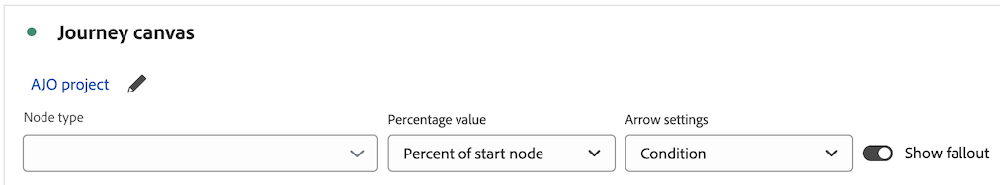

# 여정 캔버스 시각화 구성

{{release-limited-testing}}

여정 캔버스 시각화를 사용하면 사용자와 고객에게 제공하는 여정을 분석하고 심도 있는 통찰력을 얻을 수 있습니다.

## 여정 캔버스 개요

다음을 포함하여 여정 캔버스에 대한 자세한 내용은 [여정 캔버스 개요](/help/analysis-workspace/visualizations/journey-canvas/journey-canvas.md)를 참조하세요.

* 주요 기능

* 잠재적 인사이트

* 여정 캔버스와 폴아웃 간의 차이점

* Journey Optimizer 여정 분석에 대한 세부 정보

* 기타

## 여정 캔버스 시각화 작성 시작

1. 프로젝트에 빈 패널을 추가하고 왼쪽 레일에서 [!UICONTROL **시각화**] 아이콘을 선택한 다음 [!UICONTROL **여정 캔버스**] 시각화를 패널로 드래그합니다.

   또는

   [시각화 개요](/help/analysis-workspace/visualizations/freeform-analysis-visualizations.md)의 [패널에 시각화 추가](/help/analysis-workspace/visualizations/freeform-analysis-visualizations.md#add-visualizations-to-a-panel) 섹션에 설명된 방법으로 여정 캔버스 시각화를 추가하십시오.

1. 다음 기본 정보를 지정합니다.

   | 필드 | 함수 |
   |---------|----------|
   | [!UICONTROL **기본 지표**] | 기본 지표는 여정 캔버스 시각화의 다음 측면에 영향을 줍니다.  <ul><li>사람들이 여정을 이동하는 방법을 정의합니다.</li><li>각 노드에 표시된 총 수입니다.
예를 들어, 사람이 기본 지표인 경우, 각 노드는 여정에서 해당 노드에 도달한 사람 수를 표시합니다.
</li><li>각 노드에 표시된 백분율. (시각화가 빌드된 후에 합계 또는 시작 노드의 백분율을 표시하도록 선택할 수 있습니다.)</li>
예를 들어, 사람이 기본 지표인 경우, 각 노드는 여정에서 해당 노드에 도달한 사람의 백분율(합계 또는 시작 노드의 백분율)을 표시합니다.
</li><li>시각화에 차원이 추가되면 기본 지표를 기반으로 시각화의 상위 3개 노드가 추가됩니다.</li></ul> |
   | [!UICONTROL **보조 지표**] | 보조 지표는 선택 사항입니다. 하나를 선택하면 다음 정보가 기본 지표 아래의 각 노드에 표시됩니다. <ul><li>총 수
예를 들어, 세션이 보조 지표인 경우 각 노드는 여정의 해당 노드에 도달한 세션 수를 표시합니다.
</li><li>백분율(시각화가 빌드된 후 합계 또는 시작 노드의 백분율을 표시하도록 선택할 수 있습니다.)</li>
예를 들어, 세션이 보조 지표인 경우 각 노드는 여정에서 해당 노드에 도달한 세션의 백분율(합계 또는 시작 노드의 백분율)을 표시합니다.
</li></ul> |
   | [!UICONTROL **Journey Optimizer 여정**]<!-- name? --> | 여정 캔버스에서 분석의 기준으로 사용할 Journey Optimizer 여정을 선택합니다. (또는 Analysis Workspace 내에서 분석을 빌드할 빈 캔버스를 원하는 경우 이 옵션을 비워 둘 수 있습니다.)
 
여정 캔버스에서 Journey Optimizer 여정을 분석할 때 여정은 Journey Optimizer에서와 동일한 순서, 시퀀스 및 구조로 표시됩니다. 자세한 내용은 [여정 개요](/help/analysis-workspace/visualizations/journey-canvas/journey-canvas.md)에서 [Journey Optimizer 여정 분석](/help/analysis-workspace/visualizations/journey-canvas/journey-canvas.md#analyze-journey-optimizer-journeys)을 참조하십시오.

**참고**: 이 옵션은 시각화를 추가하고 있는 Analysis Workspace 패널에서 선택한 동일한 데이터 보기에서 Journey Optimizer 데이터가 검색되는 경우에만 표시됩니다. Analysis Workspace의 패널에서 데이터 보기를 변경하는 방법에 대한 자세한 내용은 [Analysis Workspace 개요](/help/analysis-workspace/home.md)를 참조하십시오.
 |

1. (선택 사항) [!UICONTROL **고급 설정 표시**]&#x200B;를 선택한 후 다음 정보를 지정하십시오.

   | 필드 | 함수 |
   |---------|----------|
   | [!UICONTROL **여정 캔버스 컨테이너**] | 여정 전체에서 초점을 맞출 컨테이너를 선택합니다. 선택하는 컨테이너는 시각화에 표시되는 통계를 결정합니다. (컨테이너 이름이 아래 표시된 기본 이름과 다른 경우 데이터 보기에서 사용자 정의되었습니다.)<ul><li>**세션:** 시각화의 통계가 지정된 사용자에 대해 정의된 단일 세션에 속하도록 제한합니다. 즉, 기본 및 보조 지표를 기반으로 하는 각 노드에 표시되는 숫자와 백분율은 각 사용자에 대한 단일 세션 내에서 발생해야 합니다.</li><li>**사용자:** 시각화의 통계가 지정된 사용자의 여러 세션에 걸쳐 표시되도록 허용합니다. 즉, 각 노드에 표시되는 수 및 백분율(기본 및 보조 지표를 기반으로 함)은 세션이 동일한 사람에 속하는 한 모든 세션 수에 걸쳐 발생할 수 있습니다. 기본 설정입니다.</li></ul> |

1. [!UICONTROL **빌드**]&#x200B;를 선택합니다.

   Journey Optimizer이 있고 Journey Optimizer 여정을 선택한 경우, 여정은 Journey Optimizer에서와 동일한 순서, 시퀀스 및 구조로 표시됩니다.

   <!-- add screen shot -->

   Journey Optimizer이 없거나 Journey Optimizer 여정을 선택하지 않은 경우 여정 채우기를 시작할 수 있는 빈 캔버스가 표시됩니다.

   <!-- add screen shot -->

1. 빈 캔버스에서 새 분석을 만들거나 Journey Optimizer 여정을 분석하든 [시각화 설정 구성](#configure-visualization-settings)에 설명된 대로 여정을 구성할 수 있습니다.

## 시각화 설정 구성

여정 캔버스 헤더에서 다양한 구성 옵션을 사용할 수 있습니다.

여정 캔버스 시각화에 대한 설정을 구성하려면 다음 작업을 수행하십시오.

1. Analysis Workspace에서 기존 여정 캔버스 시각화를 열거나 [새 시각화 작성을 시작합니다](#begin-building-a-journey-canvas-visualization).

   여정 캔버스 시각화를 구성할 수 있는 옵션은 헤더에서 사용할 수 있습니다.

   

1. 시각화 상단에 표시되는 다음 설정 중 하나를 구성합니다.

   | 설정 | 함수 |
   |---------|----------|
   | [!UICONTROL **노드 유형**] | 시각화에 표시되는 노드 유형을 구성할 수 있습니다.
시각화에서 노드 유형을 숨기려면 노드 유형 옆의 (x)를 선택하거나 드롭다운 메뉴에서 선택을 취소합니다. 숨겨진 노드 유형을 표시하려면 드롭다운 메뉴에서 해당 유형을 선택합니다. (노드를 숨길 때 여정에서 노드가 삭제되지 않습니다. 노드 삭제 방법에 대한 자세한 내용은 [노드 삭제](#delete-nodes)를 참조하십시오.

이 필드에는 다음과 같이 Journey Optimizer 노드 유형([!UICONTROL **세그먼트 읽기**], [!UICONTROL **끝**] 등)과 구성 요소 노드 유형([!UICONTROL **Dimension**], [!UICONTROL **지표**], [!UICONTROL **필터**], [!UICONTROL **날짜 범위**])이 포함될 수 있습니다. 
<ul><li>**Journey Optimizer 여정 유형만 표시됩니다** 여정이 다음 수정 사항으로 여정 캔버스에서 수정되지 않은 Journey Optimizer 노드인 경우:<ul><li>추가되거나 제거된 노드</li><li>화살표가 추가되거나 제거되었습니다.</li><li>노드의 구성 요소를 변경했습니다.</li></ul></li><li>**Journey Optimizer 여정 유형과 구성 요소 노드 유형이 모두 표시됩니다.** 여정이 다음 수정 사항으로 여정 캔버스에서 수정된 Journey Optimizer 노드인 경우:<ul><li>추가되거나 제거된 노드</li><li>화살표가 추가되거나 제거되었습니다.</li><li>노드의 구성 요소를 변경했습니다.</li></ul></li><li>여정이 Journey Optimizer 여정 노드가 아닌 경우 **구성 요소 노드 유형만 표시됩니다**.</li></ul>
 |
   | [!UICONTROL **백분율 값**] | 여정의 각 노드에 표시되는 백분율 값입니다. 이 비율에는 패널의 날짜 범위 내에 데이터 보기에 포함된 사람만 포함됩니다. 
다음 선택 사항 중 하나를 선택합니다.
 <ul><li>[!UICONTROL **시작 노드의 비율**]: 여정에서 시작 노드의 기준을 충족하는 모든 사용자의 비율입니다. 
_시작 노드_&#x200B;은(는) 앞에 연결된 노드가 없는 노드입니다.

한 여정에 여러 시작 노드가 포함될 수 있습니다. 그러나 여정에 공통 노드로 이어지는 시작 노드가 2개 이상 포함된 경우 총 [!UICONTROL **백분율**]&#x200B;이 사용됩니다. [!UICONTROL **시작 노드의 비율**]&#x200B;을 사용하려면 여정의 각 노드를 단일 시작 노드로 다시 추적할 수 있도록 여정을 업데이트하십시오.
</li><li>[!UICONTROL **이전 노드의 비율**]: 이전 노드의 모든 사용자의 비율입니다.</li><li>[!UICONTROL **총 비율**]: 패널의 날짜 범위 내에 있는 데이터 보기에 포함된 모든 사용자의 비율입니다.</li></ul> |
   | [!UICONTROL **화살표 설정**] | 여정 캔버스에서 노드 사이에 나타나는 화살표는 사용자 지정 레이블 및 값을 표시하도록 구성할 수 있습니다. 
_레이블_&#x200B;은(는) 화살표에 표시되는 사용자 지정 이름입니다. 주어진 화살표에는 단일 레이블만 표시됩니다. 레이블은 다음 중 하나일 수 있으며, 이 환경 설정 순서로 표시됩니다.
<ol><li>[노드 또는 화살표 이름 바꾸기](#rename-a-node-or-arrow)에 설명된 대로 여정 캔버스에서 사용자 지정 이름이 추가되었습니다.</li><li>Journey Optimizer 레이블</li><li>Journey Optimizer 조건</li></ol>
_값_&#x200B;은(는) 화살표에 표시되는 숫자와 백분율이며 여정의 한 노드에서 다음 노드로 이동한 사람 또는 세션을 나타냅니다. (즉, 주어진 단계에서 여정에서 빠지지 않은 사람들입니다.) 

Journey Optimizer에서 시작하지 않은 여정 및 여정 캔버스에서 크게 수정되지 않은 Journey Optimizer 여정에 대해 다음 옵션을 사용할 수 있습니다(크게 수정하면 노드 추가 또는 제거, 화살표 추가 또는 제거 또는 노드 구성 요소 변경이 포함됩니다.)
<ul><li>[!UICONTROL **레이블 없음**]: 여정의 화살표에 레이블이 표시되지 않습니다.   이 옵션은 여정이 수정된 경우에만 사용할 수 있습니다. </li><li>[!UICONTROL **레이블만**]: 레이블은 여정의 화살표에 표시됩니다.</li></ul>
여정 캔버스에서 크게 수정된 Journey Optimizer 여정에 대해 다음 옵션을 사용할 수 있습니다. (많이 수정되는 옵션에는 노드 추가 또는 제거, 화살표 추가 또는 제거 또는 노드 구성 요소 변경이 포함됩니다.)(**참고**: 이러한 옵션은 시각화를 추가하는 Analysis Workspace 패널에서 선택한 동일한 데이터 보기에서 Journey Optimizer 데이터가 검색되는 경우에만 표시됩니다. Analysis Workspace의 패널에서 데이터 보기를 변경하는 방법에 대한 자세한 내용은 [Analysis Workspace 개요](/help/analysis-workspace/home.md)를 참조하십시오.
<ul><li>[!UICONTROL **레이블이나 값이 없음**]: 레이블이나 값이 여정의 화살표에 표시되지 않습니다.</li><li>[!UICONTROL **레이블만**]: 레이블만 여정의 화살표에 표시됩니다. 값이 표시되지 않습니다.</li><li>[!UICONTROL **값만**]: 값만 여정의 화살표에 표시됩니다. 레이블이 표시되지 않습니다.</li><li>[!UICONTROL **값 및 레이블**]: 레이블과 값이 모두 여정의 화살표에 표시됩니다.</li></ul> |
   | [!UICONTROL **폴아웃 표시**] | 각 노드에 대한 폴아웃 데이터를 표시합니다. 주어진 노드 뒤에 여정을 떠난 사람의 수와 백분율을 보여 줍니다. 
여정에서 떨어진 사람은 사이트에서 다른 작업을 수행했을 수 있지만 여정의 다음 노드에서 정의한 기준을 충족하지 못했습니다.
 |
   | **확대/축소 컨트롤** | 캔버스의 오른쪽 위 모서리에서 다음 확대/축소 컨트롤을 사용할 수 있습니다.<ul><li>**확대** : 시각화의 특정 영역을 확대합니다.
트랙패드 핀치와 같은 마우스 컨트롤을 사용할 수도 있습니다.
</li><li>**축소** : 캔버스에 더 많은 공간을 허용하도록 시각화를 축소합니다.
트랙패드 핀치와 같은 마우스 컨트롤을 사용할 수도 있습니다.
</li><li>**화면 맞춤** : 전체 시각화로 화면을 채우도록 현재 확대/축소 및 패닝 설정을 조정합니다.</li></ul>
확대/축소 후 캔버스를 패닝하려면 마우스를 클릭하고 원하는 위치로 드래그합니다.
 |

1. [노드 추가](#add-nodes)를 계속합니다.

## 노드 추가

여정 캔버스 시각화의 노드는 사용자 여정의 이벤트 또는 작업을 나타냅니다.

왼쪽 레일에서 캔버스로 Workspace 구성 요소를 드래그하거나, 여정 캔버스에서 기존 노드를 기준으로 다음 또는 이전 노드의 맨 위를 선택하도록 하거나, 기존 노드를 복제하여 노드를 만듭니다.

### 왼쪽 레일에서 구성 요소 드래그

1. Analysis Workspace에서 기존 여정 캔버스 시각화를 열거나 [새 시각화 작성을 시작합니다](#begin-building-a-journey-canvas-visualization).

1. 지표, 차원, 차원 항목, 필터 또는 날짜 범위를 왼쪽 레일에서 캔버스로 드래그합니다. [파생 필드](/help/data-views/derived-fields/derived-fields.md)을(를) 기반으로 하는 지표가 지원됩니다. 그러나 [요약 데이터 세트](/help/data-views/summary-data.md)를 기반으로 하는 모든 지표 또는 차원과 계산된 지표는 지원되지 않습니다.

   Shift 키 또는 Command 키(Mac) 또는 Ctrl 키(Windows)를 눌러 왼쪽 레일에서 여러 구성 요소를 선택할 수 있습니다.

   구성 요소 유형과 시각화를 배치한 캔버스의 영역에 따라 시각화가 다음과 같이 업데이트됩니다.

   | 구성 요소 유형 | 구성 요소 배치 | 노드가 추가된 후 시각화 업데이트 |
   |---------|----------|----------|
   | 지표 | 캔버스의 빈 영역 | 노드는 기존 노드와 연결되지 않은 채 구성 요소가 삭제된 위치를 표시합니다. |
   | 지표 | 기존 노드 | 컴포넌트가 기존 노드와 자동으로 결합됩니다. 자세한 내용은 [노드 결합](#combine-nodes)을 참조하십시오.
 |
   | 지표 | 기존 노드 2개 사이의 화살표 | 노드는 구성 요소가 삭제된 두 기존 노드 사이에 표시되며 두 기존 노드 모두에 연결됩니다. 자세한 내용은 [노드 연결](#connect-nodes)을 참조하십시오.
 |
   | 차원 | 캔버스의 빈 영역 | 구성 요소가 삭제된 상위 3개 차원 항목에 대해 3개의 노드가 생성되고 기존 노드와 연결되지 않습니다. (**참고:** 노드가 1개 또는 2개만 표시되는 경우, 데이터는 차원 항목 중 1개 또는 2개에 대해서만 사용할 수 있습니다. 노드가 표시되지 않으면 어떤 차원 항목에도 데이터를 사용할 수 없음을 의미합니다. 이 경우 여정의 다른 지점에 추가하거나 시각화의 날짜 범위를 조정하거나 다른 차원을 선택하십시오.)
차원을 캔버스에 놓을 때 Shift 키를 누른 채 차원을 3개의 차원 항목이 있는 단일 노드로 추가합니다.

 |
   | 차원 | 기존 노드 | 분류는 상위 5개 차원 항목이 표시된 노드에 자동으로 적용됩니다.<!--what happens if you hold Shift?-->
새 자유 형식 테이블 시각화에서 분류를 보려면 노드에서 [!UICONTROL **자유 형식 테이블에서 열기**] 링크를 선택하십시오.
 |
   | 차원 | 기존 노드 2개를 연결하는 화살표 | 첫 번째 노드(결국 두 번째 노드에 도달한 사람/세션) 다음의 첫 번째 이벤트를 따르는 상위 3개 차원 항목에 대해 3개의 노드가 만들어집니다. 노드는 구성 요소가 드롭된 두 개의 기존 노드 사이에 표시되며 각 노드는 두 개의 기존 노드에 모두 연결됩니다. (**참고:** 노드가 1개 또는 2개만 표시되는 경우, 데이터는 차원 항목 중 1개 또는 2개에 대해서만 사용할 수 있습니다. 노드가 표시되지 않으면 어떤 차원 항목에도 데이터를 사용할 수 없음을 의미합니다. 이 경우 여정의 다른 지점에 추가하거나 시각화의 날짜 범위를 조정하거나 다른 차원을 선택하십시오.)
차원을 캔버스에 놓을 때 Shift 키를 누른 채 차원을 3개의 차원 항목이 있는 단일 노드로 추가합니다. 자세한 내용은 [노드 연결](#connect-nodes)을 참조하십시오.
 |
   | 차원 항목 | 캔버스의 빈 영역 | 노드는 기존 노드와 연결되지 않은 채 구성 요소가 삭제된 위치를 표시합니다. |
   | 차원 항목 | 기존 노드 | 컴포넌트가 기존 노드와 자동으로 결합됩니다. |
   | 차원 항목 | 기존 노드 2개를 연결하는 화살표 | 노드는 구성 요소가 삭제된 두 기존 노드 사이에 표시되며 두 기존 노드 모두에 연결됩니다. 자세한 내용은 [노드 연결](#connect-nodes)을 참조하십시오.
 |
   | 필터링 | 캔버스의 빈 영역 | 노드는 다른 노드와 연결되지 않은 채 구성 요소가 드롭된 위치를 표시합니다.
노드에 표시되는 수와 백분율에는 선택한 필터로 필터링된 기본 지표의 합계가 포함됩니다.
 
예를 들어 인물 이 여정에 대한 기본 지표로 선택된 경우, 캔버스의 빈 영역에 오늘의 필터를 추가하면 오늘 이벤트가 있었던 모든 사람이 표시됩니다.
 |
   | 필터링 | 기존 노드 | 필터를 기존 노드에 적용합니다. |
   | 필터링 | 노드 2개를 연결하는 화살표 | 노드는 구성 요소가 삭제된 두 기존 노드 사이에 표시되며 두 기존 노드 모두에 연결됩니다. 자세한 내용은 [노드 연결](#connect-nodes)을 참조하십시오.

구성 요소가 드롭된 패스의 점에 필터를 적용합니다.
 |
   | 날짜 범위 | 캔버스의 빈 영역 | 노드는 다른 노드와 연결되지 않은 채 구성 요소가 삭제된 위치를 표시합니다.
노드에 표시되는 숫자 및 백분율에는 선택한 날짜 범위로 필터링된 기본 지표의 합계가 포함됩니다.
 
예를 들어 인물 이 여정에 대한 기본 지표로 선택된 경우, 이번 달의 날짜 범위를 캔버스의 빈 영역에 추가하면 현재 달 동안 이벤트를 가졌던 모든 사람이 표시됩니다.
 |
   | 날짜 범위 | 기존 노드 | 기존 노드에 날짜 범위를 적용합니다. |
   | 날짜 범위 | 노드 2개를 연결하는 화살표 | 노드는 구성 요소가 삭제된 두 기존 노드 사이에 표시되며 두 기존 노드 모두에 연결됩니다. 자세한 내용은 [노드 연결](#connect-nodes)을 참조하십시오.

구성 요소가 드롭된 경로의 포인트에 날짜 범위를 적용합니다.
 |
   | 여러 구성 요소 | 캔버스의 빈 영역 | **차원이 없는 구성 요소:**
각 구성 요소는 기존 노드와 연결되지 않은 상태로 구성 요소가 드롭된 별도의 노드로 표시됩니다.

구성 요소를 캔버스에 놓을 때 Shift 키를 누른 채 구성 요소를 하나의 결합된 노드로 추가합니다. 

**추가할 구성 요소가 차원인 경우:**

각 구성 요소는 기존 노드와 연결되지 않은 상태로 구성 요소가 드롭된 별도의 노드로 표시됩니다.

한 번에 하나의 차원만 추가할 수 있습니다. 차원이 추가되면 구성 요소가 삭제된 상위 3개 차원 항목에 대해 3개의 노드가 생성됩니다.

구성 요소를 캔버스에 놓을 때 Shift 키를 누른 채 구성 요소를 하나의 결합된 노드로 추가합니다. 상위 3개 차원 항목이 각 노드와 결합됩니다. 자세한 내용은 [노드 결합](#combine-nodes)을 참조하십시오.
 |
   | 여러 구성 요소 | 기존 노드 | 모든 컴포넌트가 기존 노드와 결합됩니다.
추가하려는 구성 요소 중 하나라도 차원이면 상위 3개의 차원 항목이 노드와 결합됩니다.
 
한 번에 하나의 차원만 추가할 수 있습니다.
 |
   | 여러 구성 요소 | 기존 노드 2개를 연결하는 화살표 | **차원이 없는 구성 요소:**
각 구성 요소는 구성 요소가 삭제된 별도의 노드로 표시되며, 각 노드는 두 기존 노드에 모두 연결됩니다. 자세한 내용은 [노드 연결](#connect-nodes)을 참조하십시오.

구성 요소를 캔버스에 놓을 때 Shift 키를 누른 채 구성 요소를 하나의 결합된 노드로 추가합니다. (단일 노드에 결합하려면 구성 요소 유형이 동일해야 합니다.) 자세한 내용은 [노드 결합](#combine-nodes)을 참조하십시오.

**추가할 구성 요소가 차원인 경우:**

각 구성 요소는 구성 요소가 삭제된 별도의 노드로 표시되며, 각 노드는 두 기존 노드에 모두 연결됩니다.

한 번에 하나의 차원만 추가할 수 있습니다. 차원이 추가되면 첫 번째 노드(결국 두 번째 노드에 도달한 사람/세션) 다음의 첫 번째 이벤트를 따르는 차원의 상위 3개 항목에 대해 3개의 노드가 생성됩니다. 각 노드는 두 개의 기존 노드에 모두 연결됩니다. 자세한 내용은 [노드 연결](#connect-nodes)을 참조하십시오.

구성 요소를 캔버스에 놓을 때 Shift 키를 누른 채 구성 요소를 하나의 결합된 노드로 추가합니다. 상위 3개 차원 항목이 각 노드와 결합되고 각 노드는 두 기존 노드에 모두 연결됩니다. 자세한 내용은 [노드 결합](#combine-nodes)을 참조하십시오.
 |

   노드는 다음 정보가 있는 사각형 상자로 표시됩니다.

   * 구성 요소 이름

   * 구성 요소 유형 (예: 지표 또는 차원)

   * 기본 지표 통계(합계 및 백분율)

   * 보조 지표 통계(합계 및 백분율)

1. 이 프로세스를 반복하여 노드를 계속 추가하여 여정을 빌드합니다.

1. 아래 섹션에 설명된 대로 여정 사용자 지정을 계속합니다. 노드 연결, 노드 이름 변경, 분류 적용, 대상자 만들기, 시간 제한 추가 등을 수행할 수 있습니다.

### 기존 노드를 기반으로 최상위 노드 표시

>[!AVAILABILITY]
>
>이 기능은 아직 사용할 수 없습니다.

캔버스에 이미 있는 노드를 기준으로 최상위 노드를 자동으로 표시할 수 있습니다. 여정 캔버스에 상위 노드를 추가하거나 자유 형식 테이블에서 볼 수 있습니다.

이 옵션은 캔버스의 다음 오브젝트에 사용할 수 있습니다.

* 개별 노드

* 노드 사이의 화살표

#### 기존 노드 뒤에 상위 노드 표시

노드를 선택하고 그 뒤에 오는 상위 차원 항목을 여정에 표시할 수 있습니다. 상위 3개 차원 항목을 별도의 노드로 여정 캔버스에 추가하거나, 자유 형식 테이블에서 모든 상위 차원 항목을 볼 수 있습니다.

1. 여정에서 상위 차원 항목 뒤에 올 상위 차원 항목을 표시할 노드를 마우스 오른쪽 단추로 클릭합니다.

   노드에는 여정에서 나가는 기존 노드가 있을 수 없습니다.

1. [!UICONTROL **이 노드 뒤에 상위 노드 표시**]&#x200B;를 선택합니다.

1. 차원 항목을 표시할 위치를 선택하십시오.

   * [!UICONTROL **여정 캔버스에서**]: 여정에서 이 노드 뒤에 오는 캔버스에 상위 3개 노드를 추가합니다. 각 노드는 캔버스에서 별도의 분기로 선택한 노드에 연결됩니다.

   * [!UICONTROL **자유 형식 테이블에서**]: 여정에서 이 노드 뒤에 오는 모든 상위 차원 항목을 표시하는 자유 형식 테이블 시각화를 만듭니다.

1. 차원 목록에서 원하는 차원을 선택합니다.

   이전 단계에서 선택한 내용에 따라 상위 3개 차원 항목이 3개의 개별 노드로 캔버스에 추가되거나 모든 상위 차원 항목이 자유 형식 테이블에 표시됩니다.

#### 기존 노드 앞에 상위 노드 표시

노드를 선택하고 여정에서 그 앞에 오는 상위 차원 항목을 표시할 수 있습니다. 상위 3개 차원 항목을 별도의 노드로 여정 캔버스에 추가하거나, 자유 형식 테이블에서 모든 상위 차원 항목을 볼 수 있습니다.

1. 여정에서 상위 차원 항목 앞에 오는 상위 차원 항목을 표시할 노드를 마우스 오른쪽 단추로 클릭합니다.

   이 노드에는 여정에서 들어오는 기존 노드가 있을 수 없습니다.

1. [!UICONTROL **이 노드 앞에 상위 노드 표시**]&#x200B;를 선택합니다.

1. 차원 항목을 표시할 위치를 선택하십시오.

   * [!UICONTROL **여정 캔버스에서**]: 여정에서 이 노드 앞에 오는 캔버스에 상위 3개 노드를 추가합니다. 각 노드는 캔버스에서 별도의 분기로 선택한 노드에 연결됩니다.

   * [!UICONTROL **자유 형식 테이블에서**]: 여정에서 이 노드 앞에 오는 모든 상위 차원 항목을 표시하는 자유 형식 테이블 시각화를 만듭니다.

1. 차원 목록에서 원하는 차원을 선택합니다.

   이전 단계에서 선택한 내용에 따라 상위 3개 차원 항목이 3개의 개별 노드로 캔버스에 추가되거나 모든 상위 차원 항목이 자유 형식 테이블에 표시됩니다.

#### 기존 노드 사이에 상위 노드 표시

화살표를 선택하고 여정에 있는 2개의 기존 노드 사이에 있는 상위 차원 항목을 표시할 수 있습니다. 상위 3개 차원 항목을 별도의 노드로 여정 캔버스에 추가하거나, 자유 형식 테이블에서 모든 상위 차원 항목을 볼 수 있습니다.

1. 상위 차원 항목을 표시할 두 노드 사이의 화살표를 마우스 오른쪽 버튼으로 클릭합니다.

1. [!UICONTROL **이러한 노드 사이에 최상위 노드 표시**]&#x200B;를 선택합니다.

1. 차원 항목을 표시할 위치를 선택하십시오.

   * [!UICONTROL **여정 캔버스에서**]: 기존 노드 2개 사이에 있는 캔버스에 상위 3개 노드를 추가합니다. 각 노드는 캔버스에서 별도의 분기로서 주변 노드에 연결된다.

   * [!UICONTROL **자유 형식 테이블에서**]: 두 개의 기존 노드 사이에 있는 모든 최상위 차원 항목을 표시하는 자유 형식 테이블 시각화를 만듭니다.

1. 차원 목록에서 원하는 차원을 선택합니다.

   이전 단계에서 선택한 내용에 따라 상위 3개 차원 항목이 3개의 개별 노드로 캔버스에 추가되거나 모든 상위 차원 항목이 자유 형식 테이블에 표시됩니다.

### 노드 복제

>[!AVAILABILITY]
>
>이 기능은 아직 사용할 수 없습니다.

복제 옵션은 캔버스의 다음 오브젝트에 사용할 수 있습니다.

* 여러 노드

노드를 복제하려면 다음을 수행하십시오.

1. 복제할 여러 노드를 선택합니다.

1. 선택한 노드 중 하나를 마우스 오른쪽 단추로 클릭한 다음 [!UICONTROL **복제**]&#x200B;를 선택합니다.

## 여정 디자인

노드 순서 및 노드 간 연결은 여정 캔버스 데이터에 영향을 줍니다. 여정은 보고할 이벤트의 순서를 시각적으로 정확하게 반영해야 합니다.

노드가 캔버스에 추가되면 노드를 재배열하고 결합하여 연결하고 시간 제한을 추가할 수 있습니다.

### 노드 재배열

여정 캔버스의 여정은 이벤트, 차원 항목 및 필터의 조합을 나타내는 노드와 화살표의 유연한 그래프로 구성됩니다.

캔버스에서 노드를 드래그하여 여정의 이벤트 및 조건을 재배열할 수 있습니다. Command(Mac) 또는 Ctrl(Windows)을 눌러 여러 노드를 선택할 수 있습니다.

여정에서 노드 순서를 재배열하면 데이터가 그에 따라 업데이트됩니다.

### 노드 결합

여정 캔버스의 결합된 노드는 논리를 통해 함께 연결되는 2개 이상의 구성 요소가 포함된 사용자 여정(노드)의 단일 지점입니다.

#### 결합된 노드 만들기

다음 중 원하는 작업을 수행하여 여정 캔버스에 결합된 노드를 만들 수 있습니다.

* 왼쪽 레일에서 단일 구성 요소를 캔버스의 노드로 드래그합니다.

* 왼쪽 레일에서 여러 구성 요소를 동시에 캔버스의 노드로 드래그합니다.

* 왼쪽 레일에서 Shift 키를 누른 채 캔버스의 빈 영역으로 여러 구성 요소를 동시에 드래그합니다.

* 캔버스에서 결합할 노드를 선택하고 선택한 노드 중 하나를 마우스 오른쪽 단추로 클릭한 다음 **결합**.<!--Is there a limit on how many you can combine? -->을 선택합니다.

#### 노드 결합 시 논리

결합할 때 노드에 적용되는 논리는 결합할 구성 요소 유형에 따라 다음과 같이 달라집니다.

>[!TIP]
>
>노드를 마우스 오른쪽 단추로 클릭한 다음 [!UICONTROL **노드에서 필터 만들기**]&#x200B;를 선택하여 결합된 노드의 논리를 볼 수 있습니다. 논리는 [!UICONTROL **정의**] 섹션에 표시됩니다.

| 결합할 구성 요소 유형 | 사용된 논리(연산자) |
|---------|----------|
| 지표 + 지표 | OR로 연결됨 |
| Dimension 항목 + Dimension 항목(동일한 상위 차원의) | OR로 연결됨 |
| Dimension 항목 + Dimension 항목(다른 상위 차원의) | AND로 결합됨 |
| 필터 + 필터 | AND로 결합됨 |
| Dimension + 지표, 날짜 범위 또는 필터 | AND로 결합됨 |
| 날짜 범위 + 지표, 필터 또는 Dimension | AND로 결합됨 |
| 필터 + 지표, 날짜 범위 또는 Dimension | AND로 결합됨 |

### 노드 연결

이미 캔버스에 있는 노드를 연결하거나 캔버스에 추가할 때 노드를 연결할 수 있습니다.

#### 노드 간 화살표

노드는 화살표로 연결됩니다. 화살표 방향과 너비는 모두 유의성을 갖습니다.

* **방향**: 여정 이벤트의 순서를 나타냅니다.

* **너비**: 한 노드에서 다른 노드로의 볼륨 비율을 나타냅니다.

#### 노드 연결 시 논리

여정 캔버스에서 노드를 연결하면 THEN 연산자를 사용하여 연결됩니다. 이를 [순차적 필터링](/help/components/filters/seg-sequential-build.md)이라고도 합니다.

노드는 &quot;최종 경로&quot;로 연결됩니다. 즉, 방문자는 두 노드 간에 발생하는 모든 이벤트에 관계없이 결국 한 노드에서 다른 노드로 이동하는 한 카운트됩니다.

노드를 마우스 오른쪽 단추로 클릭한 다음 [!UICONTROL **노드에서 필터 만들기**]&#x200B;를 선택하여 연결된 노드의 논리를 볼 수 있습니다. 논리는 [!UICONTROL **정의**] 섹션에 표시됩니다.

#### 기존 노드 연결

여정은 순환일 수 없으며 이전에 연결된 노드로 다시 반복됩니다.

여정 캔버스에서 노드를 연결하는 방법:

1. 캔버스에서 다른 노드에 연결하려는 여정 시퀀스에서 첫 번째로 나타나는 노드를 마우스로 가리킵니다.

   선택한 노드의 각 면에 4개의 파란색 점이 나타납니다.

1. 4개의 파란색 점을 연결할 노드의 4개 면 중 하나로 드래그합니다.

   화살표가 나타나고 두 노드를 연결합니다. 자세한 내용은 [노드 간 화살표](#arrows-between-nodes)를 참조하십시오.

#### 노드 추가 시 노드 연결

캔버스에 노드를 추가할 때 연결된 두 노드 사이에 배치할 수 있습니다. 노드는 기존 노드 2개 사이에서 여정의 흐름에 추가됩니다.

자세한 내용은 [노드 추가](#add-nodes)를 참조하십시오.

### 노드 사이에 시간 제한 추가

>[!AVAILABILITY]
>
>이 기능은 아직 사용할 수 없습니다.

노드 간에 시간 제한을 설정할 수 있습니다. 시간 제한이 있는 경우, 정의된 여정을 따르지만 노드 간에 이동하는 데 할당된 기간보다 오래 걸리는 경우 여정에서 떨어진 것으로 간주됩니다.

캔버스의 다음 객체에 시간 제한을 추가하는 옵션을 사용할 수 있습니다.

* 노드 사이의 화살표

시간 제한을 추가하려면 다음을 수행합니다.

1. 두 노드 사이의 화살표를 마우스 오른쪽 단추로 클릭한 다음 [!UICONTROL **시간 제한 추가**]&#x200B;를 선택합니다.

<!-- 

from Travis: You can set time to be within X amount of time or after X amount of time (those are the only two options I think, but we can check with Brandon). 
1. Choose from the following options: 

-->

## 노드 또는 화살표 관리

### 노드 또는 화살표 색상 변경

>[!AVAILABILITY]
>
>이 기능은 아직 사용할 수 없습니다.

캔버스에서 노드 또는 화살표의 색상을 변경하여 여정을 시각적으로 사용자 지정할 수 있습니다. 예를 들어 색상을 조정하여 바람직하거나 바람직하지 않은 이벤트를 나타낼 수 있습니다.

캔버스에서 다음 객체에 대해 색상을 변경하는 옵션을 사용할 수 있습니다.

* 개별 노드

* 노드 사이의 화살표

노드 또는 화살표의 색상을 변경하려면

1. 색상을 변경할 노드 또는 화살표를 마우스 오른쪽 버튼으로 클릭합니다.

1. [!UICONTROL **색상 변경**]&#x200B;을 선택합니다. <!--make sure "color" isn't capitalized. It is in the req doc-->

1. 원하는 색상을 선택합니다.

   다음 색상을 사용할 수 있습니다. <!--look into this interaction and color list-->

### 노드 또는 화살표 이름 바꾸기

>[!AVAILABILITY]
>
>이 기능은 아직 사용할 수 없습니다.

구성 요소를 여정 캔버스 시각화로 드래그하면 구성 요소 이름과 동일한 이름의 노드가 만들어집니다. 노드가 나타내는 여정의 단계와 더 잘 일치하도록 노드의 이름을 변경할 수 있습니다.

캔버스의 다음 객체에 대해 이름 바꾸기 옵션을 사용할 수 있습니다.

* 개별 노드

* 노드 사이의 화살표

노드의 이름을 변경하려면 다음을 수행합니다.

1. 이름을 바꿀 노드를 마우스 오른쪽 단추로 클릭합니다.

1. [!UICONTROL **이름 바꾸기**]&#x200B;를 선택합니다.

1. 새 이름을 지정한 다음 Enter 키를 누릅니다.<!--is that right?-->

### 분류 적용

캔버스의 다음 오브젝트에서 데이터에 분류를 적용하는 옵션을 사용할 수 있습니다.

* 개별 노드

* 여러 노드

* 노드 사이의 화살표

* 노드 간 다중 화살표

분류를 적용할 때는 다음 사항을 고려하십시오.

* 분류는 기본 지표에 적용됩니다. 보조 지표는 영향을 받지 않습니다.

* 분류를 적용해도 여정은 변경되지 않습니다. 오히려 이 그래프는 이 그래프가 적용되는 노드에 대한 데이터의 분류를 표시합니다.

* 노드에 이미 분류가 있는 경우 새 분류를 적용하면 기존 분류가 대체됩니다.

* 여정의 이전 시점에 변경 사항이 적용되면 분류 데이터가 업데이트됩니다.

#### 하나 이상의 노드 또는 화살표에 분류 적용

>[!AVAILABILITY]
>
>이 기능은 아직 사용할 수 없습니다.

1. 분류를 적용할 노드를 하나 이상 선택한 다음 선택한 노드 중 하나를 마우스 오른쪽 버튼으로 클릭합니다.

   또는

   분류를 적용할 2개 노드 사이에 하나 이상의 화살표를 선택한 다음 선택한 화살표 중 하나를 마우스 오른쪽 버튼으로 클릭합니다.

1. [!UICONTROL **분류**]&#x200B;를 선택하십시오.

<!-- 1. Choose where you want to view the breakdown:

        * [!UICONTROL **In Journey canvas**]

        * [!UICONTROL **In a freeform table**]

-->

#### 개별 노드에 분류 적용

왼쪽 레일에서 분류를 적용하려는 캔버스의 노드로 차원을 드래그할 수 있습니다.

자세한 내용은 [노드 추가](#add-nodes)를 참조하십시오.

### 대상자 만들기

캔버스의 다음 오브젝트는 대상자를 만드는 옵션을 사용할 수 있습니다.

* 개별 노드

* 여러 노드

* 노드 사이의 화살표

* 노드 간 다중 화살표

여러 노드 또는 화살표로 대상자를 만들면 OR 연산자로 연결됩니다.

대상자를 만들려면 다음 작업을 수행하십시오.

1. 대상을 만들 노드를 하나 이상 선택한 다음 선택한 노드 중 하나를 마우스 오른쪽 버튼으로 클릭합니다.

   또는

   대상을 만들 2개의 노드 사이에 있는 하나 이상의 화살표를 선택한 다음, 선택한 화살표 중 하나를 마우스 오른쪽 버튼으로 클릭합니다.

1. [!UICONTROL **대상 만들기**]&#x200B;를 선택합니다.

<!-- 1. Choose where you want to create the audience:

        * [!UICONTROL **In Journey canvas**]

        * [!UICONTROL **In a freeform table**]

-->

1. [대상 만들기 및 게시](/help/components/audiences/publish.md)에 설명된 대로 대상을 만들고 게시합니다.

### 트렌드 데이터 보기

>[!AVAILABILITY]
>
>이 기능은 아직 사용할 수 없습니다.

여정 캔버스에서 객체에 대한 선 그래프로 추세 데이터를 볼 수 있습니다. <!--, with some prebuilt anomaly detection data (this is the definition in Fallout) -->

트렌드 옵션은 캔버스의 다음 오브젝트에 사용할 수 있습니다.

* 개별 노드

* 여러 노드

* 노드 사이의 화살표

* 노드 간 다중 화살표

트렌드 데이터를 보려면

1. 트렌드 데이터를 보려는 노드를 하나 이상 선택한 다음 선택한 노드 중 하나를 마우스 오른쪽 버튼으로 클릭합니다.

   또는

   추세 데이터를 보려는 두 노드 사이에 하나 이상의 화살표를 선택한 다음 선택한 화살표 중 하나를 마우스 오른쪽 버튼으로 클릭합니다.

1. [!UICONTROL **트렌드**]&#x200B;을(를) 선택하십시오.

### 노드 또는 화살표를 기반으로 필터 만들기

여정 내의 노드나 화살표를 기반으로 새 필터를 만들 수 있습니다. 필터가 생성되면 Analysis Workspace의 어디에서나 사용할 수 있습니다.

여정 캔버스에서 만든 필터는 [순차적 필터링](/help/components/filters/seg-sequential-build.md)을 사용합니다. 즉, 필터는 THEN 연산자를 사용하여 사람들이 이동한 이벤트 시퀀스(여정)를 함께 연결하여 선택한 노드 또는 화살표로 이어집니다. 선택한 노드 또는 화살표와 일치하는 모든 이벤트는 필터에 포함됩니다.

여러 경로가 유입되는 노드를 기반으로 필터를 만들면 모든 경로가 필터에 포함됩니다. 별도의 경로는 OR 연산자로 연결됩니다.

필터를 만드는 방법:

1. 캔버스에서 필터를 만드는 데 사용할 노드 또는 화살표를 마우스 오른쪽 단추로 클릭합니다.

1. [!UICONTROL **노드에서 필터 만들기**] 또는 [!UICONTROL **화살표에서 필터 만들기**]&#x200B;를 선택합니다.

   필터 빌더가 표시됩니다. [!UICONTROL **정의**] 섹션에서 필터 정의는 선택한 노드 또는 화살표와 여정 내의 해당 컨텍스트를 기반으로 만들어집니다.

1. 필터 제목을 지정하고 다른 내용을 변경합니다. 필터 만들기에 대한 자세한 내용은 [필터 빌더](/help/components/filters/filter-builder.md)를 참조하십시오.

1. [!UICONTROL **저장**]&#x200B;을 선택하여 필터를 저장합니다.

### 노드 삭제

여정 내에서 한 번에 하나 이상의 노드를 삭제할 수 있습니다. 여정 내 2개의 노드 사이에 연결된 노드를 삭제하면 나머지 2개의 노드가 직접 연결됩니다.

여정 캔버스에서 노드를 삭제하려면 다음을 수행하십시오.

1. 삭제할 노드를 하나 이상 선택한 다음 선택한 노드 중 하나를 마우스 오른쪽 버튼으로 클릭합니다.

1. [!UICONTROL **삭제**]&#x200B;를 선택합니다.

### 노드 간 화살표 삭제

여정 내에서 한 번에 하나 이상의 화살표를 삭제할 수 있습니다. 2개의 노드 사이에 있는 화살표를 삭제하면 노드가 더 이상 연결되지 않습니다. 화살표가 더 긴 경로의 일부인 경우 경로의 연결이 끊어집니다.

여정 캔버스에서 노드 사이의 화살표를 삭제하려면 다음을 수행합니다.

1. 삭제할 두 노드 사이에 하나 이상의 화살표를 선택하고 선택한 화살표 중 하나를 마우스 오른쪽 버튼으로 클릭합니다.

1. [!UICONTROL **삭제**]&#x200B;를 선택합니다.

<!-- Delete this after I decide I don't want to do it this way. Will probably use sections like I hav above.

### Manage existing nodes

1. In Analysis Workspace, open an existing Journey canvas visualization, or [begin building a new one](#begin-building-a-journey-canvas-visualization).

1. Right-click an **individual node** on the canvas, then select any of the following options:
   
   | Option | Function | 
   |---------|----------|
   | [!UICONTROL **Create segment**] | B1 |
   | [!UICONTROL **Publish audience**] | B2 |
   | [!UICONTROL **Trend**] | B3 | 
   | [!UICONTROL **Breakdown**] | B2 |
   | [!UICONTROL **Get top next ...**] | B2 |
   | [!UICONTROL **Change color**] | B2 |
   | [!UICONTROL **Rename**] | B2 |
   | [!UICONTROL **Delete**] | B2 |

1. Select **multiple nodes** on the canvas, right-click one of the selected nodes, then select any of the following options:

   | Option | Function | 
   |---------|----------|
   | [!UICONTROL **Combine**] | B1 |
   | [!UICONTROL **Delete**] | B2 |
   | [!UICONTROL **Duplicate**] | B3 | 
   | [!UICONTROL **Trend**] | B2 |
   | [!UICONTROL **Breakdown**] | B2 |
   | [!UICONTROL **Create segment**] | B2 |
   | [!UICONTROL **Publish audience**] | B2 |

   -->

## Journey Optimizer에서 여정 열기

Journey Optimizer에서 여정 캔버스에서 분석할 여정을 엽니다.

1. [!UICONTROL **CJA에서 분석**]&#x200B;을 선택합니다. <!-- ?? -->
