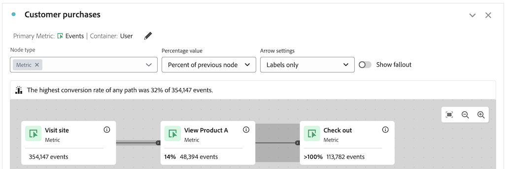

# 여정 캔버스 문제 해결

{{release-limited-testing}}

여정 캔버스 시각화를 사용하면 사용자와 고객에게 제공하는 여정을 분석하고 심도 있는 통찰력을 얻을 수 있습니다.

여정 캔버스에 대한 자세한 내용은 [여정 캔버스 개요](/help/analysis-workspace/visualizations/journey-canvas/journey-canvas.md) 및 [여정 캔버스 시각화 구성](/help/analysis-workspace/visualizations/journey-canvas/configure-journey-canvas.md)을 참조하세요.

다음 정보는 여정의 맨 뒤에 오는 노드가 여정의 맨 앞에 오는 노드보다 더 높은 비율이나 개수 카운트를 보여주는 것처럼, 의도하지 않은 결과를 해결하는 데 도움이 될 수 있습니다.

## 이전 노드보다 높은 백분율 또는 값을 갖는 노드

여정 캔버스에서 여정의 뒤에 오는 노드의 경우 여정 앞에 오는 노드보다 더 높은 비율이나 개수 카운트를 표시할 수 있습니다.

즉, 항상 단계 모양의 (각 단계에 따라 참여가 감소하면서) 폴아웃 시각화와는 달리, 여정 캔버스 시각화는 이전 단계보다 여정의 이후 단계에서 더 높은 참여도를 가질 수 있습니다.

이 문제는 다음 시나리오에서 발생할 수 있습니다.

* 사람 또는 세션 이외의 기본 지표를 사용할 때

* 여러 경로가 단일 노드로 수렴하는 경우

### 여정은 사람 또는 세션 이외의 기본 지표를 사용합니다

여정 캔버스에서는 모든 지표를 기본 지표로 사용할 수 있으므로, 여정 뒤에 오는 노드가 여정 앞에 오는 노드보다 더 높은 비율이나 수 카운트를 표시할 수 있습니다.

다음 시나리오에서 사용되는 여정은 다음 설정으로 구성됩니다.

* **[!UICONTROL 사용자]**&#x200B;이(가) 컨테이너로 설정되었습니다.

* **[!UICONTROL 이벤트]**&#x200B;이(가) 기본 지표로 설정되어 있습니다.

#### 시나리오 1 - 사용자 A는 첫 번째 세션에서 여정 경로를 따른 다음 후속 세션에서 이후 노드만 따릅니다

사용자 A가 사이트를 방문하여 여정의 경로를 따른다고 가정해 봅시다(노드 1: 사이트 방문 > 노드 2: 제품 A 보기 > 노드 3: 체크아웃). 이 시나리오에서는 이벤트가 여정의 각 노드에서 계산됩니다.

이제 사용자 A가 이후 세션에서 사이트를 다시 방문한다고 가정합니다. 사용자 A가 이전 세션에서 여정 경로를 따라 여정의 요구 사항을 이미 충족했으므로, 이는 사용자 A가 체크아웃할 때마다(현재 세션에서 여정 경로를 따르지 않았더라도) 여정의 세 번째 노드인 &quot;체크아웃&quot;에서 이벤트가 카운트됨을 의미합니다. 그러면 이전 노드인 &quot;제품 A 보기&quot;보다 &quot;체크아웃&quot; 노드에서 더 높은 비율과 숫자가 생성됩니다.

이 예제에서 여정의 컨테이너 설정은 세 번째 노드(&quot;Check out&quot;)의 이벤트가 후속 세션에서 계산되는지 여부를 결정하는 데 중요한 역할을 합니다.

또는 세션 이 개인 대신 컨테이너로 설정된 경우, 여정에 표시된 통계가 지정된 사용자에 대해 정의된 단일 세션으로 제한되므로 후속 방문의 세 번째 노드에서만 발생한 이벤트는 여정에서 계산되지 않았습니다. 컨테이너 설정에 대한 자세한 내용은 문서 [여정 캔버스 시각화 구성](/help/analysis-workspace/visualizations/journey-canvas/configure-journey-canvas.md)에서 [여정 캔버스 시각화 만들기 시작](/help/analysis-workspace/visualizations/journey-canvas/configure-journey-canvas.md#begin-building-a-journey-canvas-visualization)을 참조하세요.

<!-- The time allotted for users to move along the path is determined by the container setting. Because "Person" is selected as the container setting in this example, people who followed the journey's path in one session (moving from Node 1 to Node 2 and to Node 3) met the criteria of the journey. On any subsequent visits to the site, any event they have that matches any node on the journey is counted on that node. -->

#### 시나리오 2 - 사용자 B가 여정에서 이탈합니다.

사용자 B가 사이트를 방문하여 여정의 경로를 따르지 않고(사이트를 방문하여 제품 B를 본 다음 체크아웃함) 여정의 시작 노드인 &quot;사이트 방문&quot;에 대해서는 이벤트가 계산되지만 나머지 노드에 대해서는 이벤트가 계산되지 않고 사용자 B가 여정에서 이탈한다고 가정해 봅시다. 사용자 B가 체크아웃했더라도 사용자 B가 제품 A를 보고 여정의 경로를 따르지 않았기 때문에 세 번째 노드인 &quot;Check out&quot;에서 이벤트가 계산되지 않습니다.

이것은 사람들이 여정의 &quot;최종 경로&quot;를 따를 때만 각 노드에 대해 이벤트가 계산되기 때문입니다. 즉, 두 노드 간에 발생하는 모든 이벤트와 관계없이 개인이 결국 한 노드에서 다른 노드로 이동하는 동안 이벤트가 계산됩니다.

### 여정은 여러 경로가 단일 노드로 수렴합니다

여정 캔버스를 사용하면 단일 여정에 여러 시작 노드를 포함할 수 있으므로 여러 경로가 생성됩니다. 이러한 여정은 공통 노드로 수렴하여 여정의 뒤에 오는 노드가 의 앞에 오는 노드보다 더 높은 백분율 또는 수 카운트를 표시할 수 있습니다.

<!--

The journey used in the following scenarios is configured with the following settings:

* **[!UICONTROL Person]** is set as the container

* **[!UICONTROL Event]** is set as the primary metric

#### Scenario 

When a journey contains multiple paths that converge into a single node, the two paths are combined into the single node using the OR operator. This can result in the

-->

### 여정 백분율

**[!UICONTROL 백분율 값]** 필드에서 선택한 항목에 관계없이 여정의 각 노드에 표시된 숫자는 일정하게 유지되지만 백분율 자체는 변경될 수 있습니다.

다음 섹션에서는 **[!UICONTROL 백분율 값]** 필드에서 다음 옵션 중 어느 옵션을 선택하느냐에 따라 동일한 여정에 대해 백분율이 어떻게 변경될 수 있는지 보여 줍니다.

+++시작 노드의 백분율

**[!UICONTROL 백분율 값]** 필드가 **[!UICONTROL 시작 노드의 백분율]**(으)로 설정된 경우 이 여정의 노드에는 다음 통계가 포함됩니다.

| 노드 | 통계 |
|---------|----------|
| 노드 1 - &quot;사이트 방문&quot; | 이 여정에서 여정의 시작 노드인 &quot;사이트 방문&quot;에 표시된 대로 보고 날짜 범위 내의 사이트에 354,147개의 이벤트가 있었습니다. |
| 노드 2 - &quot;제품 A 보기&quot; | 시작 노드에 표시된 총 이벤트 수 중 14%(4만8394개)가 여정의 두 번째 노드인 &#39;제품 A 보기&#39; 기준과 일치했다. |
| 노드 3 - &quot;체크아웃&quot; | 시작 노드에 표시된 총 이벤트 수 중 32%(11만3782개)가 여정의 세 번째 노드인 &#39;체크아웃&#39; 기준과 일치했다. |

+++

+++이전 노드의 백분율

**[!UICONTROL 백분율 값]** 필드가 **[!UICONTROL 이전 노드의 백분율]**(으)로 설정된 경우 이 여정의 노드에는 다음 통계가 포함됩니다.

| 노드 | 통계 |
|---------|----------|
| 노드 1 - &quot;사이트 방문&quot; | 이 여정에서 여정의 시작 노드인 &quot;사이트 방문&quot;에 표시된 대로 보고 날짜 범위 내의 사이트에 354,147개의 이벤트가 있었습니다. |
| 노드 2 - &quot;제품 A 보기&quot; | 이전 노드에 표시된 총 이벤트 수 중 여정의 두 번째 노드인 &#39;제품 A 보기&#39; 기준과 일치하는 이벤트는 14%(4만8394개)였다. |
| 노드 3 - &quot;체크아웃&quot; | 이전 노드에 표시된 총 이벤트 수 중 100% 이상(11만3782개)이 여정의 세 번째 노드인 &#39;체크아웃&#39; 기준과 일치했다. |

+++

+++합계의 백분율

**[!UICONTROL 백분율 값]** 필드가 **[!UICONTROL 총]**&#x200B;의 백분율로 설정된 경우 이 여정의 노드에는 다음 통계가 포함됩니다.

| 노드 | 통계 |
|---------|----------|
| 노드 1 - &quot;사이트 방문&quot; | 이 여정에서 여정의 시작 노드인 &quot;사이트 방문&quot;에 표시된 대로 보고 날짜 범위 내의 사이트에 354,147개의 이벤트가 있었습니다. |
| 노드 2 - &quot;제품 A 보기&quot; | 전체 이벤트 수 중 여정의 두 번째 노드인 &#39;제품 A 보기&#39; 기준과 일치하는 이벤트는 1% 미만(4만8394건)이었다. |
| 노드 3 - &quot;체크아웃&quot; | 전체 이벤트 수 중 1%(11만3782건)가 여정의 세 번째 노드인 &#39;체크아웃&#39; 기준과 일치했다. |

+++

## 컨테이너 지표와 기본 지표 간의 호환성

여정 캔버스 컨테이너를 사람 (사람 지표 사용) 또는 세션 (세션 지표 사용)으로 구성할 수 있습니다.

현재 선택된 컨테이너 지표와 호환되는 기본 지표를 선택해야 합니다. 대부분의 지표는 사용 가능한 컨테이너 지표와 호환됩니다. 그러나 컨테이너 지표와 기본 지표의 일부 조합은 피해야 합니다.

예를 들어 세션을 기본 지표로 사용하는 컨테이너로 개인을 사용하면 의도하지 않은 결과가 발생할 수 있습니다.

<!--

## Percentages that exceed 100%

The following configurations can result in nodes that show percentages that exceed 100%:

* When the **[!UICONTROL Percentage value]** field is set to **[!UICONTROL Percent of total]** or **[!UICONTROL Percent of start node]**, and a primary metric is selected that results in less data for the start node than on subsequent nodes.

  For example, if Revenue is selected as the primary metric, and no revenue is being realized on the primary metric, then on any node where revenue is being realized will show as exceeding 100%. 

-->
