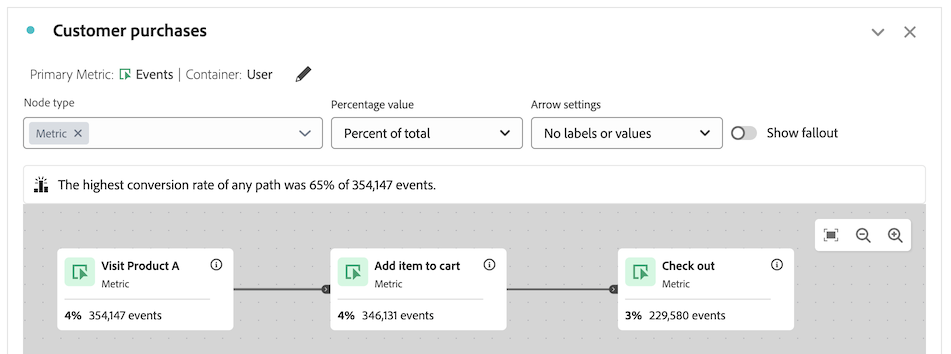
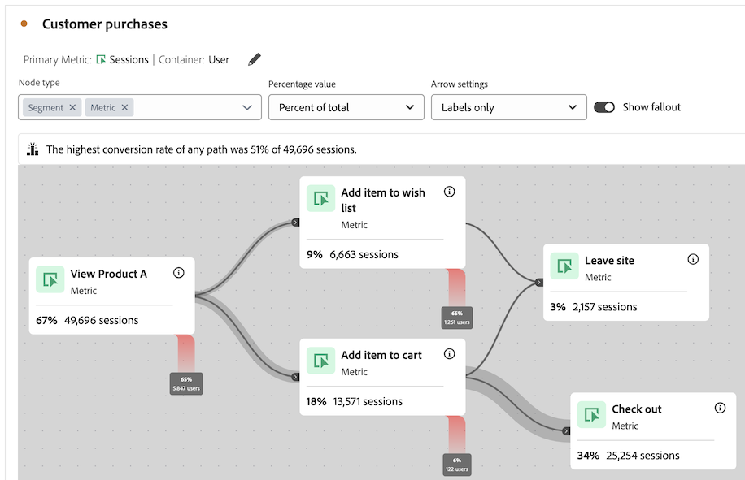

# 여정 캔버스 개요 {#journey-canvas-overview}

<!-- markdownlint-disable MD034 -->

>[!CONTEXTUALHELP]
>id="cja_journeycanvas_button"
>title="여정 캔버스"
>abstract="사람들이 일련의 터치포인트를 어떻게 진행하거나 이탈하는지 보여 줍니다. 여러 진입점과 경로가 있는 여정에 사용하거나 Journey Optimizer에서 생성된 여정을 분석하는 데 사용합니다."

<!-- markdownlint-enable MD034 -->

<!-- markdownlint-disable MD034 -->

>[!CONTEXTUALHELP]
>id="cja_journeycanvas_panel"
>title="여정 캔버스"
>abstract="사람들이 정의된 여정을 어떻게 진행하거나 이탈하는지 분석합니다. 이벤트, 차원 항목, 필터의 임의 조합을 나타내도록 노드와 화살표의 유연한 그래프를 만들어 사용자 여정의 분석을 빌드합니다. 캔버스에서 노드를 드래그하여 여정의 이벤트와 조건을 재정렬합니다. 데이터가 이에 따라 업데이트됩니다.   Adobe Journey Optimizer 이용이 가능한 고객은 기존 Journey Optimizer 여정을 분석할 수 있습니다."

<!-- markdownlint-enable MD034 -->

<!-- markdownlint-disable MD034 -->

>[!CONTEXTUALHELP]
>id="journeycanvas_button"
>title="여정 캔버스"
>abstract="사람들이 일련의 터치포인트를 어떻게 진행하거나 이탈하는지 보여 줍니다. 여러 진입점과 경로가 있는 여정에 사용하거나 Journey Optimizer에서 생성된 여정을 분석하는 데 사용합니다."

<!-- markdownlint-enable MD034 -->

<!-- markdownlint-disable MD034 -->

>[!CONTEXTUALHELP]
>id="journeycanvas_panel"
>title="여정 캔버스"
>abstract="사람들이 정의된 여정을 어떻게 진행하거나 이탈하는지 분석합니다. 이벤트, 차원 항목, 필터의 임의 조합을 나타내도록 노드와 화살표의 유연한 그래프를 만들어 사용자 여정의 분석을 빌드합니다. 캔버스에서 노드를 드래그하여 여정의 이벤트와 조건을 재정렬합니다. 데이터가 이에 따라 업데이트됩니다.   Adobe Journey Optimizer 이용이 가능한 고객은 기존 Journey Optimizer 여정을 분석할 수 있습니다."

<!-- markdownlint-enable MD034 -->

>[!BEGINSHADEBOX]

_이 문서는_  _**Customer Journey Analytics**&#x200B;에서 여정 캔버스 시각화를 문서화합니다. **Adobe Analytics**&#x200B;에 해당하는 시각화가 없습니다._

>[!ENDSHADEBOX]

여정 캔버스 시각화를 사용하면 사용자와 고객에게 제공하는 여정을 분석하고 심도 있는 통찰력을 얻을 수 있습니다. 이를 통해 여정을 처음부터 정의하거나 Journey Optimizer에서 하나를 본 다음, 사람들이 여정을 어떻게 떠나고(빠짐) 계속 지나가는지를 확인할 수 있습니다.

이벤트, 차원 항목, 필터 및 날짜 범위의 조합을 사용하여 [사용자 여정 분석을 빌드](/help/analysis-workspace/visualizations/journey-canvas/configure-journey-canvas.md)하여 여정 노드를 만들 수 있습니다. 노드를 연결하여 여정의 흐름을 만들고, 여러 경로와 의사 결정 지점을 포함합니다. 캔버스에서 노드를 드래그하여 여정의 이벤트 및 조건을 재배열합니다. 데이터를 변경할 때 실시간으로 업데이트됩니다.

[노드는 &quot;최종 경로&quot;로 연결](/help/analysis-workspace/visualizations/journey-canvas/configure-journey-canvas.md#logic-when-connecting-nodes)됩니다. 즉, 방문자는 두 노드 사이에서 발생하는 이벤트에 관계없이 한 노드에서 다른 노드로 이동하는 한 계산됩니다. 사용자가 경로를 이동하는 데 할당되는 시간은 컨테이너 설정에 따라 결정됩니다.

## 주요 기능

여정 캔버스 시각화의 주요 기능은 다음과 같습니다.

* 가장 복잡한 사용자 여정을 수용하는 폴아웃 및 폴스루에 대한 심층 분석.

* 사용자 여정의 다양한 진입점, 노드 및 경로를 매핑하고 시각화하기 위한 캔버스입니다.

* 캔버스에 구성 요소를 추가하고 기존 노드의 위치를 변경하기 위한 드래그 앤 드롭 상호 작용

* 여정 캔버스 내에서 사용자 여정 분석을 작성하거나 Journey Optimizer 여정을 기반으로 자동으로 생성하는 옵션입니다.

## 잠재적 인사이트

여정 캔버스는 가장 복잡한 여정에 대해 실행 가능한 통찰력을 제공합니다.

### 전환율이 가장 높은 경로 {#conversion-rate-caption}

여정 캔버스에서 가장 눈에 띄는 인사이트는 캔버스 자체의 맨 위에 캡션으로 표시됩니다.

이 캡션은 여정의 모든 경로 중 전환율이 가장 높았던 경로를 요약합니다.

여정에 여러 시작 노드가 포함된 경우 캡션은 다음과 같이 표시됩니다.

여정에 단일 시작 노드가 포함된 경우 캡션은 다음과 같이 표시됩니다.

이 캡션을 해석할 때는 다음 사항을 고려하십시오.

* _path_&#x200B;은(는) 화살표로 끝 노드에 연결된 시작 노드로 정의되며, 연결된 노드 수는 제한이 없습니다.

* 전환율 계산은 여정 유형(여정에 포함된 시작 노드와 끝 노드의 수 및 경로가 이들 노드 간에 교차하는지 여부)에 따라 달라집니다.

  다음 표에서는 여정 유형을 기반으로 전환율을 계산하는 방법을 설명합니다.

  | 여정 유형 | 전환율 계산 | 예 |
  |---------|----------|---------|
  | **단일 시작 노드 및 단일 끝 노드** | 변환율은 종말 노드의 수를 시작 노드의 수로 나누어 계산한다. |  |
  | **단일 시작 노드 및 여러 끝 노드** | 전환율은 숫자가 가장 높은 끝 노드를 찾고, 이 숫자를 시작 노드의 숫자로 나누어 계산됩니다. |  |
  | **각 경로에 단일 시작 노드 및 단일 끝 노드가 포함된 여러 개의 독립 경로** | 변환율은 종말 노드의 수를 시작 노드의 수로 나누어 계산한다. 전환율이 가장 높은 경로는 캡션에 설명되어 있습니다. |  |
  | **여정의 어느 지점에서든 공통 노드로 수렴하는 여러 시작 노드** | 전환율은 숫자가 가장 높은 마지막 노드를 찾고, 이 숫자를 숫자가 가장 낮은 시작 노드의 숫자로 나누어 계산됩니다. |  |

### 폴스루, 폴아웃 등

다음은 여정 캔버스에서 제공하는 데 도움이 될 수 있는 기타 통찰력의 몇 가지 예입니다. 이러한 인사이트가 데이터 보기의 모든 사람, 여정을 시작한 모든 사람 또는 여정의 이전 노드에서 온 모든 사람을 기반으로 하는지 여부를 선택할 수 있습니다.

#### 폴스루

* 여정을 완료한(종료 노드에 도착한) 사람의 수와 백분율

* 여정의 특정 노드에 도착한 사람의 수 및 백분율

* 여정의 주어진 노드 이후 또는 이전에 발생한 가장 일반적인 단계

#### 폴아웃

* 사람들이 가장 일반적으로 여정에서 떨어진 여정 노드(바로 다음 노드에 도착한 적이 없음)

#### 각 노드에 대한 추가 데이터

* 여정의 노드에 분류 차원을 추가하여 특정 노드에 대한 추가 데이터를 확인합니다

## 여정 캔버스, 폴아웃 또는 플로우 시각화 중 선택

여정 캔버스 시각화는 [폴아웃 시각화](/help/analysis-workspace/visualizations/fallout/fallout-flow.md) 및 [흐름 시각화](/help/analysis-workspace/visualizations/c-flow/flow.md)와 유사하지만 중요한 차이가 있습니다.

### 차이점 이해

<!-- Information in this snippet is shared between Journey canvas, Fallout, and Flow visualization docs -->

{{journey-visualization-comparisons}}

### 여정 캔버스 사용 시기

여정 캔버스는 다음에 필수적입니다.

* 여러 진입점 및 경로를 가진 여정을 포함하는 폴아웃 분석.

* 여러 진입점과 경로가 있고 사전 정의된 여정 시퀀스가 있는 비선형 페이지입니다.

* 사전 정의된 여정을 기반으로 하는 탐색적 Ad Hoc Analysis.

* 세션, 개인 또는 발생 횟수 이외의 기본 지표가 필요한 분석입니다.

* Adobe Journey Optimizer에서 시작된 여정에 대한 심층적인 분석입니다.

[위의 표](#understand-the-differences)를 사용하여 여정 캔버스, 폴아웃 및 플로우 시각화 간의 차이점을 이해합니다.

## Journey Optimizer 여정 분석

>[!NOTE]
>
>조직에 Journey Optimizer에 대한 액세스 권한이 없는 경우에도 [여정 캔버스에서 분석을 빌드](#build-analyses-in-customer-journey-analytics)할 수 있습니다.

여정 캔버스에서 Journey Optimizer 여정을 분석하면 사람들이 여정과 상호 작용하는 방법에 대한 깊고 실행 가능한 통찰력을 제공합니다.

여정 캔버스에서 Journey Optimizer 여정을 분석할 때 여정은 Journey Optimizer에서와 동일한 순서, 시퀀스 및 구조로 표시됩니다. 여정 캔버스 내에서 여정을 크게 변경하면 [변경 내용이 더 이상 Journey Optimizer에서 동기화되지 않습니다](#synchronization-between-journey-optimizer-and-journey-canvas).

### 여정 캔버스로 Journey Optimizer 여정 분석의 이점

여정 캔버스는 Journey Optimizer에서 가능하지 않은 심층적이고 철저한 분석을 제공합니다.

여정 캔버스를 사용하여 Journey Optimizer에서 생성된 여정을 분석하면 다양한 이점이 있습니다.

* Customer Journey Analytics 차원, 지표, 필터 또는 날짜 범위를 사용하여 이벤트를 만듭니다.

  Journey Optimizer에서 기술 사용자는 이벤트를 만든 후에 여정에 추가해야 합니다.

* 만드는 사용자 지정 노드를 기반으로 대상을 만듭니다(Customer Journey Analytics 대상 빌더 시작).

  Journey Optimizer에서는 사전 정의된 활동에 대해서만 대상을 만들 수 있습니다.

* 폴스루 및 폴아웃 분석

* 모든 차원으로 이벤트 분류

* 이벤트 결합

* 이벤트 연결

* 이벤트 이름 변경 및 삭제

* 훨씬 더

### Journey Optimizer과 여정 캔버스 간 동기화

여정 캔버스에서 Journey Optimizer 여정 분석을 만들면 데이터가 Journey Optimizer에서 여정 캔버스에 이르기까지 한 방향으로만 동기화됩니다. 즉, 여정 캔버스에서 여정에 수행된 변경 사항이 Journey Optimizer에 반영되지 않습니다.

또한 Journey Optimizer의 여정에 대한 변경 사항은 여정 캔버스에서 여정이 크게 수정되지 않은 경우에만 [여정 캔버스와 동기화됩니다](#differences-after-modifying-a-journey-in-journey-canvas). 여정 캔버스에서 여정을 수정한 후에는 Journey Optimizer의 여정에 대한 모든 변경 사항이 여정 캔버스에 반영되지 않습니다. 여정 캔버스에 반영된 변경 내용을 보려면 여정 캔버스에서 여정을 삭제하고 [다시 만들 수 있습니다](/help/analysis-workspace/visualizations/journey-canvas/configure-journey-canvas.md).

### 여정 캔버스에서 여정 수정 후의 차이점 {#differences-after-modifying}

여정 캔버스에서 Journey Optimizer 여정을 수정한 후에는 데이터 처리, 사용 가능한 기능 및 동기화 동작이 변경될 수 있습니다.

여정 캔버스에서 Journey Optimizer 여정을 크게 수정하는 경우 데이터 처리, 사용 가능한 기능 및 동기화 비헤이비어가 변경될 수 있습니다. 중요한 수정에는 다음 중 하나가 포함됩니다.

* 노드 추가 또는 제거

* 노드 사이에 화살표 추가 또는 제거

* 노드의 구성 요소 변경

노드 드래그 또는 분류 추가와 같이, 여정 캔버스에서 Journey Optimizer 여정을 변경하는 경우 다음 섹션에서 설명하는 차이가 적용되지 않습니다.

>[!NOTE]
>
>여정을 원래 상태로 되돌리려면 여정 캔버스에서 첫 번째 변경 작업을 수행한 후 Ctrl+z를 누를 수 있습니다. 또는 여정 캔버스에서 여정을 삭제하고 [다시 만들 수 있습니다](/help/analysis-workspace/visualizations/journey-canvas/configure-journey-canvas.md)

#### 데이터 처리 차이

여정 캔버스에서 Journey Optimizer 여정을 수정한 후 여정에 기본값이 아닌 속성 모델이 있는 지표가 포함된 경우 데이터가 변경되는 것을 볼 수 있습니다.

이는 Journey Optimizer과 달리 여정 캔버스를 사용하면 단일 여정 내에서 여러 차원을 적용할 수 있기 때문입니다. 이 기능은 [지표 속성](/help/data-views/component-settings/attribution.md)이 지원되지 않음을 의미합니다.

#### 기능 차이점

여정 캔버스에서 Journey Optimizer 여정을 수정한 후 수정 사항에 따라 [!UICONTROL **화살표 설정**] 드롭다운 필드에서 사용할 수 있는 옵션이 변경됩니다. 자세한 내용은 [설정 구성](/help/analysis-workspace/visualizations/journey-canvas/configure-journey-canvas.md)을 참조하세요.

[!UICONTROL **노드 유형**] 필드는 Journey Optimizer에서만 사용할 수 있습니다. 여정 캔버스에서 여정을 수정하는지 여부에 관계없이 여정 캔버스에서 Journey Optimizer 여정을 볼 때는 사용할 수 없습니다.

#### 동기화 차이점

Journey Optimizer의 여정에 대한 변경 사항은 여정이 여정 캔버스에서 수정되지 않은 상태로 유지되는 경우에만 여정 캔버스와 동기화됩니다.

여정 캔버스에서 Journey Optimizer 여정을 수정한 후에는 Journey Optimizer의 여정에 대한 모든 변경 사항이 여정 캔버스에 반영되지 않습니다. 여정 캔버스에 반영된 변경 내용을 보려면 여정 캔버스에서 여정을 삭제하고 [다시 만들 수 있습니다](/help/analysis-workspace/visualizations/journey-canvas/configure-journey-canvas.md).

### Journey Optimizer과 Customer Journey Analytics의 용어 차이점

Journey Optimizer에서 한 가지를 의미하는 특정 용어는 Customer Journey Analytics에서 다른 의미를 갖습니다. 여정 캔버스를 사용할 때는 Customer Journey Analytics 용어가 사용됩니다.

| 용어 | 여정 캔버스 | Journey Optimizer |
|---------|----------|---------|
| **Event** | Customer Journey Analytics에서 사용할 수 있는 여러 표준 지표 중 하나입니다. 이 지표는 생성된 매출, 구독 또는 리드와 같은 것을 계산합니다. | 온라인 구매와 같이 개인화된 여정을 트리거하는 활동의 카테고리입니다. |

### 여정 캔버스에서 Journey Optimizer 여정 분석

여정 캔버스에서 Journey Optimizer 여정을 분석하는 방법에 대한 자세한 내용은 [여정 캔버스 시각화 구성](/help/analysis-workspace/visualizations/journey-canvas/configure-journey-canvas.md)을 참조하십시오.

## 여정 캔버스에서 분석 빌드

Analysis Workspace에서 사용할 수 있는 차원 또는 지표를 기반으로 하는 여정 캔버스에서 분석을 빌드할 수 있습니다. 또는 Journey Optimizer에서 생성된 여정을 분석할 수 있습니다. 자세한 내용은 [여정 캔버스 시각화 구성](/help/analysis-workspace/visualizations/journey-canvas/configure-journey-canvas.md)을 참조하십시오.

>[!MORELIKETHIS]
>
> * [Adobe Customer Journey Analytics의 여정 캔버스 시각화 가이드](https://experienceleaguecommunities.adobe.com/t5/adobe-analytics-blogs/a-guide-to-journey-canvas-visualization-in-adobe-customer/ba-p/737857)

