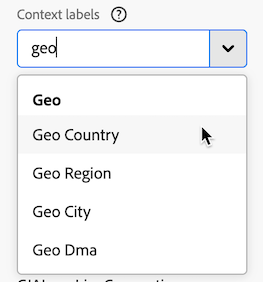
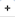
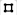

# 맵 {#map}

<!-- markdownlint-disable MD034 -->

>[!CONTEXTUALHELP]
>id="workspace_map_button"
>title="맵"
>abstract="이 시각화는 지표를 맵 위에 중첩되도록 표현합니다. 이는 지리적으로 다른 지역들의 데이터를 식별하는 데 유용합니다."

<!-- markdownlint-enable MD034 -->

<!-- markdownlint-disable MD034 -->

>[!CONTEXTUALHELP]
>id="workspace_map_bubbles"
>title="버블"
>abstract="버블을 사용하여 이벤트를 플롯합니다."

<!-- markdownlint-enable MD034 -->

<!-- markdownlint-disable MD034 -->

>[!CONTEXTUALHELP]
>id="workspace_map_heatmap"
>title="열 지도"
>abstract="히트맵을 사용하여 이벤트를 플롯합니다."

<!-- markdownlint-enable MD034 -->

{{release-limited-testing}}

>[!BEGINSHADEBOX]

_이 문서는_&#x200B;에 맵 시각화를 문서화합니다 _&#x200B;**Customer Journey Analytics**._ _이 문서의 [AdobeAnalytics](https://experienceleague.adobe.com/ko/docs/analytics/analyze/analysis-workspace/visualizations/map-visualization)_ Adobe Analytics맵&#x200B;_&#x200B;**을 참조하세요.**&#x200B;_

>[!ENDSHADEBOX]

Analysis Workspace의  **[!UICONTROL 맵]** 시각화를 사용하면 모든 지표(계산된 지표 포함)의 시각적 맵을 작성할 수 있습니다. 다른 지역 간에 지표 데이터를 식별하고 비교하는 데 유용합니다.

## 사전 요구 사항

### 데이터 보기에 컨텍스트 레이블 추가

Customer Journey Analytics 데이터 보기 설정에서 관리자는 차원 또는 지표에 [컨텍스트 레이블](/help/data-views/component-settings/overview.md)을(를) 추가할 수 있으며 [!UICONTROL 맵] 시각화와 같은 Customer Journey Analytics 서비스에서는 이러한 레이블을 목적에 사용할 수 있습니다.

#### 맵 시각화에 필요한 컨텍스트 레이블

맵 시각화가 작동하려면 컨텍스트 레이블이 필요합니다. 다음 컨텍스트 레이블이 없으면 작업할 위도 및 경도 데이터가 없으므로 맵 시각화가 작동하지 않습니다.

* [!UICONTROL 지역: 위도]
* [!UICONTROL 지역: 경도]

이러한 컨텍스트 레이블을 추가하려면 다음 작업을 수행하십시오.

1. Customer Journey Analytics에서 **[!UICONTROL 데이터 관리]** > **[!UICONTROL 데이터 보기]**&#x200B;를 선택합니다.

1. 데이터 보기 페이지에서 맵 시각화에 분석할 데이터가 포함된 데이터 보기를 선택합니다.

1. **[!UICONTROL 구성 요소]** 탭을 선택한 다음 경도 데이터를 포함하는 차원을 선택합니다.

1. 오른쪽 레일의 **[!UICONTROL 구성 요소 설정]** 섹션, **[!UICONTROL 컨텍스트 레이블]** 필드에서 `Longitude`을(를) 입력한 다음 드롭다운 메뉴에서 선택합니다.

   

1. 이 프로세스를 반복하여 위도 데이터가 포함된 차원에 **[!UICONTROL 위도]** 컨텍스트 레이블을 추가하십시오.

1. **[!UICONTROL 저장 후 계속]** > **[!UICONTROL 저장 후 완료]**&#x200B;를 선택합니다.

#### 지역 템플릿에 필요한 컨텍스트 레이블

Adobe은 맵 시각화를 사용하는 몇 가지 [미리 작성된 템플릿](/help/analysis-workspace/templates/use-templates.md#web-audience)을 제공합니다. 각 템플릿을 사용하려면 데이터 보기의 차원에 해당 컨텍스트 레이블을 추가해야 합니다.

다음은 템플릿과 필수 컨텍스트 레이블입니다. 이러한 레이블이 없으면 함께 작동할 지역 데이터가 없기 때문에 템플릿이 작동하지 않습니다.

| 템플릿 이름 | 필수 컨텍스트 레이블 |
|---------|----------|
| 지역 국가 | [!UICONTROL 지역: 지역 국가] |
| 지리적 지역 | [!UICONTROL 지역: 지역] |
| 지리적 도시 | [!UICONTROL 지역: 지역 도시] |
| 지리적 미국 주 | [!UICONTROL 지역: 지역 상태] |
| 지역 US DMA | [!UICONTROL 지역: 지역 Dma] |

이러한 컨텍스트 레이블을 추가하려면 다음 작업을 수행하십시오.

1. Customer Journey Analytics에서 **[!UICONTROL 데이터 관리]** > **[!UICONTROL 데이터 보기]**&#x200B;를 선택합니다.

1. 데이터 보기 페이지에서 맵 시각화를 사용하는 미리 작성된 템플릿으로 분석할 데이터가 포함된 데이터 보기를 선택합니다. 이 데이터 보기에서 국가 데이터가 있는 차원, 지역 데이터가 있는 차원, 도시 데이터가 있는 차원, 주 데이터가 있는 차원 및 DMA 데이터가 있는 차원 등 5개를 선택합니다. 그런 다음 해당 컨텍스트 레이블로 차원에 레이블을 지정합니다.

1. **[!UICONTROL 구성 요소]** 탭을 선택한 다음 국가 데이터가 포함된 차원을 선택합니다.

1. 오른쪽 레일의 **[!UICONTROL 구성 요소 설정]** 섹션, **[!UICONTROL 컨텍스트 레이블]** 필드에서 `Geo Country`을(를) 입력한 다음 드롭다운 메뉴에서 선택합니다.

   

1. 이 프로세스를 반복하여 해당 데이터를 포함하는 각 차원에 **[!UICONTROL 지역: 지역]**, **[!UICONTROL 지역: 지역]**, **[!UICONTROL 지역: 지역 상태]** 및 **[!UICONTROL 지역: Dma]** 컨텍스트 레이블을 추가합니다.

1. **[!UICONTROL 저장 후 계속]** > **[!UICONTROL 저장 후 완료]**&#x200B;를 선택합니다.

### 그래픽 드라이버는 WebGL 렌더링을 지원해야 합니다.

맵 시각화는 그래픽 표시에 WebGL을 사용합니다. 그래픽 드라이버가 WebGL 렌더링을 지원하지 않는 경우 드라이버를 업데이트해야 할 수 있습니다.

## Customer Journey Analytics과 Adobe Analytics의 맵 시각화

Customer Journey Analytics의 맵 시각화는 Adobe Analytics의 맵 시각화와 다음과 같은 점에서 다릅니다.

| 기능 | Customer Journey Analytics | Adobe Analytics |
|---------|----------|---------|
| 데이터 소스 | 데이터 보기에서 사용할 수 있는 모든 세그먼트를 데이터 소스로 사용합니다. | 다음 옵션을 제공합니다. <ul><li>모바일 위도/경도</li><li>지리적 Dimension 방문자의 IP 주소를 기반으로 방문자 위치에 대한 지리 특성 데이터를 나타냅니다. </li></ul> |
| 정밀도 | 정밀도가 높은 데이터 세트의 경우 데이터 보기에서 최대 5개의 소수 자리를 표시하도록 차원을 구성할 수 있습니다. 이를 통해 맵 시각화가 1미터 이내로 정확해질 수 있습니다. 
자세한 내용은 [차원의 정확한 위치 구성](#configure-precise-locations-for-dimensions)을 참조하십시오.
 | 데이터는 [!UICONTROL 국가], [!UICONTROL 지역] 및 [!UICONTROL 도시] 수준으로 정확합니다. (DMA 또는 우편번호 수준으로는 이동하지 않습니다.) |
| 선택 항목에서 세그먼트 만들기 | 맵 시각화에서 선택한 특정 영역을 기반으로 세그먼트를 만듭니다. 
자세한 내용은 [맵 시각화에서 세그먼트 만들기](#create-a-segment-from-the-map-visualization)를 참조하십시오.
 | 일반적으로 맵 시각화에서 보고되는 데이터를 기반으로 세그먼트를 만듭니다. |
| 선택 항목에서 대상자 만들기 | 맵 시각화에서 선택한 특정 영역을 기반으로 대상자를 만듭니다. 
자세한 내용은 [맵 시각화에서 대상 만들기](#create-an-audience-from-the-map-visualization)를 참조하십시오. | 맵 시각화에서 대상자를 만들 수 없습니다. |
| 선택 항목에서 트렌드 만들기 | 맵 시각화에서 선택한 특정 영역을 기반으로 추세선 차트 시각화를 만듭니다. 
자세한 내용은 [맵 시각화에서 추세선 차트 만들기](#create-a-trended-line-chart-from-the-map-visualization)를 참조하세요. <!-- is this correct? --> | 맵 시각화에서 트렌드를 만들 수 없습니다. |
| 선택 항목에서 분류 추가 | 맵 시각화에서 선택한 특정 영역 내의 특정 차원 항목, 지표, 세그먼트 또는 날짜 범위를 분류합니다. 
자세한 내용은 [맵 시각화에서 분류 추가](#add-a-breakdown-from-the-map-visualization)를 참조하십시오. | 맵 시각화에서 분류를 추가할 수 없습니다. |

## 맵 시각화 작성 시작 {#begin-building-map}

<!-- markdownlint-disable MD034 -->

>[!CONTEXTUALHELP]
>id="workspace_map_panel"
>title="맵 시각화 구성"
>abstract="맵 시각화의 기반으로 사용되는 지표 또는 계산된 지표를 선택합니다. 데이터의 특정 하위 세트에 중점을 두려는 경우 세그먼트를 추가할 수도 있습니다.
시각화가 렌더링된 후 언제든지 이 정보를 업데이트할 수 있습니다.
"

<!-- markdownlint-enable MD034 -->

1. 왼쪽 레일에서 [!UICONTROL **시각화**] 아이콘을 선택한 다음 **[!UICONTROL 맵]** 시각화 을(를) 자유 형식 테이블이 포함된 패널로 드래그합니다.

   또는

   [시각화 개요](/help/analysis-workspace/visualizations/freeform-analysis-visualizations.md#add-visualizations-to-a-panel)의 [패널에 시각화 추가](/help/analysis-workspace/visualizations/freeform-analysis-visualizations.md) 섹션에 설명된 방법으로 맵 시각화를 추가하십시오.

   {width="50%"}

1. 맵 시각화를 구성하려면 다음 기본 정보를 지정합니다.

   * **[!UICONTROL 지표 추가]**: 지표 드롭다운 목록에서 지표 또는 계산된 지표를 선택합니다. (왼쪽 레일에서 지표를 드래그할 수도 있습니다.)

     >[!IMPORTANT]
     >
     >[속성이 적용된](/help/data-views/component-settings/attribution.md#attribution-models) 지표를 선택하면 동일한 속성이 맵 시각화의 현재 뷰포트 내에 있는 위도 및 경도 쌍에 적용됩니다.
     >

     <!-- Only choose metrics that use Last Touch as the [attribution model](/help/data-views/component-settings/attribution.md#attribution-models) (this is the default attribution model for all metrics). Choosing a metric that has an attribution model other than Last Touch results in inaccurate map data, because attribution is applied to the latitude and longitude pairs. -->

   * **[!UICONTROL 세그먼트 추가]**: (선택 사항) 세그먼트 드롭다운 목록에서 세그먼트를 선택합니다. 또는 세그먼트 목록에서 세그먼트를 드래그합니다.

   시각화 헤더에서 편집 아이콘 을 선택하여 시각화를 작성한 후 이 정보를 업데이트할 수 있습니다.

1. **[!UICONTROL 빌드]**&#x200B;를 선택합니다.

   버블이 포함된 세계 맵 시각화가 생성됩니다.

   

1. [맵 시각화 보기](#view-a-map-visualization) 및 [시각화 설정 구성](#configure-visualization-settings)을 계속합니다.

## 맵 시각화 보기

1. [맵 시각화 작성 시작](#begin-building-a-map-visualization)에 설명된 대로 맵 시각화를 작성하십시오.

1. Analysis Workspace의 맵 시각화에서 다음 중 하나를 수행합니다.

   * **확대**: 다음 방법 중 하나로 특정 영역을 확대하도록 맵을 확대할 수 있습니다.

      * 마우스를 사용하여 맵을 두 번 클릭합니다.

      * 트랙패드에서 마우스 스크롤 휠이나 유사한 작업을 사용합니다.

      * 맵 시각화에서 더하기 아이콘 을(를) 선택합니다.

     그에 따라 맵이 확대/축소됩니다. 필요한 차원(국가 > 주 > 구/군/시)은 확대/축소 수준에 따라 자동으로 업데이트됩니다.

   * **축소**: 맵을 축소하여 다음 방법 중 하나로 더 큰 영역을 볼 수 있습니다.

      * Shift 키를 누른 채 마우스로 맵을 두 번 클릭합니다.

      * 트랙패드에서 마우스 스크롤 휠이나 유사한 작업을 사용합니다.

      * 맵 시각화에서 마이너스 아이콘 을 선택합니다.

     그에 따라 맵이 확대/축소됩니다. 필요한 차원(국가 > 주 > 구/군/시)은 확대/축소 수준에 따라 자동으로 업데이트됩니다.

   * **회전**: 마우스로 맵을 드래그하는 동안 [!UICONTROL Ctrl] 키를 눌러 맵을 2D 또는 3D로 회전할 수 있습니다.

     맵을 원래 북쪽 맞춤으로 재설정하려면 나침반 아이콘 을 선택합니다.

   * **선택 도구**: 맵의 영역을 선택하여 [세그먼트 만들기](#create-a-segment-from-the-map-visualization), [트렌드 만들기](#create-a-trended-line-chart-from-the-map-visualization) 또는 [분류를 추가](#add-a-breakdown-from-the-map-visualization)할 수 있습니다.

     선택 도구 을 클릭한 다음 마우스를 끌어 원하는 영역을 선택합니다.

   * **비교**: 동일한 프로젝트에서 둘 이상의 맵 시각화를 나란히 배치하여 비교할 수 있습니다.

   * **기간별 비교 표시(예: 연도별)**:

      * 음수를 표시합니다.

        예를 들어 연도별 지표를 맵에 그리는 경우 뉴욕에 대해 -33%를 맵에 표시할 수 있습니다.
      * *퍼센트* 유형의 지표를 사용하면 클러스터링에서 백분율의 평균을 함께 계산합니다.
      * 녹색 및 빨간색 색상 구성표는 양수 및 음수를 나타냅니다.

   * **추가 시각화 설정**: 맵 시각화에 대한 추가 설정을 보려면 시각화 헤더에서 설정 아이콘 을 선택하십시오. 자세한 내용은 [시각화 설정 구성](#configure-visualization-settings)을 참조하십시오.

1. 프로젝트를 **저장**&#x200B;하여 모든 맵 설정(좌표, 확대/축소, 회전)을 저장합니다.
1. (선택 사항) 시각화 아래의 자유 형식 테이블은 왼쪽 레일에서 위치 차원 및 지표를 드래그하여 채울 수 있습니다.

## 시각화 설정 구성

맵 시각화에 대한 설정을 구성하려면 다음 작업을 수행하십시오.

1. Analysis Workspace에서 기존 맵 시각화를 열거나 [새 맵 시각화를 만들기](#begin-building-a-map-visualization)합니다.

1. 맵 시각화 위로 마우스를 가져간 다음 시각화 헤더에서 설정 아이콘 을 선택합니다.

   다음 옵션을 사용할 수 있습니다.

   | 섹션 | 설정 | 설명 |
   | --- |--- |--- |
   | **[!UICONTROL 맵 유형]** | | |
   | | **[!UICONTROL 버블]** | 버블을 사용하여 이벤트를 그립니다. 버블 차트는 산포도와 비례 영역 차트의 중간에 있는 다중 변수 그래프입니다. 이 보기가 기본값입니다. |
   | | **[!UICONTROL 히트맵]** | 히트맵을 사용하여 이벤트를 그립니다. 히트맵은 표에 포함된 개별 값이 색상으로 표현되는 데이터 그래픽 표현입니다. |
   | **[!UICONTROL 스타일]** | | |
   | | **[!UICONTROL 색상 테마]** | 히트맵 및 버블의 색상 구성표를 보여 줍니다. 코랄, 빨강, 녹색, 파랑 중에서 선택할 수 있습니다. 기본값은 코랄입니다. |
   | | **[!UICONTROL 맵 스타일]** | 기본, 도로, 더 밝게, 밝게, 어둡게, 위성 중에서 선택할 수 있습니다. |
   | | **[!UICONTROL 클러스터 반경]** | 지정된 픽셀 수 내에 있는 데이터 포인트를 그룹화합니다. 기본값은 50입니다. |
   | | **[!UICONTROL 사용자 지정 최대값]** | 맵의 최대 값에 대한 임계값을 변경할 수 있습니다. 이 값을 조정하면 설정한 사용자 지정 최대 값에 비례하여 버블 또는 히트맵 값(색상 및 크기)의 크기가 조정됩니다. |
   | | **[!UICONTROL 주석 표시]** | 이 시각화에 대해 만들어진 주석을 표시합니다. |
   | | **[!UICONTROL 제목 숨기기]** | 시각화의 제목을 숨깁니다. |

## 차원에 대한 정확한 위치 구성

정밀도가 높은 사용자 지정 데이터 세트가 있는 경우 맵 시각화를 구성하여 1미터 내에서 위치 정확도를 달성할 수 있습니다.

1. Customer Journey Analytics에서 **[!UICONTROL 데이터 관리]** > **[!UICONTROL 데이터 보기]**&#x200B;를 선택합니다.

1. 더 정확한 위치를 사용하도록 구성할 차원이 포함된 데이터 보기를 선택합니다.

1. 데이터 보기에서 **[!UICONTROL 구성 요소]** 탭을 선택합니다.

1. 구성할 차원을 선택합니다.

1. 차원에 대한 정밀도 수준을 구성합니다.

   1. 구성할 차원을 선택한 상태로 오른쪽 레일의 **[!UICONTROL 서식]** 섹션을 확장합니다.

      

   1. **[!UICONTROL 소수점 이하 자리 수]** 필드에서 원하는 전체 자릿수를 반영하도록 소수점 이하 자릿수를 변경합니다.

      * **0:** 맵 시각화에서 큰 지역 또는 국가 수준으로 정밀합니다. Workspace 보고서에 소수점 이하 0자리를 표시합니다.

      * **1:** 맵 시각화에서 지역 또는 대도시 수준에 정확하게 맞춥니다.  Workspace 보고서에 소수점 이하 1자리를 표시합니다.

      * **2:** 맵 시각화에서 도시 또는 우편번호 수준에 정확하게 맞춥니다. Workspace 보고서에 소수점 이하 두 자리를 표시합니다.

        이것이 기본 선택입니다.

      * **3:** 맵 시각화에서 매우 작은 마을 또는 인근 수준에 정확하게 맞춥니다. Workspace 보고서에 소수점 이하 세 자리를 표시합니다.

      * **4:** 맵 시각화에서 특정 토지 또는 건물 수준에 정확하게 맞춥니다. Workspace 보고서에 소수점 이하 4자리를 표시합니다.

      * **5:** 맵 시각화에서 1미터에 정확히 맞춥니다. Workspace 보고서에 소수점 이하 다섯 자리를 표시합니다.

1. **[!UICONTROL 저장 후 계속]** > **[!UICONTROL 저장 후 완료]**&#x200B;를 선택합니다.

## 맵 시각화에서 세그먼트 만들기 {#map-create-segment}

맵 시각화에서 선택한 특정 영역을 기반으로 세그먼트를 만들 수 있습니다. 선택한 영역을 기반으로 세그먼트를 만들면 선택 영역의 위도와 경도 내에 있는 모든 데이터가 세그먼트에 포함됩니다.

맵 시각화에서 세그먼트를 만들려면 다음 작업을 수행하십시오.

1. (선택 사항) 세그먼트에 사용할 데이터가 포함된 맵의 특정 영역을 확대합니다.

1. 선택 도구 을 클릭한 다음 마우스를 끌어 원하는 영역을 선택합니다.

1. 표시되는 드롭다운 메뉴에서 **[!UICONTROL 선택 항목에서 세그먼트 만들기]**&#x200B;를 선택합니다.

1. 세그먼트 빌더 를 사용하여 새 세그먼트를 정의합니다. 자세한 내용은 [세그먼트 빌더](/help/components/segments/seg-builder.md)를 참조하십시오.

## 맵 시각화에서 대상자 만들기

맵 시각화에서 선택한 특정 영역을 기반으로 대상을 만들 수 있습니다.

맵 시각화에서 대상자를 만들려면 다음 작업을 수행하십시오.

1. (선택 사항) 대상자에게 사용할 데이터가 포함된 맵의 특정 영역을 확대합니다.

1. 선택 도구 을 클릭한 다음 마우스를 끌어 원하는 영역을 선택합니다.

1. 표시되는 드롭다운 메뉴에서 **[!UICONTROL 선택 항목에서 대상 만들기]**&#x200B;를 선택합니다.

1. 대상 빌더를 사용하여 새 대상을 정의합니다. 자세한 내용은 [대상 만들기 및 게시](/help/components/audiences/publish.md#audience-builder)의 [대상 빌더](/help/components/audiences/publish.md)를 참조하십시오.

## 맵 시각화에서 추세선 차트 만들기

맵 시각화에서 선택한 특정 영역 내의 데이터에 대한 트렌드 라인 차트 시각화를 만들 수 있습니다.

맵 시각화에서 추세선 차트를 만들려면 다음 작업을 수행하십시오.

1. (선택 사항) 트렌드 라인 차트에 사용할 데이터가 포함된 맵의 특정 영역을 확대합니다.

1. 선택 도구 을 클릭한 다음 마우스를 끌어 원하는 영역을 선택합니다.

1. 표시되는 드롭다운 메뉴에서 **[!UICONTROL 트렌드]**&#x200B;을(를) 선택합니다.

   추세선을 포함하는 선 시각화가 구축됩니다. 이 시각화에 대한 자세한 내용은 [줄](/help/analysis-workspace/visualizations/line.md)을 참조하세요.

<!--

Can you do this?

## Add a breakdown from the map visualization

You can break down a specific dimension item, metric, segment, or date range for the data within a designated area that you select in the map visualization.

To add a breakdown from the map visualization:

1. (Optional) Zoom in on the specific area of the map that contains the data where you want to add the breakdown.

1. Click the selection tool , then drag your mouse to select the desired area.

1. Select **[!UICONTROL Add breakdown]**. 

-->

<!--

Can you do this?

## Export the map visualization as a PDF

To export the map visualization in PDF format:

1. how...

-->

