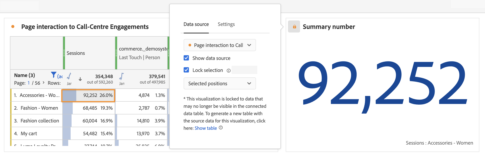

# 데이터 소스 관리 {#manage-data-sources}

<!-- markdownlint-disable MD034 -->

>[!CONTEXTUALHELP]
>id="workspace_freeformtable_lockselection"
>title="선택 사항 잠금"
>abstract="이 설정을 활성화하여 시각화를 데이터 소스의 선택한 위치 또는 선택한 항목에 잠급니다."

<!-- markdownlint-enable MD034 -->

<!-- markdownlint-disable MD034 -->

>[!CONTEXTUALHELP]
>id="workspace_freeformtable_lockselection_showtable"
>title="테이블 표시"
>abstract="**[!UICONTROL 테이블 표시]**&#x200B;를 선택하면 현재 시각화에 대한 새 데이터 소스를 생성하여 원래 데이터 소스와 분리시킬 수 있습니다."

<!-- markdownlint-enable MD034 -->

<!-- markdownlint-disable MD034 -->

>[!CONTEXTUALHELP]
>id="workspace_freeformtable_showtable"
>title="테이블 표시"
>abstract="**[!UICONTROL 테이블 표시]**&#x200B;를 선택하여 원본 데이터 원본과 별도로 현재 시각화에 대한 새 데이터 원본을 생성합니다."

<!-- markdownlint-enable MD034 -->

시각화를 동기화하면 시각화에 해당하는 데이터 테이블 또는 데이터 소스를 제어할 수 있습니다.

>[!TIP]
>
>시각화 제목 옆의  색상을 통해 연관된 시각화를 구분할 수 있습니다. 색상이 일치하면 시각화가 동일한 데이터 소스를 기준으로 한다는 것을 의미합니다.
>

데이터 소스를 표시하거나 숨길 수 있습니다. 선택한 위치나 항목에 선택 항목을 잠글 수도 있습니다. 이러한 설정은 새 데이터가 유입될 때 시각화가 변경되는 (또는 변경되지 않는) 방식을 결정합니다.

| 옵션 | 설명 |
|--- |--- |
| **[!UICONTROL 데이터 소스]** | 드롭다운 메뉴에서 시각화의 기반이 되는 데이터 소스를 선택합니다. |
| **[!UICONTROL 연결된 시각화]** | 연결된 모든 시각화를 나열합니다. 데이터 소스(자유 형식 테이블)에 적용됩니다. |
| **[!UICONTROL 데이터 소스 표시]** | 시각화에 해당하는 데이터 소스(자유 형식 테이블)를 표시하거나 숨길 수 있습니다. |
| **[!UICONTROL 선택 사항 잠금]** | 이 옵션을 선택하면 해당 데이터 테이블에서 현재 선택된 데이터로 시각화 를 잠급니다. 활성화되면 다음 중에서 선택합니다.  <ul><li>**선택한 위치**: 시각화가 해당 데이터 테이블에서 선택한 **위치**&#x200B;에 잠깁니다. 이 위치는 특정 항목이 위치(예: 정렬 또는 필터링)에서 변경되더라도 계속 시각화됩니다. 예를 들어 데이터 소스에 나열된 상위 5개 캠페인 이름을 이 시각화에 항상 표시하려면 이 옵션을 선택합니다. 어떤 캠페인 이름이 표시되는지는 중요하지 않습니다.</li> <li>**선택한 항목**: 시각화가 해당 데이터 테이블에서 현재 선택한 특정 **항목**&#x200B;에 잠깁니다. 이러한 항목은 테이블의 항목 간에 순위가 바뀌는 경우에도 계속 시각화됩니다. 예를 들어 데이터 소스에 나열된 동일한 5개의 특정 캠페인 이름을 이 시각화에 항상 표시하려면 이 옵션을 선택합니다. 캠페인 이름의 순위가 어떻게 되는지는 중요하지 않습니다.</li></ul>연결된 데이터 테이블에 시각화가 더 이상 표시되지 않는 데이터로 잠긴 경우 새 테이블을 생성할 수 있습니다. **[!UICONTROL 테이블 표시]**&#x200B;를 선택하면 현재 시각화에 대한 새 데이터 소스를 생성하여 원래 데이터 소스와 분리시킬 수 있습니다. |
