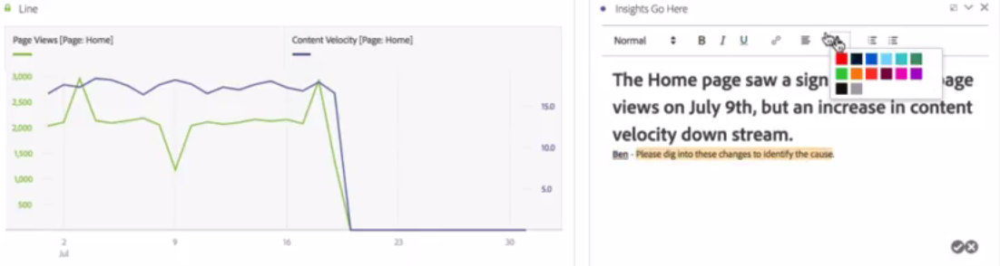

# 텍스트

>[!NOTE]
>
>Customer Journey Analytics의 Analysis Workspace 설명서를 보고 있습니다. 이 기능은 기존 Adobe Analytics의 [Analysis Workspace과 약간 다릅니다](https://docs.adobe.com/content/help/ko-KR/analytics/analyze/analysis-workspace/home.html). [추가 정보...](/help/getting-started/cja-aa.md)

사용자 정의 텍스트를 Workspace에 추가할 수 있게 합니다.

글꼴 설정(굵게, 기울임꼴 등)을 변경할 수 있습니다. 그리고 텍스트 상자 시각화 및 패널/시각화 설명 내에 하이퍼링크를 추가할 수 있습니다.

## 글꼴 설정 변경 {#section_32727EE03FD04A8EB1D1B387DCAF6537}

텍스트 시각화를 패널로 드래그하고 텍스트를 추가한 후에 제목 수준을 추가하고, 텍스트를 굵게/기울임꼴/밑줄을 적용해 변경하고, 텍스트 색상을 변경하는 등으로 텍스트 서식을 지정할 수 있습니다.

## 하이퍼링크 추가 {#section_D55B857188A74A06B49006DF3511DC7C}

텍스트를 강조 표시하고 서식 메뉴의 하이퍼링크 아이콘을 클릭하여 하이퍼링크를 추가하십시오.
