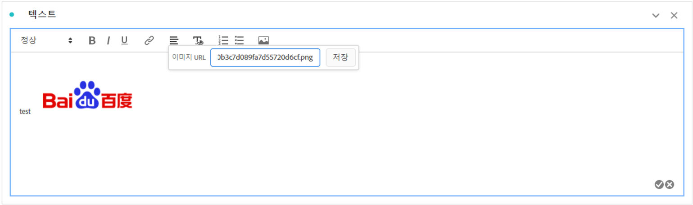

# 텍스트 {#text-visualization}

<!-- markdownlint-disable MD034 -->

>[!CONTEXTUALHELP]
>id="workspace_text_button"
>title="텍스트"
>abstract="사용자 정의 서식 있는 텍스트 시각화를 프로젝트에 추가합니다."

<!-- markdownlint-enable MD034 -->

Workspace 프로젝트에 사용자 정의 서식 있는 텍스트를 추가하려면  **[!UICONTROL 텍스트]** 시각화를 사용하거나 시각화 및 패널에 대한 설명을 사용할 수 있습니다.

## 사용

다음과 같은 방법으로 텍스트 시각화를 사용할 수 있습니다.

1.  **[!UICONTROL 텍스트]** 시각화를 추가합니다. [패널에 시각화 추가](freeform-analysis-visualizations.md#add-visualizations-to-a-panel)를 참조하십시오.

1. 패널 또는 시각화의 컨텍스트 메뉴에서 **[!UICONTROL 설명 편집]**&#x200B;을 선택합니다.

   설명 편집을 마쳤으면 을(를) 선택하고, 취소할 을(를) 선택합니다.

텍스트 서식을 변경하고 하이퍼링크를 추가하고 이미지를 추가할 수 있습니다.

## 텍스트 서식 조정 {#format}

텍스트 상자 또는 설명을 편집할 때 선택한 텍스트의 글꼴 크기 (제목 수준), 색상, 스타일 (굵게, 기울임 꼴, 밑줄) 및 정렬을 조정할 수 있습니다. 글머리 기호 및 번호 매기기 목록을 추가할 수도 있습니다.

## 하이퍼링크 추가 {#hyperlinks}

하이퍼링크를 추가하려면 텍스트를 강조 표시하고 메뉴에서 를 선택하십시오. 하이퍼링크를 사용하여 프로젝트 수신자에게 추가 지원을 제공할 수 있습니다. 하이퍼링크는 외부 웹 사이트, 문서 페이지, [Workspace 프로젝트, 패널 또는 시각화](/help/analysis-workspace/curate-share/shareable-links.md) 등에 연결할 수 있습니다.

링크 아이콘이 강조 표시된 

## 이미지 추가 {#images}

프로젝트에 이미지를 추가하려면 메뉴에서 를 선택하고 공개 이미지 URL을 삽입하십시오. 이미지 URL은 공개적으로 액세스할 수 있어야 하며 `https`로 시작하고 `.png`, `.jpeg`, `.jpg` 또는 `.gif` 형식이어야 합니다. 정적 및 애니메이션 이미지가 지원됩니다.

