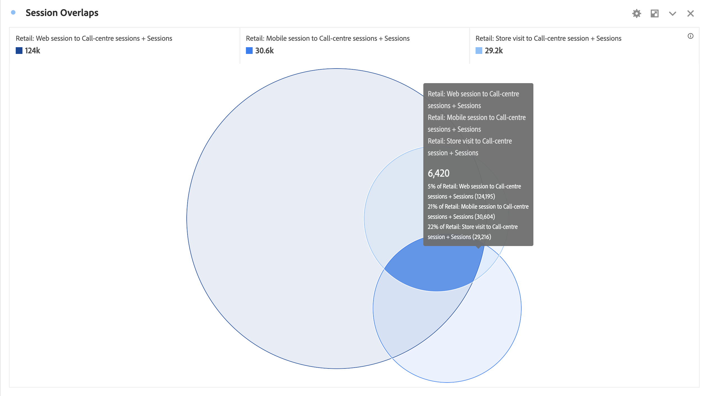

# 벤 {#venn}

<!-- markdownlint-disable MD034 -->

>[!CONTEXTUALHELP]
>id="workspace_venn_button"
>title="벤"
>abstract="두 요소와 중복 크기를 시각적으로 빠르게 비교하는 벤 차트 시각화를 만듭니다."

<!-- markdownlint-enable MD034 -->

>[!BEGINSHADEBOX]

_이 문서에서는 벤 시각화에 대해 설명합니다_  _**Customer Journey Analytics**._ _이 문서의 _**Adobe Analytics**버전에 대한 [벤](https://experienceleague.adobe.com/en/docs/analytics/analyze/analysis-workspace/visualizations/venn)을 참조하세요.__

>[!ENDSHADEBOX]

 **[!UICONTROL Venn]** 시각화를 사용하면 최대 3개의 필터와 지표(구성 요소 패널에서)를 드래그하여 벤 다이어그램을 작성할 수 있습니다.

필터 위로 마우스를 가져가 백분율 등을 보다 자세히 확인할 수 있습니다.

[!UICONTROL 벤] 시각화에서 [!UICONTROL 자유 형식 테이블]을(를) 생성하려면 **[!UICONTROL 벤]** 헤더 옆의 색상 을(를) 선택하고 **[!UICONTROL 데이터 원본 표시]**&#x200B;를 선택하십시오. [!UICONTROL 벤] 시각화를 만드는 데 사용된 데이터가 포함된 **[!UICONTROL 벤 데이터]** 자유 형식 테이블이 표시됩니다.

<!--
To normalize the Venn diagram (take the size out of it), go select  and select **[!UICONTROL Normalization]**.

-->

>[!BEGINSHADEBOX]

데모 비디오는  [벤 시각화](https://video.tv.adobe.com/v/335798/?quality=12&learn=on){target="_blank"}를 참조하십시오.

>[!ENDSHADEBOX]

>[!MORELIKETHIS]
>
>[패널에 시각화 추가](/help/analysis-workspace/visualizations/freeform-analysis-visualizations.md#add-visualizations-to-a-panel)
>[시각화 설정](/help/analysis-workspace/visualizations/freeform-analysis-visualizations.md#settings)
>[시각화 컨텍스트 메뉴](/help/analysis-workspace/visualizations/freeform-analysis-visualizations.md#context-menu)
>

