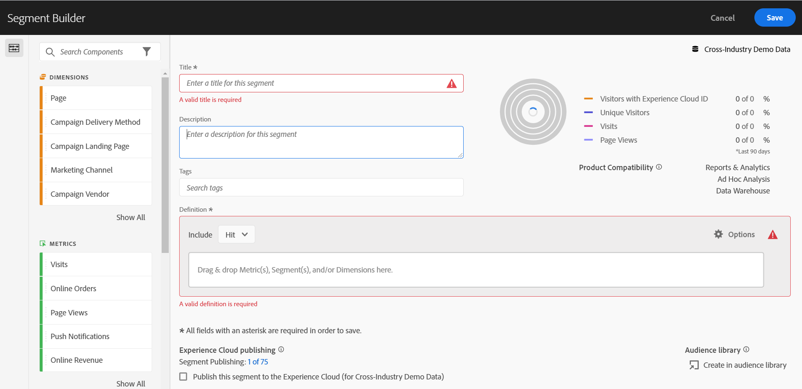

# Analysis Workspace 액세스 가능 여부

Customer Journey Analytics의 고급 분석 툴인 [!UICONTROL Analysis Workspace]의 접근성 지원에 대해 알아보십시오.

접근성은 제품이 시각, 청각, 인지, 모터 및 기타 장애가 있는 사람들에게 유용하게 사용되는 것을 말합니다. 소프트웨어 제품의 접근성 기능에는 다음이 포함됩니다.

* 화면 판독기 지원
* 그래픽에 상응하는 텍스트,
* 키보드 단축키,
* 디스플레이 색상을 고대비로 변경
* 등

[!UICONTROL Analysis Workspace]는 다음과 같은 사용 지원 도구를 제공합니다.

## 키보드 탐색

[!UICONTROL Analysis Workspace]에서 탐색은 위쪽 아래쪽, 왼쪽 오른쪽으로 작동합니다. 다음 탐색 요소는 접근성을 용이하게 합니다.

* **[!UICONTROL 탭]** 키를 통해 작업 영역 내의 더 큰 섹션 사이를 이동하는 랜드마크 단축키를 사용할 수 있습니다. 왼쪽 패널에서 **[!UICONTROL 탭]**&#x200B;을 사용하면 드래그 가능한 하나의 옵션에서 다음 옵션으로 이동할 수도 있습니다
* ◀︎ 및 ▶︎는 **[!UICONTROL 탭]** 키가 요소를 강조 표시한 후 개별 요소 사이를 이동합니다.
* **[!UICONTROL F6]** 키는 프로젝트의 첫 번째 패널로 이동하고 해당 패널 내의 시각화 간에 이동합니다. 그런 다음 프로젝트의 다음 패널로 이동하여 반복합니다.
* 보이는 키보드 사용자가 현재 포커스가 있는 UI 요소를 명확하게 나타낼 수 있도록 포커스 표시기가 적용됩니다. 표시기에는 포커스가 있는 패널에 파란색 테두리가 표시됩니다. 최근 선택한 기능과 기능 내 선택 항목에 회색 배경이 표시됩니다. 예시에서 최근 [!UICONTROL 구성 요소] 및 페이지 차원이 선택되었습니다.

  

### 메뉴 모음의 키보드 탐색

1. 메뉴 모음에 도달할 때까지 Tab을 누릅니다.
1. 화살표 키를 사용하여 메뉴와 메뉴 항목 사이를 탐색합니다.
1. **[!UICONTROL Enter]** 키를 눌러 메뉴를 열거나 메뉴 항목을 선택합니다.
1. **[!UICONTROL Esc]** 키를 사용하여 메뉴를 닫습니다.

### 드래그 앤 드롭 상호 작용을 위한 키보드 탐색

[!UICONTROL Analysis Workspace]는 드래그 앤 드롭 사용자 인터페이스입니다. 그러나 사용자는 키보드를 사용하여 구성 요소를 추가할 수 있습니다.

1. 왼쪽 패널에 있는 구성 요소에 탭으로 이동합니다.
1. **[!UICONTROL Enter]** 키를 눌러 선택합니다.
1. 화살표 키를 사용하여 구성 요소를 놓을 영역으로 이동합니다.
1. **[!UICONTROL Enter]** 키를 눌러 구성 요소를 배치합니다.

### 키보드 단축키 (핫키)

[!UICONTROL Analysis Workspace]에서는 보다 매끄러운 워크플로를 위해 [키보드 단축키(핫키)](/help/analysis-workspace/build-workspace-project/fa-shortcut-keys.md)의 다양한 집합을 제공합니다.

## 화면 판독기 및 화면 돋보기 지원

화면 판독기는 컴퓨터 화면에 표시되는 텍스트를 읽습니다. 또한 애플리케이션의 버튼 레이블이나 이미지 설명과 같은 텍스트가 아닌 정보를 읽습니다.

## 색상 팔레트 및 대비

[!UICONTROL Analysis Workspace]는 색상 대비 요구 사항을 포함하여 WCAG 2.1 AA 적합성을 준수하기 위해 최선을 다합니다.

또한 **[!UICONTROL 프로젝트]** > **[!UICONTROL 프로젝트 설정]** > [프로젝트 색상 팔레트](/help/analysis-workspace/build-workspace-project/color-palettes.md) 아래에서 프로젝트에 대해 원하는 색상 팔레트를 직접 설정할 수도 있습니다.

## 필수 유효성 검사

구성 요소나 시각화 또는 패널을 작성할 때 저장 시 필수 필드의 유효성이 검사됩니다. 필수 필드가 유효성 검사를 통과하지 못하면 오류 아이콘과 함께 빨간색으로 표시됩니다. 수정해야 하는 문제에 대한 서면 설명이 표시됩니다.

## 운영 체제 접근성 기능 지원

Analysis Workspace는 고대비 모드, 고정 키 및 느린 키/필터 키와 같은 기본 제공되는 Windows 및 macOS 접근성 기능을 지원합니다. 또한 운영 체제에 대한 사용자 인터페이스에 대한 정보를 제공하여 macOS용 VoiceOver 및 Windows용 NVDA와 같은 보조 기술과 상호 작용할 수 있도록 합니다.
