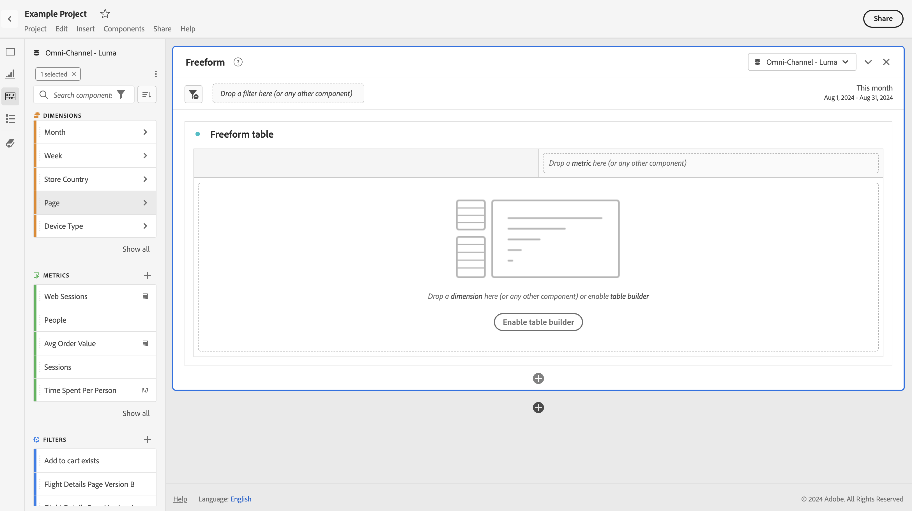

# Analysis Workspace 액세스 가능 여부

Customer Journey Analytics의 고급 분석 툴인 [!UICONTROL Analysis Workspace]의 접근성 지원에 대해 알아보십시오.

접근성은 제품이 시각, 청각, 인지, 모터 및 기타 장애가 있는 사람들에게 유용하게 사용되는 것을 말합니다. 소프트웨어 제품에 대한 접근성 기능의 예는 다음과 같습니다.

* 화면 판독기 지원,
* 그래픽에 해당하는 텍스트,
* 키보드 단축키,
* 디스플레이 색상을 고대비로 변경,
* 등.

[!UICONTROL Analysis Workspace]는 다음과 같은 사용 지원 도구를 제공합니다.

## 키보드 탐색

[!UICONTROL Analysis Workspace]에서 탐색은 위에서 아래로, 왼쪽에서 오른쪽으로 작동합니다. 다음 탐색 요소는 접근성을 용이하게 합니다.

* **[!UICONTROL Tab]** 키를 사용하면 Workspace 내의 더 큰 섹션 사이를 이동하는 중요한 단축키를 사용할 수 있습니다. 왼쪽 패널에서 **[!UICONTROL Tab]**&#x200B;을(를) 사용하면 끌기 가능한 한 옵션에서 다음 옵션으로 이동할 수도 있습니다.
* {◀︎}Tab ]**키로 요소를 강조 표시한 후 개별 요소 간에 및 ▶︎이 이동합니다.**[!UICONTROL 
* **[!UICONTROL F6]** 키는 프로젝트의 첫 번째 패널로 이동하고 해당 패널 내의 시각화 간에 이동합니다. 그런 다음 프로젝트의 다음 패널로 이동하여 반복합니다.
* 포커스 표시기가 적용되어 시력이 정상인 키보드 사용자는 현재 포커스가 있는 UI 요소를 명확하게 나타낼 수 있습니다. 표시기는 포커스가 있는 패널의 파란색 테두리입니다. 최근에 선택한 기능과 기능 내에서 선택한 항목에 대한 회색 배경입니다. 이 예제에서는 [!UICONTROL 구성 요소] 및 페이지 차원을 최근에 선택했습니다.

  

### 메뉴 모음의 키보드 탐색

1. 메뉴 모음에 도달할 때까지 Tab을 누릅니다.
1. 화살표 키를 사용하여 메뉴와 메뉴 항목 사이를 이동합니다.
1. 메뉴를 열거나 메뉴 항목을 선택하려면 **[!UICONTROL Enter]**&#x200B;를 누르십시오.
1. 메뉴를 닫으려면 **[!UICONTROL Esc]**&#x200B;을 사용하십시오.

### 끌어다 놓기 상호 작용을 위한 키보드 탐색

[!UICONTROL Analysis Workspace]은(는) 드래그 앤 드롭 사용자 인터페이스입니다. 그러나 사용자는 키보드를 사용하여 구성 요소를 추가할 수 있습니다.

1. 왼쪽 패널의 구성 요소에 탭으로 이동합니다.
1. 선택하려면 **[!UICONTROL Enter]**&#x200B;를 누르십시오.
1. 화살표 키를 사용하여 구성 요소를 놓을 영역으로 이동합니다.
1. 구성 요소를 배치하려면 **[!UICONTROL Enter]**&#x200B;를 누르십시오.

### 키보드 단축키(핫키)

[!UICONTROL Analysis Workspace]에서는 보다 매끄러운 워크플로를 위해 다양한 [키보드 단축키](https://experienceleague.adobe.com/en/docs/analytics/analyze/analysis-workspace/build-workspace-project/fa-shortcut-keys) 집합을 제공합니다.

## 화면 판독기 및 화면 돋보기 지원

화면 판독기는 컴퓨터 화면에 표시되는 텍스트를 읽습니다. 또한 애플리케이션의 버튼 레이블이나 이미지 설명과 같은 텍스트가 아닌 정보를 읽습니다.

## 색상 팔레트 및 대비

[!UICONTROL Analysis Workspace]는 색상 대비 요구 사항을 포함하여 WCAG 2.1 AA 적합성을 준수하기 위해 최선을 다합니다.

또한 **[!UICONTROL 프로젝트]** > **[!UICONTROL 프로젝트 설정]** > [프로젝트 색상 팔레트](https://experienceleague.adobe.com/en/docs/analytics/analyze/analysis-workspace/build-workspace-project/color-palettes) 아래에서 프로젝트에 대해 원하는 색상 팔레트를 직접 설정할 수도 있습니다.

## 필수 유효성 검사

구성 요소, 시각화 또는 패널을 빌드할 때 저장 시 필수 필드의 유효성이 검사됩니다. 필수 필드가 유효성 검사를 통과하지 못하면 오류 아이콘과 함께 빨간색으로 표시됩니다. 수정해야 할 사항을 설명하는 서면 설명입니다.

## 운영 체제 접근성 기능 지원

Analysis Workspace은 고대비 모드, 고정 키 및 느린 키/필터 키와 같은 내장된 Windows 및 macOS 접근성 기능을 지원합니다. 또한 운영 체제에 대한 사용자 인터페이스에 대한 정보를 제공하여 macOS용 VoiceOver 및 Windows용 NVDA와 같은 보조 기술과 상호 작용할 수 있도록 합니다.
