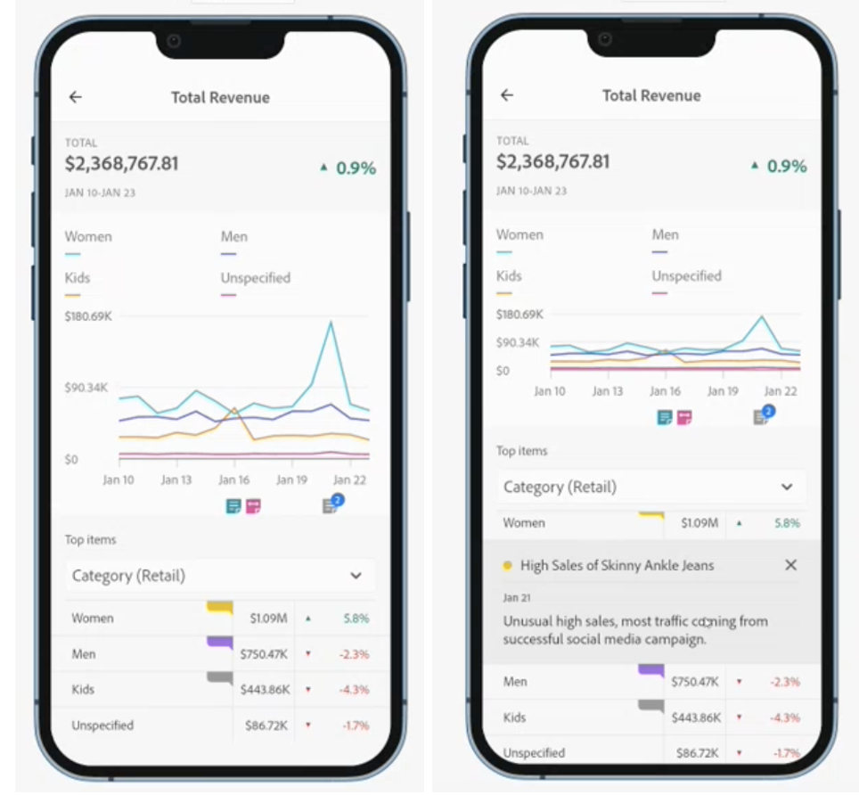

# 모바일 스코어카드에서 주석 공유

Workspace에서 생성된 주석을 모바일 스코어카드에 표시할 수 있습니다. 이를 통해 스코어카드 내에서 바로 조직 및 캠페인에 컨텍스트 기반의 데이터 뉘앙스와 통찰력을 공유할 수 있습니다.

모바일 스코어카드의 주석은 일부 추가 기능이 있는 작업 공간 주석과 유사하게 작동합니다. 예를 들어 작업 공간에서 날짜 범위에 대한 테이블 수준 주석을 만들 수 있습니다. 모바일 스코어카드에서 카테고리 수준 주석을 볼 수 있습니다. 이렇게 하면 모바일 스코어카드 사용자에 대한 추가 컨텍스트를 제공합니다.
__예를 추가합니다. 차이점에 대해 설명하는 추가 정보

?? 모바일에는 어떤 추가 기능이 있습니까?

## 모바일 스코어카드에 주석 추가

모바일 스코어카드에 표시되는 주석은 Workspace 주석 생성 방법을 사용하여 Workspace에서 생성됩니다. 주석 만들기에 대한 내용은 [주석 만들기](create-annotations.md).

1. 주석 켜기. 주석을 켜려면 [주석 켜기 또는 끄기](https://experienceleague.adobe.com/docs/analytics-platform/using/cja-components/annotations/overview.html?lang=en#turn-annotations-on-or-off).

1. 주석을 만들어 _global 프로젝트에 지정합니다. 작업 공간에서 주석을 작성하려면 다음을 참조하십시오 [주석 만들기](create-annotations.md).

1. 선택 **주석 표시** 모바일 스코어카드에 주석을 표시할 수 있습니다.

주석 표시를 선택했는지 확인하려면 **프로젝트** > **프로젝트 정보 및 설정**.

## 모바일 스코어카드에서 주석 보기

Workspace에서 빌더에서 주석을 확인할 수 있습니다. 미리 보기 모드를 사용하여 주석이 있는 모바일 스코어카드를 볼 수도 있습니다.

모바일 장치에서 주석을 보려면 모바일 스코어카드에서 주석 아이콘을 탭합니다. 추가 주석을 보려면 왼쪽 또는 오른쪽으로 밀십시오. 이렇게 하면 모든 주석을 빠르게 볼 수 있습니다.

__도넛을 볼 때 오른쪽 아래 모서리에 지표에 적용된 주석 요약이 있습니다.

## 모바일 스코어카드 주석 고려 사항

* 주석이 카테고리에 적용되어 사용자가 해당 카테고리 보기에서 전환하면 주석이 사라집니다. 주석은 연관된 카테고리에만 표시됩니다.

* 주석은 기본적으로 꺼져 있습니다.

## 주석 색상

주석을 만들 때 스코어카드에 표시되는 주석에 특정 색상을 지정합니다. 회색으로 표시되는 주석은 여러 주석이 동일한 카테고리에 지정되었음을 나타냅니다. 그렇지 않으면 작업 공간에서 설정된 색상으로 주석이 나타납니다.
