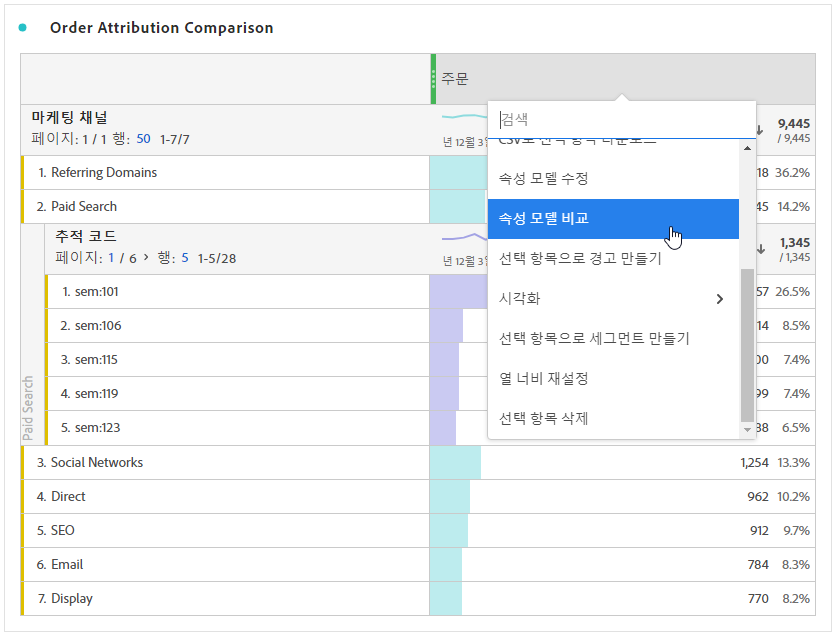

# 지표

지표를 사용하면 Analysis Workspace에서 데이터 포인트를 수량화할 수 있습니다. 이들은 일반적으로 시각화에서 열로 사용되며 차원에 연결됩니다.

## 지표 유형

Adobe는 Analysis Workspace에서 사용할 수 있는 여러 유형의 지표를 제공합니다.

* **표준 지표**: 표준 지표의 예로는 사람, 세션, 이벤트가 있습니다.

* **계산된 지표** : 표준 지표, 정적 숫자 또는 알고리즘 함수를 기반으로 하는 사용자 정의 지표입니다.

* **계산된 지표 템플릿**   : 계산된 지표와 유사하게 동작하는 Adobe 정의 지표입니다. Workspace 프로젝트에서 그대로 사용하거나 복사본을 저장하여 논리를 사용자 정의할 수 있습니다.

지표가 승인되었는지 여부를 확인할 수 있습니다   아님 말거나 지표에 대한 자세한 내용을 보려면 지표 위로 마우스를 가져간 다음 을 선택합니다 .

지표는 Analysis Workspace 내에서 유연하게 사용할 수 있습니다. 지표를 빈 자유 형식 테이블로 드래그하면 해당 지표가 프로젝트의 날짜 기간 동안 추세를 보여 줍니다. 차원이 있을 때 지표를 드래그하여 각 차원 항목과 비교한 지표를 볼 수도 있습니다. 기존 지표 헤더 위로 지표를 드래그하면 지표가 대체되고 헤더 옆으로 지표를 드래그하면 두 지표를 나란히 볼 수 있습니다.

## 계산된 지표

계산된 지표를 사용하면 간단한 연산자 또는 통계 함수를 사용하여 지표가 서로 관련되는 방식에 대해 쉽게 살펴볼 수 있습니다. 다음 몇 가지 방법으로 계산된 지표를 만들 수 있습니다.

다음을 선택할 수 있습니다. **[!UICONTROL 구성 요소]** > **[!UICONTROL 계산된 지표]**. 이렇게 하면 다음 위치로 이동합니다. [계산된 지표 빌더](/help/components/calc-metrics/calc-metr-overview.md): 기존 지표에서 사용자 지정 지표를 작성할 수 있습니다.

계산된 지표를 더 빠르고 쉽게 생성할 수 있도록 **[!UICONTROL 선택 항목으로 지표 만들기]**&#x200B;가 자유 형식 테이블의 열 마우스 오른쪽 버튼 클릭 메뉴에 추가되었습니다. 이 선택 사항은 머리글 열 셀을 하나 이상 선택하면 표시됩니다.

[계산된 지표: 구현 불가 지표](https://experienceleague.adobe.com/docs/analytics-learn/tutorials/components/calculated-metrics/calculated-metrics-implementationless-metrics.html?lang=ko-KR) (3:42)

## 다양한 속성 모델과 지표 비교

한 가지 기여도 분석 모델을 다른 모델과 신속하고 간편하게 비교하려면 지표를 마우스 오른쪽 단추로 클릭하고 를 선택하십시오 **[!UICONTROL 속성 모델 비교]**:

이 단축키를 사용하면 지표를 드래그하여 두 번 구성하지 않고 한 가지 속성 모델을 다른 모델과 신속하고 간편하게 비교할 수 있습니다.
