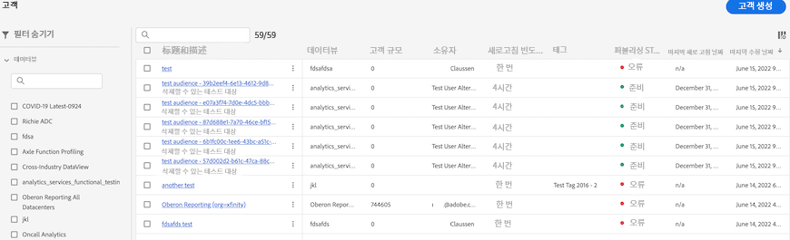

# Customer Journey Analytics에서 생성된 대상자 관리

이전에 생성된 대상자를 관리하면 다음과 같은 작업을 수행할 수 있습니다.:

* 자동 대상자 새로 고침/업데이트를 **예약하거나 예약을 취소**&#x200B;합니다. 일정의 최대 만료 기간은 1년입니다.
* 곧 만료될 예정인 **대상자의 새로 고침 일정을 갱신**&#x200B;합니다. 만료 예정인 대상자는 만료될 예정인 예약된 보고서와 유사하게 처리됩니다. 관리자는 일정이 만료되기 한 달 전에 이메일을 수신합니다.
* **새로 고침 간격** 및 **대상자가 마지막으로 업데이트된 시간** 보기
* 에 대한 통찰력 확보 **대상자를 생성하는 데 걸린 시간** 활성화 목적을 위해 실시간 고객 프로필에 대상을 표시하는 데 걸린 시간 및 Customer Journey Analytics에서.
* Customer Journey Analytics의 대상이 다음과 같은지 확인합니다. **실시간 고객 프로필에서 적극적으로 사용 중** 또는 (이상적으로) Customer Journey Analytics이 만든 대상을 소비하는 모든 Experience Platform 애플리케이션입니다.

## 관리 UI

| UI 설정 | 정의 |
| --- | --- |
| 필터 숨기기/표시 | 왼쪽 레일에서 다음 필터를 표시하거나 숨길 수 있습니다. <ul><li>[!UICONTROL 데이터 보기]</li><li>[!UICONTROL 소유자]</li><li>[!UICONTROL 새로 고침 빈도]</li><li>[!UICONTROL 태그]</li></ul> |
| [!UICONTROL 제목 및 설명] | 생성 시 대상자에게 제공된 제목과 설명입니다. |
| [!UICONTROL 데이터 보기] | 이 대상자가 생성된 데이터 보기입니다. |
| [!UICONTROL 대상자 크기] | 이 대상자에 있는 총 인원수입니다. |
| [!UICONTROL 소유자] | 대상자의 소유자 - 대상자를 만든 사람입니다. |
| [!UICONTROL 새로 고침 빈도] | 대상자를 만들 때 구성된 새로 고침 간격입니다. |
| [!UICONTROL 태그] | 이 대상자에 적용되는 태그입니다. |
| [!UICONTROL 퍼블리싱 상태] | [!UICONTROL 준비], [!UICONTROL 진행 중] 또는 [!UICONTROL 오류]를 표시할 수 있습니다. |
| [!UICONTROL  마지막으로 새로 고침] | 대상자를 마지막으로 새로 고친 때입니다. |
| [!UICONTROL 마지막 수정일] | 대상자를 마지막으로 편집 또는 수정한 때입니다. |

{style="table-layout:auto"}
