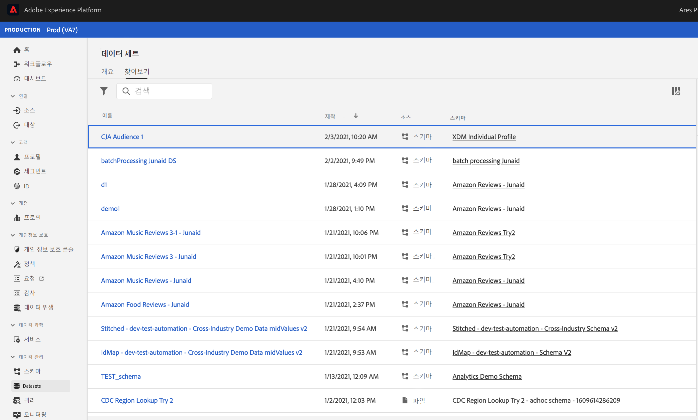

# Customer Journey Analytics에서 만든 대상 관리

>[!NOTE]
>
>이 기능은 현재 [제한된 테스트](/help/release-notes/releases.md).

이전에 만든 대상을 관리할 수 있습니다.

* **예약 또는 예약 취소** 자동 대상 새로 고침/업데이트. 예약의 최대 만료 기간은 1년입니다.
* **대상자 새로 고침 일정 갱신** 만료 예정인 경우. 만료 대상은 만료 예약된 보고서와 유사하게 처리됩니다. 관리자가 일정이 만료되기 한 달 전에 이메일을 받게 됩니다.
* 보기 **마지막으로 대상이 업데이트됨**
* 에 대한 통찰력 얻기 **청중을 만드는 데 걸린 시간** Customer Journey Analytics(CJA)에서 및 활성화를 위해 실시간 고객 프로필에 대상자를 표시하는 데 걸린 시간입니다.
* CJA의 대상자를 **실시간 고객 프로필에서 적극적으로 사용** 또는 (이상적으로) CJA에서 만든 대상을 사용하는 모든 Experience Platform 애플리케이션입니다.

## 관리 UI

스크린샷

| UI 설정 | 정의 |
| --- | --- |
| 필터 숨기기/표시 | 왼쪽 레일에서 다음 필터를 표시하거나 숨길 수 있습니다. <ul><li>데이터 보기</li><li>소유자</li><li>새로 고침 빈도</li><li>태그</li></ul> |
| 제목 및 설명 |  |
| Data View |
| 대상 크기 |  |
| 소유자 |  |
| 새로 고침 빈도 |  |
| 태그 |  |
| 마지막으로 새로 고친 날짜 |  |
| 마지막 수정일 |  |

{style=&quot;table-layout:auto&quot;}

## Experience Platform에서 CJA 대상 보기 및 사용

다음 위치로 이동하여 Platform에서 CJA 대상을 볼 수 있습니다 [!UICONTROL 세그먼트] > [!UICONTROL 세그먼트 만들기] > [!UICONTROL 대상] 탭 > [!UICONTROL CJA 대상].

CJA 대상을 AEP 세그먼트의 세그먼트 정의로 드래그할 수 있습니다.

이 대상을 AEP Data Lake로 내보내도록 선택하는 경우, XDM 개별 프로필 스키마 클래스를 준수하는 데이터 세트로 표시됩니다.

