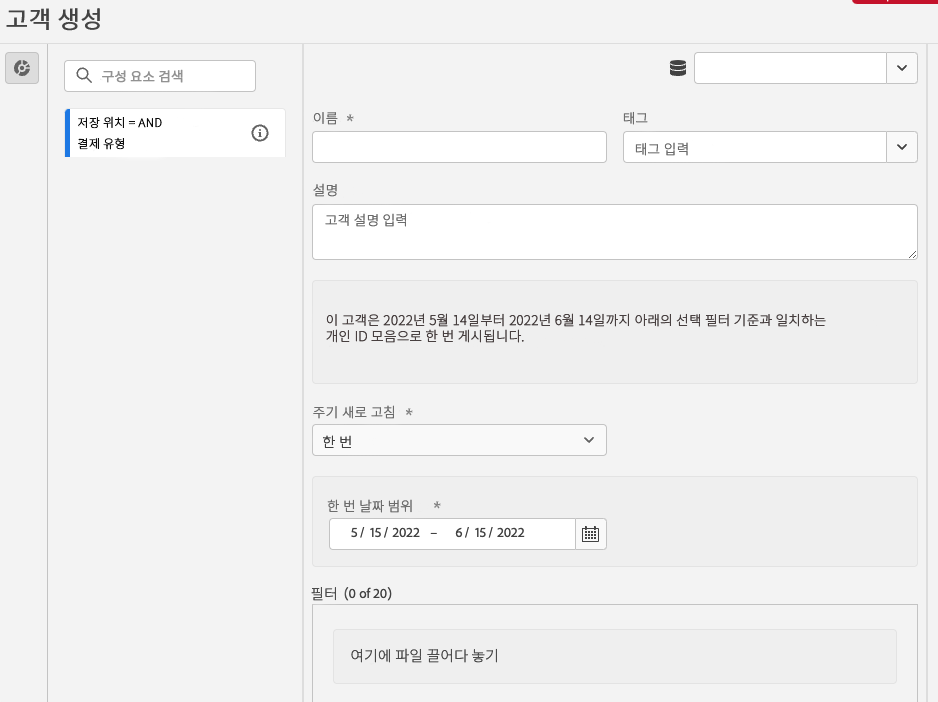

# 대상자 생성 및 게시 {#create-and-publish-audiences}

<!-- markdownlint-disable MD034 -->

>[!CONTEXTUALHELP]
>id="components_audiences_refreshfrequency"
>title="새로 고침 빈도"
>abstract="대상자의 멤버십을 재평가할 빈도를 확인합니다. 일회성 대상자는 한 번만 평가됩니다."

<!-- markdownlint-enable MD034 -->

<!-- markdownlint-disable MD034 -->

>[!CONTEXTUALHELP]
>id="components_audiences_audiencelimit"
>title="대상자 제한"
>abstract="새로 고치는 대상자는 새로 고침 빈도에 따라 제한됩니다."

<!-- markdownlint-enable MD034 -->

<!-- markdownlint-disable MD034 -->

>[!CONTEXTUALHELP]
>id="component_audiences_refreshlookbackwindow"
>title="전환 확인 기간 새로 고침"
>abstract="대상자 평가의 시점인 오늘부터 전환 확인 일수를 정의하십시오."

<!-- markdownlint-enable MD034 -->

<!-- markdownlint-disable MD034 -->

>[!CONTEXTUALHELP]
>id="component_audiences_audiencesizelimit"
>title="대상자 크기 제한"
>abstract="대상자는 멤버 수 2천만 명을 초과할 수 없습니다."

<!-- markdownlint-enable MD034 -->

<!-- markdownlint-disable MD034 -->

>[!CONTEXTUALHELP]
>id="component_audiences_namespacesincluded"
>title="네임스페이스 포함됨"
>abstract="이 대상자의 ID는 아래 네임스페이스로 구성됩니다."

<!-- markdownlint-enable MD034 -->

이 항목에서는 고객 타겟팅 및 맞춤화를 위해 Customer Journey Analytics에서 식별된 대상을 Adobe Experience Platform의 [실시간 고객 프로필](https://experienceleague.adobe.com/ko/docs/experience-platform/profile/home)을(를) 만들어 게시하는 방법에 대해 설명합니다.

이 [개요](/help/components/audiences/audiences-overview.md)를 읽고 Customer Journey Analytics 대상의 개념을 숙지하십시오.

## 대상자 만들기 및 게시 {#create}

1. 대상을 만들고 게시하려면 다음 중 하나를 수행하십시오.

   | 만들기 방법 | 세부 사항 |
   | --- | --- |
   | **[!UICONTROL 대상]** 인터페이스 내에서. | 기본 Customer Journey Analytics 메뉴에서 **[!UICONTROL 구성 요소]** > **[!UICONTROL 대상]**&#x200B;을 선택합니다. Audiences 인터페이스가 표시됩니다. **[!UICONTROL 대상 만들기]**&#x200B;를 선택하면 [!UICONTROL 대상 빌더]가 열립니다. |
   | Analysis Workspace의 시각화에서 | Analysis Workspace의 많은 시각화를 사용하면 컨텍스트 메뉴를 사용하여 대상을 만들 수 있습니다. 예를 들어 [자유 형식 테이블](/help/analysis-workspace/visualizations/freeform-table/freeform-table.md)에 있는 항목 또는 [여정 캔버스](/help/analysis-workspace/visualizations/journey-canvas/journey-canvas.md)에 있는 노드의 컨텍스트 메뉴에서 **[!UICONTROL 대상 만들기]**&#x200B;를 선택할 수 있습니다.
이 방법을 사용하면 대상 빌더의 필터가 선택한 차원 또는 차원 항목으로 미리 채워집니다.

다음 시각화를 사용하면 마우스 오른쪽 버튼 클릭 메뉴를 사용하여 대상을 만들 수 있습니다.
<ul><li>[코호트 테이블](/help/analysis-workspace/visualizations/cohort-table/cohort-analysis.md)</li><li>[폴아웃](/help/analysis-workspace/visualizations/fallout/fallout-flow.md)</li><li>[흐름](/help/analysis-workspace/visualizations/c-flow/flow.md)</li><li>[자유 형식 테이블](/help/analysis-workspace/visualizations/freeform-table/freeform-table.md)</li><li>[여정 캔버스](/help/analysis-workspace/visualizations/journey-canvas/journey-canvas.md)</li><li>[벤](/help/analysis-workspace/visualizations/venn.md)</li></ul>
**참고:** 대상에는 계산된 지표를 포함할 수 없습니다. 계산된 지표를 포함하는 대상을 만들려고 하면 계산된 지표는 대상 정의에 포함되지 않습니다.
 |
   | 필터 생성/편집 UI에서 | **[!UICONTROL 이 필터에서 대상자 만들기]** 확인란을 선택합니다. 이 방법을 사용하면 필터가 미리 채워집니다. 자세한 내용은 [필터 만들기](/help/components/filters/create-filters.md)를 참조하십시오. |

   {style="table-layout:auto"}

1. [대상 빌더](#audience-builder)를 사용하여 대상을 작성합니다.

1. [날짜 미리 보기](#data-preview) 패널을 사용하여 데이터를 해석합니다.

1. 이 대상의 ID 샘플을 보려면 **[!UICONTROL [!UICONTROL 샘플 ID 보기]]**&#x200B;를 선택하십시오. **[!UICONTROL 샘플 ID]** 대화 상자에서  [!UICONTROL *샘플 ID 검색*]&#x200B;을 사용하여 샘플 ID를 검색할 수 있습니다.

1. 대상 구성을 다시 확인하고 **[!UICONTROL 게시]**를 선택합니다.
대상자가 게시되었다는 확인 메시지를 받게 됩니다. 이 대상자가 Experience Platform에 나타나는 데는 게시 작업이 불과 1~2분 정도 소요됩니다.

1. 동일한 메시지 내에서 **[!UICONTROL AEP의 대상자 보기]**&#x200B;를 선택하면 Adobe Experience Platform의 [세그먼트 UI](https://experienceleague.adobe.com/en/docs/experience-platform/segmentation/ui/overview)&#x200B;(으)로 이동합니다. 자세한 내용은 아래를 참조하십시오.

## 대상자 빌더

이러한 설정을 구성하여 대상자를 정의하거나 업데이트합니다.

| 설정 | 설명 |
| --- | --- |
|  | 대상자 만들기에 사용할 데이터 보기를 선택하십시오. |
| **[!UICONTROL 이름]** | 대상자의 이름입니다. 예를 들어 `Really Interested in Potential Car Buyers` |
| **[!UICONTROL 태그]** | 조직용으로 대상자에게 할당하고자 하는 모든 태그입니다. 하나 이상의 기존 태그를 선택하거나 새 태그를 입력할 수 있습니다. |
| **[!UICONTROL 설명]** | 다른 대상과 구별하기 위한 대상에 대한 설명입니다. 예를 들어 `Build an audience of really interested potential car buyers` |
| **[!UICONTROL 새로 고침 빈도]** | 대상자를 새로 고침하는 빈도입니다.
다음 중 하나를 선택할 수 있습니다. <ul><li>**[!UICONTROL 한 번]** 대상: 새로 고침이 필요하지 않은 대상(기본값)입니다. 예를 들어 이 옵션은 특정 일회성 캠페인에 유용합니다. 1회 날짜 범위를 **[!UICONTROL 지정해야 합니다]**. 을 사용하여 날짜 범위를 입력할 수 있습니다.</li><li>새로 고치는 대상입니다. 다음 옵션 중에서 선택할 수 있습니다.<ul><li>**[!UICONTROL 매 4시간]**&#x200B;초: 4시간마다 새로 고치는 대상입니다.</li><li>**[!UICONTROL 매일]**: 매일 새로 고치는 대상입니다.</li><li>**[!UICONTROL 주별]**: 주별로 새로 고치는 대상입니다.</li><li>**[!UICONTROL 월별]**: 매월 새로 고치는 대상입니다.</li></ul></li>대상을 새로 고치려면 다음을 지정해야 합니다.<ul><li>**[!UICONTROL 전환 확인 기간 새로 고침]**. 대상이 평가되는 오늘부터 전환 확인 일수를 정의합니다. 옵션에서 선택하거나 사용자 지정 시간을 정의할 수 있습니다. 최대값은 90일입니다.</li><li>**[!UICONTROL 만료 날짜]**: 대상자 새로 고침을 중지할 시기를 정의합니다. 을 사용하여 날짜를 선택할 수 있습니다. 기본 설정은 생성일로부터 1년이 되는 날입니다. 만료될 예정인 대상은 만료될 예정인 예약된 보고서와 유사하게 처리됩니다. 관리자는 대상이 만료되기 한 달 전에 이메일을 수신합니다.</li></ul> Customer Journey Analytics 권한에 따라 대상 새로 고침이 75~150개로 제한됩니다.</li></ul> |
| **[!UICONTROL 필터]** | 필터는 대상자의 주요 입력입니다. 왼쪽  **[!UICONTROL 필터]** 패널에서 필터 영역으로 필터를 하나 이상 끌어다 놓습니다.  [!UICONTROL *검색 필터*]&#x200B;를 사용하여 필터를 검색할 수 있습니다. 최대 20개의 필터를 추가할 수 있습니다. 필터는 **[!UICONTROL And]** 또는 **[!UICONTROL Or]** 연산자로 결합할 수 있습니다.
Analysis Workspace의 시각화(예: 자유 형식 테이블 또는 여정 캔버스)에서 대상을 만들면 패널 또는 열에 적용된 모든 필터가 보존됩니다. 자동으로 적용되는 필터를 제거할 수 있습니다.
 |
| **[!UICONTROL 데이터 미리 보기]** | 선택한 날짜 범위에 대한 [데이터 미리 보기](#data-preview)를 표시하거나 숨기려면 를 선택하십시오. |

## 데이터 미리보기

데이터 미리보기 패널은 다음 정보를 제공합니다.

| 요소 | 설명 |
| --- | --- |
| **[!UICONTROL 총 인원]** | 이 대상자의 총 인원수에 대한 요약 번호입니다. 최대 규모는 2000만 명이다. 대상이 2천만 명을 초과하는 경우 게시하려면 대상 크기를 줄여야 합니다. |
| **[!UICONTROL 대상자 크기 제한]** | 이 대상이 2천만 개 제한 중 얼마나 사용했는지 보여 주는 시각화. |
| **[!UICONTROL 예상 대상자 반환]** | 이 값을 사용하여 사이트, 모바일 앱 또는 기타 채널로 돌아오는 이 대상의 사용자를 재타겟팅할 수 있습니다.
돌아올 수 있는 예상 고객 수에 대해 시간대(**[!UICONTROL 다음 7일]**, **[!UICONTROL 다음 2주]** 또는 **[!UICONTROL 다음 달]**)를 선택할 수 있습니다. |
| **[!UICONTROL 예상 반환]** | 이 숫자는 선택한 기간 동안 돌아오는 예상 고객 수를 제공합니다. 이 숫자는 이 대상에 대한 이전 이탈률을 사용하여 예측됩니다. |
| **[!UICONTROL 지표 미리보기]** | 특정 지표를 선택하여 해당 지표에 대한 데이터가 정의한 대상자를 기준으로 하는 방식을 확인할 수 있습니다.  각 미리보기 지표는 대상을 기반으로 지표에 대한 합계를 표시합니다. 그리고 데이터 보기에서 정의된 대로 전체 지표 합계의 대상 기반 지표의 비율입니다. 예를 들어 381명(선택한 지표)은 대상 정의의 결과이며, 이는 데이터 보기에서 사용할 수 있는 총 사용자의 5%입니다. 데이터 보기에서 사용할 수 있는 지표를 선택할 수 있습니다. |
| **[!UICONTROL 네임스페이스 포함됨]** | 대상자의 인원과 연결된 특정 네임스페이스입니다. 예를 들어 ECID, CRM ID, 이메일 주소 등이 있습니다. |
| **[!UICONTROL 샌드박스]** | 이 대상자가 있는 [Experience Platform 샌드박스](https://experienceleague.adobe.com/ko/docs/experience-platform/sandbox/home)입니다. 이 대상자를 Platform에 게시할 때 이 샌드박스의 범위 내에서만 대상자와 작업할 수 있습니다. |

{style="table-layout:auto"}

## 대상을 만들고 게시하면 어떻게 됩니까? {#after-audience-created}

Customer Journey Analytics에서 대상을 만들고 게시하면 Experience Platform에서 해당 대상을 사용할 수 있습니다. Adobe Experience Platform 스트리밍 세그먼트는 조직이 스트리밍 세분화를 위해 설정된 경우에만 만들어집니다.

* Platform의 대상자는 Customer Journey Analytics 대상자와 동일한 이름과 설명을 공유합니다. 이 이름은 대상이 고유하도록 Customer Journey Analytics 대상 ID에 추가됩니다.
* Customer Journey Analytics에서 대상자의 이름이나 설명에 대한 모든 변경 사항은 Experience Platform에 반영됩니다.
* Customer Journey Analytics에서 대상이 삭제되면 해당 대상의 프로필 멤버십이 만료될 때까지 Experience Platform에서 해당 대상을 계속 사용할 수 있습니다. 프로필 멤버십은 일회성 대상의 경우 420일 후에 만료되고 반복 대상의 경우 16일 후에 만료됩니다.

## 지연 고려 사항 {#latency}

대상자 게시 전, 게시 중 및 게시 후 여러 지점에서 지연이 발생할 수 있습니다. 가능한 지연에 대한 개요는 다음과 같습니다.

|  | 지연 지점 | 지연 기간 |
| --- | --- | --- |
| 표시되지 않음 | Adobe Analytics-Analytics 소스 커넥터 (A4T) | 최대 30분 |
| 1 | Analytics 소스 커넥터 또는 기타 소스에서 데이터 레이크로 데이터 수집 | 최대 90분 |
| 2 | Experience Platform 데이터 레이크에서 Customer Journey Analytics으로 데이터 수집 | 최대 90분 |
| 3 | 실시간 고객 프로필에 게시하는 대상(스트리밍 세그먼트의 자동 생성 및 세그먼트의 데이터 수신 준비 허용 포함). | 몇 초 |
| 4 | 대상자에 대한 새로 고침 빈도 | <ul><li>일회성 새로 고침(지연 시간 5분 미만)</li><li>4시간마다, 매일, 매주, 매월 새로 고침(지연 시간은 새로 고침 빈도와 밀접한 관련이 있음) |
| 5 | Adobe Experience Platform에서 대상 만들기: 새 세그먼트 활성화 | 1~2시간 |

{style="table-layout:auto"}

## Experience Platform에서 Customer Journey Analytics 대상 사용 {#audiences-aep}

Customer Journey Analytics은 게시된 대상으로부터 모든 네임스페이스와 ID 조합을 가져와서 Real-Time Customer Data Platform에 스트리밍합니다. Customer Journey Analytics은 연결이 구성되었을 때 [!UICONTROL 개인 ID]&#x200B;(으)로 선택된 항목에 따라 기본 ID가 설정된 Experience Platform으로 대상을 보냅니다.

그런 다음 Real-Time Customer Data Platform은 각 네임스페이스/ID 조합을 검사하고 해당 조합이 속할 수 있는 프로필을 찾습니다. 프로필은 기본적으로 연결된 네임스페이스, ID 및 디바이스의 클러스터입니다. 프로필을 찾으면 네임스페이스와 ID를 이 프로필의 다른 ID에 세그먼트 멤버십 속성으로 추가합니다. 예를 들어 <user@adobe.com>을(를) 모든 장치 및 채널에서 타깃팅할 수 있습니다. 프로필을 찾을 수 없으면 새 프로필이 만들어집니다.

Platform에서 Customer Journey Analytics 대상자를 보려면 다음 작업을 수행하십시오.

1. 왼쪽 패널에서 **[!UICONTROL 고객]**&#x200B;을 확장한 다음 **[!UICONTROL 대상]**&#x200B;을 선택합니다. <!-- is there a folder called "Customer Journey Analytics? -->

1. **[!UICONTROL 찾아보기]** 탭을 선택합니다.

1. Customer Journey Analytics에서 게시한 대상자를 찾으려면 다음 중 하나를 수행하십시오.

   왼쪽 패널의 

   * [!UICONTROL **Customer Journey Analytics**]&#x200B;을(를) 원본으로 표시하는 대상을 보려면 테이블을 **[!UICONTROL 원본]** 열을 기준으로 정렬하십시오.

   * **[!UICONTROL 원본]**&#x200B;에서 을(를) 필터링하고 **[!UICONTROL Customer Journey Analytics]**&#x200B;을(를) 선택하십시오.

   *  검색 필드를 사용하십시오.

플랫폼에서 대상을 사용하는 방법에 대한 자세한 내용은 Experience Platform 설명서의 [세그먼트 빌더 UI 안내서](https://experienceleague.adobe.com/en/docs/experience-platform/segmentation/ui/segment-builder)에서 [대상](https://experienceleague.adobe.com/en/docs/experience-platform/segmentation/ui/segment-builder) 섹션을 참조하십시오.

## FAQ {#faq}

대상자 게시에 대해 자주 묻는 질문.

+++**사용자가 더 이상 Customer Journey Analytics의 대상이 아닌 경우 어떻게 됩니까?**

이 경우 종료 이벤트가 Customer Journey Analytics에서 Experience Platform으로 전송됩니다.

+++

+++**Customer Journey Analytics에서 대상을 삭제하면 어떻게 됩니까?**

Customer Journey Analytics 대상이 삭제되면 해당 대상은 더 이상 Experience Platform UI에 표시되지 않습니다. 단, 해당 대상과 연결된 프로필은 Experience Platform에서 삭제되지 않습니다.

+++

+++**해당 프로필이 Real-Time Customer Data Platform에 없는 경우 새 프로필이 만들어졌습니까?**

네. 그렇습니다.

+++

+++**Customer Journey Analytics에서 대상 데이터를 파이프라인 이벤트나 데이터 레이크로 이동하는 플랫 파일로 전송합니까?**

Customer Journey Analytics은 파이프라인을 통해 데이터를 Real-Time Customer Data Platform에 스트리밍하며, 이 데이터는 데이터 레이크의 시스템 데이터 세트에도 수집됩니다.

+++

+++**Customer Journey Analytics에서 어떤 ID를 전송합니까?**

[연결 설정](https://experienceleague.adobe.com/en/docs/analytics-platform/using/cja-connections/create-connection)에 지정된 ID/네임스페이스 쌍입니다. 특히, 사용자가 개인 ID로 사용할 필드를 선택하는 단계입니다.

+++

+++**기본 ID로 어떤 ID를 선택합니까?**

위를 참조하십시오. Customer Journey Analytics 사용자당 하나의 ID만 전송됩니다.

+++

+++**Real-Time Customer Data Platform에서 Customer Journey Analytics 메시지도 처리합니까? Customer Journey Analytics에서 대상 공유를 통해 프로필 ID 그래프에 ID를 추가할 수 있습니까?**

아니요. 한 사람당 하나의 ID만 전송되므로 Real-Time Customer Data Platform에서 사용할 그래프 에지가 없습니다.

+++

+++**일별, 주별, 월별 새로 고침은 언제 수행됩니까? 주별 새로 고침은 어떤 요일에 수행됩니까?**

새로 고침 시점은 원래 대상이 게시된 시점을 기준으로 하며 해당 시간(및 요일 또는 월)에 앵커합니다.

+++

+++**일별, 주별, 월별 새로 고침 시간을 구성할 수 있습니까?**

아니요. 사용자가 새로 고침 시간을 구성할 수 없습니다.

+++

## 다음 단계

* 이 대상자를 관리하려면 [관리 UI](/help/components/audiences/manage.md)로 이동하십시오.
