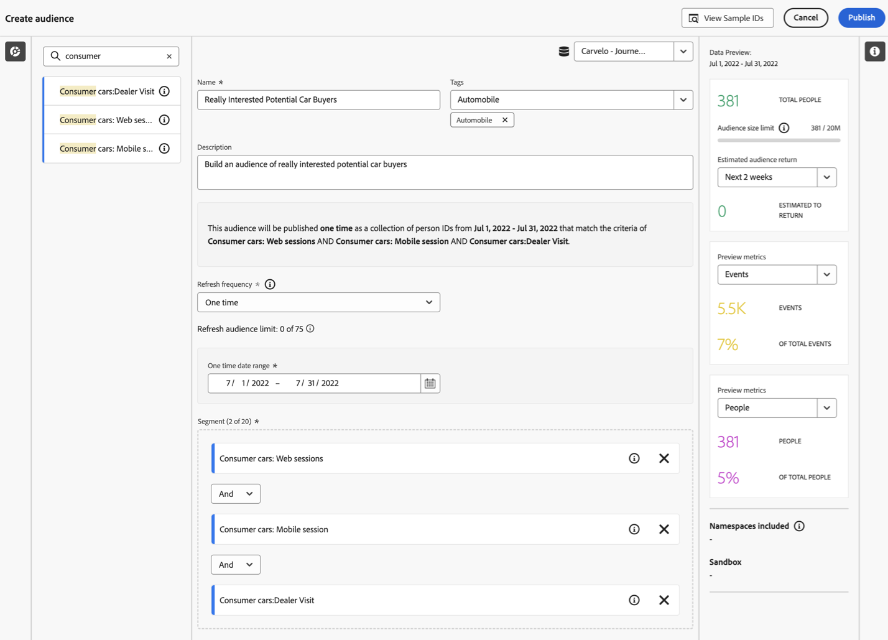

# 대상자 생성 및 게시

이 항목에서는 Customer Journey Analytics에서 식별된 대상자를 만들고 게시하는 방법을 설명합니다. [실시간 고객 프로필](https://experienceleague.adobe.com/docs/experience-platform/profile/home.html?lang=ko-KR) 고객 타겟팅 및 개인화를 위한 Adobe Experience Platform에서.

이 항목 읽기 [개요](/help/components/audiences/audiences-overview.md) Customer Journey Analytics 대상의 개념을 숙지하십시오.

## 대상자 만들기 {#create}

1. 대상자를 만들려면 다음 세 가지 방법으로 시작할 수 있습니다.

   | 만들기 방법 | 세부 사항 |
   | --- | --- |
   | 메인 **[!UICONTROL 구성 요소] > [!UICONTROL 대상자]** 메뉴에서 | Audiences Manager 페이지가 열립니다. **[!UICONTROL 대상자 만들기]**&#x200B;를 클릭하면 [!UICONTROL 대상자 빌더]가 열립니다. |
   | 자유 형식 테이블 내에서 | 자유 형식 테이블에서 항목을 마우스 오른쪽 버튼으로 클릭하고 **[!UICONTROL 선택 항목에서 대상자 만들기]**&#x200B;를 선택합니다. 이 방법을 사용하면 테이블에서 선택한 차원 또는 차원 항목으로 필터가 미리 채워집니다. |
   | 필터 생성/편집 UI에서 | **[!UICONTROL 이 필터에서 대상자 만들기]** 확인란을 선택합니다. 이 방법을 사용하면 필터가 미리 채워집니다. |

   {style="table-layout:auto"}

1. 대상자를 빌드합니다.

   대상자를 게시하기 전에 이러한 설정을 구성합니다.

   

   | 설정 | 설명 |
   | --- | --- |
   | [!UICONTROL 이름] | 대상자의 이름입니다. |
   | [!UICONTROL 태그] | 조직용으로 대상자에 할당하고자 하는 모든 태그입니다. 기존 태그를 사용하거나 새 태그를 입력할 수 있습니다. |
   | [!UICONTROL 설명] | 해당 대상자를 다른 대상자와 구별하기 위해 대상자에 대한 설명을 추가하십시오. |
   | [!UICONTROL 새로 고침 빈도] | 대상자를 새로 고침하는 빈도입니다.<ul><li>새로 고침이 필요하지 않은 일회성 대상자(기본값)를 만들도록 선택할 수 있습니다. 이는 예를 들어 특정 일회성 캠페인에 유용합니다.</li><li>다른 새로 고침 주기를 선택할 수 있습니다. 4시간 새로 고침 빈도의 경우 Customer Journey Analytics 권한에 따라 75~150회 대상 새로 고침으로 제한됩니다.</li></ul> |
   | 만료 날짜 | 대상자 새로 고침 중단일 기본 설정은 생성일로부터 1년이 되는 날입니다. 만료될 예정인 대상자는 만료될 예정인 예약된 보고서와 유사하게 처리됩니다. 관리자는 대상자가 만료되기 한 달 전에 이메일을 수신합니다. |
   | 전환 확인 기간 새로 고침 | 이 대상자를 생성할 때 데이터 창에서 얼마나 오래 적용될 것인지 지정합니다. 최대값은 90일입니다. |
   | [!UICONTROL 일회성 기간] | 일회성 대상자를 게시하려는 날짜 범위입니다. |
   | [!UICONTROL 필터] | 필터는 대상자의 주요 입력입니다. 최대 20개의 필터를 추가할 수 있습니다. 이러한 필터는 `And` 또는 `Or` 연산자와 결합할 수 있습니다. |
   | [!UICONTROL 샘플 ID 보기] | 이 대상자의 샘플 ID입니다. 검색 창을 사용하여 샘플 ID를 검색합니다. |

   {style="table-layout:auto"}

1. 데이터 미리보기를 해석합니다.

   대상자 미리보기가 오른쪽 레일에 표시됩니다. 이를 통해 사용자가 만든 대상자를 요약 분석할 수 있습니다.

   

   | 미리보기 설정 | 설명 |
   | --- | --- |
   | [!UICONTROL 데이터 미리보기] 창 | 대상자의 기간입니다. |
   | [!UICONTROL 총 인원] | 이 대상자의 총 인원수에 대한 요약 번호입니다. 최대 2천만 명까지 갈 수 있습니다. 대상자가 2천만 명을 초과하는 경우 대상자의 크기를 줄여야 게시할 수 있습니다. |
   | [!UICONTROL 대상자 크기 제한] | 이 대상자가 2천만 개 제한 중 얼마나 사용했는지 보여 줍니다. |
   | [!UICONTROL 예상 대상자 반환] | 이 설정은 이 대상자의 고객 중 사이트로 돌아오는 고객을 타겟팅하는 경우 유용합니다. (즉, 이 데이터 세트에서 다시 볼 수 있습니다.) 
여기서 돌아올 수 있는 예상 고객 수에 대한 시간대(다음 7일, 다음 2주, 다음 달)를 선택할 수 있습니다. |
   | [!UICONTROL 예상 반환] | 이 숫자는 드롭다운 목록에서 선택한 시간대 동안 돌아오는 예상 고객 수를 알려 줍니다. 이 숫자를 예측하기 위해 이 대상자의 과거 이탈률을 살펴봅니다. |
   | [!UICONTROL 지표 미리보기] | 이 설정을 사용하면 &#39;[!UICONTROL 매출]&#39; 또는 &#39;[!UICONTROL 평균 사이트에서 보낸 시간]&#39;과 같이 특정 지표를 보고 이 지표에 불균형적인 양을 기여하는지 확인할 수 있습니다. 지표의 집계 카운트와 지표가 나타내는 총계의 백분율을 제공합니다. 데이터 보기에서 사용할 수 있는 지표를 선택할 수 있습니다. |
   | [!UICONTROL 네임스페이스 포함됨] | 대상자의 인원과 연결된 특정 네임스페이스입니다. 예를 들어 ECID, CRM ID, 이메일 주소 등이 있습니다. |
   | [!UICONTROL 샌드박스] | 이 대상자가 있는 [Experience Platform 샌드박스](https://experienceleague.adobe.com/docs/experience-platform/sandbox/home.html?lang=ko-KR)입니다. 이 대상자를 Platform에 게시할 때 이 샌드박스의 범위 내에서만 작업할 수 있습니다. |

   {style="table-layout:auto"}

1. 대상자 구성을 두 번 확인하고 **[!UICONTROL 게시]**&#x200B;를 클릭합니다.

   모든 것이 잘 진행되면 대상자가 게시되었다는 확인 메시지를 받게 됩니다. 이 대상자가 Experience Platform에 나타나는 데는 불과 1~2분밖에 걸리지 않습니다. (수백만 명의 멤버를 보유한 대상자도 5분 미만이 소요됩니다.)

1. 동일한 메시지 내에서 **[!UICONTROL AEP의 대상자 보기]**&#x200B;를 클릭하면 Adobe Experience Platform의 [Segment UI](https://experienceleague.adobe.com/docs/experience-platform/segmentation/ui/overview.html?lang=ko-KR)로 이동합니다. 자세한 내용은 아래를 참조하십시오.

## 대상자가 생성된 후 진행되는 상황? {#after-audience-created}

대상자를 만들면, Adobe은 새로운 각 Customer Journey Analytics 대상자에 대한 Experience Platform 스트리밍 세그먼트를 만듭니다. Adobe Experience Platform 스트리밍 세그먼트는 조직이 스트리밍 세분화를 위해 설정된 경우에만 만들어집니다.

* Adobe Experience Platform 세그먼트는 Customer Journey Analytics 대상과 동일한 이름/설명을 공유하지만 이 이름은 고유하도록 Customer Journey Analytics 대상 ID에 추가됩니다.
* Customer Journey Analytics 대상 이름/설명이 변경되면 Adobe Experience Platform 세그먼트 이름/설명도 해당 변경 사항을 반영합니다.
* 사용자가 Customer Journey Analytics 대상자를 삭제해도 Adobe Experience Platform 세그먼트는 삭제되지 않습니다. 그 이유는 Customer Journey Analytics 대상이 나중에 삭제 취소될 수 있기 때문입니다.

## 지연 고려 사항 {#latency}

대상자 게시 전, 게시 중 및 게시 후 여러 지점에서 지연이 발생할 수 있습니다. 가능한 지연에 대한 개요는 다음과 같습니다.

| # | 지연 지점 | 지연 기간 |
| --- | --- | --- |
| 표시되지 않음 | Adobe Analytics-Analytics 소스 커넥터 (A4T) | 최대 30분 |
| 1 | Analytics 소스 커넥터 또는 기타 소스에서 데이터 레이크로 데이터 수집 | 최대 90분 |
| 2 | Experience Platform 데이터 레이크에서 Customer Journey Analytics으로 데이터 수집 | 최대 90분 |
| 3 | 스트리밍 세그먼트의 자동 생성을 포함하여 실시간 고객 프로필에 대상자를 게시하고 세그먼트가 데이터를 수신할 수 있도록 합니다. | 약 60분 |
| 4 | 대상자에 대한 새로 고침 빈도 | <ul><li>일회성 새로 고침(지연 시간 5분 미만)</li><li>4시간마다, 매일, 매주, 매월 새로 고침(지연 시간은 새로 고침 빈도와 밀접한 관련이 있음) |
| 5 | Adobe Experience Platform에서 대상 만들기: 새 세그먼트 활성화 | 1~2시간 |

{style="table-layout:auto"}

## Experience Platform에서 Customer Journey Analytics 대상 사용 {#audiences-aep}

Customer Journey Analytics은 게시된 대상자로부터 네임스페이스와 ID 조합을 모두 가져와서 실시간 고객 프로필(RTCP)로 스트리밍합니다. Customer Journey Analytics은 로 선택된 내용에 따라 기본 ID가 설정된 Experience Platform으로 대상자를 보냅니다. [!UICONTROL 개인 ID] 연결이 구성된 경우.

그런 다음 RTCP는 각 네임스페이스/ID 조합을 검사하고 해당 조합이 속할 수 있는 프로필을 찾습니다. 프로필은 기본적으로 연결된 네임스페이스, ID 및 디바이스의 클러스터입니다. 프로필을 찾으면 네임스페이스와 ID를 이 프로필의 다른 ID에 세그먼트 멤버십 속성으로 추가합니다. 예를 들어, <user@adobe.com> 는 모든 디바이스와 채널에서 타겟팅할 수 있습니다. 프로필을 찾을 수 없으면 새 프로필이 만들어집니다.

로 이동하여 플랫폼에서 Customer Journey Analytics 대상을 볼 수 있습니다. **[!UICONTROL 세그먼트]** > **[!UICONTROL 세그먼트 만들기]** > **[!UICONTROL 대상]** 탭 > **[!UICONTROL CJA 대상]**.

Customer Journey Analytics 대상을 Adobe Experience Platform 세그먼트에 대한 세그먼트 정의로 드래그할 수 있습니다.

## FAQ {#faq}

대상자 게시에 대해 자주 묻는 질문.

+++**사용자가 더 이상 Customer Journey Analytics 대상의 멤버가 아닌 경우 어떻게 됩니까?**

이 경우 종료 이벤트가 Customer Journey Analytics의 Experience Platform으로 전송됩니다.

+++

+++**Customer Journey Analytics에서 대상을 삭제하면 어떻게 됩니까?**

Customer Journey Analytics 대상자가 삭제되면 해당 대상자는 더 이상 Experience Platform UI에 표시되지 않습니다. 단, 해당 대상자와 관련된 프로필은 실제로 플랫폼에서 삭제되지 않습니다.

+++

+++**해당 프로필이 RTCDP에 존재하지 않는 경우 새 프로필이 생성됩니까?**

네. 그렇습니다.

+++

+++**Customer Journey Analytics은 대상 데이터를 파이프라인 이벤트로 전송합니까? 또는 데이터 레이크로도 이동하는 플랫 파일로 전송합니까?**

Customer Journey Analytics은 파이프라인을 통해 데이터를 RTCP로 스트리밍하고, 이 데이터는 데이터 레이크의 시스템 데이터 세트에도 수집됩니다.

+++

+++**Customer Journey Analytics은 어떤 ID를 전송합니까?**

에 지정된 ID/네임스페이스 쌍 [연결 설정](https://experienceleague.adobe.com/docs/analytics-platform/using/cja-connections/create-connection.html?lang=ko-KR#create-connection). 이는 특히 사용자가 “개인 ID”로 사용할 필드를 선택하는 단계입니다.

+++

+++**기본 ID로 어떤 ID를 선택합니까?**

위를 참조하십시오. Customer Journey Analytics &quot;사람&quot;당 하나의 ID만 보냅니다.

+++

+++**RTCP는 Customer Journey Analytics 메시지도 처리합니까? Customer Journey Analytics이 대상 공유를 통해 프로필 ID 그래프에 ID를 추가할 수 있습니까?**

아니요. “개인”당 한 개의 ID만 전송하므로 RTCP가 사용할 그래프 에지가 없습니다.

+++

+++**일별, 주별 및 월별 새로 고침은 언제 발생합니까? 주별 새로 고침은 어떤 요일에 발생합니까?**

새로 고침 시점은 원래 대상이 게시된 시점을 기준으로 하며 해당 시간(및 요일 또는 월)에 앵커합니다.

+++

+++**사용자가 일별, 주별 및 월별 새로 고침 시간을 구성할 수 있습니까?**

아니요. 사용자가 구성할 수 없습니다.

+++

## 다음 단계

* 이 대상자를 관리하려면 [관리 UI](/help/components/audiences/manage.md)로 이동하십시오.
