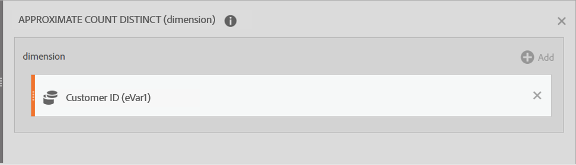

# 고급 함수

[계산된 지표 빌더](cm-workflow/cm-build-metrics.md)를 사용하면 통계 및 수학 함수를 적용할 수 있습니다. 이 문서에서는 고급 함수의 알파벳 목록과 해당 정의를 설명합니다.

[구성 요소] 패널에서  **[!UICONTROL 함수]** 목록 아래의 **[!UICONTROL 모두 표시]**&#x200B;를 선택하여 이 함수들에 액세스하십시오. 아래로 스크롤하여 **[!UICONTROL 고급 함수]** 목록을 확인합니다.

## 테이블 함수 대 행 함수

테이블 함수는 출력이 모든 테이블 행에 대해 동일한 함수입니다. 행 함수는 출력이 모든 테이블 행에 대해 다른 함수입니다.

적용 가능하고 관련된 경우 함수에는 [!BADGE 테이블] 형식의 주석이 추가됩니다.{type="Neutral"}[!BADGE 행]{type="Neutral"}

## include-zeros 매개변수는 무엇을 의미합니까?

계산에 0을 포함할지 여부를 알려 줍니다. 때로는 0이 *없음*&#x200B;을 의미하지만 때로는 중요합니다.

예를 들어, 매출 지표가 있고, 그 다음 페이지 보기 지표를 보고서에 추가하는 경우, 모두 0인 매출 행이 갑자기 더 많아집니다. 추가 지표가 **[평균](cm-functions.md#mean)**, **[행 최소값](cm-functions.md#row-min)**, **[사분위수](cm-functions.md#quartile)** 및 수익 열에 있는 더 많은 계산에 영향을 주지 않도록 하려는 것일 수 있습니다. 이 경우 `include-zeros` 매개 변수를 확인합니다.

대체 시나리오는 두 개의 관심 지표가 있고 행 중 일부가 0이므로 한 개의 지표가 더 높은 평균 또는 최소값을 갖는 것입니다.  이 경우 0을 포함하도록 매개 변수를 확인하지 않도록 선택할 수 있습니다.


## And

 **[!UICONTROL AND(logical_test)]**


결합. 0과 같지 않으면 참으로 간주하고 0과 같으면 거짓으로 간주합니다. 출력은 0(false) 또는 1(true)입니다.


| 인수 | 설명 |
|---|---|
| logical_test | 하나 이상의 매개 변수가 필요하지만 매개 변수를 원하는 수만큼 사용할 수 있습니다. TRUE 또는 FALSE로 평가할 수 있는 모든 값 또는 표현식 |

## 대략적인 고유 개수

 **[!UICONTROL 근사 고유 개수(차원)]**


선택한 차원에 대한 차원 항목의 근사 고유 개수를 반환합니다.


| 인수 | 설명 |
|---|---|
| 차원 | 대략적인 개별 항목 수를 계산할 차원입니다 |

### 예

이 기능의 일반적인 사용 사례는 대략적인 고객 수를 얻으려는 경우입니다.


## 아크코사인

 **[!UICONTROL 아크코사인(지표)]**


[!BADGE 행]{type="Neutral"}


| 인수 | 설명 |
|---|---|
| metric | 원하는 각도의 코사인 (-1 ~ 1 범위) |


## 아크사인

 **[!UICONTROL 아크사인(지표)]**


[!BADGE 행]{type="Neutral"}


| 인수 | 설명 |
|---|---|
| metric | 원하는 각도의 사인 (-1 ~ 1 범위) |


## 아크탄젠트

 **[!UICONTROL 아크탄젠트(지표)]**


[!BADGE 행]{type="Neutral"}


| 인수 | 설명 |
|---|---|
| metric | 원하는 각도의 탄젠트 -1부터 1까지 |


## Cdf-T

 **[!UICONTROL CDF-T(지표, 숫자)]**


자유도가 n인 학생 t 분포를 사용하는 확률변수에 col보다 적은 z-점수가 있는 확률을 반환합니다.


| 인수 | 설명 |
|---|---|
| metric | 학생 t-분포의 누적 분포 함수를 원하는 지표 |
| 숫자 | 학생 t-분포의 누적 분포 함수에 대한 자유도 |

### 예

```
CDF-T(-∞, n) = 0
CDF-T(∞, n) = 1
CDF-T(3, 5) ? 0.99865
CDF-T(-2, 7) ? 0.0227501
CDF-T(x, ∞) ? cdf_z(x)
```


## Cdf-Z

 **[!UICONTROL CDF-Z(지표, 숫자)]**


정규 분포를 사용하는 임의의 변수에 col보다 적은 z-점수가 있는 확률을 반환합니다.


| 인수 | 설명 |
|---|---|
| metric | 표준 정규 분포의 누적 분포 함수를 원하는 지표 |

### 예

```
CDF-Z(-∞) = 0
CDF-Z(∞) = 1
CDF-Z(0) = 0.5
CDF-Z(2) ? 0.97725
CDF-Z(-3) ? 0.0013499
```

## 천장

 **[!UICONTROL 천정(지표)]**


[!BADGE 행]{type="Neutral"}


| 인수 | 설명 |
|---|---|
| metric | 반올림하려는 지표 |


## 신뢰도 (하한)

 **[!UICONTROL 신뢰도(정규화-컨테이너, 성공-지표, 제어, 중요도-임계값)]**

[시간 균일 중앙 제한 이론 및 점근 신뢰 시퀀스](https://arxiv.org/pdf/2103.06476)에 설명된 대로 WASKR 메서드를 사용하여 임의의 시간 유효 신뢰도 **lower**&#x200B;을(를) 계산합니다.

신뢰도는 주어진 변형이 제어 변형과 동일하다는 증거가 얼마나 있는지에 대한 확률론적 척도입니다. 신뢰도가 높을수록 제어 변형과 비제어 변형의 성과가 동일하다는 가정의 증거가 적다는 것을 나타냅니다.

| 인수 | 설명 |
| --- | --- |
| 표준화-컨테이너 | 테스트가 실행되는 기준(사람, 세션 또는 이벤트)입니다. |
| 성공 지표 | 사용자가 변형을 비교하는 지표입니다. |
| 제어 | 실험의 다른 모든 변형과 비교되는 변형입니다. 제어 변형 차원 항목의 이름을 입력하십시오. |
| 유의 임계값 | 이 함수에서의 임계값은 95%의 기본값으로 설정됩니다. |

## 신뢰도 (상한)

 **[!UICONTROL 신뢰도(정규화-컨테이너, 성공-지표, 제어, 중요도-임계값)]**

[Time-uniform 중앙 제한 이론 및 점근 신뢰 시퀀스](https://arxiv.org/pdf/2103.06476)에 설명된 대로 WASKR 메서드를 사용하여 언제든지 유효한 신뢰 **upper**&#x200B;를 계산합니다.

신뢰도는 주어진 변형이 제어 변형과 동일하다는 증거가 얼마나 있는지에 대한 확률론적 척도입니다. 신뢰도가 높을수록 제어 변형과 비제어 변형의 성과가 동일하다는 가정의 증거가 적다는 것을 나타냅니다.

| 인수 | 설명 |
| --- | --- |
| 표준화-컨테이너 | 테스트가 실행되는 기준(사람, 세션 또는 이벤트)입니다. |
| 성공 지표 | 사용자가 변형을 비교하는 지표입니다. |
| 제어 | 실험의 다른 모든 변형과 비교되는 변형입니다. 제어 변형 차원 항목의 이름을 입력하십시오. |
| 유의 임계값 | 이 함수에서의 임계값은 95%의 기본값으로 설정됩니다. |


## 코사인

 **[!UICONTROL 코사인(지표)]**

[!BADGE 행]{type="Neutral"}

| 인수 | 설명 |
|---|---|
| metric | 코사인을 원하는 라디안 단위 각도 |


## 세제곱근

 **[!UICONTROL 큐브 루트(지표)]**


숫자의 양의 세제곱근을 반환합니다. 숫자의 세제곱근은 해당 숫자의 1/3 거듭제곱 값입니다.


| 인수 | 설명 |
|---|---|
| metric | 큐브 루트를 계산할 지표입니다 |


## 누적

 **[!UICONTROL 누적(숫자, 지표)]**

열 x의 마지막 n 요소의 합을 반환합니다. n > 0이면 마지막 n개 요소 또는 x를 합합니다. n &lt; 0이면 앞에 오는 요소를 합합니다.

| 인수 | 설명 |
| --- | --- |
| 숫자 | 합계를 반환하는 마지막 N개 행 수입니다. N &lt;= 0이면 이전의 모든 행을 사용합니다. |
| metric | 누적 합계를 원하는 지표입니다. |

### 예

| 날짜 | 매출 | CUMULATIVE(0, 매출) | CUMULATIVE(2, 매출) |
|------|------:|--------------:|--------------:|
| 5월 | 500달러 | 500달러 | 500달러 |
| 6월 | 200달러 | 700달러 | 700달러 |
| 7월 | $400 | 1100달러 | $600 |


## 누적(평균)

 **[!UICONTROL 누적 평균(숫자, 지표)]**

열 x의 마지막 n개 요소의 평균을 반환합니다. n > 0이면 마지막 n개 요소 또는 x를 합합니다. n &lt; 0이면 앞에 오는 요소를 합합니다.

| 인수 | 설명 |
| --- | --- |
| 숫자 | 평균을 반환하는 마지막 N개 행 수입니다. N &lt;= 0이면 이전의 모든 행을 사용합니다. |
| metric | 누적 평균을 구할 지표입니다. |

>[!NOTE]
>
>이 함수는 1인당 매출과 같은 비율 지표에는 작동하지 않습니다. 이 함수는 마지막 N에 대한 수입을 합하고 마지막 N에 대한 사람의 수를 합한 다음 이들을 나누는 대신 비율의 평균을 구합니다. <br/>대신 [**[!UICONTROL CUMULATIVE(revenue)]**](#cumulative)  [**[!UICONTROL CUMULATIVE(person)]**](#cumulative)를 사용하십시오.
>


## Equal

 **[!UICONTROL EQUAL()]**


같음. 출력은 0(false) 또는 1(true)입니다.


| 인수 | 설명 |
|---|---|
| metric_X | |
| metric_Y | |

### 예

`Metric 1 = Metric 2`


## 지수 회귀: 상관 계수

 **[!UICONTROL 지수 회귀: 상관 계수(metric_X, metric_Y, include_zeros)]**


[!BADGE 표]{type="Neutral"}


| 인수 | 설명 |
|---|---|
| metric_X | metric_Y와 상호 연관시킬 지표 |
| metric_Y | metric_X 와 상호 연관시킬 지표 |
| include_zeros | 계산에 0 값을 포함할지 여부 |

## 지수 회귀: 예측된 Y

 **[!UICONTROL 지수 회귀: 예측된 Y(metric_X, metric_Y, include_zeros)]**


[!BADGE 행]{type="Neutral"}


| 인수 | 설명 |
|---|---|
| metric_X | 독립 데이터로 지정할 지표. |
| metric_Y | 종속 데이터로 지정할 지표. |
| include_zeros | 계산에 0 값을 포함할지 여부 |


## 지수 회귀: 절편

 **[!UICONTROL 지수 회귀: INTERCEPT(metric_X, metric_Y, include_zeros)]**


[!BADGE 표]{type="Neutral"}

| 인수 | 설명 |
|---|---|
| metric_X | 종속 데이터로 지정할 지표 |
| metric_Y | 독립 데이터로 지정할 지표 |
| include_zeros | 계산에 0 값을 포함할지 여부 |


## 지수 회귀: 기울기

 **[!UICONTROL 지수 회귀: SLOPE(metric_X, metric_Y, include_zeros)]**


[!BADGE 표]{type="Neutral"}


| 인수 | 설명 |
|---|---|
| metric_X | 종속 데이터로 지정할 지표 |
| metric_Y | 독립 데이터로 지정할 지표 |
| include_zeros | 계산에 0 값을 포함할지 여부 |


## Floor

 **[!UICONTROL FLOOR(metric_X, metric_Y, include_zeros)]**

[!BADGE 행]{type="Neutral"}

| 인수 | 설명 |
|---|---|
| metric | 반올림할 지표. |


## 보다 큼

 **[!UICONTROL 다음보다 큼()]**


출력은 0(false) 또는 1(true)입니다.


| 인수 | 설명 |
|---|---|
| metric_X | |
| metric_Y | |

### 예

`Metric 1 > Metric 2`

## 크거나 같음

 **[!UICONTROL 크거나 같음()]**


크거나 같음. 출력은 0(false) 또는 1(true)입니다.


| 인수 | 설명 |
|---|---|
| metric_X |  |
| metric_Y |  |

### 예

`Metric 1 >= Metric 2`


## 쌍곡코사인

 **[!UICONTROL 쌍곡코사인(지표)]**


[!BADGE 행]{type="Neutral"}


| 인수 | 설명 |
|---|---|
| metric | 쌍곡코사인을 찾을 라디안 단위 각도 |


## 쌍곡사인

 **[!UICONTROL 쌍곡사인(지표)]**


[!BADGE 행]{type="Neutral"}


| 인수 | 설명 |
|---|---|
| metric | 쌍곡사인을 찾을 라디안 단위 각도 |


## 쌍곡탄젠트

 **[!UICONTROL 쌍곡탄젠트(지표)]**


[!BADGE 행]{type="Neutral"}


| 인수 | 설명 |
|---|---|
| metric | 쌍곡탄젠트를 찾을 라디안 단위 각도 |


## If

 **[!UICONTROL IF(logical_test, value_if_true, value_if_false)]**


[!BADGE 행]{type="Neutral"}


| 인수 | 설명 |
|---|---|
| logical_test | 필수 여부. TRUE 또는 FALSE로 평가할 수 있는 모든 값 또는 표현식 |
| value_if_true | logical_test 인수가 TRUE로 평가되는 경우 반환할 값입니다. (이 인수는 포함되지 않을 경우 기본값이 0으로 지정됩니다.) |
| value_if_false | logical_test 인수가 FALSE로 평가되는 경우 반환할 값. (이 인수는 포함되지 않을 경우 기본값이 0으로 지정됩니다.) |


## 보다 작음

 **[!UICONTROL 보다 작음()]**


출력은 0(false) 또는 1(true)입니다.


| 인수 | 설명 |
|---|---|
| metric_X | |
| metric_Y | |


### 예

`Metric 1 < Metric 2`

## 작거나 같음

 **[!UICONTROL 작거나 같음()]**

작거나 같음. 출력은 0(false) 또는 1(true)입니다.


| 인수 | 설명 |
|---|---|
| metric_X | |
| metric_Y | |

### 예

`Metric 1 <= Metric 2`


## 선형 회귀: 상관 계수

 **[!UICONTROL 선형 회귀: 상관 계수(metric_X, metric_Y, include_zeros)]**


[!BADGE 표]{type="Neutral"}


| 인수 | 설명 |
|---|---|
| metric_X | metric_Y와 상호 연관시킬 지표 |
| metric_Y | metric_X 와 상호 연관시킬 지표 |
| include_zeros | 계산에 0 값을 포함할지 여부 |


## 선형 회귀: 절편

 **[!UICONTROL 선형 회귀: INTERCEPT(metric_X, metric_Y, include_zeros)]**


[!BADGE 표]{type="Neutral"}


| 인수 | 설명 |
|---|---|
| metric_X | 종속 데이터로 지정할 지표 |
| metric_Y | 독립 데이터로 지정할 지표 |
| include_zeros | 계산에 0 값을 포함할지 여부 |


## 선형 회귀: 예측된 Y

 **[!UICONTROL 선형 회귀: 예측된 Y(metric_X, metric_Y, include_zeros)]**


[!BADGE 행]{type="Neutral"}


| 인수 | 설명 |
|---|---|
| metric_X | 종속 데이터로 지정할 지표 |
| metric_Y | 독립 데이터로 지정할 지표 |
| include_zeros | 계산에 0 값을 포함할지 여부 |


## 선형 회귀: 기울기

 **[!UICONTROL 선형 회귀: SLOPE(metric_X, metric_Y, include_zeros)]**


[!BADGE 표]{type="Neutral"}


| 인수 | 설명 |
|---|---|
| metric_X | 종속 데이터로 지정할 지표 |
| metric_Y | 독립 데이터로 지정할 지표 |
| include_zeros | 계산에 0 값을 포함할지 여부 |


## 로그 밑 10

 **[!UICONTROL 로그 밑 10(지표)]**


[!BADGE 행]{type="Neutral"}


| 인수 | 설명 |
|---|---|
| metric | 밑이 10인 로그를 구하려는 양의 실수 |


## 로그 회귀: 상관 계수

 **[!UICONTROL 로그 회귀: 상관 계수(metric_X, metric_Y, include_zeros)]**


[!BADGE 표]{type="Neutral"}


| 인수 | 설명 |
|---|---|
| metric_X | metric_Y와 상호 연관시킬 지표 |
| metric_Y | metric_X 와 상호 연관시킬 지표 |
| include_zeros | 계산에 0 값을 포함할지 여부 |


## 로그 회귀: 절편

 **[!UICONTROL 로그 회귀: INTERCEPT(metric_X, metric_Y, include_zeros)]**


[!BADGE 표]{type="Neutral"}


| 인수 | 설명 |
|---|---|
| metric_X | 종속 데이터로 지정할 지표 |
| metric_Y | 독립 데이터로 지정할 지표 |
| include_zeros | 계산에 0 값을 포함할지 여부 |


## 로그 회귀: 예측된 Y

 **[!UICONTROL 로그 회귀: 예측된 Y(metric_X, metric_Y, include_zeros)]**


[!BADGE 행]{type="Neutral"}


| 인수 | 설명 |
|---|---|
| metric_X | 종속 데이터로 지정할 지표 |
| metric_Y | 독립 데이터로 지정할 지표 |
| include_zeros | 계산에 0 값을 포함할지 여부 |


## 로그 회귀: 기울기

 **[!UICONTROL 로그 회귀: SLOPE(metric_X, metric_Y, include_zeros)]**


[!BADGE 표]{type="Neutral"}


| 인수 | 설명 |
|---|---|
| metric_X | 종속 데이터로 지정할 지표 |
| metric_Y | 독립 데이터로 지정할 지표 |
| include_zeros | 계산에 0 값을 포함할지 여부 |


## 자연 로그

 **[!UICONTROL 자연어 로그(지표)]**


숫자의 자연 로그를 반환합니다. 자연 로그의 밑은 상수 e(2.71828182845904)입니다. LN은 EXP 함수의 역함수입니다.


| 인수 | 설명 |
|---|---|
| metric | 자연 로그를 구하려는 양의 실수 |


## 아님

 **[!UICONTROL NOT(논리적)]**


부울로서의 부정 출력은 0(false) 또는 1(true)입니다.


| 인수 | 설명 |
|---|---|
| 논리적 | 필수 여부. TRUE 또는 FALSE로 평가할 수 있는 값 또는 식입니다. |


## 같지 않음

 **[!UICONTROL 같지 않음()]**


같지 않음. 출력은 0(false) 또는 1(true)입니다.


| 인수 | 설명 |
|---|---|
| metric_X | |
| metric_Y | |

### 예

`Metric 1 != Metric 2`


## 또는

 **[!UICONTROL OR(logical_test)]**


[!BADGE 행]{type="Neutral"}


| 인수 | 설명 |
|---|---|
| logical_test | 하나 이상의 매개 변수가 필요하지만 매개 변수를 원하는 수만큼 사용할 수 있습니다. TRUE 또는 FALSE로 평가할 수 있는 모든 값 또는 표현식 |


>[!NOTE]
>
>0(영)은 False를 의미하며, 다른 값은 True입니다.


## Pi

 **[!UICONTROL PI()]**

Pi 반환: 3.14159...


## 거듭제곱 회귀: 상관 계수

 **[!UICONTROL 거듭제곱 회귀: 상관 계수(metric_X, metric_Y, include_zeros)]**


[!BADGE 표]{type="Neutral"}


| 인수 | 설명 |
|---|---|
| metric_X | metric_Y와 상호 연관시킬 지표 |
| metric_Y | metric_X 와 상호 연관시킬 지표 |
| include_zeros | 계산에 0 값을 포함할지 여부 |


## 거듭제곱 회귀: 절편

 **[!UICONTROL 거듭제곱 회귀: INTERCEPT(metric_X, metric_Y, include_zeros)]**


[!BADGE 표]{type="Neutral"}


| 인수 | 설명 |
|---|---|
| metric_X | 종속 데이터로 지정할 지표 |
| metric_Y | 독립 데이터로 지정할 지표 |
| include_zeros | 계산에 0 값을 포함할지 여부 |


## 거듭제곱 회귀: 예측된 Y

 **[!UICONTROL 거듭제곱 회귀: 예측된 Y(metric_X, metric_Y, include_zeros)]**


[!BADGE 행]{type="Neutral"}


| 인수 | 설명 |
|---|---|
| metric_X | 종속 데이터로 지정할 지표 |
| metric_Y | 독립 데이터로 지정할 지표 |
| include_zeros | 계산에 0 값을 포함할지 여부 |


## 거듭제곱 회귀: 기울기

 **[!UICONTROL 거듭제곱 회귀: SLOPE(metric_X, metric_Y, include_zeros)]**


[!BADGE 표]{type="Neutral"}


| 인수 | 설명 |
|---|---|
| metric_X | 종속 데이터로 지정할 지표 |
| metric_Y | 독립 데이터로 지정할 지표 |
| include_zeros | 계산에 0 값을 포함할지 여부 |


## 이차 회귀: 상관 계수

 **[!UICONTROL 이차 회귀: 상관 계수(metric_X, metric_Y, include_zeros)]**


[!BADGE 표]{type="Neutral"}


| 인수 | 설명 |
|---|---|
| metric_X | metric_Y와 상호 연관시킬 지표 |
| metric_Y | metric_X 와 상호 연관시킬 지표 |
| include_zeros | 계산에 0 값을 포함할지 여부 |

## 이차 회귀: 절편

 **[!UICONTROL 이차 회귀: INTERCEPT(metric_X, metric_Y, include_zeros)]**


[!BADGE 표]{type="Neutral"}


| 인수 | 설명 |
|---|---|
| metric_X | 종속 데이터로 지정할 지표 |
| metric_Y | 독립 데이터로 지정할 지표 |
| include_zeros | 계산에 0 값을 포함할지 여부 |


## 이차 회귀: 예측된 Y

 **[!UICONTROL 이차 회귀: 예측된 Y(metric_X, metric_Y, include_zeros)]**


[!BADGE 행]{type="Neutral"}


| 인수 | 설명 |
|---|---|
| metric_X | 종속 데이터로 지정할 지표 |
| metric_Y | 독립 데이터로 지정할 지표 |
| include_zeros | 계산에 0 값을 포함할지 여부 |

## 이차 회귀: 기울기

 **[!UICONTROL 이차 회귀: SLOPE(metric_X, metric_Y, include_zeros)]**


[!BADGE 표]{type="Neutral"}


| 인수 | 설명 |
|---|---|
| metric_X | 종속 데이터로 지정할 지표 |
| metric_Y | 독립 데이터로 지정할 지표 |
| include_zeros | 계산에 0 값을 포함할지 여부 |


## 역수 회귀: 상관 계수

 **[!UICONTROL 역수 회귀: 상관 계수(metric_X, metric_Y, include_zeros)]**


[!BADGE 표]{type="Neutral"}


| 인수 | 설명 |
|---|---|
| metric_X | metric_Y와 상호 연관시킬 지표 |
| metric_Y | metric_X 와 상호 연관시킬 지표 |
| include_zeros | 계산에 0 값을 포함할지 여부 |


## 역수 회귀: 절편

 **[!UICONTROL 역수 회귀: INTERCEPT(metric_X, metric_Y, include_zeros)]**


[!BADGE 표]{type="Neutral"}


| 인수 | 설명 |
|---|---|
| metric_X | 종속 데이터로 지정할 지표 |
| metric_Y | 독립 데이터로 지정할 지표 |
| include_zeros | 계산에 0 값을 포함할지 여부 |


## 역수 회귀: 예측된 Y

 **[!UICONTROL 역수 회귀: 예측된 Y(metric_X, metric_Y, include_zeros)]**


[!BADGE 행]{type="Neutral"}


| 인수 | 설명 |
|---|---|
| metric_X | 종속 데이터로 지정할 지표 |
| metric_Y | 독립 데이터로 지정할 지표 |
| include_zeros | 계산에 0 값을 포함할지 여부 |


## 역수 회귀: 기울기

 **[!UICONTROL 역수 회귀: SLOPE(metric_X, metric_Y, include_zeros)]**


[!BADGE 표]{type="Neutral"}


| 인수 | 설명 |
|---|---|
| metric_X | 종속 데이터로 지정할 지표 |
| metric_Y | 독립 데이터로 지정할 지표 |
| include_zeros | 계산에 0 값을 포함할지 여부 |


## 사인

 **[!UICONTROL 사인(지표)]**


[!BADGE 행]{type="Neutral"}


| 인수 | 설명 |
|---|---|
| metric | 사인을 사용할 라디안 단위 각도 |


## T 스코어

 **[!UICONTROL T 스코어(지표, include_zeros)]**


[MEAN](cm-functions.md#mean)에서의 편차를 표준 편차로 나눈 값입니다. [Z 스코어](#z-score)에 대한 별칭입니다.


| 인수 | 설명 |
|---|---|
| metric | T 점수를 원하는 지표 |
| include_zeros | 계산에 0 값을 포함할지 여부 |


## T-테스트

 **[!UICONTROL T-테스트(지표, 도, 꼬리)]**


t 점수가 x이고 자유도가 n인 m측 검증 t 테스트를 수행합니다.


| 인수 | 설명 |
|---|---|
| metric | T 테스트를 수행할 지표 |
| 도 | 자유도 |
| 꼬리 | T 테스트를 수행하는 데 사용할 꼬리 길이 |

### 세부 사항

시그니처는 T-TEST(지표, 도, 꼬리)입니다. 이 식은 아래에서 ***m***  **[[!DNL CDF-T(-ABSOLUTE VALUE(tails), degrees)]](#cdf-t)**&#x200B;을(를) 호출합니다. 이 함수는 ***m***  **[[!DNL CDF-Z(-ABSOLUTE VALUE(tails))]](#cdf-z)**&#x200B;을(를) 실행하는 **[Z-TEST](#z-test)** 함수와 유사합니다.

- ***m***&#x200B;은(는) 꼬리 수입니다.
- ***n***&#x200B;은(는) 자유도이며, 행 단위로 변경되지 않는 전체 보고서의 상수여야 합니다.
- ***x***&#x200B;은(는) T-test 통계로 종종 지표를 기반으로 하는 공식(예: **[Z-SCORE](#z-score)**)으로 표시되며 모든 행에서 평가됩니다.

반환 값은 자유도 및 꼬리 수를 감안할 때 테스트 통계 x의 지각 확률입니다.

**예:**

1. 함수를 사용하여 이상치를 찾습니다.

   ```
   T-TEST(Z-SCORE(bouncerate), ROW COUNT - 1, 2)
   ```

1. 매우 높거나 낮은 바운스 비율을 무시하도록 함수를 **[IF](#if)**&#x200B;와(과) 결합하고 다른 모든 경우에 세션을 계산하십시오.

   ```
   IF(T-TEST(Z-SCORE(bouncerate), ROW COUNT - 1, 2) < 0.01, 0, sessions )
   ```


## 탄젠트

 **[!UICONTROL 탄젠트(지표)]**


주어진 각도의 탄젠트를 반환합니다. 이 각도가 도 단위인 경우에는 각도에 PI( )/180을 곱하십시오.


| 인수 | 설명 |
|---|---|
| metric | 탄젠트를 원하는 라디안 단위 각도 |


## Z 스코어

 **[!UICONTROL Z-SCORE(metric, include_zeros)]**


[!BADGE 행]{type="Neutral"}


| 인수 | 설명 |
|---|---|
| metric | Z 점수를 원하는 지표 |
| include_zeros | 계산에 0 값을 포함할지 여부 |

Z 스코어가 0(영)이면 스코어가 평균과 같음을 의미합니다. Z 스코어는 양수 또는 음수일 수 있으며, 이는 평균보다 큰지 또는 작은지를 표준 편차의 수로 나타냅니다.

Z 스코어에 대한 방정식은 다음과 같습니다.


여기서 ***[!DNL x]***&#x200B;은(는) 원시 점수이고, ***[!DNL μ]***&#x200B;은(는) 모집단의 평균이고, ***[!DNL σ]***&#x200B;은(는) 모집단의 표준 편차입니다.

>[!NOTE]
>
>***[!DNL μ]***(mu)와 ***[!DNL σ]***(sigma)는 지표에서 자동으로 계산됩니다.


## Z-테스트

 **[!UICONTROL Z-TEST(metric_tails)]**


z-점수가 x인 양측 z-테스트를 수행합니다.


| 인수 | 설명 |
|---|---|
| metric | Z 테스트를 수행할 지표 |
| 꼬리 | Z 테스트를 수행하는 데 사용할 꼬리의 길이 |

>[!NOTE]
>
>값은 정상적으로 배분된다고 가정합니다.


<!--


## AND

Returns the value of its argument. Use NOT to make sure that a value is not equal to one particular value.

>[!NOTE]
>
>0 (zero) means False, and any other value is True.

```
AND(logical_test1,[logical_test2],...)
```

|  Argument  | Description  |
|---|---|
|  *logical_test1* | Required. Any value or expression that can be evaluated to TRUE or FALSE.  |
|  *logical_test2* | Optional. Additional conditions that you want to evaluate as TRUE or FALSE  |

## Approximate Count Distinct (dimension)

Returns the approximated distinct count of dimension items for the selected dimension. The function uses the HyperLogLog (HLL) method of approximating distinct counts.&nbsp; It is configured to guarantee the value is within 5% of the actual value 95% of the time.

```
Approximate Count Distinct (dimension)
```

|  Argument  |  |
|---|---|
|  *dimension* | The dimension for which you want the approximate distinct item count.  |

### Example Use Case

Approximate Count Distinct (customer ID eVar) is a common use case for this function.

Definition for a new 'Approximate Customers' calculated metric:



This is how the "Approximate Customers" metric could be used in reporting:


### Comparing Count Functions

Approximate Count Distinct() is an improvement over Count() and RowCount() functions because the metric created can be used in any dimensional report to render an approximated count of items for a separate dimension. For example, a count of customer IDs used in a Mobile Device Type report.

This function will be marginally less accurate than Count() and RowCount() because it uses the HLL method, whereas Count() and RowCount() are exact counts.

## Arc Cosine (Row)

Returns the arccosine, or inverse of the cosine, of a metric. The arccosine is the angle whose cosine is number. The returned angle is given in radians in the range 0 (zero) to pi. If you want to convert the result from radians to degrees, multiply it by 180/PI( ).

```
ACOS(metric)
```

|  Argument  |  |
|---|---|
|  *metric* | The cosine of the angle you want from -1 to 1. |

## Arc Sine (Row)

Returns the arcsine, or inverse sine, of a number. The arcsine is the angle whose sine is number. The returned angle is given in radians in the range -pi/2 to pi/2. To express the arcsine in degrees, multiply the result by 180/PI( ).

```
ASIN(metric)
```

|  Argument  |  |
|---|---|
|  *metric* | The cosine of the angle you want from -1 to 1. |

## Arc Tangent (Row)

Returns the arctangent, or inverse tangent, of a number. The arctangent is the angle whose tangent is number. The returned angle is given in radians in the range -pi/2 to pi/2. To express the arctangent in degrees, multiply the result by 180/PI( ).

```
ATAN(metric)
```

|  Argument  |  |
|---|---|
|  *metric* | The cosine of the angle you want from -1 to 1. |

## Exponential Regression: Predicted Y (Row)

Calculates the predicted y-values (metric_Y), given the known x-values (metric_X) using the "least squares" method for calculating the line of best fit based on .

```
ESTIMATE.EXP(metric_X, metric_Y)
```

|  Argument  | Description  |
|---|---|
|  *metric_X* | A metric that you would like to designate as the dependent data.  |
|  *metric_Y* | A metric that you would like to designate as the independent data.  |

## Cdf-T

Returns the percentage of values in a student's t-distribution with n degrees of freedom that have a z-score less than x.

```
cdf_t( -∞, n ) = 0
cdf_t(  ∞, n ) = 1
cdf_t( 3, 5 ) ? 0.99865
cdf_t( -2, 7 ) ? 0.0227501
cdf_t( x, ∞ ) ? cdf_z( x )
```

## Cdf-Z

Returns the percentage of values in a normal distribution that have a z-score less than x.

```
cdf_z( -∞ ) = 0
cdf_z( ∞ ) = 1
cdf_z( 0 ) = 0.5
cdf_z( 2 ) ? 0.97725
cdf_z( -3 ) ? 0.0013499

```

## Exponential Regression: Intercept (Table)

Returns the intercept, *b*, between two metric columns ( *metric_X* and *metric_Y*) for

```
INTERCEPT.EXP(metric_X, metric_Y)
```

|  Argument  | Description  |
|---|---|
|  *metric_X* | A metric that you would like to designate as the dependent data.  |
|  *metric_Y* | A metric that you would like to designate as the independent data.  |

## Exponential Regression: Slope (Table)

Returns the slope, *a*, between two metric columns ( *metric_X* and *metric_Y*) for .

```
SLOPE.EXP(metric_X, metric_Y)
```

|  Argument  | Description  |
|---|---|
|  *metric_X* | A metric that you would like to designate as the dependent data.  |
|  *metric_Y* | A metric that you would like to designate as the independent data.  |

## Floor (Row)

Returns the largest integer not greater than a given value. For example, if you want to avoid reporting currency decimals for revenue and a product has $569.34, use the formula FLOOR( *Revenue*) to round revenue down to the nearest dollar, or $569.

```
FLOOR(metric)
```

|  Argument  | Description  |
|---|---|
|  *metric* | The metric you want to round.  |

## Greater Than

Returns items whose numeric count is greater than the value entered.

## Greater Than or Equal

Returns items whose numeric count is greater than or equal to the value entered.

## Hyperbolic Cosine (Row)

Returns the hyperbolic cosine of a number.

```
COSH(metric)
```

|  Argument  | Description  |
|---|---|
|  *metric* | The angle in radians for which you want to find the hyperbolic cosine.  |

## Hyperbolic Sine (Row)

Returns the hyperbolic sine of a number.

```
SINH(metric)
```

|  Argument  | Description  |
|---|---|
|  *metric* | The angle in radians for which you want to find the hyperbolic sine.  |

## Hyperbolic Tangent (Row)

Returns the hyperbolic tangent of a number.

```
TANH(metric)
```

|  Argument  | Description  |
|---|---|
|  *metric* | The angle in radians for which you want to find the hyperbolic tanget.  |

## IF (Row)

The IF function returns one value if a condition you specify evaluates to TRUE, and another value if that condition evaluates to FALSE.

```
IF(logical_test, [value_if_true], [value_if_false])
```

|  Argument  | Description  |
|---|---|
|  *logical_test* | Required. Any value or expression that can be evaluated to TRUE or FALSE.  |
|  *[value_if_true]* | The value that you want to be returned if the *logical_test* argument evaluates to TRUE. (This argument defaults to 0 if not included.)  |
|  *[value_if_false]* | The value that you want to be returned if the *logical_test* argument evaluates to FALSE. (This argument defaults to 0 if not included.)  |

## Less Than

Returns items whose numeric count is less than the value entered.

## Less Than or Equal

Returns items whose numeric count is less than or equal to the value entered.

## Lift

Returns the Lift a particular variant had in conversions over a control variant. It is the difference in performance between a given variant and the baseline, divided by the performance of the baseline, expressed as a percentage. 

```
fx Lift (normalizing-container, success-metric, control)
```

| Argument | Description |
| --- | --- |
| Normalizing Container | The basis (People, Sessions, or Events) on which a test will be run. |
| Success Metric | The metric or metrics that a user is comparing variants with. |
| Control | The variant that all other variants in the experiment are being compared with. Enter the name of the control variant dimension item. |

{style="table-layout:auto"}

## Linear regression_ Correlation Coefficient

Y = a X + b. Returns the correlation coefficient

## Linear regression_ Intercept

Y = a X + b. Returns b.

## Linear regression_ Predicted Y

Y = a X + b. Returns Y.

## Linear regression_ Slope

Y = a X + b. Returns a.

## Log Base 10 (Row)

Returns the base-10 logarithm of a number.

```
LOG10(metric)
```

|  Argument  | Description  |
|---|---|
|  *metric* | The positive real number for which you want the base-10 logarithm.  |

## Log regression: Correlation coefficient (Table)

Returns the correlation coefficient, *r*, between two metric columns (*metric_X* and *metric_Y*) for the regression equation [!DNL Y = a ln(X) + b]. It is calculated using the CORREL equation.

```
CORREL.LOG(metric_X,metric_Y)
```

|  Argument  | Description  |
|---|---|
|  *metric_X* | A metric that you would like to correlate with *metric_Y*.  |
|  *metric_Y* | A metric that you would like to correlate with *metric_X*.  |

## Log regression: Intercept (Table)

Returns the intercept *b* as the least squares regression between two metric columns (*metric_X* and *metric_Y*) for the regression equation [!DNL Y = a ln(X) + b]. It is calculated using the INTERCEPT equation.

```
INTERCEPT.LOG(metric_X, metric_Y)
```

|  Argument  | Description  |
|---|---|
|  *metric_X* | A metric that you would like to designate as the dependent data.  |
|  *metric_Y* | A metric that you would like to designate as the independent data.  |

## Log Regression: Predicted Y (Row)

Calculates the predicted [!DNL y] values (metric_Y), given the known [!DNL x] values (metric_X) using the "least squares" method for calculating the line of best fit based on [!DNL Y = a ln(X) + b]. It is calculated using the ESTIMATE equation.

In regression analysis, this function calculates the predicted [!DNL y] values (*metric_Y*), given the known [!DNL x] values (*metric_X*) using the logarithm for calculating the line of best fit for the regression equation [!DNL Y = a ln(X) + b]. The [!DNL a] values correspond to each x value, and [!DNL b] is a constant value.

```
ESTIMATE.LOG(metric_X, metric_Y)
```

|  Argument  | Description  |
|---|---|
|  *metric_X* | A metric that you would like to designate as the dependent data.  |
|  *metric_Y* | A metric that you would like to designate as the independent data.  |

## Log regression: Slope (Table)

Returns the slope, *a*, between two metric columns (*metric_X* and *metric_Y*) for the regression equation [!DNL Y = a ln(X) + b]. It is calculated using the SLOPE equation.

```
SLOPE.LOG(metric_A, metric_B)
```

|  Argument  | Description  |
|---|---|
|  *metric_A* | A metric that you would like to designate as the dependent data.  |
|  *metric_B* | A metric that you would like to designate as the independent data.  |

## Natural Log

Returns the natural logarithm of a number. Natural logarithms are based on the constant *e* (2.71828182845904). LN is the inverse of the EXP function.

```
LN(metric)
```

|  Argument  | Description  |
|---|---|
|  *metric* | The positive real number for which you want the natural logarithm.  |

## NOT

Returns 1 if the number is 0 or returns 0 if another number.

```
NOT(logical)
```

|  Argument  | Description  |
|---|---|
|  *logical* | Required. A value or expression that can be evaluated to TRUE or FALSE.  |

Using NOT requires knowing if the expressions (<, >, =, <> , etc.) return 0 or 1 values.

## Not equal

Returns all items that do not contain the exact match of the value entered.

## Or (Row)

Returns TRUE if any argument is TRUE, or returns FALSE if all arguments are FALSE.

>[!NOTE]
>
>0 (zero) means False, and any other value is True.

```
OR(logical_test1,[logical_test2],...)
```

|  Argument  | Description  |
|---|---|
|  *logical_test1* | Required. Any value or expression that can be evaluated to TRUE or FALSE.  |
|  *logical_test2* | Optional. Additional conditions that you want to evaluate as TRUE or FALSE  |

## Pi

Returns the constant PI, 3.14159265358979, accurate to 15 digits.

```
PI()
```

The [!DNL PI]function has no arguments.

## Power regression: Correlation coefficient (Table)

Returns the correlation coefficient, *r*, between two metric columns (*metric_X* and *metric_Y*) for [!DNL Y = b*X].

```
CORREL.POWER(metric_X, metric_Y)
```

|  Argument  | Description  |
|---|---|
|  *metric_X* | A metric that you would like to correlate with *metric_Y*.  |
|  *metric_Y* | A metric that you would like to correlate with *metric_X*.  |

## Power regression: Intercept (Table)

Returns the intercept, *b*, between two metric columns (*metric_X* and *metric_Y*) for [!DNL Y = b*X].

```
 INTERCEPT.POWER(metric_X, metric_Y)
```

|  Argument  | Description  |
|---|---|
|  *metric_X* | A metric that you would like to designate as the dependent data.  |
|  *metric_Y* | A metric that you would like to designate as the independent data.  |

## Power regression: Predicted Y (Row)

Calculates the predicted [!DNL y] values ( [!DNL metric_Y]), given the known [!DNL x] values ( [!DNL metric_X]) using the "least squares" method for calculating the line of best fit for [!DNL Y = b*X].

```
 ESTIMATE.POWER(metric_X, metric_Y)
```

|  Argument  | Description  |
|---|---|
|  *metric_X* | A metric that you would like to designate as the dependent data.  |
|  *metric_Y* | A metric that you would like to designate as the independent data.  |

## Power regression: Slope (Table)

Returns the slope, *a*, between two metric columns (*metric_X* and *metric_Y*) for [!DNL Y = b*X].

```
SLOPE.POWER(metric_X, metric_Y)
```

|  Argument  | Description  |
|---|---|
|  *metric_X* | A metric that you would like to designate as the dependent data.  |
|  *metric_Y* | A metric that you would like to designate as the independent data.  |

## Quadratic regression: Correlation coefficient (Table)

Returns the correlation coefficient, *r*, between two metric columns (*metric_X* and *metric_Y*) for [!DNL Y=(a*X+b)]****.

```
CORREL.QUADRATIC(metric_X, metric_Y)
```

|  Argument  | Description  |
|---|---|
|  *metric_X* | A metric that you would like to correlate with *metric_Y*.  |
|  *metric_Y* | A metric that you would like to correlate with *metric_X*.  |

## Quadratic regression: Intercept (Table)

Returns the intercept, *b*, between two metric columns (*metric_X* and *metric_Y*) for [!DNL Y=(a*X+b)]****.

```
INTERCEPT.POWER(metric_X, metric_Y)
```

|  Argument  | Description  |
|---|---|
|  *metric_X* | A metric that you would like to designate as the dependent data.  |
|  *metric_Y* | A metric that you would like to designate as the independent data.  |

## Quadratic regression: Predicted Y (Row)

Calculates the predicted [!DNL y] values (metric_Y), given the known [!DNL x] values (metric_X) using the least squares method for calculating the line of best fit using [!DNL Y=(a*X+b)]**** .

```
ESTIMATE.QUADRATIC(metric_A, metric_B)
```

|  Argument  | Description  |
|---|---|
|  *metric_A* | A metric that you would like to designate as the dependent data.  |
|  *metric_B* | A metric that you would like to designate as the dependent data.  |

## Quadratic regression: Slope (Table)

Returns the slope, *a*, between two metric columns (*metric_X* and metric_Y) for [!DNL Y=(a*X+b)]****.

```
SLOPE.QUADRATIC(metric_X, metric_Y)
```

|  Argument  | Description  |
|---|---|
|  *metric_X* | A metric that you would like to designate as the dependent data.  |
|  *metric_Y* | A metric that you would like to designate as the independent data.  |

## Reciprocal regression: Correlation coefficient (Table)

Returns the correlation coefficient, *r*, between two metric columns (*metric_X)* and *metric_Y*) for [!DNL Y = a/X+b].

```
CORREL.RECIPROCAL(metric_X, metric_Y)
```

|  Argument  | Description  |
|---|---|
|  *metric_X* | A metric that you would like to correlate with *metric_Y*.  |
|  *metric_Y* | A metric that you would like to correlate with *metric_X*.  |

## Reciprocal regression: Intercept (Table)

Returns the intercept, *b*, between two metric columns (*metric_X* and *metric_Y*) for [!DNL Y = a/X+b].

```
INTERCEPT.RECIPROCAL(metric_A, metric_B)
```

|  Argument  | Description  |
|---|---|
|  *metric_X* | A metric that you would like to designate as the dependent data.  |
|  *metric_Y* | A metric that you would like to designate as the independent data.  |

## Reciprocal regression: Predicted Y (Row)

Calculates the predicted [!DNL y] values (metric_Y), given the known [!DNL x] values (metric_X) using the least squares method for calculating the line of best fit using [!DNL Y = a/X+b].

```
ESTIMATE.RECIPROCAL(metric_X, metric_Y)
```

|  Argument  | Description  |
|---|---|
|  *metric_X* | A metric that you would like to designate as the dependent data.  |
|  *metric_Y* | A metric that you would like to designate as the independent data.  |

## Reciprocal regression: Slope (Table)

Returns the slope, *a*, between two metric columns (*metric_X* and *metric_Y*) for [!DNL Y = a/X+b].

```
SLOPE.RECIPROCAL(metric_X, metric_Y)
```

|  Argument  | Description  |
|---|---|
|  *metric_X* | A metric that you would like to designate as the dependent data.  |
|  *metric_Y* | A metric that you would like to designate as the independent data.  |

## Sine (Row)

Returns the sine of the given angle. If the angle is in degrees, multiply the angle by PI( )/180.

```
SIN(metric)
```

|  Argument  | Description  |
|---|---|
|  *metric* | The angle in radians for which you want the sine.  |

## T-Score

Alias for Z-Score, namely the deviation from the mean divided by the standard deviation

## T-Test

Performs an m-tailed t-test with t-score of col and n degrees of freedom.

The signature is `t_test( x, n, m )`. Underneath, it simply calls `m*cdf_t(-abs(x),n)`. (This is similar to the z-test function which runs `m*cdf_z(-abs(x))`.

Here, `m` is the number of tails, and `n` is the degrees of freedom. These should be numbers (constant for the whole report, i.e. not changing on a row by row basis).

`X` is the t-test statistic, and would often be a formula (e.g. zscore) based on a metric and will be evaluated on every row.

The return value is the probability of seeing the test statistic x given the degrees of freedom and number of tails.

**Examples:**

1. Use it to find outliers:

   ```
   t_test( zscore(bouncerate), row-count-1, 2)
   ```

1. Combine it with `if` to ignore very high or low bounce rates, and count visits on everything else:

   ```
   if ( t_test( z-score(bouncerate), row-count, 2) < 0.01, 0, visits )
   ```

## Tangent

Returns the tangent of the given angle. If the angle is in degrees, multiply the angle by PI( )/180.

```
TAN (metric)
```

|  Argument  | Description  |
|---|---|
|  *metric* | The angle in radians for which you want the tangent.  |

## Z-Score (Row)

Returns the Z-score, or normal score, based upon a normal distribution. The Z-score is the number of standard deviations an observation is from the mean. A Z-score of 0 (zero) means the score is the same as the mean. A Z-score can be positive or negative, indicating whether it is above or below the mean and by how many standard deviations.

The equation for Z-score is:


where [!DNL x] is the raw score, [!DNL μ] is the mean of the population, and [!DNL σ] is the standard deviation of the population.

>[!NOTE]
>
>[!DNL μ] (mu) and[!DNL σ] (sigma) are automatically calculated from the metric.

Z-score(metric)

<table id="table_AEA3622A58F54EA495468A9402651E1B">
 <thead>
  <tr>
   <th colname="col1" class="entry"> Argument </th>
   <th colname="col2" class="entry"> Description </th>
  </tr>
 </thead>
 <tbody>
  <tr>
   <td colname="col1"> <i>metric</i> </td>
   <td colname="col2"> <p> Returns the value of its first non-zero argument. </p> </td>
  </tr>
 </tbody>
</table>

## Z-Test

Performs an n-tailed Z-test with Z-score of A.

Returns the probability that the current row could be seen by chance in the column.

>[!NOTE]
>
>Assumes that the values are normally distributed.

-->