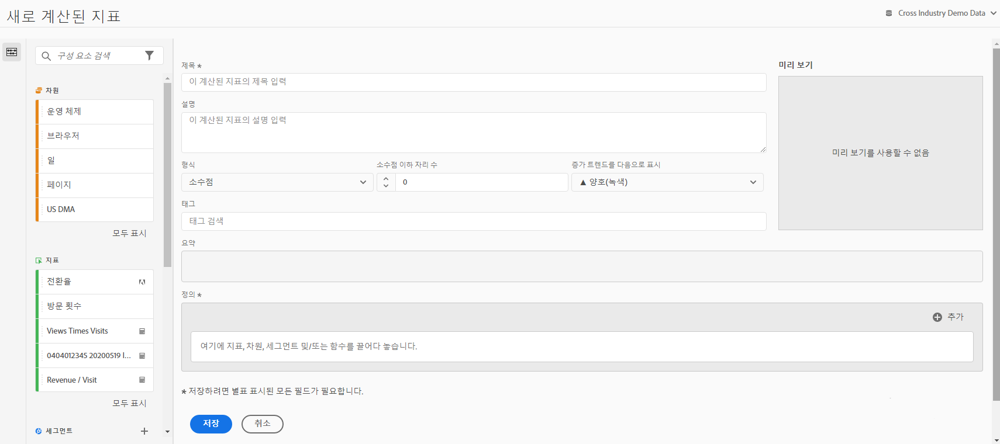

# 지표 작성

Customer Journey Analytics은 차원, 지표, 필터 및 함수를 드래그하여 놓음으로써 컨테이너 계층 논리, 규칙 및 연산자를 기준으로 사용자 지정 지표를 만들 수 있는 캔버스를 제공합니다. 이러한 통합 개발 도구를 사용하여 간단한 계산된 지표나 복잡한 고급 계산된 지표를 빌드하고 저장할 수 있습니다.

## 계산된 지표 작성 시작

계산된 지표 빌더를 사용하여 계산된 지표를 만들 수 있습니다. 이러한 방식으로 생성되면 계산된 지표를 구성 요소 목록에서 사용할 수 있으며, 그런 다음 조직 전체의 프로젝트에서 사용할 수 있습니다. 또는 [지표](/help/components/apply-create-metrics.md)의 [단일 프로젝트에 대한 계산된 지표 만들기](/help/components/apply-create-metrics.md#create-calculated-metrics-for-a-single-project)에 설명된 대로 빠른 계산된 지표를 만들 수 있습니다.

계산된 지표 빌더에 액세스하여 구성 요소 목록에서 사용할 수 있는 계산된 지표 생성을 시작합니다.

1. 다음 방법 중 하나로 계산된 지표 빌더에 액세스합니다.

   * Analysis Workspace에서 프로젝트를 연 다음 **[!UICONTROL 구성 요소]** > **[!UICONTROL 지표 만들기]**&#x200B;를 선택합니다.
   * Analysis Workspace에서 프로젝트를 연 다음 왼쪽 레일에서 [!UICONTROL **지표**] 섹션 옆에 있는 **더하기** 아이콘을 선택합니다.
   * [!DNL Customer Journey Analytics]에서 **[!UICONTROL 구성 요소]** > **[!UICONTROL 계산된 지표]**(으)로 이동한 다음 계산된 지표 페이지 상단에서 **[!UICONTROL + 추가]**&#x200B;를 선택합니다.

1. 계산된 지표 빌더의 [영역](#areas-of-the-calculated-metrics-builder)을 계속 사용합니다.

## 계산된 지표 빌더의 영역

<!-- 

>[!CONTEXTUALHELP]
>id="cja_journeycanvas_viz_product_compatibility"
>title="Product compatibility"
>abstract="Indicates where in Customer Journey Analytics this calculated metric can be used, such as in Analysis Workspace, Report Builder, and so forth."  
>"Some calculated metrics cannot be used with experimentation. Calculated metrics that are not compatible with experimentation have the following value: "Everywhere in Customer Journey Analytics (excluding experimentation)" "
>"Various factors affect whether a calculated metric is compatible with experimentation. Learn more (https://experienceleague.adobe.com/en/docs/analytics-platform/using/cja-workspace/panels/experimentation#use-in-experimentation) ."
>additional-url="https://experienceleague.adobe.com/en/docs/analytics-platform/using/cja-workspace/panels/experimentation#use-in-experimentation" text="Use calculated metrics in experimentation"

-->

다음 이미지와 함께 제공되는 표에서는 계산된 지표 빌더의 몇 가지 주요 영역 및 기능에 대해 설명합니다.

| 필드 | 설명 |
| --- | --- |
| 제목 | 지표에 이름을 지정하는 것은 필수입니다. 이름을 지정하지 않으면 지표를 저장할 수 없습니다. |
| 설명 | 사용자에게 친근한 설명을 지정하여 용도를 알고 유사한 지표들과 구별할 수 있도록 하십시오. 
이 설명은 보고서 내에도 나타납니다. 설명에 공식을 넣지 않는 것이 좋습니다. 대신 이 지표를 어디에 사용하고 어디에 사용하지 말아야 하는지 설명하십시오. (공식은 지표를 만들면 요약 머리글 아래에 생성됩니다. 따라서 공식을 설명에 추가할 필요가 없습니다.) 
 |
| 포맷 | 선택 사항에는 소수, 시간, 비율 및 통화가 포함됩니다. |
| 소수점 이하 자리 수 | 보고서에 소수점 이하 몇 자리가 표시될 것인지 보여 줍니다. 지정할 수 있는 소수점 이하 최대 자리수는 10자리입니다. |
| 증가 트렌드를 다음으로 표시... | 이 지표 극성 설정은 Analytics가 지표에서 증가 트렌드를 양호 (녹색)으로 간주할지 또는 불량 (빨간색)으로 간주할지를 보여 줍니다. 그 결과, 보고서의 그래프는 증가할 때 녹색 또는 빨간색으로 표시됩니다. |
| 통화 | 이 데이터 보기의 기본 통화입니다. |
| 태그 | 태깅은 지표를 구성하는 좋은 방법입니다. 모든 사용자는 태그를 만든 후 지표에 하나 이상의 태그를 적용할 수 있습니다. 하지만 본인이 소유하거나 본인과 공유된 필터에 대한 태그만 볼 수 있습니다. 어떤 종류의 태그를 만들어야 합니까? 다음은 제안되는 유용한 태그입니다.<ul><li>소셜 마케팅, 모바일 마케팅과 같은 **팀 이름**.</li><li>시작 페이지 분석과 같은 **프로젝트**(분석 태그).</li><li>**범주**(예: 여성, 지역).</li><li>**워크플로**(예: 승인용, 처리됨(특정 비즈니스 단위)</li></ul> |
| 요약 | 
요약 공식은 지표 정의를 변경할 때마다 업데이트됩니다. 이 공식은 마우스로 지표를 가리키고 를 클릭하면 왼쪽의 지표 레일에 표시됩니다.  아이콘. 
 |
| 정의 | 여기서 지표/계산된 지표, 필터 및/또는 함수를 드래그하여 계산된 지표를 작성합니다. <ul><li>계산된 지표에서 드래그하면 그 지표 정의를 자동으로 확장합니다. </li> <li>정의를 컨테이너와 중첩시킬 수 있습니다. 하지만 필터 컨테이너와 달리 이 컨테이너는 수학 표현식처럼 작동하고 작동 순서를 결정합니다. </li> </ul> |
| 연산자 | 나누기(  )은 기본 연산자이며 이외에도 +, -, x 연산자가 있습니다. |
| 미리보기 | 모든 가능한 오류 시 빨리 읽을 수 있도록 해 줍니다. 이 미리보기는 마지막 90일에 적용됩니다. 해당 지표에 대해 올바른 구성 요소를 선택했는지를 초기에 판단하는 방법입니다. 예상치 않은 결과는 지표 정의 시 두 번 확인해야 함을 의미합니다. |
| 제품 호환성 | Customer Journey Analytics에서 이 계산된 지표를 사용할 수 있는 위치를 나타냅니다. 
가능한 값은 다음과 같습니다.
<ul><li>[!UICONTROL **Customer Journey Analytics의 모든 곳**]: 계산된 지표는 Analysis Workspace, Report Builder 등을 포함하여 모든 Customer Journey Analytics 전체에서 사용할 수 있습니다.</li><li>[!UICONTROL **Customer Journey Analytics의 모든 곳(실험 제외)**]: 계산된 지표는 실험 패널을 제외하고 모든 Customer Journey Analytics 전체에서 사용할 수 있습니다.</li> 
계산된 지표를 실험에 사용할 수 있는지 여부를 결정하는 기준에 대한 자세한 내용은 [실험 패널](/help/analysis-workspace/c-panels/experimentation.md)의 [실험 패널에서 계산된 지표 사용](/help/analysis-workspace/c-panels/experimentation.md#use-calculated-metrics-in-the-experimentation-panel)을 참조하십시오.
</ul> |
| 이벤트가 복제되지 않도록 하면서 현재 이벤트 변수에 | 모든 유형의 계산된 지표의 경우, 컨테이너 및 정적 수를 정의에 추가할 수 있습니다. 고급 계산된 지표의 경우 필터 및 함수를 추가할 수도 있습니다.<ul><li>컨테이너는 수학 표현식처럼 작동하고 작업 순서를 결정합니다. 그러므로 컨테이너에 있는 모든 것은 다음 작업 전에 처리됩니다.</li><li>필터를 컨테이너로 드래그하면 해당 컨테이너의 모든 항목이 필터링됩니다. (고급 계산된 지표만)</li><li>한 컨테이너에서 여러 필터를 스택할 수 있습니다.</li></ul> |
| 톱니바퀴 아이콘(지표 유형, 기여도 분석) | 지표 옆에 있는 톱니바퀴 아이콘을 선택하여 지표 유형 및 기여도 분석 모델을 지정할 수 있습니다. 
**참고:** 구성 요소의 속성을 기본이 아닌 속성 모델로 업데이트할 때는 다음 사항을 고려하십시오.
<ul><li>**보고서에서 *단일 차원과 함께 구성 요소를 사용하는 경우*:** 구성 요소의 속성은 기본이 아닌 속성 모델을 사용하는 경우 할당 모델을 무시합니다.</li><li>**보고서에서 구성 요소를 *여러 차원과 함께 사용하는 경우*:** 구성 요소의 속성은 기본이 아닌 속성 모델을 사용하는 경우 할당 모델을 유지합니다.</li><li>여러 차원은 [클라우드로 데이터를 내보내는](/help/analysis-workspace/export/export-cloud.md)경우에만 사용할 수 있습니다.</li></ul> 
할당에 대한 자세한 내용은 [지속성 구성 요소 설정](/help/data-views/component-settings/persistence.md)을 참조하십시오.
 |
| 더하기(+) 아이콘 | 필터 빌더로 이동하는 새로운 필터와 같은 새 구성 요소를 만들 수 있습니다. |
| 구성 요소 검색 | 이 검색 창을 사용하면 차원, 지표, 필터(고급 계산된 지표만) 및 함수(고급 계산된 지표만)를 검색할 수 있습니다. |
| 차원 목록 | 필터 빌더에서 &quot;Page = Homepage&quot;와 같은 간단한 필터를 작성하기 위해 계산된 지표 빌더를 종료하지 않고, 페이지에서 드래그하여 계산된 지표 빌더에서 직접 홈 페이지를 선택할 수 있습니다. 그 결과 필터링된 계산된 지표를 생성할 훨씬 능률적인 워크플로가 만들어집니다. |
| 지표 목록 | 지표는 3가지 범주로 분류됩니다.<ul><li>표준 지표</li><li>계산된 지표</li><li>지표 템플릿 - 목록의 맨 아래.</li></ul>마우스로 지표를 가리키면 그 오른쪽에 정보 아이콘이 표시됩니다. 이 아이콘을 클릭하면 다음 정보가 표시됩니다.<ul><li>계산되는 방식에 대한 공식.</li><li>지표의 미리보기 트렌드.</li><li>이 계산된 지표를 편집할 수 있는 계산된 지표 빌더로 이동하는 오른쪽 상단의 편집(연필) 아이콘.</li></ul> |
| 필터 목록 | (고급 계산된 지표만 해당) 관리자인 경우 이 목록에는 로그인 회사에서 만든 모든 필터가 표시됩니다. 관리자가 아닌 사용자인 경우 이 목록에는 사용자가 소유한 필터와 사용자와 공유된 필터가 표시됩니다. |
| 함수 목록 | (고급 계산된 지표만 해당) 함수는 기본 (가장 자주 사용됨) 및 고급 의 두 목록으로 나뉩니다. |
| 데이터 뷰 선택기 | 이 선택기(오른쪽 상단)를 사용하면 다른 데이터 보기로 전환할 수 있습니다. |
